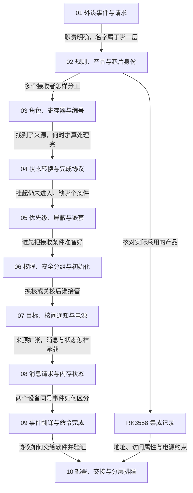

# 第1章\_GICv3物理中断专题大纲

## 1.1\_独立讲懂概念\_也能带着问题读官方文档

本专题从“外设收到了数据，正在运行的程序怎样知道”开始，逐步推导 **通用中断控制器（Generic Interrupt Controller，GIC）** 的职责，再学习 RK3588 芯片所用控制器的规则与实现。无需先懂 Arm 平台分类、控制器模块或代际差异；这些名称在问题出现时才建立。

这里不是官方文档的逐页翻译，也不是只有链接的资料目录。**不打开原件，也应能从正文理解概念、因果关系、状态与设计边界；需要查字段、例外或更细规则时，再沿相邻的官方对照返回原文。** 教学场景、编号算例和示意图帮助推理，不冒充芯片实测或规范原图。

首次出现的专题术语使用“中文名（English Full Name，缩写）”，并将这组名称整体加粗；关键比较中的易混术语也突出显示，后续普通引用不反复加粗。没有通行缩写时只列中英文名，产品型号、字段与命令保留官方拼写并说明名称性质，不杜撰词源。每篇独立打开时也有本地提醒，不要求读者先背总术语表。

当前第一卷包括十篇物理中断正文与一篇芯片集成记录。架构版本、硬件产品与芯片的区别在第二章独立建立；没有把“GICv3.0、GIC-600 r1p6、RK3588”当作已经懂得的三个前提。

## 1.2\_因果阅读地图

箭头表示前一问题解决后暴露的下一缺口，不是信号接线。默认顺序完整阅读正文；芯片记录在第二章先看身份证据，到内存与部署章节再按需回访约束。

| 真实章节 | 承接的前置结论 | 本章解决什么 | 留下的下一问 |
| --- | --- | --- | --- |
| [01 从外设事件到中断请求](P01_从外设事件到中断请求.md#1.1_数据已经到了_程序为什么还不知道) | 程序在处理器上执行 | 从轮询价值与代价推出请求和控制器职责 | 规则、产品、芯片是不是同一层？ |
| [02 从控制器规则到芯片与软件身份](P02_从控制器规则到芯片与软件身份.md#2.1_已经知道职责_为什么还要分清名称) | 控制器需要管理请求 | 区分架构、实现、芯片、板与软件，核对首个平台 | 多处理器系统中哪些状态共享？ |
| [03 多核控制器的角色、寄存器与编号](P03_多核控制器的角色_寄存器与编号.md#3.1_增加第二个处理器后_什么必须拆开) | 身份与职责已分层 | 由来源关系推出角色、编号与访问方式 | 进入处理入口为什么还没结束？ |
| [04 一次中断的状态转换与完成协议](P04_一次中断的状态转换与完成协议.md#4.1_处理入口已经运行_为什么还没有完成) | 能定位来源配置 | 分开设备、控制器、处理器和软件状态，闭合一次周期 | 有待办为何仍不能进入？ |
| [05 优先级、屏蔽与嵌套处理](P05_优先级_屏蔽与嵌套处理.md#5.1_已经挂起的请求_为什么仍然不能进入) | 确认与完成有配对义务 | 区分排队、抢占和各层屏蔽，解释嵌套恢复 | 谁有权建立接收条件？ |
| [06 权限、安全分组与初始化闭环](P06_权限_安全分组与初始化闭环.md#6.1_为什么照着寄存器名写值还不够) | 接收取决于一组条件 | 建立权限、初始化作用域和硬件完成握手 | 换目标、关核时怎样交接？ |
| [07 目标选择、核间通知与电源交接](P07_目标选择_核间通知与电源交接.md#7.1_把请求交给另一个处理器_改变了什么) | 接收者必须先准备好 | 分开工作数据、通知状态与目标存活条件 | 大量消息来源的状态放在哪里？ |
| [08 从消息请求到内存中的中断状态](P08_从消息请求到内存中的中断状态.md#8.1_来源越来越多_为什么让设备发送一条消息) | 通知不等于完整工作数据 | 推出消息来源、内存表与不同状态模型 | 设备事件如何找到目标编号？ |
| [09 设备事件翻译与命令完成](P09_设备事件翻译与命令完成.md#9.1_两个设备都发事件0_怎样区分) | 消息状态由内存与硬件共同承载 | 分开设备身份、映射、命令发布与完成 | 真实软件怎样接管和验证？ |
| [10 软件交接、部署与分层排障](P10_软件交接_部署与分层排障.md#10.1_硬件模型闭合后_软件该接管哪一段) | 物理请求与消息路径已闭合 | 建立软件所有权、证据层次与实验边界 | 固定目标软件后再深入实现与实验 |
| [RK3588 的 GIC-600 集成与手册核对](../../rockchip/rk3588/P01_RK3588的GIC-600集成与手册核对.md#1.1_通用规则没有告诉我们这颗芯片接了什么) | 区分规则与芯片 | 记录具体身份、地址宽度、访问属性、电源和摘要冲突 | 板与软件实际启用了什么？ |

第四章的 [S0～S6 完整周期](P04_一次中断的状态转换与完成协议.md#4.4_用同一组阶段闭合正常周期)是后续放大状态与通信的共同坐标；消息中断明确解释哪些阶段沿用、哪些硬件状态不同。阶段号是本专题的叙述工具，不是规范的寄存器编码。

## 1.3\_怎样使用每节旁边的官方对照

“官方对照”给出文档身份、固定版本、原文目录和本节需要复核的具体问题。章节编号与英文标题优先于 PDF 页码；指南通常使用连续页码，架构规范使用如 4-50 的印刷页码，不应混为 PDF 阅读器的页序号。在线入口可能重定向，仍可按已下载原件的目录和关键词定位。

| 正文中的来源简称 | 对应官方原件与版本 | 阅读任务 |
| --- | --- | --- |
| 概览 198123，3.2-01 | [Learn the architecture — Generic Interrupt Controller v3 and v4, Overview](https://developer.arm.com/documentation/198123/0302)，198123_0302_01_en | 先理解角色和普通处理过程 |
| 规范 IHI0069 H.b | [Arm Generic Interrupt Controller Architecture Specification, GIC architecture version 3 and version 4](https://developer.arm.com/documentation/ihi0069/hb) | 核对状态、寄存器、命令的规范保证；只选择当前 v3.0 适用部分 |
| 消息指南 102923，1.0-01 | [Learn the architecture — Generic Interrupt Controller v3 and v4, LPIs](https://developer.arm.com/documentation/102923/0100)，102923_0100_01_en | 对照第八、九章的内存状态和翻译管理 |
| GIC-600 手册 100336，r1p6 | [Arm CoreLink GIC-600 Generic Interrupt Controller Technical Reference Manual](https://developer.arm.com/documentation/100336/0106)，100336_0106_00_en | 查该硬件实现的选择与限制 |
| RK3588 手册 | [资料索引中的原件入口](../../../../reference/external_resources/arm/README.md#1.4.2_型号判断的证据与适用边界)，TRM V1.0 Part1，2022-03-09 | 查芯片集成；不拿软件现象替代型号核验 |

普通中文论证是本专题自己的教学表达；“架构规定”必须能回到规范，“该产品或芯片采用”必须能回到实现资料，“可能导致”需要注明所依赖的条件。官方对照不要求第一次阅读时打开所有原件，但不能省略为模糊的“参考 Arm 文档”。

完整书目、缓存位置、官方入口和下载校验由[资料索引](../../../../reference/external_resources/arm/README.md#1.4.3_先读哪几份资料)统一维护。本大纲只组织阅读，不复制第二份下载清单。

## 1.4\_本卷边界与后续扩展

本卷已形成独立物理中断讲解，不代表全部架构分支、真实 Linux 函数体或板上实验已经完成。软件实现需要另行固定内核、固件、配置与设备描述；本卷的伪代码只说明协议职责，不能直接部署。

Linux 的中断请求（Interrupt Request，IRQ）管理仍在[原有专题](../../../../knowledge/linux/synchronization_and_asynchrony/asynchrony/interrupts/大纲.md#1.3_与独立GIC专题的分工)解释软件对象与接口，两边不复制完整教程。后续先从零补 GICv3 自身已有的虚拟化，再在问题成立时扩展 GICv4；后续计划由[建设路线](../../../../atlas/roadmaps/gic_learning_plan.md#1.5_GICv3_学到哪里可以结束_何时才进入_GICv4)维护，不在这里制造未落地章节。

人工阅读与评审进度只在[评审地图](../../../../atlas/maps/knowledge_review_map.md)维护；基础格式和资料核对不等于开发者已经完成评审。
