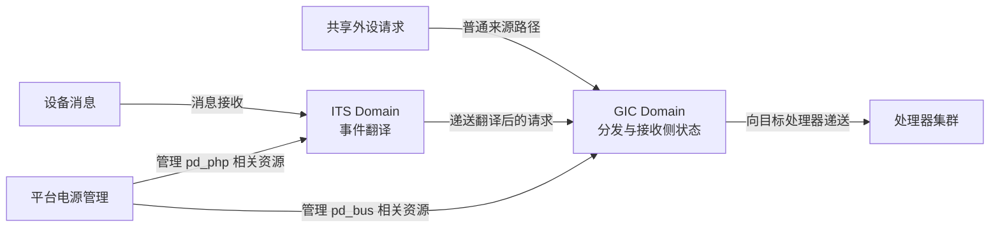

# 第1章\_RK3588的GIC-600集成与手册核对

## 1.1\_通用规则没有告诉我们这颗芯片接了什么

**通用中断控制器（Generic Interrupt Controller，GIC）** 架构规定中断的状态和软件操作规则；RK3588 是 Rockchip 的 **系统级芯片（System on Chip，SoC）** 产品，必须自己选择控制器实现、地址、连接和集成选项。规则与芯片不能相互代替。

本记录保存 RK3588 特有的手册证据与工程约束，不重复完整 GIC 教材。第一次接触这些名称时，可从[身份关系章节](../../architecture/gic/P02_从控制器规则到芯片与软件身份.md#2.1_已经知道职责_为什么还要分清名称)顺序建立概念；当前页只要求读者区分“架构规则”“硬件产品”“芯片集成”和“运行软件”。

证据基线为 RK3588 **技术参考手册（Technical Reference Manual，TRM）** V1.0 Part1，日期 2022-03-09，以及 Arm GIC-600 r1p6 TRM，文档编号 100336_0106_00_en。2026-09-06 核对原件文字与框图；尚未执行板上实验，也未把某套板级软件配置当作这些手册的同义物。

## 1.2\_怎样确认控制器身份

先查 RK3588 TRM 第 11.1 节表 11-1，确认采用 GIC600（手册对 GIC-600 产品专名的写法），修订 r1p6-00rel0；再查 Arm 对应 TRM 的 1.3 Compliance，确认该硬件产品遵循 GIC 架构版本 3.0。前一步解决“采用谁”，后一步解决“这个产品实现什么规则”。

表中 **局部性专属外设中断（Locality-specific Peripheral Interrupt，LPI）** 是 GIC 的消息来源类型；**中断翻译服务（Interrupt Translation Service，ITS）** 把设备事件对应到目标 LPI 和接收者。页码采用 **可移植文档格式（Portable Document Format，PDF）** 原件的阅读器页序。

| 原件位置 | 已核对信息 | 应如何使用 |
| --- | --- | --- |
| RK3588 TRM，PDF 第 1312 页，11.1、表 11-1 | GIC600，r1p6-00rel0 | 选择 GIC-600 r1p6 实现手册，不由 600 推断代际 |
| Arm 100336，PDF 第 17 页，1.3 | 遵循 GICv3.0 | 筛选架构规范中的适用版本，不把后续扩展套进来 |
| RK3588 TRM，同一配置表 | 接入 8 个处理器、启用 LPI、配置两个 ITS | 后续学习需要覆盖消息路径；不能据此声称软件已启用全部功能 |
| RK3588 TRM，PDF 第 18 页，地址映射 | GIC600 窗口从 0xFE600000 开始 | 是查找芯片地址布局的入口，不是所有寄存器共用同一地址 |

两个 ITS 表示芯片提供两个这样的硬件实例，不表示可以任意选一个地址发送所有设备消息。官方对照：[GIC-600 r1p6 手册 100336](https://developer.arm.com/documentation/100336/0106)，1.3 Compliance；RK3588 TRM V1.0 Part1 的 11.1 Overview 与表 11-1，原件入口见[资料证据表](../../../../reference/external_resources/arm/README.md#1.4.2_型号判断的证据与适用边界)。

本页不罗列未经核对的设备中断编号。为某个设备写描述以前，还要找到它的连接条目，明确手册使用绝对硬件编号还是类型内编号，再和目标软件的绑定规则核对。

## 1.3\_内存地址与访问属性怎样影响实现

**GIC 分发器（GIC Distributor，GICD）** 承担共享来源分发；ITS 承担消息翻译。RK3588 TRM 第 11.1 节给出这两部分内存访问地址宽度相关配置，并说明其访问范围为 0～32 GB；表中相应主接口地址宽度为 35 位。从地址位数看，这是低 32 GiB 的地址空间，GiB 表示 2 的 30 次方字节。为控制器分配表时，必须确认使用的是它能够到达的物理地址，而不只是处理器能访问的虚拟地址。

同一节明确说明该芯片对 LPI 表访问只支持 **Non-shareable（非共享）** 属性。这里描述控制器发起内存访问的属性约束，不表示“整个芯片没有缓存一致性”，也不允许推导“所有普通内存都必须禁用缓存”。

影响路径是具体的：处理器写表 → 更新需要按该访问路径可见 → 控制器读取配置 → 控制器可能再缓存条目。如果软件把其他平台的共享属性或缓存假设照搬过来，处理器看到新表，控制器仍可能用旧内容。实现要核对内存分配、可访问范围、属性读回、缓存维护与失效完成等环节，不能只加一条没有语义依据的屏障。

配置表与挂起表的读写所有权见[内存状态章节](../../architecture/gic/P08_从消息请求到内存中的中断状态.md#8.3_两张表分别归谁维护)；ITS 自身的设备表、翻译表与命令队列还要分别核对其接口属性，不能凭“也是一张表”就默认所有限制完全相同。

这些是实施前必须验证的约束，不是本轮对某个 Linux 分配器或缓存维护函数的逐行结论。目标驱动究竟采用何种回退或内存属性，需要固定软件版本以后继续读代码。

## 1.4\_电源域解释了为什么普通中断与消息路径可能不同

**电源域（Power domain）** 是可以由平台独立管理供电或相关运行资源的一组硬件。RK3588 TRM 第 11.2 节框图与说明指出，**GIC 域（GIC Domain）** 和 **ITS 域（ITS Domain）** 分开，分别位于名为 `pd_bus` 与 `pd_php` 的电源域；这两个名字是芯片集成标识，不是 GIC 架构统一规定的名称。

框图中的 **GICD** 表示分发器接口，**GICR** 表示 **再分发器（Redistributor）** 的每处理器接收侧接口；处理器、私有请求、共享请求及 ITS 经集成链路协作。图不能被解读为“两颗完全独立、互不通信的 GIC”。

这是依据手册提炼的职责图，省略了具体总线桥和时钟细节。由此可以提出一个有依据的排障假设：普通来源工作正常而消息路径在某次电源切换后失败时，应额外检查 ITS 所属域与连接，而不是直接断言整个控制器都正常。该假设仍须运行证据确认。

## 1.5\_手册中的摘要冲突怎样处理

同一本手册也可能包含复用模板、概括或笔误。不能因为材料来自厂商，就不区分摘要与可执行的编程契约。

以下对照中的 **处理器接口（CPU Interface；CPU 即 Central Processing Unit，中央处理器）** 负责接收侧确认与完成，**软件产生中断（Software Generated Interrupt，SGI）** 是由软件发起的通知类型。两者一个是接口角色、一个是来源类型，不因摘要提到“寄存器”就都采用同一种访问方式。

| 需要继续核对的说法 | 为什么不能直接转成代码 | 本专题处理方式 |
| --- | --- | --- |
| 前部摘要与第 11.1 节的共享来源数量不完全一致 | “编号空间”“配置数量”“实际连接”可能被混写 | 保留第 11 章 num_spis=480 为配置表事实，实际可用来源继续核对能力寄存器与连接表 |
| 私有来源数量与触发方式的概括 | 实现可能对某些私有输入固定类型 | 不默认每个来源都可任意切换边沿/电平 |
| “所有寄存器均内存映射” | GICv3 CPU Interface 使用系统寄存器，访问方式不能混写 | 以架构接口与实现手册分别确认 |
| 摘要提及旧式 SGI 生成入口 | GIC-600 不支持旧式兼容操作 | 主线使用已确认的系统寄存器生成路径，不照抄旧寄存器例子 |

处理冲突不是自行挑一个喜欢的数字。应同时保留原件位置、比较对象、适用条件与尚待确认项；需要运行结果才能裁决的内容，就标明未完成，而不是把推测写成芯片事实。

## 1.6\_从手册走向目标板还缺哪些证据

下一轮板级核对应固定具体开发板、启动固件、内核提交、配置和设备描述，观察硬件能力寄存器与实际启动日志，再选择普通外设、核间通知和消息中断分别做最小实验。不能拿一条计数增长代替三条路径各自的证明。

当前已确认的是控制器身份和上述文档约束，不是板上初始化、缓存一致性、休眠恢复或 Linux 源码路径已经验收。完整学习顺序由[专题大纲](../../architecture/gic/大纲.md#1.2_因果阅读地图)组织，后续软件核对遵循[交接与排障章节](../../architecture/gic/P10_软件交接_部署与分层排障.md#10.3_部署之前先固定板与软件基线)。

资料的官方入口、修订、校验值与取得方式统一见[外部资料索引](../../../../reference/external_resources/arm/README.md#1.4.2_型号判断的证据与适用边界)与[机器清单](../../../../reference/external_resources/arm/manifest.json)。本文不复制原版 PDF，不以本机缓存路径代替来源身份。
