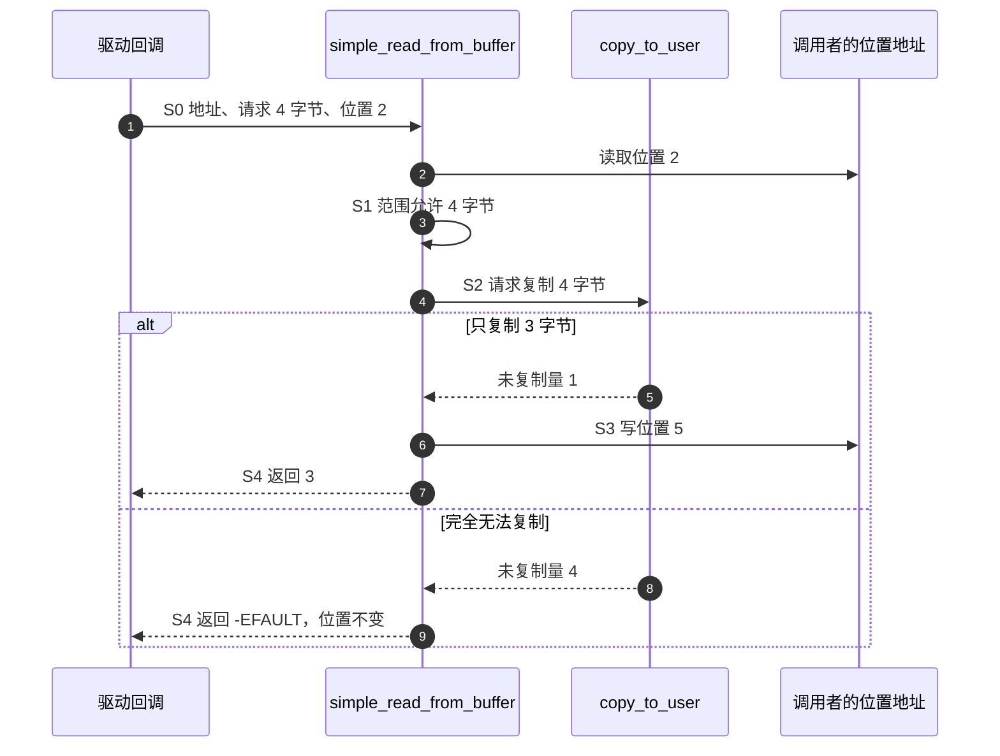

# 第2章\_Linux\_6.12\_有限缓冲区IO模块导读

版本与范围由[总阅读索引](P01_Linux_6.12_字符设备源码阅读索引.md#1.1_版本和阅读边界)固定。阅读目标是确认：帮助函数怎样把请求量、有限缓冲区与用户复制结果变成返回量及下一次位置。前置是[正文第五章](../../../../knowledge/driver_model/character_device/P05_文件操作契约与数据路径.md)建立的设备状态、打开状态与请求状态之分。

## 2.1\_参与者与状态落点

`fs/libfs.c` 提供有限缓冲区复制帮助函数；调用者传入的内核缓冲区仍由调用者拥有。用户访问层由 `include/linux/uaccess.h` 接入，并可能选择架构实现。一次调用里，`pos` 是位置快照，`count` 是裁剪后的本次允许量，`ret` 或 `res` 记录未复制量；`*ppos` 是调用者提供的可更新位置。

这些局部量构成一次请求状态，不是设备自己的全局状态机。共享数据何时可读、设备是否离线、哪个打开者拥有快照，均不在这两个帮助函数中解决。

## 2.2\_按同一组阶段读两个函数

| 阶段 | 在帮助函数中的落点 | 调用者的责任 |
| --- | --- | --- |
| S0 接受请求 | 从 `*ppos` 取得局部 `pos`，接收地址和长度 | 确保内核对象与位置地址有效 |
| S1 确定范围 | 拒绝负位置；检查末尾和零长度；裁剪 `count` | 提供正确有效长度或可写容量，决定外围设备协议 |
| S2 执行复制 | 分别调用 `copy_to_user` 或 `copy_from_user` | 提供适用的任务上下文、稳定的数据与同步 |
| S3 提交进度 | 从 `count` 扣除未复制量，再写 `*ppos` | 写入后若要扩大有效数据长度，另外维护；不得误认为失败会回滚共享内容 |
| S4 返回 | 没有复制到字节时返回错误，否则返回完成量 | 向上层保持同一字节数协议，处理设备特有状态 |

按顺序阅读[读取实现](../source_explanations/fs/libfs.c.md#1.1_simple_read_from_buffer)，再比较[写入实现](../source_explanations/fs/libfs.c.md#1.2_simple_write_to_buffer)。相似结构不表示两者拥有完全相同的业务含义：读取的 `available` 通常是有效数据长度，写入的 `available` 通常是可写容量。

尤其注意写帮助函数在位置达到容量时返回零。驱动若承诺“正长度写入、容量已满则返回 ENOSPC”，必须在自己的协议层处理，不能直接把帮助函数的所有返回都当作完整设备规范。

## 2.3\_复制层与调用者的交接

用户访问层报告尚未复制的字节数，帮助函数据此计算进度。若直接写共享缓冲区，即使后来返回错误，目标也可能已经发生变化。普通用户复制的[短复制与清零分支](../source_explanations/include/linux/uaccess.h.md#1.1_普通复制的短复制处理)是理解这一点的证据，而不是要求驱动自行仿造架构复制代码。

图中假定调用者给出的内核区间一直有效。该序列没有任何获取设备锁的动作，不能从图中推导其他写者已经被排除。用一份临时记录换取“失败不改变旧内容”，属于正文中的协议设计；这两个通用帮助函数本身不承诺事务提交。
