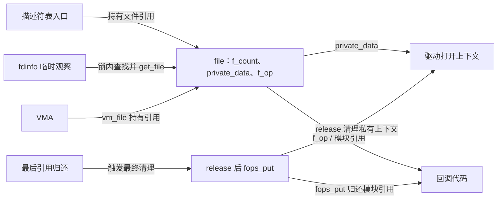
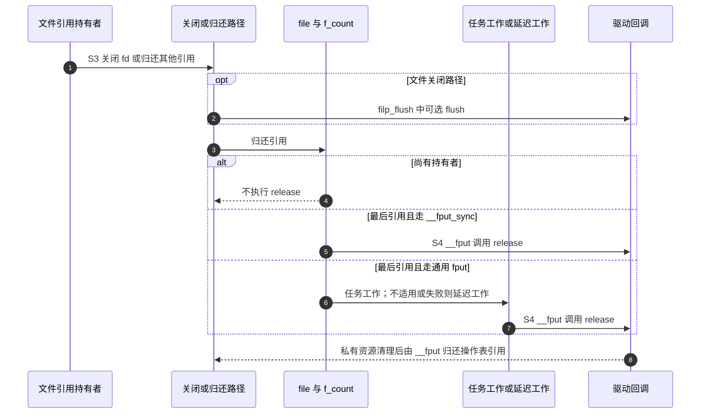

# 第3章\_文件操作与打开寿命导读

由[总阅读索引](P01_Linux_6.12_字符设备源码阅读索引.md#1.1_版本和阅读边界)进入。本篇按 NXP 官方固定提交 `dfaf2136deb2af2e60b994421281ba42f1c087e0`（Linux 6.12.20）定位文件操作，不把三笔本地实验提交或生成配置当成发布证据。[正文四章](../../../../knowledge/driver_model/file_operations/大纲.md)负责建立模型和实验；这里负责解释各字段、函数与源码位置怎样对上。

## 3.1\_打开对象由谁持有

先打开 [include/linux/fs.h](../../linux/include/linux/fs.h)，找到 struct file 与 struct file_operations。f_op 是操作表指针，private_data 是驱动可使用的上下文地址，f_pos 是打开对象的位置，f_count 是本版本的文件引用计数。它们不是同一种状态：改变位置不会增加引用，分配私有对象也不会自动把 file 保活。

misc_open 用 replace_fops 换到服务的操作表，再调用服务 open。表的模块引用先于该回调取得；具体实现沿[已有 misc 实现讲解](../../driver_entries/source_explanations/P01_对象创建与misc分派.md#1.3_misc打开与注销的交接)阅读，不再抄一份函数体。一次独立打开建立新的 file，而 dup 增加描述符入口与文件引用，不重新执行服务 open。

| 阶段 | 事件和状态地址 | 写入者、后续读取者与退出条件 |
| --- | --- | --- |
| S0 | 打开尚未建立，驱动私有上下文不存在 | 打开路径准备 file；尚不能把一次失败初始化当作成功文件释放 |
| S1 | 服务 open 成功，把上下文地址写入 file->private_data | 服务回调创建；后续回调通过同一 file 读取 |
| S2 | 描述符、临时使用者或 VMA 持有 file；计数在 file->f_count | VFS 引用接口协调；计数不是驱动自己扫描 fd 数组得到的 |
| S3 | 关闭入口调用可选 flush，再归还文件引用 | flush 可见同一私有上下文；计数不为零就不能进入最终 release |
| S4 | 最后一份引用归还，__fput 执行清理并调用 release、fops_put | release 清理私有数据；操作表模块引用在其后归还 |

这是打开初始化、持有者集合与驱动私有状态三组协作状态，不是一张由驱动独占的枚举。`fs/proc/fd.c` 的 seq_show 在描述符表锁下找到目标 file 并取得引用，退出锁后才调用 show_fdinfo，最后 fput；因而观察期间 file 仍活着，但字段内容仍可能变化。

接着读 [filp_close](../source_explanations/fs/open.c.md#1.1_filp_close归还文件引用)和[本版本 close 系统调用](../source_explanations/fs/open.c.md#1.2_close系统调用的同步清理)。注意当前 close 系统调用不是直接调用 filp_close：它调用 filp_flush 后走 __fput_sync。通用 fput 可延迟最终处理，不能把这条一般规则说成每次 close 都必然延迟。

`fs/file_table.c` 中 fput 先减 f_count，仅最后引用才安排任务工作；无法使用任务工作时进入 delayed_fput_list，由延迟工作继续处理。__fput_sync 则在减到零时直接 __fput。两条路径的终点相同：成功打开的文件先清理事件/锁等登记，处理 fasync，再调用 release，随后 fops_put。release 返回值没有成为 close 的业务保存错误结果。

## 3.2\_请求位置怎样回到调用方

普通 read 与 pread 的区别，在进入驱动前已经体现在传入的位置地址：前者需要更新共享打开位置，后者使用本次显式位置。`fs/read_write.c` 的 ksys_read、ksys_pread64 是追踪入口；沿 vfs_read 看回调分派，再读 new_sync_read 的适配。不要从“这些函数最终读同一个 file”推导“都应该改 f_pos”。

本周期另有 S0～S4：S0 构造 kiocb 和目的 iov_iter；S1 确定内容范围；S2 copy_to_iter 推进缓冲游标；S3 服务回调推进 ki_pos；S4 适配者把位置带回调用方，再由各调用方兑现共享位置或显式位置的契约。与上一节的寿命周期同名阶段属于 **不同操作周期**，不可把一次复制结束误当成 file 引用结束。

| 状态 | 所在地址和所有权 | 本次请求完成后的去向 |
| --- | --- | --- |
| 打开位置 | file->f_pos，属于共享打开对象 | 普通读路径按位置协调规则写回；pread 不写回 |
| 请求位置 | kiocb.ki_pos，由构造者初始化、回调提交 | 同步适配者读取它，带回调用路径 |
| 缓冲进度 | iov_iter 的当前段、偏移与 count | copy_to_iter 推进；不是文件内容位置 |
| 源内容 | 教学模块的只读 message | 不变数据不需要内容锁；可变源必须另定协议 |

[vfs_read 的唯一实现讲解](../source_explanations/fs/read_write.c.md#1.1_vfs_read选择回调)显示 .read 优先，缺省才选择 .read_iter；[同步适配](../source_explanations/fs/read_write.c.md#1.2_new_sync_read构造请求)显示本地 kiocb、ITER_DEST 和位置回传。再对照同文件的 vfs_readv：它先选 .read_iter，否则逐段处理旧回调。不能在路径不同的情况下宣布统一优先级。

`include/linux/uio.h` 的当前后端包括 UBUF、IOVEC、BVEC、KVEC、FOLIOQ、XARRAY 和 DISCARD。教学 readv 的用户向量只是其中一种。认识类型名的目的是避免把已不存在的 PIPE 后端照抄进当前实现，不是要求初学者一次实现全部后端。

## 3.3\_映射怎样留住文件

先查 `mm/vmalloc.c` 的 vmalloc_user_noprof：它请求清零内存并带 VM_USERMAP。再看 remap_vmalloc_range 及其 partial 帮助函数：检查偏移移位溢出、页对齐、vmalloc 区域身份、允许用户映射的标志和范围，逐页取得 struct page 并插入映射，成功后设置 VM_DONTEXPAND/VM_DONTDUMP。它不把任意 kmalloc 小对象变成可公开整页。

引用落点在 `mm/mmap.c` 的 mmap_region：文件映射给 vma->vm_file 保存 get_file(file) 的结果，出错路径也要归还。`mm/vma.c` 的 remove_vma 在 vma_close 后对 vm_file 执行 fput。映射的拆分、复制与销毁由内存管理路径维护引用，驱动不能按“只发生一次 mmap 回调”手工猜还剩多少 VMA。

映射周期 S0 分配专用页；S1 发布服务；S2 VMA 建立并持有 file；S3 关闭 fd 只归还描述符引用；S4 最后映射及其他引用退出后才能结束文件与模块寿命。跨层通信靠引用转移和最终清理回调，不靠驱动后台轮询是否还有映射。正文的静态模块让普通卸载成为释放页的唯一终点；硬件热拔插或独立释放实例则不满足这个前提。

## 3.4\_扩展接口的核对位置

下表给出实际核对过的固定提交位置。标为“只读核对”的文件未在本批保存全文；用总索引中的同一提交 git show 定位，不把工作树 HEAD 当替代。这里不展开第二份上游函数体。

| 问题 | 位置与定位项 | 得到的边界 |
| --- | --- | --- |
| 当前操作表成员 | [include/linux/fs.h](../../linux/include/linux/fs.h)：file_operations、fop_flags_t、dir_emit | 无 iterate/sendpage/mmap_supported_flags；dir_emit 不自动推进 pos；!CONFIG_MMU 才有 mmap_capabilities |
| fdinfo 如何保活 | [fs/proc/fd.c](../../linux/fs/proc/fd.c)：seq_show | 在锁内 get_file，回调后 fput；内容同步仍属驱动 |
| 目录的打开位置 | [fs/readdir.c](../../linux/fs/readdir.c)：iterate_dir | 调用 iterate_shared 前后在 ctx->pos 与 file->f_pos 间交接 |
| ioctl 布局与错误 | [Documentation/driver-api/ioctl.rst](../../linux/Documentation/driver-api/ioctl.rst)、fs/ioctl.c（只读核对） | 方向不会代替复制；固定宽度、布局、指针和标量必须区分 |
| procfs/debugfs | include/linux/proc_fs.h、include/linux/debugfs.h（只读核对） | proc_create 使用 proc_ops；debugfs_create_u32 对应 u32 存储 |
| 文件锁与租约 | fs/locks.c（只读核对）：vfs_lock_file、flock、vfs_setlease | 专用回调以外还有公共路径；setlease 当前使用 file_lease |
| 专用异步命令 | io_uring/uring_cmd.c、include/linux/io_uring/cmd.h（只读核对） | 普通结果、重试与 -EIOCBQUEUED 的完成归属不同；不能两次完成 |
| 范围与搬运 | fs/open.c、fs/remap_range.c、fs/splice.c（后两者只读核对） | 预分配不等于改大小；CAN_SHORTEN 是缩短完成范围；splice 需真实管道/页协议 |
| 同步与访问提示 | fs/sync.c、mm/fadvise.c（只读核对） | 缺少 fsync 回调时该路径返回 EINVAL；访问提示可能被忽略，不是持久化保证 |
| 无 MMU 映射 | mm/nommu.c（只读核对）：validate_mmap_request | 对象类型影响缺省能力，不能把 MMU 与 compat 混成一个轴 |

原文保存范围及检查边界见[源码基线](../../linux/SOURCE_BASELINE.md)。普通页映射不证明 DMA 或设备寄存器映射安全；ARM 语法检查不证明跨架构用户 ABI、真实页表和文件引用实验已经执行。

回到[正文大纲](../../../../knowledge/driver_model/file_operations/大纲.md)完成观察，再用[总索引](P01_Linux_6.12_字符设备源码阅读索引.md#1.2_由问题进入模块导读)按需要继续阅读。
