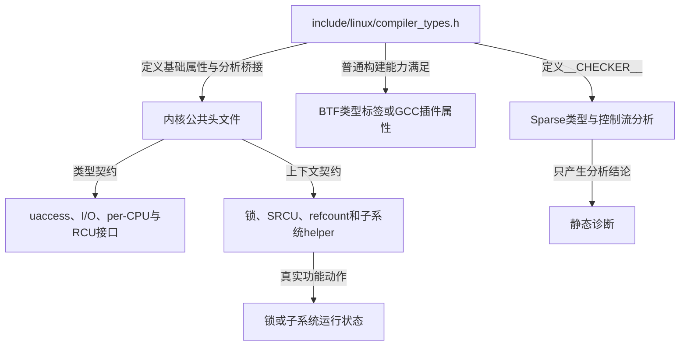
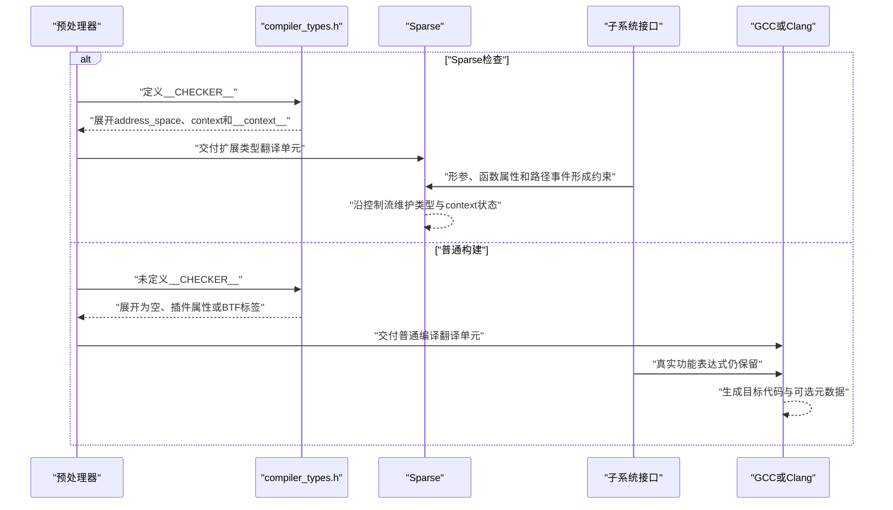

# 第1章\_Linux\_6.12\_编译器与Sparse注解源码导读

## 1.1\_基线与阅读任务

本导读基于仓库 [Linux 源码阅读基线](../../linux/SOURCE_BASELINE.md#1.1_当前来源)：NXP `linux-imx` 发布标签 `lf-6.12.20-2.0.0`、Git 提交 `dfaf2136deb2af2e60b994421281ba42f1c087e0`、Linux 6.12.20。源码身份来自远端、标签、提交与顶层版本，不来自本机目录名称。

本模块只回答五个源码阅读问题：

1. `BTF_TYPE_TAG()` 在什么构建能力下保留，何时退化为空；
2. `__CHECKER__` 怎样把同一组友好宏切换为 Sparse 类型与 context 语义；
3. 地址空间、类型桥接函数和逃生口分别落在哪一段定义；
4. 函数属性、路径事件和条件取得怎样组合；
5. 普通 GCC/Clang 分支怎样保持 ABI、参数求值和真实控制流不变。

跨版本稳定的解释与操作方法由 [Linux 内核编译器与静态分析注解专题](../../../../knowledge/foundations/c_language/kernel_static_annotations/大纲.md#1.1_专题定位) 维护。本篇不把 Linux 6.12 的具体宏组织写成永远不变的语言标准。

完整模块协作、两组正交状态和一次翻译单元处理周期见 [Linux 6.12 compiler types 注解模块概念导读](P02_Linux_6.12_compiler_types注解模块概念导读.md#2.1_模块问题与实现所有权)。

## 1.2\_模块边界与实现所有权



实现所有权分为三层：

| 层次 | 权威位置 | 当前导读如何处理 |
| --- | --- | --- |
| 基础注解宏 | `include/linux/compiler_types.h` | 组织完整定义簇并链接唯一实现讲解 |
| Sparse 分析器语义 | Sparse 项目 | 只引用官方文档，不把分析器算法复制成 Linux 实现 |
| 子系统接入 | `spinlock.h`、`refcount.h`、`rcupdate.h` 等 | 展示代表性调用点，具体功能仍归对应专题 |

## 1.3\_源码入口分组

### 1.3.1\_构建能力门槛

入口：[BTF TYPE TAG能力门槛](../source_explanations/P01_Linux_6.12_compiler_types注解宏源码实现.md#1.4_BTF_TYPE_TAG能力门槛)。

先读 `CONFIG_DEBUG_INFO_BTF`、`CONFIG_PAHOLE_HAS_BTF_TAG`、`__has_attribute(btf_type_tag)` 与 `__BINDGEN__` 的组合。这里决定普通构建能否把 `user`、`percpu`、`rcu` 保存为类型元数据。

### 1.3.2\_Sparse地址空间簇

入口：[地址空间注解与类型桥接函数](../source_explanations/P01_Linux_6.12_compiler_types注解宏源码实现.md#1.5_地址空间注解与类型桥接函数)。

依次阅读：

```text
__kernel
  → __user、__iomem、__percpu、__rcu
  → __chk_user_ptr()、__chk_io_ptr()
  → RCU等调用方构造更具体的类型检查表达式
```

这组定义只建立逻辑类型边界。真实 uaccess、I/O、per-CPU 与 RCU 功能接口必须分别核对。

### 1.3.3\_Sparse上下文簇

入口：[上下文注解与条件取得](../source_explanations/P01_Linux_6.12_compiler_types注解宏源码实现.md#1.6_上下文注解与条件取得)。

阅读顺序：

```text
函数边界属性
  __must_hold、__acquires、__cond_acquires、__releases

函数体/表达式事件
  __acquire、__release、__cond_lock

代表性调用点
  spinlock、refcount、SRCU和子系统helper
```

不要根据 `acquire` 名称推断真实功能动作。必须继续确认相邻函数是否执行了锁原子操作、失败返回和释放。

### 1.3.4\_其他限定与私有访问

入口：[其他限定与ACCESS PRIVATE逃生口](../source_explanations/P01_Linux_6.12_compiler_types注解宏源码实现.md#1.7_其他限定与_ACCESS_PRIVATE逃生口)。

`__force`、`__nocast`、`__safe`、`__private` 和 `ACCESS_PRIVATE()` 属于受控类型放宽或访问纪律。应同时搜索调用点，判断越权是否集中在对象所有者实现内。

### 1.3.5\_普通编译退化

入口：[普通编译分支怎样退化](../source_explanations/P01_Linux_6.12_compiler_types注解宏源码实现.md#1.8_普通编译分支怎样退化)。

这部分需要逐项检查：

- 哪些声明属性变为空；
- 哪些类型标记保留为插件/BTF输入；
- 哪些表达式退化为 `(void)0`；
- 哪些条件包装必须保留真实条件 `c`；
- 哪些参数在普通分支中不再求值。

## 1.4\_代表性调用链

### 1.4.1\_用户与I/O指针检查

```text
接口接收__user或__iomem指针
  → 包装宏调用__chk_user_ptr/__chk_io_ptr
  → 空inline函数形参要求对应address_space
  → Sparse检查调用实参转换
```

当前仓库保存的 `compiler_types.h` 提供桥接定义，但未为了本导读复制全部 uaccess 和 I/O 调用方。读者应从真实改动所在子系统继续追踪。

### 1.4.2\_trylock条件记账

[`include/linux/spinlock.h`](../../linux/include/linux/spinlock.h) 中：

```text
raw_spin_trylock(lock)
  → 求值_raw_spin_trylock(lock)真实结果
  → __cond_lock(lock, result)
  → 只在真分支登记__acquire(lock)
```

宏体的逐项解释见[条件取得的展开与分支状态](../source_explanations/P01_Linux_6.12_compiler_types注解宏源码实现.md#1.6.3_条件取得的展开与分支状态)。真实自旋锁功能由锁专题负责，本导读只解释 Sparse 接入。

### 1.4.3\_条件取得函数声明

[`include/linux/refcount.h`](../../linux/include/linux/refcount.h) 中 `refcount_dec_and_lock*()` 使用 `__cond_acquires(lock)`，表示函数可能在返回成功时取得锁。该属性的调用者传播能力不能仅凭宏名推断；还要检查调用表达式是否使用分支可见的包装以及当前 Sparse 行为。

### 1.4.4\_RCU类型桥接

[`include/linux/rcupdate.h`](../../linux/include/linux/rcupdate.h) 使用 `typeof(*p)`、`space` 与比较表达式构造 `rcu_check_sparse()`。具体实现已在 [RCU 公共接口与检查机制源码详解](../../rcu/source_explanations/P01_Linux_6.12_RCU_公共接口与检查机制源码详解.md#1.3.3_rcu_check_sparse静态类型桥接) 唯一展开，本专题只解释它依赖的基础 `__rcu` 属性。

## 1.5\_源码与分析状态时序



## 1.6\_建议阅读顺序

1. 先读稳定专题的[同一份源码怎样面对多个消费者](../../../../knowledge/foundations/c_language/kernel_static_annotations/P01_同一份源码怎样面对多个消费者.md#1.3_处理链不是一条只有编译器的直线)，建立分层坐标；
2. 打开仓库保存的 [`include/linux/compiler_types.h`](../../linux/include/linux/compiler_types.h)，只读文件开头到 `__CHECKER__` 分支结束；
3. 进入唯一实现讲解的[源码符号覆盖账本](../source_explanations/P01_Linux_6.12_compiler_types注解宏源码实现.md#1.2_源码符号覆盖账本)，确认每个符号的消费者；
4. 分别阅读[address-space类型](../source_explanations/P01_Linux_6.12_compiler_types注解宏源码实现.md#1.5_地址空间注解与类型桥接函数)与[context路径](../source_explanations/P01_Linux_6.12_compiler_types注解宏源码实现.md#1.6_上下文注解与条件取得)，不要交叉混用两本账；
5. 阅读[普通编译退化](../source_explanations/P01_Linux_6.12_compiler_types注解宏源码实现.md#1.8_普通编译分支怎样退化)，逐项核对 ABI、参数求值和控制流；
6. 按实验目标进入 [Sparse 地址空间与上下文记账研究型实验](../../../../labs/foundations/c_language/P01_Sparse地址空间与上下文记账/README.md#1.1_实验目标)，完成预处理、单变量诊断、消费者对照和 Kbuild 接入闭环；
7. 最后回到 RCU、锁或驱动调用方，确认基础注解怎样与真实功能状态配对。

## 1.7\_当前证据边界

- 本导读确认的是仓库保存的 Linux 6.12.20 `compiler_types.h` 与代表性调用点；不声明其他内核版本宏组织完全相同。
- 当前 `.config` 中的 `CONFIG_TREE_RCU`、`CONFIG_PREEMPT_RCU` 不能推出构建时一定启用 `CONFIG_DEBUG_INFO_BTF`，也不能推出开发机已经运行 Sparse。
- BTF 能力还依赖编译器属性与 `pahole`；仅看到源码分支不能证明最终 `.BTF` 已包含标签。
- Sparse 的分析能力受其版本、配置分支、注解完整性和翻译单元可见性限制。
- 本地 Windows 会话没有 Sparse 运行环境，因此实验观测仍待 Linux 环境补录。
