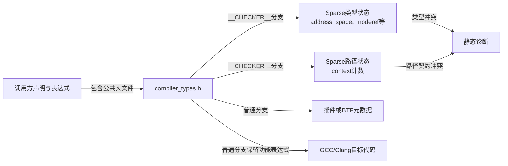

# 第2章\_Linux\_6.12\_compiler\_types注解模块概念导读

## 2.1\_模块问题与实现所有权

总阅读入口见 [Linux 6.12 编译器与 Sparse 注解源码导读](P01_Linux_6.12_编译器与Sparse注解源码导读.md#1.1_基线与阅读任务)。本篇不逐段复制宏体，只借 `include/linux/compiler_types.h` 回答一个模块问题：同一组内核友好注解怎样在 Sparse 分析、普通编译、插件和 BTF 元数据之间切换，同时保证真实功能表达式不被检查分支改变？

DWARF、BTF 与 type tag 的跨版本稳定模型见[普通编译、BTF 与运行时边界](../../../../knowledge/foundations/c_language/kernel_static_annotations/P05_普通编译_BTF与运行时边界.md#5.2_先把type_tag理解为类型上的语义元数据)；本篇只负责把该模型落到 Linux 6.12 `compiler_types.h` 的模块分支与阅读顺序。

实现所有权如下：

| 组件 | 负责什么 | 不负责什么 |
| --- | --- | --- |
| `compiler_types.h` | 定义公共注解外形、消费者分支与退化规则 | 实现uaccess、I/O、锁、RCU功能 |
| C预处理器 | 选择`__CHECKER__`等条件并展开宏 | 理解地址域或锁语义 |
| Sparse | 建立扩展类型和context控制流状态 | 生成运行内核目标文件 |
| GCC/Clang | 生成目标代码与可选调试元数据 | 自动执行Sparse契约 |
| 子系统接口 | 把基础注解接到具体指针、helper和原语 | 重新定义Sparse核心语义 |

具体宏体、配置分支和修改影响由 [Linux 6.12 compiler types 注解宏源码实现](../source_explanations/P01_Linux_6.12_compiler_types注解宏源码实现.md#1.1_关联入口与实现边界) 唯一维护。

## 2.2\_参与者与两组正交状态



模块不是一个单一状态机，而是至少包含两组正交状态：

- **类型状态：** 指针属于哪个逻辑地址域、能否普通解引用、转换是否需要显式越权；
- **路径状态：** 某个上下文进入函数时是多少、当前分支增减了多少、退出是否平衡。

BTF标签是第三类编译元数据，不参与前两本 Sparse 账本；真实锁和RCU状态又属于运行时功能层。

## 2.3\_一次翻译单元处理周期

| 阶段 | 触发 | 主要输入 | 写入者 | 结果 | 退出条件 |
| --- | --- | --- | --- | --- | --- |
| S0 条件确定 | 构建命令启动预处理 | Kconfig、编译器能力、`__CHECKER__`等宏 | 构建系统与工具 | 当前翻译分支集合 | 条件宏固定 |
| S1 公共注解展开 | 调用方包含头文件 | 友好宏与实参 | 预处理器 | 属性、类型、表达式或空宏 | 翻译单元交给消费者 |
| S2a Sparse分析 | 定义`__CHECKER__` | address-space与context语法 | Sparse | 类型/路径抽象状态与诊断 | 分析完成 |
| S2b 普通编译 | 未定义`__CHECKER__` | 真实表达式、可选插件/BTF属性 | GCC/Clang | 目标代码与可选元数据 | 编译完成 |
| S3 功能运行 | 目标文件链接并启动 | 真实访问器、锁和RCU代码 | CPU与内核状态机 | 运行时功能状态 | 操作结束或系统停止 |

S2a 与 S2b 是并列构建路径，不是先运行 Sparse 再自动继续生成同一个目标文件。S3 只来自普通编译产物。

## 2.4\_地址空间模块链

```text
调用方声明__user/__iomem/__percpu/__rcu
  → compiler_types.h在Sparse分支附加address_space
  → noderef阻止普通解引用
  → 形参、赋值、比较和显式转换消费类型
  → 专用访问器负责真实功能协议
```

`__chk_user_ptr()` 与 `__chk_io_ptr()` 的空函数体不改变状态；带地址域的形参是类型桥。RCU 的 `rcu_check_sparse()` 则利用 `typeof(*p)` 构造期望目标类型。具体定义见[地址空间注解与类型桥接函数](../source_explanations/P01_Linux_6.12_compiler_types注解宏源码实现.md#1.5_地址空间注解与类型桥接函数)，RCU 实例见 [`rcu_check_sparse()` 静态类型桥接](../../rcu/source_explanations/P01_Linux_6.12_RCU_公共接口与检查机制源码详解.md#1.3.3_rcu_check_sparse静态类型桥接)。

## 2.5\_上下文模块链

```text
函数声明context(entry, exit)
  → 调用点建立入口/出口契约
  → 函数体中的__context__(delta)更新当前路径
  → 分支合流与函数返回检查计数
  → 只形成Sparse诊断，不取得真实锁
```

trylock 的关键分支是：真实尝试先产生结果，`__cond_lock()` 再只在成功表达式中放入 `__acquire()`。具体展开见[条件取得的展开与分支状态](../source_explanations/P01_Linux_6.12_compiler_types注解宏源码实现.md#1.6.3_条件取得的展开与分支状态)。

`__cond_acquires()` 的负退出值不能读成普通计数目标，也不能假设分析器会自动把函数布尔返回值关联到调用者真分支。阅读调用方时必须继续查找显式分支包装。

## 2.6\_普通编译模块链

```text
未定义__CHECKER__
  → 地址域和context语法不能进入普通编译器路径
  → 声明注解变空
  → 检查语句变(void)0
  → 条件包装必须保留真实条件c
  → 能力满足时类型标签进入插件或BTF元数据
```

这个退化过程需要保持三项不变量：函数 ABI 不因 Sparse 开关改变；检查参数不能意外增加业务求值；真实 trylock 条件不能被常量替代。具体矩阵见[普通编译分支怎样退化](../source_explanations/P01_Linux_6.12_compiler_types注解宏源码实现.md#1.8_普通编译分支怎样退化)。

## 2.7\_代表性调用点怎样分工

| 调用点 | 使用的基础注解 | 当前模块能解释什么 | 应继续进入哪里 |
| --- | --- | --- | --- |
| `raw_spin_trylock()` | `__cond_lock()` | 成功分支怎样登记Sparse context | 锁专题的真实原子取得与内存序 |
| `refcount_dec_and_lock*()` | `__cond_acquires()` | 函数声明表达条件取得 | refcount与锁组合的功能/生命期 |
| `rcu_check_sparse()` | `__rcu`、`typeof()` | 怎样构造地址域类型约束 | RCU发布、取得与对象回收 |
| `ACCESS_PRIVATE()`调用点 | `__private`、`__force` | 怎样集中有意越权 | 对象所有者的字段不变量 |

相同基础宏被多个子系统使用，不意味着功能语义相同。通用注解只在本专题展开一次，各子系统继续解释自己的实例、时序和误用后果。

## 2.8\_建议阅读顺序与修改边界

1. 从总索引的[源码入口分组](P01_Linux_6.12_编译器与Sparse注解源码导读.md#1.3_源码入口分组)建立文件坐标；
2. 先读[地址空间模块链](#2.4_地址空间模块链)，再读[上下文模块链](#2.5_上下文模块链)，不要混合两组状态；
3. 使用[普通编译模块链](#2.6_普通编译模块链)核对空宏、参数求值和BTF边界；
4. 进入[源码符号覆盖账本](../source_explanations/P01_Linux_6.12_compiler_types注解宏源码实现.md#1.2_源码符号覆盖账本)逐项查看具体宏体；
5. 完成 [Sparse 地址空间与上下文记账研究型实验](../../../../labs/foundations/c_language/P01_Sparse地址空间与上下文记账/README.md#1.1_实验目标)，用正反例、自动断言和 Kbuild 日志复验模块结论；
6. 修改任何基础宏后，同时检查 Sparse、普通编译、调用方正确/错误样例以及可选BTF产物。

模块级结论是：`compiler_types.h` 负责把设计意图路由给正确消费者，并保持其他消费者安全退化；它本身不替代任何子系统功能协议。
