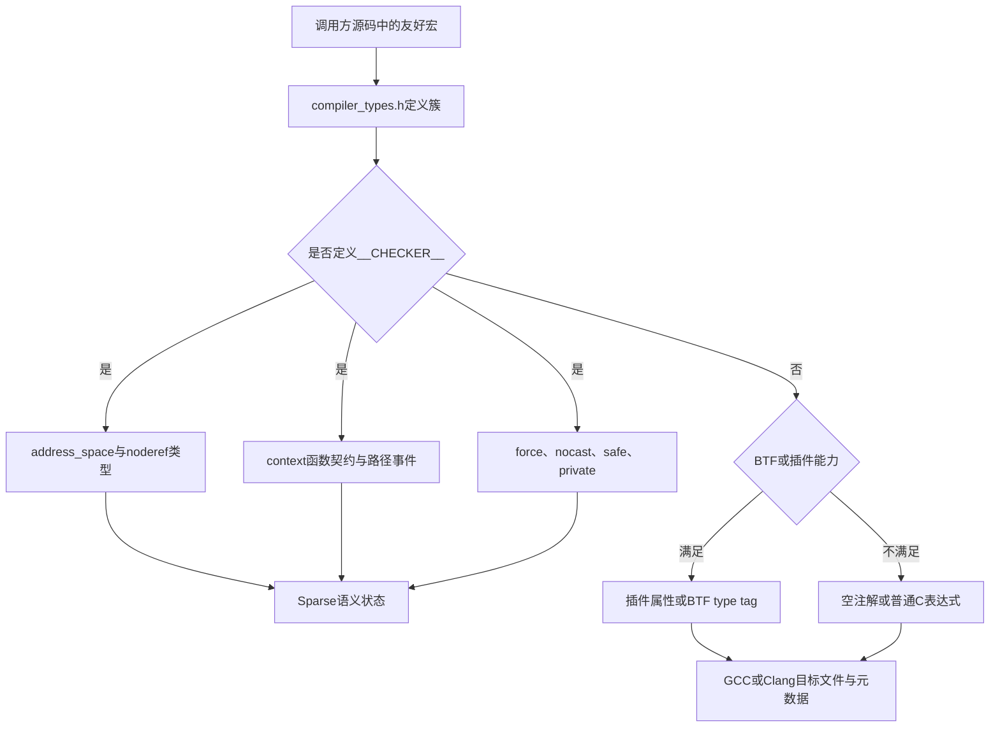
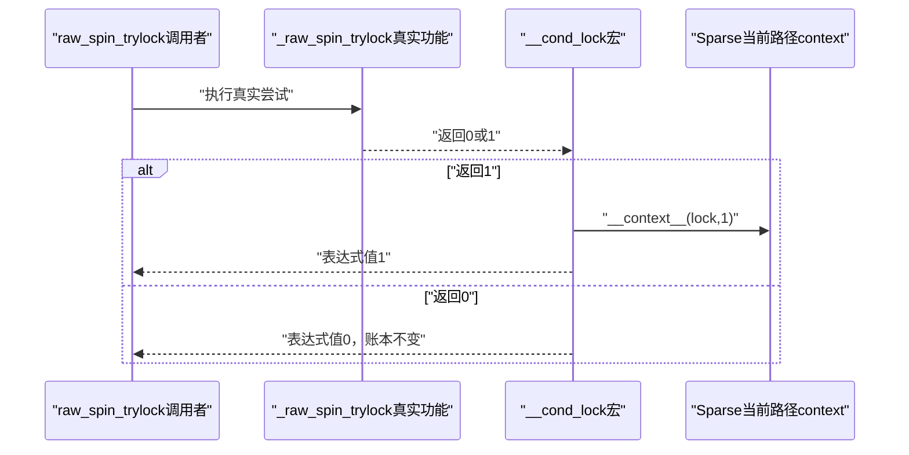
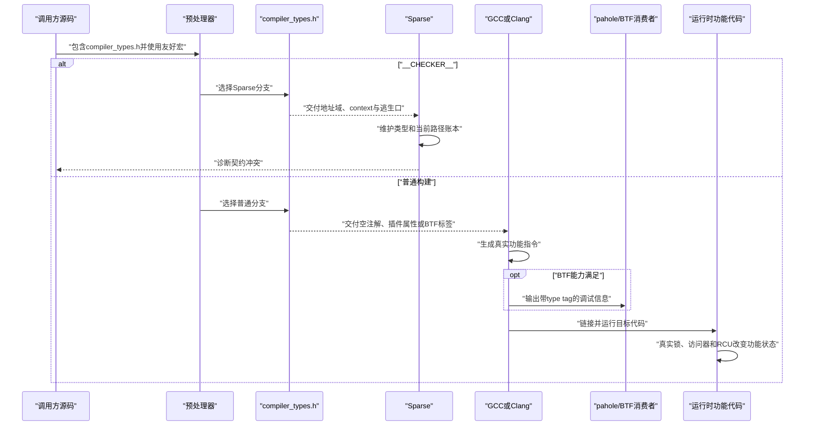

# 第1章\_Linux\_6.12\_compiler\_types注解宏源码实现

## 1.1\_关联入口与实现边界

| 阅读任务 | 权威入口 |
| --- | --- |
| 建立跨版本稳定的多消费者模型 | [Linux 内核编译器与静态分析注解专题](../../../../knowledge/foundations/c_language/kernel_static_annotations/大纲.md#1.1_专题定位) |
| 理解type tag、DWARF/BTF生成链与证明边界 | [普通编译、BTF 与运行时边界](../../../../knowledge/foundations/c_language/kernel_static_annotations/P05_普通编译_BTF与运行时边界.md#5.2_先把type_tag理解为类型上的语义元数据) |
| 按模块职责和调用点阅读源码 | [Linux 6.12 编译器与 Sparse 注解源码导读](../navigation/P01_Linux_6.12_编译器与Sparse注解源码导读.md#1.1_基线与阅读任务) |
| 理解模块协作与两组正交状态 | [Linux 6.12 compiler types 注解模块概念导读](../navigation/P02_Linux_6.12_compiler_types注解模块概念导读.md#2.1_模块问题与实现所有权) |
| 验证地址域、context与Kbuild接入 | [Sparse 地址空间与上下文记账研究型实验](../../../../labs/foundations/c_language/P01_Sparse地址空间与上下文记账/README.md#1.1_实验目标) |
| 理解RCU怎样消费`__rcu` | [`rcu_check_sparse()` 静态类型桥接](../../rcu/source_explanations/P01_Linux_6.12_RCU_公共接口与检查机制源码详解.md#1.3.3_rcu_check_sparse静态类型桥接) |
| 理解运行时锁依赖 | [Lockdep 专题](../../../../knowledge/linux/synchronization/lockdep/大纲.md#1.1_专题定位) |

本篇唯一展开仓库保存的 Linux 6.12.20 [`include/linux/compiler_types.h`](../../linux/include/linux/compiler_types.h) 文件开头注解实现簇。Sparse 分析器内部算法归 Sparse 项目维护；uaccess、MMIO、per-CPU、RCU 和真实锁功能归各自子系统维护。

## 1.2\_源码符号覆盖账本

| 符号或实现簇 | 声明与定义 | 消费者 | 状态类别 | 普通构建退化 | 修改影响 |
| --- | --- | --- | --- | --- | --- |
| `BTF_TYPE_TAG()` | `compiler_types.h` | GCC/Clang、pahole、BTF工具 | 编译元数据 | 能力不足时为空 | 调试类型、BPF与工具兼容性 |
| `__kernel`、`__user`、`__iomem`、`__percpu`、`__rcu` | 同上 | Sparse | 静态类型状态 | 空、插件属性或BTF标签 | 大量公共接口的类型诊断 |
| `__chk_user_ptr()`、`__chk_io_ptr()` | 同上空inline函数 | Sparse调用类型匹配 | 静态类型状态 | `(void)0`且参数不求值 | uaccess与I/O包装诊断 |
| `__must_hold()`、`__acquires()`、`__cond_acquires()`、`__releases()` | 同上函数属性 | Sparse | 函数边界context契约 | 空 | helper、锁、SRCU与refcount调用链 |
| `__acquire()`、`__release()`、`__cond_lock()` | 同上表达式宏 | Sparse与真实条件调用方 | 当前路径context状态 | 空事件但保留条件 `c` | 成功/失败/回滚路径配对 |
| `__force`、`__nocast`、`__safe`、`__private` | 同上类型属性 | Sparse | 类型放宽或限制 | 空 | 误报、漏报与接口封装 |
| `ACCESS_PRIVATE()` | 同上复合表达式 | 对象实现所有者 | 受控越权点 | 直接成员访问 | 私有字段访问边界 |
| `__builtin_warning()` | 同上普通分支回退 | 具体调用表达式 | 常量表达式 | 返回 `1` | 分支选择；需继续查调用方 |

## 1.3\_对象关系与处理分支



## 1.4\_BTF\_TYPE\_TAG能力门槛

仓库保存的上游实现为：

```c
/**
 * @brief 仓库补充阅读说明，非上游原文。
 *
 * 只有配置、pahole、编译器属性和bindgen边界同时满足时，
 * 才把value字符串附着为btf_type_tag；否则保持可构建的空宏。
 */
#if defined(CONFIG_DEBUG_INFO_BTF) && \
    defined(CONFIG_PAHOLE_HAS_BTF_TAG) && \
    __has_attribute(btf_type_tag) && !defined(__BINDGEN__)
# define BTF_TYPE_TAG(value) __attribute__((btf_type_tag(#value)))
#else
# define BTF_TYPE_TAG(value) /* nothing */
#endif
```

### 1.4.1\_实现原理

`#value` 把宏实参转成字符串，例如 `BTF_TYPE_TAG(rcu)` 形成 `btf_type_tag("rcu")`。该标签附着到类型元数据；它不增加 Sparse 地址域，也不生成运行时 RCU 操作。

`__has_attribute()` 是编译器能力探测。即使 Kconfig 请求 BTF、`pahole` 也支持 type tag，编译器无法解析属性时仍必须退化为空。`__BINDGEN__` 分支用于避开当前绑定生成工具的兼容问题，不能删除后假设所有语言绑定都能接受该属性。

### 1.4.2\_可修改性说明

修改能力条件时至少检查：

- GCC 与 Clang 构建；
- 开启和关闭 `CONFIG_DEBUG_INFO_BTF`；
- 新旧 `pahole` 能力；
- bindgen 路径；
- `__user`、`__percpu`、`__rcu` 的元数据消费者；
- 普通构建在能力不足时是否仍能通过。

最小观察包括编译器预处理输出、目标文件 `.BTF` 段以及 `pahole`/`bpftool` 类型转储，不能只检查源码宏是否存在。

## 1.5\_地址空间注解与类型桥接函数

```c
/**
 * @brief 仓库补充阅读说明，非上游原文。
 *
 * 这些属性创建Sparse逻辑类型域；noderef禁止普通解引用。
 */
# define __kernel __attribute__((address_space(0)))
# define __user   __attribute__((noderef, address_space(__user)))
# define __iomem  __attribute__((noderef, address_space(__iomem)))
# define __percpu __attribute__((noderef, address_space(__percpu)))
# define __rcu    __attribute__((noderef, address_space(__rcu)))

static inline void
__chk_user_ptr(const volatile void __user *ptr)
{
}

static inline void
__chk_io_ptr(const volatile void __iomem *ptr)
{
}
```

### 1.5.1\_实现原理

`address_space(0)` 表示默认内核地址域；命名地址域把目标类型区分为 `__user`、`__iomem`、`__percpu` 和 `__rcu`。`noderef` 进一步禁止普通解引用。

两个空inline函数不修改程序状态。Sparse 在调用点把实参转换为带地址域的形参类型，因此能够报告不兼容。普通编译分支把函数入口替换为宏 `(void)0`，参数不求值。

### 1.5.2\_状态副作用

| 路径 | 输入 | 分析状态变化 | 生成代码 |
| --- | --- | --- | --- |
| Sparse声明 | 指针声明 | 增加逻辑地址域与noderef限定 | 无目标代码 |
| Sparse调用检查函数 | 实参表达式 | 执行类型兼容检查 | 空函数通常不产生业务代码 |
| 普通编译 | 相同友好宏 | 无Sparse类型状态 | 空、插件属性或BTF标签 |

### 1.5.3\_可修改性说明

改变属性施加位置会影响大量接口的类型传播。最小安全修改面必须同时准备：

- 同地址域的正确赋值与形参传递；
- 跨地址域的故意错误；
- 受限指针裸解引用；
- 使用专用访问器的正确路径；
- 普通编译和 Sparse 两个分支。

不能通过在公共宏中普遍加入 `__force` 修复警告；那会删除边界而不是修复访问协议。

## 1.6\_上下文注解与条件取得

```c
/**
 * @brief 仓库补充阅读说明，非上游原文。
 *
 * 函数属性描述入口/出口计数，__context__描述当前路径增量。
 */
# define __must_hold(x)     __attribute__((context(x, 1, 1)))
# define __acquires(x)      __attribute__((context(x, 0, 1)))
# define __cond_acquires(x) __attribute__((context(x, 0, -1)))
# define __releases(x)      __attribute__((context(x, 1, 0)))
# define __acquire(x)       __context__(x, 1)
# define __release(x)       __context__(x, -1)
# define __cond_lock(x, c)  ((c) ? ({ __acquire(x); 1; }) : 0)
```

### 1.6.1\_函数契约与路径事件

`context(x, entry, exit)` 是函数声明属性。调用点用 `exit - entry` 更新抽象状态，函数体分析则检查各返回路径能否满足声明。`__context__(x, delta)` 直接在当前控制流上增加或减少计数。

这里没有任何真实锁字段，也没有 CPU acquire/release 内存序。底层锁函数必须另外完成原子取得、等待、失败返回和释放。

### 1.6.2\_cond\_acquires的特殊退出值

`context(x, 0, -1)` 中的负退出值不能作为普通目标计数读取。它表达条件取得的特殊情况；当前 Sparse 不能仅凭函数返回值自动把调用者真分支变成一次取得。因此在分析调用点时，仍要确认是否存在 `__cond_lock()` 这种把 `__acquire()` 放入成功表达式的包装。

这也是修改 `refcount_dec_and_lock*()` 一类接口时的风险：函数声明出现 `__cond_acquires()` 只能说明作者表达了条件语义，不能直接证明所有包装层和调用者分支都得到精确跟踪。

### 1.6.3\_条件取得的展开与分支状态

[`include/linux/spinlock.h`](../../linux/include/linux/spinlock.h) 中：

```c
#define raw_spin_trylock(lock) \
    __cond_lock(lock, _raw_spin_trylock(lock))
```

Sparse 分支的端到端过程：



普通编译分支中 `__cond_lock(x, c)` 只剩 `(c)`，因此 `_raw_spin_trylock(lock)` 仍然只求值一次，返回值和控制流不变。

### 1.6.4\_可修改性说明

新增或修改上下文注解时必须同步检查：

- 真实功能尝试发生在静态登记之前还是之后；
- 失败、回滚和取消路径是否错误登记；
- 每个正常与错误返回的计数；
- trylock 成功条件是否进入调用者可见分支；
- 嵌套取得是否使用同一上下文身份；
- 普通编译分支是否改变实参求值次数；
- `-Wcontext` 正确与错误样例。

## 1.7\_其他限定与\_ACCESS\_PRIVATE逃生口

```c
/**
 * @brief 仓库补充阅读说明，非上游原文。
 *
 * force是显式越权；private借noderef限制普通成员访问。
 */
# define __force   __attribute__((force))
# define __nocast  __attribute__((nocast))
# define __safe    __attribute__((safe))
# define __private __attribute__((noderef))

# define ACCESS_PRIVATE(p, member) \
    (*((typeof((p)->member) __force *)&(p)->member))
```

### 1.7.1\_实现原理

`ACCESS_PRIVATE()` 先取得成员类型与成员地址，再通过带 `__force` 的成员类型指针显式绕过 `noderef`，最后解引用恢复成员左值。该表达式不会新增存储，也不会改变成员布局。

`__force` 只抑制 Sparse 额外限定导致的转换诊断。`__nocast` 提供较弱的转换约束，`__safe` 声明指针不应为空或陷阱值，`__private` 只形成 Sparse 访问纪律。

### 1.7.2\_代表性调用点

仓库保存的 RCU 实现使用 `ACCESS_PRIVATE(rnp, lock)`、`ACCESS_PRIVATE(sdp, lock)` 管理私有锁成员；内存管理使用它更新 VMA 私有标志。调用点证明该宏用于实现所有者有意访问，不能反过来推出任何调用者都可以绕过私有边界。

### 1.7.3\_可修改性说明

修改私有成员或访问器时应全仓搜索 `ACCESS_PRIVATE`，确认初始化、锁类设置、取得、释放和断言仍使用同一成员身份。若把调用点改回直接访问，Sparse 分支可能重新诊断；若把 `__private` 删除，外部误用则可能失去静态约束。

## 1.8\_普通编译分支怎样退化

```c
/**
 * @brief 仓库补充阅读说明，非上游原文。
 *
 * 普通构建不维护Sparse账本，但可能保留插件或BTF元数据。
 */
# define __kernel
# ifdef STRUCTLEAK_PLUGIN
#  define __user __attribute__((user))
# else
#  define __user BTF_TYPE_TAG(user)
# endif
# define __iomem
# define __percpu BTF_TYPE_TAG(percpu)
# define __rcu    BTF_TYPE_TAG(rcu)

# define __chk_user_ptr(x) (void)0
# define __chk_io_ptr(x)   (void)0
# define __must_hold(x)
# define __acquires(x)
# define __cond_acquires(x)
# define __releases(x)
# define __acquire(x)      (void)0
# define __release(x)      (void)0
# define __cond_lock(x, c) (c)
# define __force
# define __nocast
# define __safe
# define __private
# define ACCESS_PRIVATE(p, member) ((p)->member)
# define __builtin_warning(x, y...) (1)
```

### 1.8.1\_实现原理

这组退化遵守三项不变量：

1. Sparse 专用语法不能交给不认识它的普通编译路径；
2. 删除分析事件不能改变 ABI、业务参数求值和真实控制流；
3. 配置与工具能力允许时，可以保留不执行协议的插件/BTF元数据。

`__cond_lock(x, c)` 必须保留 `c`，因为 `c` 是真实 trylock 结果。`__chk_user_ptr(x)` 变成 `(void)0` 后不求值 `x`，说明这类检查入口不允许承载业务副作用。

### 1.8.2\_builtin\_warning证据边界

当前保存的证据只确认非 Sparse 分支把 `__builtin_warning(x, y...)` 定义成常量 `1`。没有具体调用表达式时，只能证明它提供可编译的返回值形状，不能推断它一定选择哪个分支或产生何种诊断。继续研究时应先 `rg` 全部调用点，再按当前配置展开。

### 1.8.3\_可修改性说明

调整普通分支时必须比较预处理输出，并至少编译一个使用类型宏、检查函数、trylock 与私有成员的代表性翻译单元。任何新增参数求值、返回值变化或 ABI 属性都不是“只改静态检查”，需要按功能变更重新审查。

## 1.9\_完整端到端时序



## 1.10\_配置与工具矩阵

| 条件 | Sparse类型/context | 插件属性 | BTF标签 | 真实功能代码 |
| --- | --- | --- | --- | --- |
| Sparse定义`__CHECKER__` | 有 | 不走普通分支 | 不走普通分支 | 不生成内核目标文件 |
| 普通构建且`STRUCTLEAK_PLUGIN` | 无 | `__user`可保留插件属性 | 其他标签仍看BTF门槛 | 保留 |
| 普通构建且BTF门槛满足 | 无 | 视插件分支 | `user/percpu/rcu`可保留 | 保留 |
| 普通构建且BTF门槛不满足 | 无 | 视插件分支 | 空 | 保留 |

这个矩阵没有“实际运行内核启用 Sparse”一行，因为 Sparse 是构建阶段工具，不是启动配置。

## 1.11\_修改影响核对表

| 修改 | 最小必须同步检查 |
| --- | --- |
| 新增地址域 | 所有声明、转换、专用访问器、正确/错误样例与普通分支 |
| 改`noderef`位置 | 裸解引用诊断、合法访问器内部与逃生口 |
| 改函数context属性 | 所有返回、错误回滚、包装层和调用者分支 |
| 改`__cond_lock` | 条件求值次数、真/假分支、真实trylock结果与普通构建 |
| 改`BTF_TYPE_TAG`门槛 | 编译器、pahole、bindgen、BTF转储与无BTF构建 |
| 改`ACCESS_PRIVATE` | 私有成员全部调用点、初始化、锁类、断言与普通构建 |
| 改普通分支空宏 | ABI、参数副作用、控制流、代码生成与分析/非分析一致性 |

## 1.12\_证据与验证

- 稳定语义参考 [Sparse 注解文档](https://sparse.docs.kernel.org/en/latest/annotations.html) 与 [Linux 内核 Sparse 文档](https://docs.kernel.org/dev-tools/sparse.html)。
- GNU 属性外形参考 [GCC 属性语法](https://gcc.gnu.org/onlinedocs/gcc/Attribute-Syntax.html)。
- BTF 属性能力参考 [Clang btf type tag](https://clang.llvm.org/docs/AttributeReference.html#btf-type-tag)。
- 本篇宏体来自仓库保存的 [`include/linux/compiler_types.h`](../../linux/include/linux/compiler_types.h)，版本身份见 [Linux 源码阅读基线](../../linux/SOURCE_BASELINE.md#1.1_当前来源)。
- 可执行的单变量反例、消费者对照、自动断言和 Kbuild 接入见 [Sparse 地址空间与上下文记账研究型实验](../../../../labs/foundations/c_language/P01_Sparse地址空间与上下文记账/README.md#1.1_实验目标)。

当前 Windows 会话没有 Sparse 可执行环境，因此源码位置、宏展开关系、链接和实验源文件可以静态核对，但不能把预期警告描述为本次已运行结果。
