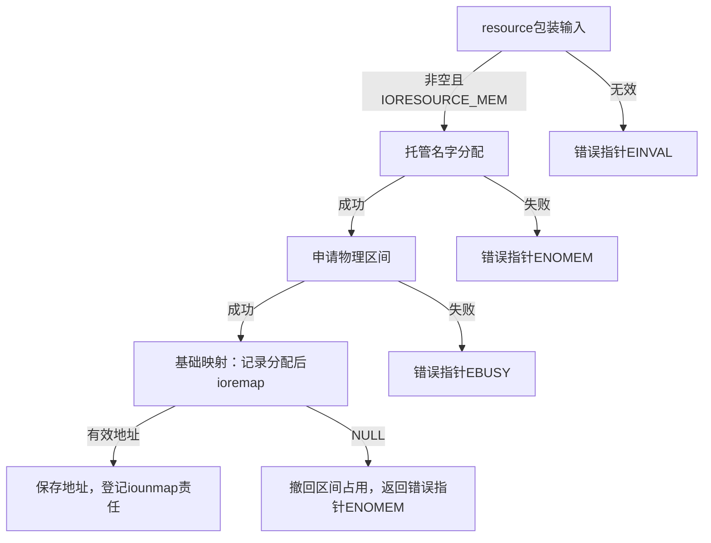

# 第3章\_内存映射与中断资源导读

已从[P02](P02_记录与分组清理导读.md#2.1_从记录地址追踪S0到S4)知道资源成功和登记成功是两个事件，本篇比较四类包装怎样进入S1，以及失败前要撤回哪些责任。固定版本与配置入口见[总索引](P01_Linux_6.12_devres源码阅读索引.md#1.1_固定版本与阅读任务)，对应[API查询](../../../../knowledge/linux/object_lifetime/devres/devres_API说明.md#2.2_内存与字符串)。

## 3.1\_内存失败与零大小

在`include/linux/device.h`中，devm_kzalloc向devm_kmalloc加入清零标志；devm_kcalloc经devm_kmalloc_array检查乘法溢出，再进入总字节分配。`drivers/base/devres.c`的devm_kmalloc在零大小时返回ZERO_SIZE_PTR，不创建可访问的数据区；非零分配成功才写调试记录并登记。其资源数据区与通用记录一起分配，最终由通用release_nodes回收记录所占内存。

同一devres.c中的devm_kstrdup先判空输入，再计算含终止符长度、申请和复制；devm_kmemdup按指定长度复制，不为内部指针管理寿命。这些函数本批核对既有[device.h](../../linux/include/linux/device.h)与[devres.c](../../linux/drivers/base/devres.c)原文，未另复制函数体。

## 3.2\_映射与区域占用是两条责任

公共devm_ioremap在`include/linux/io.h`声明size为resource_size_t，`lib/devres.c`的[基础映射实现](../source_explanations/lib/devres.c.md#1.1_基础映射失败保持NULL)先分配保存映射地址的记录，再调用底层ioremap。任一失败都是NULL；成功只登记iounmap责任，没有申请区间占用。

[resource包装](../source_explanations/lib/devres.c.md#1.2_资源包装将失败编码并撤回区域)检查资源类型、准备名字、申请区间，再调用基础映射。其对外错误表示改为错误指针：无效资源为EINVAL，区间申请失败为EBUSY，名字或映射路径分配失败为ENOMEM。基础映射失败后，它使用托管区间释放接口撤回占用，而名字分配仍留给已有设备账本处理。不能因为最后一步失败就声称所有早期记录都即时消失。

图中的IORESOURCE_MEM表示内存资源类型。`drivers/base/platform.c`中的按index或name入口先取这一类资源，再调用同一resource包装；没有找到资源会传入NULL并转为相应错误。无HAS_IOMEM时，头文件桩也返回错误值。这里核对包装选择与返回路径，不证明ARM具体页表属性、缓存一致性或某块板上寄存器访问已经验证。

## 3.3\_GPIO可选缺席与记录失败

固定`drivers/gpio/gpiolib-devres.c`中，普通get转到index为0的获取。devm_gpiod_get_index先调用gpiod_get_index，错误直接传播；正常取得之后才分配devres记录，记录失败必须gpiod_put再返回ENOMEM。非独占标志还查找本设备是否已有同一描述符登记，不能简单数调用次数推算最终put次数。

optional入口经devm_gpiod_get_index_optional，只在gpiod_not_found成立时转为NULL。`drivers/gpio/gpiolib.h`把该谓词定义为错误值ENOENT；其他错误没有被吞掉。`include/linux/gpio/consumer.h`在GPIOLIB未启用时另有桩：optional返回NULL，非optional返回ENOSYS。这是配置契约，不能拿这个NULL当板上GPIO确实缺席的证据。

GPIO原文已有[仓库副本](../../linux/drivers/gpio/gpiolib-devres.c)，配置头和gpiolib.h本批按固定对象只读核对；具体方向、电平与板级顺序继续遵循消费者专题，不在本页推导硬件结论。

## 3.4\_IRQ记录不替代使用者退出

`include/linux/interrupt.h`的devm_request_irq是thread_fn为NULL的包装。`kernel/irq/devres.c`先分配irq_devres，再调用request_threaded_irq；底层失败只释放未登记记录，成功写irq与dev_id后登记。设备核心将来沿devm_irq_release执行free_irq，记录并不会自动为dev_id所指私有对象增加引用。

提前调用devm_free_irq会按irq/dev_id匹配并销毁记录，再执行free_irq。固定`kernel/irq/manage.c`的free_irq及__free_irq涉及移除处理者、同步硬中断和停止对应线程；接口文档明确不可在中断上下文调用，共享线还须先停本设备的硬件来源。它们没有替驱动把先前投递的任意work一起排空，驱动仍须按资源依赖组织后续退出。

这几份IRQ文件本批只读核对，未保存新的完整原文或另写函数体。对应返回值、提前释放与状态初始化要求见[IRQ参考](../../../../knowledge/linux/object_lifetime/devres/devres_API说明.md#2.5_IRQ)。

## 3.5\_已执行验证与未覆盖范围

两个映射内部包装从固定原文抽取，11条宿主顺序路径覆盖基础记录失败、映射失败、成功，以及resource无效、名字失败、区间失败、两种映射失败与普通/非posted选择。资源提供者、分配器、日志和登记操作是明确替身，未执行真实ioremap或硬件占用。它能检查包装层NULL/错误指针转换和失败时是否调用撤回，不证明真实资源分配行为。

14项公开接口的真实头文件类型断言通过当前ARM前端；这既不是运行测试，也不是跨配置编译矩阵。GPIO与IRQ动态路径仅源码核对，未进行真实中断、热拔、并发或平台绑定试验。返回[总索引](P01_Linux_6.12_devres源码阅读索引.md#1.2_按问题进入实现)。

下一组[句柄启停与注册契约](P04_句柄启停与注册契约导读.md#4.1_时钟把退出动作放进同一记录)继续比较普通获取、带状态获取及不同注册返回值。
