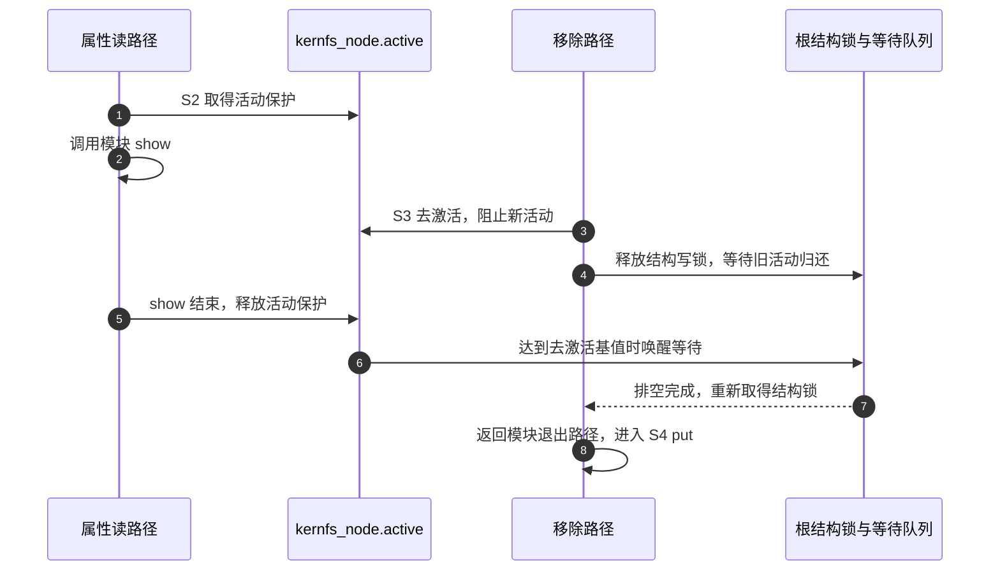
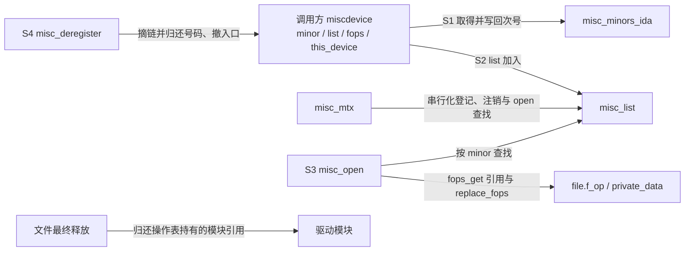

# 第2章\_对象属性与字符入口导读

同样是打开一个路径，sysfs 属性与 misc 字符设备沿两条不同的协作链运行。本篇面向已经做过教材实验的读者，把读请求与退出请求放到真实状态地址上；宏体和函数体统一留在[实现文档](../source_explanations/P01_对象创建与misc分派.md)。

## 2.1\_对象属性的两个寿命

先复用属性教材的 S0～S4。S1 的 kobject_create_and_add 分配动态对象，kobject_init 设置初始引用和 dynamic_kobj_ktype，再由 kobject_add 加入层次。失败时便利函数归还已经取得的引用，只返回 NULL；调用方不能再从 NULL 取回原始 errno。

S2 的属性节点不另造一个 device。sysfs_create_file 根据 kobj->sd 找到目录，在属性节点保存 attribute 关联。读取路径 sysfs_kf_seq_show 从打开文件找到 kernfs 节点，用父节点的 priv 找到 kobject，再经 kobj->ktype->sysfs_ops->show 调用属性方法。动态 kobject 的 kobj_sysfs_ops 把公共 attribute 还原为 kobj_attribute，最后调用 status_show。

| 状态载体 | 登记或写入者 | 消费者与生命期 |
| --- | --- | --- |
| note_kobj 与其 kref | 模块初始化取得创建引用，退出归还 | 动态对象的引用协议，最终 release 属于公共内核代码 |
| kobj->sd 与节点关联 | kobject/sysfs 加入路径 | 属性的创建、查找、移除依靠它定位 |
| status_attr 及 show 地址 | 模块静态定义，属性创建时关联 | 活动读路径使用；模块离开前必须排空 |
| kernfs_node.active | 活动请求取得/释放保护，移除设置去激活状态 | 移除路径等待旧活动结束，不代表等待所有用户文件描述符 close |

具体创建规则见[动态 kobject 的创建引用](../source_explanations/P01_对象创建与misc分派.md#1.1_动态kobject的创建引用)。kset 与 sysfs_ops 的公开成员声明见[原始头文件](../../linux/include/linux/kobject.h)，这里不重写对象模型教材。

## 2.2\_移除属性怎样等待读者

S3 从 sysfs_remove_file 的包装进入 sysfs_remove_file_ns，再经 kernfs_remove_by_name_ns 定位节点，由 __kernfs_remove 撤销节点并调用 kernfs_drain。这里需要区分结构锁与活动计数：根对象的 kernfs_rwsem 保护目录结构修改，节点 active 跟踪已进入的操作。

kernfs_drain 在等待前释放结构写锁，再等待 root->deactivate_waitq 上的条件：active 达到 KN_DEACTIVATED_BIAS 表示去激活后旧活动已经交还。必要时它继续排空打开文件相关状态，最后重新取得结构锁。等待者不靠轮询睡眠时间猜测读者已经结束；活动释放路径推进计数并在满足条件时唤醒。

沿[sysfs 文件原文](../../linux/fs/sysfs/file.c)与[kernfs 目录原文](../../linux/fs/kernfs/dir.c)定位这些检查点；本篇只组织阅读，没有宣称逐句覆盖整个 kernfs。对应的正式接口约束由[sysfs 文档](../../linux/Documentation/filesystems/sysfs.rst)补充。不能在同一个属性回调里随意调用普通移除然后等自己结束；自移除有专门协议，不属于本实验退出路径。

S4 的 kobject_put 只归还引用。若 DEBUG_KOBJECT_RELEASE 开启，最终清理被调度到稍后执行；若 SYSFS 未启用，对应接口可能是桩，不能据返回成功预测 /sys 中一定出现目录。本教材实验明确要求 SYSFS 与挂载，不混用配置分支。

## 2.3\_misc的共享状态与分派

回到字符实验自己的 S0～S4。S1/S2 由 misc_register 在 misc_mtx 下处理编号分配、device 创建和 misc_list 加入。miscdevice 是调用方交来的对象，misc 不复制它；注销前不得移动或销毁它。

S3 的模块引用保护操作表代码；private_data 是实例地址，不自动附加一个可热拔插对象的引用计数。misc_open 在持有 misc_mtx 时调用驱动自己的 open，所以 open 中不得回头同步取得这把锁，例如递归注册或注销 misc。耗时 open 还会扩大其他 misc 服务打开及注册的等待范围；共享设施的成本也在这里。

S4 移除 misc_list 项只阻止后续查找旧服务。旧 file 已保存操作表，继续读不会重新查 misc_list。若次号后来被复用，新打开可能到达新服务，而旧文件依旧属于旧服务；这要求调用方另行管理旧实例寿命。教材静态对象利用普通模块引用约束卸载，不能外推为热拔插证明。

详细状态改写分别见[登记与回滚](../source_explanations/P01_对象创建与misc分派.md#1.2_misc登记与失败回滚)、[打开与注销交接](../source_explanations/P01_对象创建与misc分派.md#1.3_misc打开与注销的交接)。通用的 read 进度与复制由[字符设备源码索引](../../character_device/navigation/P01_Linux_6.12_字符设备源码阅读索引.md)承担。

## 2.4\_带着一次修改继续阅读

如果改变属性的内容，先检查 show 的返回长度、可变数据同步与退出排空；如果改变 misc 的实例分配方式，先检查 private_data 指向谁、旧打开者如何持有它、注销后谁最终释放。不要先从源码删一条 put 或一把锁，再期待实验没崩溃就证明正确。

本次固定证据包括 kobject.c/h、misc.c/h、sysfs/file.c、kernfs/dir.c 与 sysfs 文档。driver core 的 core.c/dd.c 已在相邻专题保存；drivers/base/platform.c、bus.c、base.h、操作表辅助所在 include/linux/fs.h、配置桩所在 include/linux/sysfs.h 和主号常量所在 include/uapi/linux/major.h 仅只读核对，未冒充新增全文副本。base.h 的 subsys_private、device_private 与 driver_private 分别承载总线集合、设备节点和驱动已绑定集合，教材框架章沿 bus.c 登记与 dd.c 的 driver_bound/device_is_bound 检查三者，而不把 dev->driver 非空当作所有阶段的成功标志。完整身份与配置入口见[总索引](P01_Linux_6.12_驱动入口源码阅读索引.md)。

上一篇：[总阅读索引](P01_Linux_6.12_驱动入口源码阅读索引.md) · 下一篇：[具体实现](../source_explanations/P01_对象创建与misc分派.md)。
