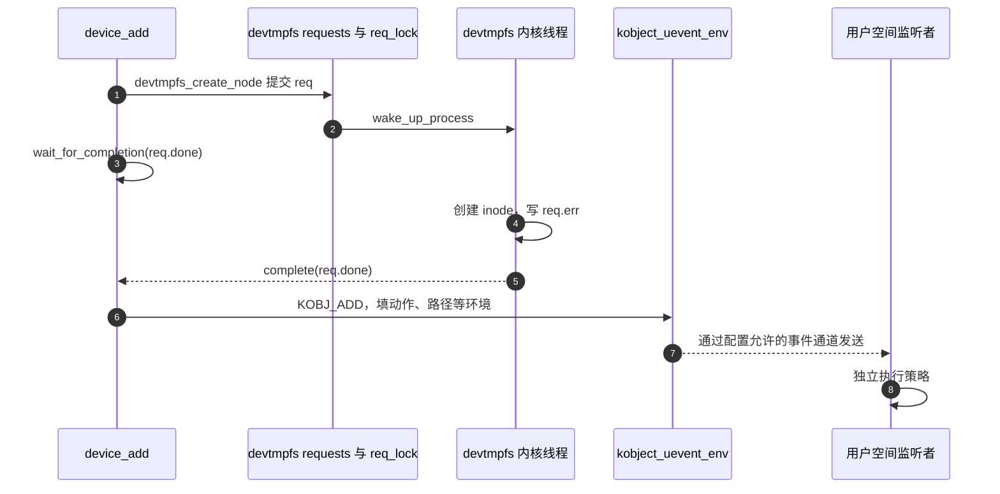

# 第3章\_分类对象与属性事务导读

[教材](../../../../knowledge/linux/device_model/class_sysfs/大纲.md)已用两个模块区别分类、字符分派和业务状态。本篇面向读源码的任务：找到这些状态在 NXP Linux 6.12.20 固定提交中的具体落点，再选择需要逐句读的实现。版本身份与配置入口见[总索引](P01_Linux_6.12_驱动入口源码阅读索引.md#1.1_版本与范围)，本地实验提交不作为依据。

## 3.1\_分类集合与设备创建

| 地址或结构 | 建立与使用者 | 阅读问题 |
| --- | --- | --- |
| include/linux/device/class.h 的 struct class | 调用者描述名字、属性组、事件、节点、释放及命名空间等策略 | 哪些是公开策略，哪些内部集合不在这里 |
| drivers/base/base.h 的 subsys_private | class_register 分配，subsys.kobj 进入 class_kset；保存 class 回指 | class_to_subsys 怎样从公开描述找管理对象 |
| subsys_private.klist_devices 与 mutex | device_add 在类管理锁内加入，device_del 摘除；迭代器使用引用 | 业务锁不能直接借用这把内部锁 |
| device 的 class、parent、groups、driver_data | 创建函数写入，添加路径与属性回调消费 | drvdata 指向的数据由谁保活 |
| device_private.knode_class | 设备加入对应类集合的链节点 | 分类可见、集合加入和添加事件并非一个原子动作 |

先读 class_register 对 ns_type/namespace 成对配置的检查，以及内部集合初始化；再读 class_create 的动态描述与 class_release。当前公开 struct class 没有旧稿中的 owner、p、devices 或内嵌 subsys 字段。最后读[core.c 创建设备实现](../source_explanations/drivers/base/core.c.md#1.1_设备创建便利函数的所有权)：class 不能是 NULL，parent 可以；groups 在 device_add 前放好，失败统一 put。

教材的 S0 准备对应业务状态初始化，S1 属性发布落在便利函数和 device_add；S2 字符分派由 cdev_add 独立完成，不在 class 实现内部。按 devt 查找的 device_destroy 不适合替两个零 devt 实例区分身份，因此教材保存具体指针并调用 device_unregister。

## 3.2\_发布的两条通信路径

device_add 在建立基础属性、总线和 PM 关系后，对非零主号依次创建 dev 属性、sys_dev 索引，调用 devtmpfs_create_node，然后才发送 KOBJ_ADD。该路径没有根据 devtmpfs_create_node 的结果回滚整个 device_add，节点状态需单独观察。类设备集合的 knode_class 加入又位于后续部分，不能把整个函数想成原子发布。

`drivers/base/devtmpfs.c` 的请求有完成量和结果值，调用栈上的 req 依靠等待完成保持有效；链表通过自旋锁交接给内核线程。`lib/kobject_uevent.c` 另负责事件环境、过滤及发送，CONFIG_NET 等条件会影响网络事件通道。两个通道的状态存储和接收者不同，不能写成“devtmpfs 监听 uevent 建节点”。

`device_get_devnode` 先尝试 device type，再尝试 class 的命名策略，最后回退到设备名。mode 可由回调写入；临时分配的名字由调用路径释放。注销方向读 device_del：节点、类关系和属性撤销在 KOBJ_REMOVE 之前，最后删除 kobject 可见关系并归还父引用。device_unregister 再归还自身初始引用，不强制归零所有引用。

## 3.3\_一次属性写入的状态落点

| 教材阶段 | 固定源码入口 | 状态交接 |
| --- | --- | --- |
| S3 从用户缓冲进入 | fs/kernfs/file.c 的 kernfs_fop_write_iter | 复制到内核缓冲并补终止零；对每个打开对象加锁 |
| S3 防止与撤销交错 | kernfs_get_active / kernfs_put_active | 取得属性节点活动资格，去激活后拒绝新活动 |
| S3 找回对象与属性 | fs/sysfs/file.c 的 sysfs_kf_write | parent.priv 是 kobject，kn.priv 是 attribute |
| S3 调业务回调 | core.c 的 dev_attr_store | 找回 device_attribute 与 device，再调用 store |
| S4 等待旧请求 | fs/kernfs/dir.c 的移除与 drain 路径 | 禁止新活动，等待已进入的访问归还 |

具体适配函数唯一展开在[core.c 的属性分派](../source_explanations/drivers/base/core.c.md#1.2_从通用属性回到设备回调)。活动排空继续沿既有[对象属性导读](P02_对象属性与字符入口导读.md#2.2_移除属性怎样等待读者)，不重复函数体。kernfs 的 of.mutex 保护一次打开；不同 open 的业务状态仍由调用者同步。

读取方面，普通文本属性经 sysfs_kf_seq_show 使用 seq_file 缓冲，再经 dev_sysfs_ops.show 找到 device_attribute.show；预分配属性另有路径。不要从文档里的抽象“一次读取调用 show”推导每个短 read 都重新采样硬件。解析方面按 lib/kstrtox.c 的 kstrtoint → kstrtoll → _kstrtoull 链检查：允许末尾一个换行，错误或超范围不写结果。业务范围校验仍不属于这个转换函数。

## 3.4\_配置与旁支证据

本批保存或复核原文：drivers/base/class.c、base.h、core.c、devtmpfs.c，include/linux/device/class.h，fs/sysfs/file.c、fs/kernfs/file.c、lib/kstrtox.c。保存位置见[源码基线](../../linux/SOURCE_BASELINE.md)。以下只是只读核对，不声称已保存全文：

- drivers/base/Kconfig：DEVTMPFS 与自动挂载，initramfs 场景限制。
- Documentation/filesystems/sysfs.rst：文本、同类数组、PAGE_SIZE、sysfs_emit 与 ABI；configfs.rst 及 fs/configfs/mount.c：用户驱动配置对象与独立文件系统。
- Documentation/admin-guide/pm/sleep-states.rst、pm/cpufreq.rst、Documentation/power/runtime_pm.rst：mem 的状态选择、频率观察与运行时计数失败契约。
- Documentation/admin-guide/cgroup-v2.rst、kernel/bpf/inode.c、net/core/net-sysfs.c：资源控制层次、BPF 文件系统和网络类属性/命名空间。
- include/linux/device.h、include/linux/sysfs.h：属性、驱动数据、权限与通知接口。

阅读这些旁支是为了限定参考表的结论，不等于完成各子系统的独立源码专题。本地配置启用 NET_NS、PM、SYSFS、DEVTMPFS 等不代表所有可选硬件或属性都存在；也不把配置身份当官方发布配置。

返回[总索引](P01_Linux_6.12_驱动入口源码阅读索引.md)或[教材](../../../../knowledge/linux/device_model/class_sysfs/大纲.md)。
