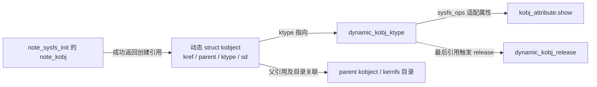
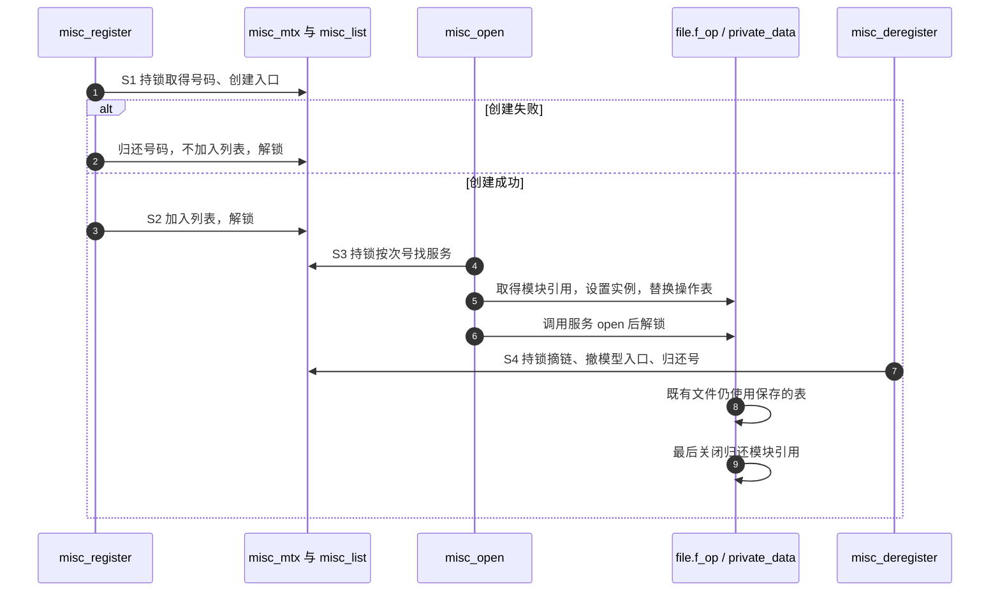

# 第1章\_对象创建与misc分派

[模块导读](../navigation/P02_对象属性与字符入口导读.md)已经区分对象引用、属性活动与打开文件。本篇只展开决定两个教学示例归属的实现簇：动态 kobject 创建，misc 登记、打开与注销。所有摘录来自[总索引](../navigation/P01_Linux_6.12_驱动入口源码阅读索引.md)锁定的 NXP Linux 6.12.20 提交；中文 Doxygen 和行内中文说明是本仓库补充，不是上游原注释。裁剪位置明确标示，不可拿摘录替换完整内核文件。

## 1.1\_动态kobject的创建引用

声明位于 [include/linux/kobject.h](../../linux/include/linux/kobject.h)，定义位于 [lib/kobject.c](../../linux/lib/kobject.c)。调用者是教材 note_sysfs_init。实现原理围绕一个不变量展开：便利函数一旦返回非空指针，调用方得到的是已经初始化并登记的对象引用；它失败时不得把一个半成品交给调用方清理。

```c
/**
 * 仓库阅读说明：动态对象的最终释放由公共内核代码执行。
 * @kobj: 最后一个引用归还后的动态对象
 *
 * 原函数中的 pr_debug 仅输出地址，已裁剪，不改变释放动作。
 */
static void dynamic_kobj_release(struct kobject *kobj)
{
    kfree(kobj);
}

static const struct kobj_type dynamic_kobj_ktype = {
    .release = dynamic_kobj_release,
    .sysfs_ops = &kobj_sysfs_ops,
};

/**
 * 仓库阅读说明：分配并初始化引用，不在此加入 sysfs。
 * 返回：带初始引用的对象，或 NULL。
 */
static struct kobject *kobject_create(void)
{
    struct kobject *kobj;

    kobj = kzalloc(sizeof(*kobj), GFP_KERNEL);
    if (!kobj)
        return NULL;

    kobject_init(kobj, &dynamic_kobj_ktype);
    return kobj;
}

/**
 * 仓库阅读说明：把创建引用交给成功调用者，失败在内部归还。
 * @name: 对象目录名
 * @parent: 父对象，决定加入的层次
 * 返回：成功对象或 NULL；失败原因不会经返回值保留。
 */
struct kobject *kobject_create_and_add(const char *name, struct kobject *parent)
{
    struct kobject *kobj;
    int retval;

    kobj = kobject_create();
    if (!kobj)
        return NULL;

    retval = kobject_add(kobj, parent, "%s", name);
    if (retval) {
        /* 原 pr_warn 只记录加入错误，已裁剪。 */
        kobject_put(kobj);
        kobj = NULL;
    }
    return kobj;
}
```

kzalloc 取得清零内存，GFP_KERNEL 表示可以按正常可睡眠分配路径工作；这组接口不应挪到不能睡眠的中断处理现场。kobject_init 建立 kref 初值并记录 ktype；type 的 release 指定最终销毁协议，sysfs_ops 指定属性适配方式。这里的 kobj_sysfs_ops 把通用 attribute 转成 kobj_attribute，再调用其中的 show/store；它不把字符设备 read 接过来。

kobject_add 设置名字并建立父子/集合与 sysfs 关系。父对象引用的取得与失败回滚由加入路径配对管理；调用方不要为猜测父引用数量而额外 put。加入失败后，本函数只归还创建对象自己的引用，最终清理再完成剩余关系的回收。errno 被折叠为 NULL 正是这段代码的可观察结果，不是 ERR_PTR。



kobject_put 的实际动作是对 kref 调用 kref_put 并指定 kobject_release。最后引用才触发清理：未先撤销的 sysfs 关系会被清掉，然后调用类型的 release，释放名称并归还父引用。DEBUG_KOBJECT_RELEASE 会让这个清理延后，所以“最后 put 已发生”与“现在已经 free”不能在所有配置下等同。

可修改性：若需要保留加入失败 errno，应改调用方的分步构造协议，不要把便利函数的 NULL 当成错误指针解析。若将 kobject 内嵌到自定义结构，必须更换 release 的所有权设计，保证回收外层对象；不能让公共 dynamic_kobj_release 对内嵌地址执行 kfree。SYSFS 关闭时目录接口的桩不再兑现可见目录，相关实验必须改用启用配置。更改 show 所在模块的寿命时，还需按[属性排空路径](../navigation/P02_对象属性与字符入口导读.md#2.2_移除属性怎样等待读者)检查回调退出。

## 1.2\_misc登记与失败回滚

声明和描述结构位于 [include/linux/miscdevice.h](../../linux/include/linux/miscdevice.h)，实现位于 [drivers/char/misc.c](../../linux/drivers/char/misc.c)。misc_init 在子系统初始化阶段登记名为 misc 的 class，再通过 register_chrdev 把主号 10 接到公共 misc_fops；这使单个驱动以后只需登记次号服务。其失败路径撤销已经登记的 class，并清理可选的 /proc/misc 观察入口，不把观察入口当作实际分派表。

符号账本先说明同一实现簇中的状态承载者：

| 实现簇 | 初始化、写入与消费 | 修改边界 |
| --- | --- | --- |
| misc_list / misc_mtx | 静态空链表与互斥锁；register 加入，open 查找，deregister 摘除 | 不能把列表修改移出锁外；锁还覆盖调用驱动 open |
| misc_minors_ida / misc_minor_alloc/free | 静态编号分配器；分配和归还次号 | 动态号先从小号段取反向映射，不足再取 255 以上范围；不承诺跨启动稳定 |
| misc_class / misc_devnode | 类名和节点策略静态定义；device 创建消费它 | mode 非零时参与设置模式，nodename 可覆盖节点名；用户空间仍可调整策略 |
| miscdevice 的 minor/list/fops | 调用者准备，登记时写实际次号与链表关系，open 消费 fops | misc 不复制对象；登记存续期间必须保活 |
| this_device / parent / groups / name | 注册调用 device_create_with_groups，保存结果 | parent 决定父对象，groups 为属性组，name 是格式化名称；this_device 失败是错误指针 |
| misc_fops / 服务 fops / file | 公共 open 先接请求，再交给具体服务 | 公共表的 noop_llseek 不会在替换后自动补到服务表上 |

以下保留动态次号的完整成功与设备创建失败分支，固定次号分支以裁剪说明替代：

```c
/**
 * 仓库阅读说明：在一把锁下取得号码、创建入口并加入分派集合。
 * @misc: 调用方持有、初始化好的描述对象
 * 返回：0 或负错误码；成功后才需要配对注销。
 */
int misc_register(struct miscdevice *misc)
{
    dev_t dev;
    int err = 0;
    bool is_dynamic = (misc->minor == MISC_DYNAMIC_MINOR);

    INIT_LIST_HEAD(&misc->list);
    mutex_lock(&misc_mtx);

    if (is_dynamic) {
        int i = misc_minor_alloc(misc->minor);

        if (i < 0) {
            err = -EBUSY;
            goto out;
        }
        misc->minor = i;
    } else {
        /*
         * 裁剪：原代码扫描 misc_list 拒绝已有相同次号，
         * 随后调用 misc_minor_alloc 预留相应编号；
         * 任一步失败均设置 -EBUSY 并转到 out。
         * 本摘录只研究动态次号；固定次号不可使用此裁剪体。
         */
    }

    dev = MKDEV(MISC_MAJOR, misc->minor);
    misc->this_device =
        device_create_with_groups(&misc_class, misc->parent, dev,
                                  misc, misc->groups, "%s", misc->name);
    if (IS_ERR(misc->this_device)) {
        misc_minor_free(misc->minor);
        if (is_dynamic)
            misc->minor = MISC_DYNAMIC_MINOR;
        err = PTR_ERR(misc->this_device);
        goto out;
    }

    list_add(&misc->list, &misc_list);
out:
    mutex_unlock(&misc_mtx);
    return err;
}
```

MKDEV 组合主次号；MISC_MAJOR 的值来自 include/uapi/linux/major.h。device_create_with_groups 把 misc 作为驱动数据保存到新设备，使 misc_devnode 能从设备取回描述并读取 mode/nodename。它失败时返回错误指针；IS_ERR 判断，PTR_ERR 取回原因，具体编码唯一解释在[err.h 实现](../../error_pointer/source_explanations/P01_err.h_错误值编码与检查.md)。

动态分配器失败被本函数映射为 -EBUSY；模型创建错误则保留其实际原因。两者不能混写成“所有失败返回 ENOMEM”。创建失败会先归还次号，再恢复动态请求标记；成功注销则不会把 minor 自动恢复成 255。因此同一个描述对象若要重新请求动态分配，应在下一次注册前明确重新设置 minor，不能猜注销会重置所有字段。

教材的 S1/S2 对应号码及模型入口、最终链表发布。创建模型入口时可能出现可见目录，但并发 misc_open 需要同一把锁，尚不能越过本次事务查找这个服务。改变加链位置或锁范围会改变这个证明：不再能由“持锁查找”排除半初始化对象，需要同步检查创建失败、节点出现、open 与注销交错。

本实现没有为每个服务分配一份私有 miscdevice，也不管理它的最终释放。安全的最小修改点通常在调用方的名字、属性组、操作表及私有对象协议，而不是直接改变共享次号范围。若确需改公共分配策略，要同时测试固定号冲突、动态号耗尽、模型创建失败、成功注销和号码复用。

## 1.3\_misc打开与注销的交接

下面的打开函数保留首次查找、操作表交接和驱动 open；未命中的装载重试以明确说明裁剪。完整重试代码在同路径原文中，不能把裁剪块理解为原实现“什么也没做”。

```c
/**
 * 仓库阅读说明：按次号找到服务，并把文件交给服务操作表。
 * @inode: 提供字符设备次号
 * @file: 本次打开的文件对象
 * 返回：驱动 open 的状态，或找不到可用服务时的 -ENODEV。
 */
static int misc_open(struct inode *inode, struct file *file)
{
    int minor = iminor(inode);
    struct miscdevice *c = NULL, *iter;
    int err = -ENODEV;
    const struct file_operations *new_fops = NULL;

    mutex_lock(&misc_mtx);
    list_for_each_entry(iter, &misc_list, list) {
        if (iter->minor != minor)
            continue;
        c = iter;
        new_fops = fops_get(iter->fops);
        break;
    }

    if (!new_fops) {
        /*
         * 裁剪：释放 misc_mtx，调用 request_module 请求
         * char-major-主号-次号，再持锁完整查找一次。
         * 若重试仍未取得操作表，则 goto fail。
         */
        goto fail; /* 本摘录仅保留直接命中的路径。 */
    }

    file->private_data = c;
    err = 0;
    replace_fops(file, new_fops);
    if (file->f_op->open)
        err = file->f_op->open(inode, file);
fail:
    mutex_unlock(&misc_mtx);
    return err;
}

/**
 * 仓库阅读说明：撤销成功登记的服务，不关闭既有 file。
 * @misc: 已经成功登记且尚未注销的对象
 */
void misc_deregister(struct miscdevice *misc)
{
    if (WARN_ON(list_empty(&misc->list)))
        return;

    mutex_lock(&misc_mtx);
    list_del(&misc->list);
    device_destroy(&misc_class, MKDEV(MISC_MAJOR, misc->minor));
    misc_minor_free(misc->minor);
    mutex_unlock(&misc_mtx);
}
```

iminor 从 inode 取得次号；list_for_each_entry 按 list 成员遍历真实 miscdevice。fops_get 尝试取得操作表及其 owner 模块引用，模块不可取得时可返回 NULL。replace_fops 归还旧操作表引用并把新表交给 file；之后调用的是新表的 open。没有自定义 open 时依旧已经设置 private_data，不需要写一个空 open 只为获得这个指针。

这些操作表辅助位于 include/linux/fs.h，宏定义不在本篇重复展开；本篇只消费它们的引用交接契约。文件打开失败或最后释放时，其持有的操作表引用沿 VFS 清理，不由 misc_deregister 扫描并关闭所有旧 file。通用文件生存期见[VFS 文件与描述符](../../../../knowledge/kernel_subsystems/vfs/P13_fd_table与file生命周期.md)。



图中特意允许注销时还有旧文件，展示的是通用运行中注销。教材采用普通模块卸载，已有打开引用会阻止进入模块退出，所以教材的正常顺序是先 close 再 S4；不能把一种调用场景误读成函数本身的保证。

WARN_ON 的空链表检查是调用契约诊断，不是重复注销的通用幂等保证。第一次 list_del 后节点不再是初始化空表状态，调用方必须记录成功注册与是否已注销，不能靠再次调用来“保险”。注销之后重用同一对象还须重新建立它的业务状态。

可修改性：在驱动 open 中加入耗时工作，会在 misc_mtx 下阻挡别的 misc 操作；在其中递归调用注册或注销，还可能死锁。若把静态实例改为动态实例，必须在 private_data 的使用路径增加真正的实例持有协议，不能认为 owner 引用等于任意数据对象引用。注销后立即释放动态对象是否安全，应由旧 file、在途请求和异步使用者都退出的证据证明。

## 1.4\_从实现返回观察

动态对象示例应检查属性创建失败是否归还创建引用、退出是否先移除属性；misc 示例应检查失败不重复注销、实际号值不写死、EOF 与重新打开不同、旧文件引用如何影响普通卸载。可以通过故障替身验证调用顺序，但它无法证明内核实际活动计数、锁交错或模块装卸。

返回[模块导读](../navigation/P02_对象属性与字符入口导读.md)、[总阅读索引](../navigation/P01_Linux_6.12_驱动入口源码阅读索引.md)或[教材地图](../../../../knowledge/driver_model/fundamentals/framework_model/大纲.md)。
