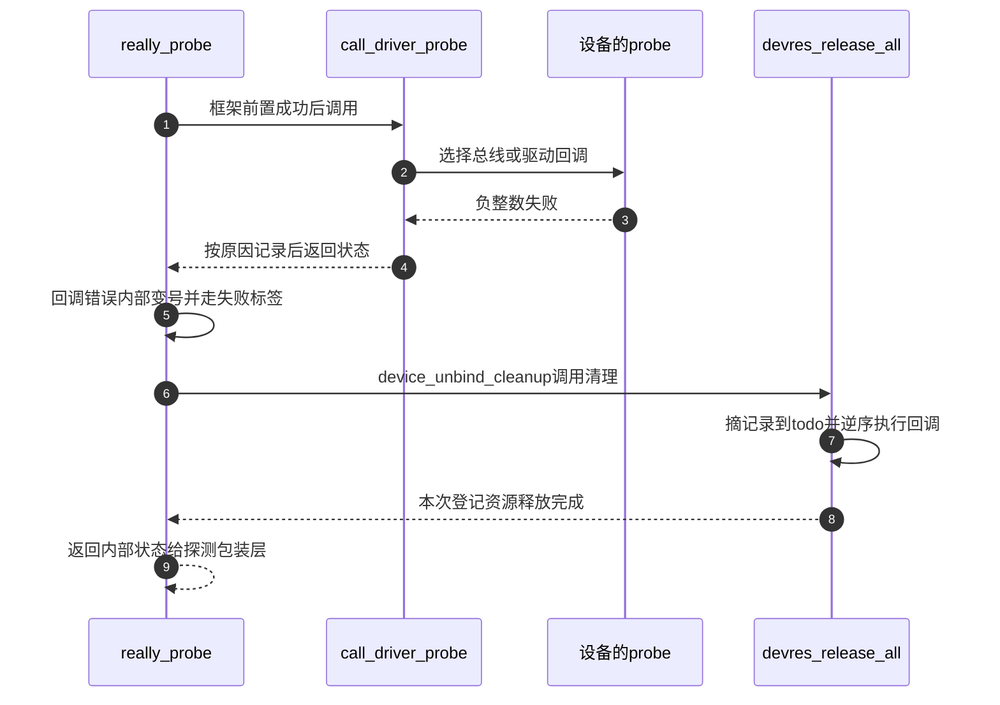

# 第2章\_返回值与清理路径导读

在[教材的失败周期](../../../../knowledge/linux/error_handling/error_pointer/P03_资源失败与驱动回滚.md#3.4_沿一次失败走完S0到S4)中，提供者交出错误值，驱动返回失败，框架再执行清理。下面把同一周期落到 Linux 6.12.20 固定源码，但不把通用模型压成几个函数名。

## 2.1\_先把返回值与资源记录分开

返回值暂存在调用约定指定的返回位置以及调用者局部变量中；调用者读它来决定分支。它并不保存“此前成功了几项”，也不带释放函数地址。错误指针的[编码、识别与传播帮助接口](../source_explanations/P01_err.h_错误值编码与检查.md#1.2_编码与还原)只处理这一条值通道。

资源记录则进入设备对象。已保存的[device.h](../../linux/include/linux/device.h)中，`struct device` 声明 `devres_head` 与 `devres_lock`；[core.c](../../linux/drivers/base/core.c) 的 `device_initialize` 初始化这条链和锁。[devres.c](../../linux/drivers/base/devres.c) 私有 `struct devres` 包含 node 与 data，node 保存链表连接和 release 回调。返回给使用者的数据地址与内部记录头不能互换。

这两条线在核心选中失败分支时汇合。改变 `IS_ERR` 不会直接改变登记链，改变释放回调也不会自动改变返回类型。源码阅读要沿各自读写者追踪，再确认交点。

## 2.2\_比较两种申请路径

先读 `include/linux/device.h` 的 `devm_kzalloc`，它调用 `devm_kmalloc` 并加入清零标志。再读 `drivers/base/devres.c` 的 `devm_kmalloc`：非零大小分配失败返回 NULL，成功通过 `devres_add` 登记并返回数据区。零大小有 `ZERO_SIZE_PTR` 特殊处理，因此不能把非空等同于“可读写任意长度的分配”。教材实验始终分配非零大小结构体。

随后读[GPIO 的设备管理包装](../../linux/drivers/gpio/gpiolib-devres.c)中 `devm_gpiod_get_index`。它先调用 `gpiod_get_index`；若描述符是错误值，直接返回。若描述符成功而释放记录分配失败，就先 `gpiod_put`，再返回内存不足的错误指针。正常独占路径把描述符保存在记录数据区后登记；非独占标志还有查找已有记录的分支，不应将正常路径误写成无条件重复登记。

`devm_gpiod_get_index_optional` 在包装结果之上识别“未分配 GPIO”并转换为 NULL，其他结果仍原样保留。可选缺席是获取契约的一部分，不是 devres 链表看到 NULL 后执行了某种自动转换。关闭 GPIOLIB 的头文件桩行为需另查 `include/linux/gpio/consumer.h`。

对于 S4，`devres_release_all` 先检查设备链状态，再在锁保护下通过 `remove_nodes` 摘出记录，锁外由 `release_nodes` 逆序调用释放回调并释放记录。组记录也由相应算法处理，本文不把完整分组算法改写成虚假的“从头逐个删除”。资源拥有者必须保证没有不受控的并发使用者跨越销毁点。分组与action的固定实现从[devres索引](../../devres/navigation/P01_Linux_6.12_devres源码阅读索引.md#1.2_按问题进入实现)继续，不在这里重复函数体。

## 2.3\_跟随驱动失败而不混用返回类型

[dd.c](../../linux/drivers/base/dd.c) 中先看 `call_driver_probe`：总线的 probe 存在时优先调用，否则调用驱动的 probe。返回值是整数。普通失败、拒绝匹配、延迟探测采用不同日志分支，不能保证每次失败都有同一种错误日志。

再进入 `really_probe`。在调用驱动之前，核心还会检查依赖并建立框架状态；这些失败不等于驱动自己的 probe 已经执行。驱动回调失败后，特定依赖策略可能把原因转为延迟探测，随后内部把回调错误变号，沿失败标签进入 `device_unbind_cleanup`。这个清理函数明确调用 `devres_release_all`，再整理相关核心状态；不是错误指针自己触发资源析构。

最后看 `driver_probe_device`，它通过 `__driver_probe_device` 发起探测，并同时识别正、负的延迟状态。它还有探测计数与完成等待者的通知，这是探测协调状态，和错误指针的无共享状态转换不是同一个机制。本专题不展开异步探测与延迟工作队列，但保留这些边界，避免把一条同步示意图当作全部实现。

此图只覆盖教材 S3～S4 的回调失败分支；若在回调执行前就因依赖推迟，或成功后在建立其他核心属性时失败，要从对应源码标签重新追踪，不能凭图补出不存在的回调。

## 2.4\_其他表示与观测入口

保存的[Rust 错误封装](../../linux/rust/kernel/error.rs)中，`Error` 的存储是 `NonZeroI32`，合法范围是负错误区间；`Result` 是成功/错误结果类型别名。`from_err_ptr` 调用 C 的检测与提取接口，非错误值进入 `Ok`，所以 `Ok(NULL)` 并不会被它自动拒绝。这个边界适合用来检查类型包装究竟新增了什么保证。

下面的辅助文件本轮已按固定对象核对，但未新增全文副本。可在已经确认身份的源码仓库执行 `git show <固定提交>:<上游相对路径>` 阅读；固定提交见[总索引](P01_Linux_6.12_错误指针源码阅读索引.md#1.1_固定版本与证据粒度)。

| 上游相对位置 | 具体检查点及结论 |
| --- | --- |
| `include/linux/clk.h`、`drivers/clk/clk-devres.c` | `clk_get_optional` 只把未找到的指定错误转换为空；受管理获取另登记释放，未启用支持的桩函数需分开看 |
| `drivers/regulator/core.c`、`drivers/regulator/devres.c` | `_regulator_get_common` 中 optional 不采用正常获取的 dummy 替代分支，缺席保留为错误指针；启用动作有独立结果 |
| `drivers/pinctrl/core.c` | 获取控制器、查找状态、选择状态的返回类型分别核对 |
| `drivers/i2c/i2c-core-base.c` | `i2c_new_client_device`、`devm_i2c_new_dummy_device` 的真实名称和失败边界 |
| `drivers/base/core.c` | `dev_err_probe` 返回原错误，但内存不足、延迟和其他错误的打印方式不同；本文件已有仓库副本 |
| `lib/vsprintf.c`、`Documentation/core-api/printk-formats.rst` | `ptr_to_id` 对 NULL/错误值的特例，以及 `%pe` 错误名称格式 |
| `include/uapi/asm-generic/errno-base.h`、`include/uapi/asm-generic/errno.h`、`include/linux/errno.h` | 通用错误常量与内核内部延迟探测码；ARM 使用生成的通用 errno 头 |

所有检查都限定在固定源码，没有从工具能找到某个符号推断目标实际运行了相应路径。返回[源码大纲](../大纲.md)或[教材的观察实验](../../../../knowledge/linux/error_handling/error_pointer/P04_观察返回值与释放顺序.md)。
