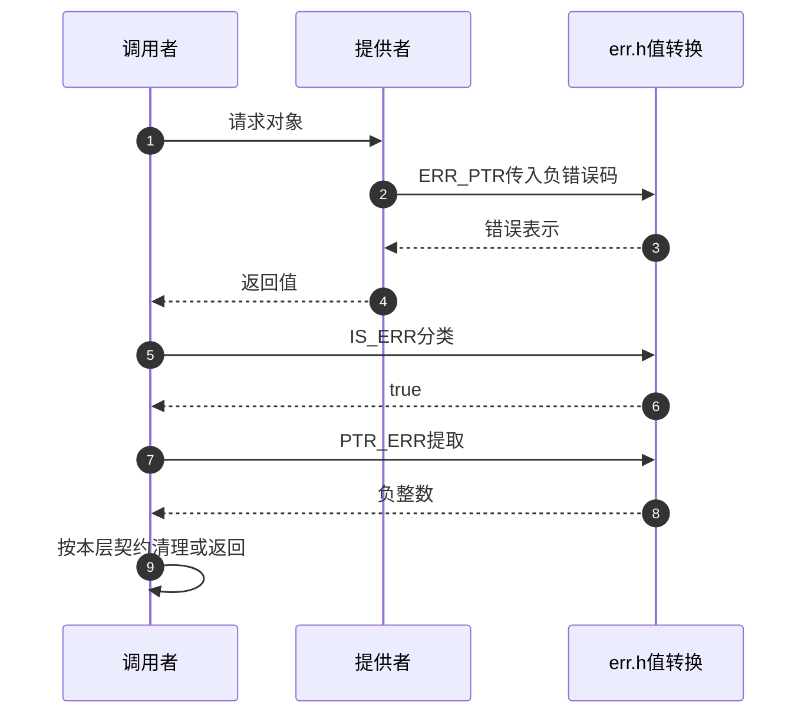

# 第1章\_err.h\_错误值编码与检查

本篇检查一个很小但容易被夸大的实现：它只把错误放进返回值、再识别和取出，不建立对象、不完成回滚。阅读前应已能解释[编码边界](../../../../knowledge/linux/error_handling/error_pointer/P02_错误值的编码与判定.md)。现在的任务是把每项保证对应到实际函数体，判断删掉检查或改变输入后会发生什么。

## 1.1\_关联入口与源码身份

| 入口 | 任务 |
| --- | --- |
| [总索引](../navigation/P01_Linux_6.12_错误指针源码阅读索引.md#1.2_按问题进入源码) | 固定版本、保存范围与后续路径 |
| [返回值与清理模块导读](../navigation/P02_返回值与清理路径导读.md#2.1_先把返回值与资源记录分开) | 将本篇接口放回资源获取的调用过程 |
| [上游 err.h 副本](../../linux/include/linux/err.h) | 原文、完整注解与未裁剪声明 |

源码固定为 NXP 官方 Linux 6.12.20 提交 `dfaf2136deb2af2e60b994421281ba42f1c087e0`。下列 Doxygen 阅读说明和中文注释均为 **仓库补充，非上游原文**；代码按实现簇裁剪，未复制原英文文档块。所有实现位于 `include/linux/err.h`，无需寻找一个同名 C 文件里的导出函数。

## 1.2\_编码与还原

`ERR_PTR` 的输入是负错误码，范围由调用者遵守；`PTR_ERR` 的输入是已确认的错误指针。`long` 与指针转换采用目标 Linux 的实现约定，不是为任意 ISO C 平台提供的可移植序列化协议。

```c
/**
 * ERR_PTR - 仓库补充：把负错误码放入指针表示。
 * @error: 调用者保证属于有效负错误范围。
 * 返回值没有对应的错误对象，不能解引用。
 */
static inline void * __must_check ERR_PTR(long error)
{
    return (void *) error;          /* 转换值，不分配内存。 */
}

/**
 * PTR_ERR - 仓库补充：读取已确认错误值中的负码。
 * @ptr: 调用者已通过契约或检查确认它是错误指针。
 */
static inline long __must_check PTR_ERR(__force const void *ptr)
{
    return (long) ptr;              /* 转换值，不读取指向的存储。 */
}
```

**实现原理：** 没有范围分支，没有全局变量，也没有申请或释放动作。输入 -22 产生相应错误表示，输入正的 22 也只是原样转换，不会自动变成负错误。`PTR_ERR` 不先调用 `IS_ERR`，因此检查前置不能由这个名字替代。

`__must_check` 是要求注意返回值的编译诊断注解，`__force` 用于静态类型检查器的地址空间转换标记；它们不执行运行时检测。相关编译器注解由头文件引入，改变或关闭诊断不改变函数的转换动作。

**可修改性说明：** 编码与还原必须和区间检测共同满足往返不变量。改任意一边都要检查 C 调用者、Rust 桥接和目标数据模型，不能只测一个负数。教材的 32/64 位整数模型穷举范围，但真正指针转换仍需目标编译器验证。

## 1.3\_区间识别与空值组合

先确定 `MAX_ERRNO` 的范围，再看无符号比较；不要从“高地址”三个字推断页表。当前版本的判断阈值包含 -4095，不包含 -4096。

```c
/* 仓库补充：允许编码的负错误绝对值上限。 */
#define MAX_ERRNO 4095

/**
 * IS_ERR_VALUE - 仓库补充：检测值是否属于错误表示。
 * @x: 被检测的值；没有访问对象内容的副作用。
 */
#define IS_ERR_VALUE(x) unlikely((unsigned long)(void *)(x) >= (unsigned long)-MAX_ERRNO)

/**
 * IS_ERR - 仓库补充：带返回值检查注解的指针检测接口。
 * @ptr: 待分类的指针值。
 */
static inline bool __must_check IS_ERR(__force const void *ptr)
{
    return IS_ERR_VALUE((unsigned long)ptr);
}

/**
 * IS_ERR_OR_NULL - 仓库补充：把空值与错误编码合并分类。
 * @ptr: 待检测值；调用者另行决定这两类值的处理语义。
 */
static inline bool __must_check IS_ERR_OR_NULL(__force const void *ptr)
{
    return unlikely(!ptr) || IS_ERR_VALUE((unsigned long)ptr);
}
```

**实现原理：** 比较只消费传入的表示。`unlikely` 给编译器分支倾向信息，不读取历史失败次数。NULL 在普通检测中为假，在组合检测中被第一项纳入；悬空对象地址是否落入区间与对象有没有释放没有必然联系。因此这些接口都不是内存有效性验证器。

**可修改性说明：** 把比较改成严格大于会漏掉边界 -4095。增加范围会改变被当作错误的值集合，必须重新证明目标架构约定；不能由“通常不会分配到那里”替代证据。组合函数的 NULL 分支若被调用者直接交给 `PTR_ERR`，会得到 0，因此应审查其后是否提前返回成功。

## 1.4\_传播帮助接口与类型注解

下面两种便利形式分别解决“另一种指针返回类型”与“整数状态返回类型”的衔接。它们都不改变对象所有权。

```c
/**
 * ERR_CAST - 仓库补充：显式传递已确认的错误值。
 * @ptr: 错误指针；不是待转换的成功对象。
 */
static inline void * __must_check ERR_CAST(__force const void *ptr)
{
    return (void *) ptr;             /* 去掉 const，不验证对象布局。 */
}

/**
 * PTR_ERR_OR_ZERO - 仓库补充：错误值转负码，其他值转零。
 * @ptr: 可能为错误编码的值；NULL 同样进入返回零分支。
 */
static inline int __must_check PTR_ERR_OR_ZERO(__force const void *ptr)
{
    if (IS_ERR(ptr))
        return PTR_ERR(ptr);
    else
        return 0;
}
```

**实现原理：** `ERR_CAST` 不调用检测函数，前置条件由调用者负责。`PTR_ERR_OR_ZERO` 包含显式条件分支，只是让调用点更简洁；如果成功取得了手动管理的对象却立即丢掉句柄，返回零不会替你归还引用。

头文件另有每 CPU 地址空间辅助宏。`__percpu` 是用于标识每 CPU 存储的类型注解，下面只处理错误值的注解转换，不选择 CPU、不读取每 CPU 对象、不发送通知。

```c
/* 仓库补充：同一编码契约在每 CPU 地址空间类型上的适配。 */
#define ERR_PTR_PCPU(error) ((void __percpu *)(unsigned long)ERR_PTR(error))
#define PTR_ERR_PCPU(ptr) (PTR_ERR((const void *)(__force const unsigned long)(ptr)))
#define IS_ERR_PCPU(ptr) (IS_ERR((const void *)(__force const unsigned long)(ptr)))
```

**可修改性说明：** 转型接口应仅传播已确认的错误分支；正常对象需要本身的转换与持有协议。调整类型注解时还需检查 Sparse 等静态检查器能够发现的地址空间误用，普通编译通过不能代表这层诊断已执行。

## 1.5\_调用上下文与状态边界

这些值转换不睡眠、不加锁、不读取资源对象，调用上下文的限制主要来自周围的获取、访问和释放接口。没有共享错误变量不等于“返回对象可以无锁共享”：对象如何发布与持有是另一份协议。




图中最后一条箭头属于调用者代码，接口不会代为执行。回到[模块导读](../navigation/P02_返回值与清理路径导读.md#2.3_跟随驱动失败而不混用返回类型)可看到它怎样进入特定版本的核心失败路径；回到[总索引](../navigation/P01_Linux_6.12_错误指针源码阅读索引.md#1.2_按问题进入源码)选择其他证据。
