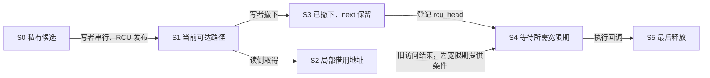

# 第3章\_节点连接与并发边界导读

[总索引](P01_Linux_6.12_哈希计算源码阅读索引.md)锁定 NXP 官方提交。本页按源码阅读任务定位对象地址、函数协作和配置分支；教材 P02 推演表示，P04 比较共享访问协议。这里不重复上游函数体，也不把术语重叠当成应删除任一层的理由。

## 3.1\_节点与桶数组分别负责什么

| 状态地址或入口 | 所有者和读写者 | 按此顺序阅读 |
| --- | --- | --- |
| hlist_head.first | 容器拥有者保存；插入/摘除写，遍历读 | [类型与初始化](../source_explanations/include/linux/list.h.md#1.1_头节点与初始化) |
| hlist_node.next/pprev | 嵌入业务对象，修改者维护；普通或 RCU 读者沿 next 前进 | [改边和后置状态](../source_explanations/include/linux/list.h.md#1.2_摘除与节点后置状态) |
| 业务对象地址与成员偏移 | 对象拥有者保证位置、类型和生命期 | [成员恢复与游标](../source_explanations/include/linux/list.h.md#1.3_成员恢复与遍历游标) |
| 固定桶数组及键表达式 | 数组声明提供容量，调用者保持键类型一致 | [数组初始化](../source_explanations/include/linux/hashtable.h.md#1.1_数组身份与初始化)、[选桶包装](../source_explanations/include/linux/hashtable.h.md#1.2_选桶与成员操作) |
| bkt/tmp/obj 局部游标 | 当前遍历调用者，分别保存桶序号、节点与宿主 | [候选和全表遍历](../source_explanations/include/linux/hashtable.h.md#1.3_候选遍历与全表清理) |

hlist 不在内部维护锁或引用计数。普通 del 把连接毒化，del_init 清两字段；这个区别影响重复删除、下一游标和再加入。hash_del 包装后者，不是旧稿中一个自定义的二参数链接函数。

## 3.2\_普通修改与RCU发布的分界

同一条前向关系可以配不同访问协议。私有或共同锁下的普通表，可以先把整个结构调整好再交回访问权。允许 RCU 读者重叠时，必须在对象业务字段和 next 准备完成后发布入口，旧对象 next 则保存到足够晚。

S0～S5 与[教材 P04 的公共阶段表](../../../../knowledge/linux/data_structures/哈希表_Hash_Table/P03_高级进阶与性能调优/P04_并发保护与RCU机制_多核下的读写博弈.md#4.2_同一个桶中的状态由谁保存)逐项相同，不另建编号。具体更新在[rculist 发布](../source_explanations/include/linux/rculist.h.md#1.1_先构建再发布)、[删除](../source_explanations/include/linux/rculist.h.md#1.2_删除保留前向连接)和[遍历检查](../source_explanations/include/linux/rculist.h.md#1.3_遍历的取得与检查分开)。RCU 状态并不保存在 session_lock：该锁只协调写者，普通读侧依赖执行流的 RCU 域及其配置实现。

## 3.3\_从撤下到回调完成

材料 note_hlist_rcu 中，add_user 在锁外分配、锁内查重后发布；remove_user_async 锁内撤下、锁外登记一次回调；drain_sessions 关闭范围内不再有生产者，再撤下剩余节点，最后调用 rcu_barrier。find_user_rcu 不取得长期引用；初始化函数保持读侧区间直到旧 next 观察完成。

这不是 hlist_del_rcu 自动触发的隐藏通知。call_rcu 把 rcu_head 和回调交给 RCU，宽限期检测器依据 CPU/任务证据推进，满足条件后才执行 reclaim_user。当前 Tiny 配置的队列、静止状态和回调执行见[Tiny 导读](../../rcu/navigation/P11_Linux_6.12_Tiny_RCU模块源码概念导读.md)；Tree 路径见[回调导读](../../rcu/navigation/P07_Linux_6.12_Tree_RCU_回调与NOCB模块源码概念导读.md)。rcu_barrier 等待回调实际完成，与只等宽限期不同。

辅助读取范围为同固定提交的 rcupdate.h、rcutiny.h、kernel/rcu/tiny.c、slab.h 与 string.h；配置沿 SOURCE_BASELINE 的工作树边界。未新增另一套这些通用函数的副本或讲解。模块没有设备、工作队列或中断生产者；将来增加入口时，必须先证明停产与排空，再复用本例的最后回收顺序。

回到[总索引](P01_Linux_6.12_哈希计算源码阅读索引.md#1.2_从问题选择入口)，或按应用任务读[哈希表教材](../../../../knowledge/linux/data_structures/哈希表_Hash_Table/大纲.md)。
