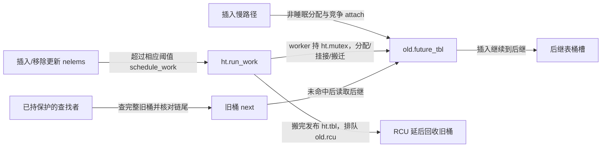

# 第4章\_动态表迁移与接口边界导读

本篇按 NXP 官方固定提交 dfaf2136deb2af2e60b994421281ba42f1c087e0（Linux 6.12.20）组织 rhashtable 源码，身份仍由[总索引](P01_Linux_6.12_哈希计算源码阅读索引.md)统一维护。教材 P05 建立在线迁移的因果模型，本篇把它落到地址、辅助函数和版本差异；不复制宏体或把通用 RCU 再讲成第二套教程。

## 4.1\_表句柄桶数组与业务节点

先读[对象布局](../source_explanations/include/linux/rhashtable-types.h.md#1.1_从句柄到节点的状态落点)：ht 保存稳定句柄与工作项；bucket_table 是具体容量和种子的桶存储；rhash_head 嵌入调用者的业务对象。对象地址不因换桶表而移动，但它的 next 可改变。ht.mutex、ht.lock 和桶槽位锁分别管理表版本、walker 登记与桶内修改。

然后读[参数](../source_explanations/include/linux/rhashtable-types.h.md#1.2_参数怎样描述用户结构)。head_offset 恢复业务对象，key_offset/key_len 描述固定键字节，obj_hashfn/obj_cmpfn 允许另一种对象键协议。不能把默认 memcmp 当成任意 C 结构体的语义相等。

最后读[桶锁位与链尾身份](../source_explanations/include/linux/rhashtable.h.md#1.1_桶锁位与链尾身份)。数组槽低位是锁；链节点的结束标记带桶地址；future_tbl 指向另一份 bucket_table。旧稿的 redirect tag 把三类状态混为一个，不对应此版本。

## 4.2\_沿R0到R5追踪一次迁移

下表与[教材阶段](../../../../knowledge/linux/data_structures/哈希表_Hash_Table/P03_高级进阶与性能调优/P05_动态伸缩的rhashtable_无感扩容的艺术.md#5.4_一次迁移怎样保持可以继续查找)逐项同号；此处只补源码落点和读写上下文。

| 阶段 | 状态地址、写者和读者 | 实现入口 |
| --- | --- | --- |
| R0 当前表 | ht.tbl 由初始化发布，读写路径在各自保护下取得 | [初始化](../source_explanations/lib/rhashtable.c.md#1.4_初始化与销毁边界) |
| R1 准备候选 | 分配者填 size/hash_rnd/buckets/dep_map/rcu；尚无业务路径消费 | [bucket_table_alloc](../source_explanations/lib/rhashtable.c.md#1.1_新表分配与后继挂接) |
| R2 挂接后继 | cmpxchg 竞争写 old.future_tbl；业务插入与查找读取它 | [attach 与末端选择](../source_explanations/lib/rhashtable.c.md#1.1_新表分配与后继挂接) |
| R3 搬迁 | worker 持 ht.mutex 和旧桶锁，再持新桶锁改尾节点 next 和两边入口；旧读者可跨链 | [rehash_one/chain](../source_explanations/lib/rhashtable.c.md#1.2_尾节点迁移与表入口交接)、[lookup 重扫](../source_explanations/include/linux/rhashtable.h.md#1.3_查找的重扫与后继路径) |
| R4 入口切换 | worker 发布 ht.tbl，在 ht.lock 下使旧 walker 失效并排队旧表 rcu | [rehash_table](../source_explanations/lib/rhashtable.c.md#1.2_尾节点迁移与表入口交接) |
| R5 回收桶存储 | 核心 RCU 调用 bucket_table_free_rcu；业务对象继续由新表索引 | [回收与用户回调区别](../source_explanations/lib/rhashtable.c.md#1.5_同步销毁与两种回调寿命) |

rht_deferred_worker 与插入慢路径共享后继协议，但执行上下文不同：前者可以用 GFP_KERNEL 分配并按桶调度，后者可以尝试 GFP_ATOMIC 分配且可能重试。细节在[调整与慢路径](../source_explanations/lib/rhashtable.c.md#1.3_后台调整与插入慢路径)。链长预算、元素上界、75%/30% 条件分别约束不同分支；源码旧注释中的 70% 与实际判断不一致，本页以实际条件为准。

完整时序在[迁移实现](../source_explanations/lib/rhashtable.c.md#1.2_尾节点迁移与表入口交接)复用同组 R 阶段。此版本没有一个独立的“桶迁移完毕位”供所有路径查询，也没有一个 rehash 结构字段可代替实际遍历控制流。

## 4.3\_业务对象的回收不等于桶表回收

公开接口包装见[lookup 与 insert](../source_explanations/include/linux/rhashtable.h.md#1.4_公开包装不会增加对象所有权)：普通 insert 不自动查重；lookup_insert 才把固定键传给比较路径。lookup_fast 的短读侧不保护返回后的裸对象；remove_fast 只移除节点，销毁仍由调用者安排。

free_and_destroy 停止后台工作、同步调用可选 free_fn 并释放容器版本链。它不自动关闭用户入口，也不保证任意业务读者已经结束。先前撤下的旧表由核心库 RCU 回调释放，与用户 free_fn 是两条生命期。完整调用者见[P08 实验](../../../../knowledge/linux/data_structures/哈希表_Hash_Table/P03_高级进阶与性能调优/P08_rhashtable接口与回收实验.md#8.1_先固定本例的拥有者)。

同键分组与 walker 的状态入口见[布局页](../source_explanations/include/linux/rhashtable-types.h.md#1.3_遍历器与重复键分组)。本批没有用 walker 实现全表快照，不把只读接口说明冒充其所有并发分支已经实测。

源码核对范围为 rhashtable-types.h、rhashtable.h、lib/rhashtable.c；辅助只读 include/linux/list_nulls.h 的 NULLS_MARKER 和现有 RCU/分配接口。当前访问配置为 ARM、非 SMP、Tiny RCU，公共算法的阅读不能自动变成其他架构的内存序或性能证据。C 模型只重放一个确定的跨链过程，完整模块的实际验证边界另记于工作记录。
