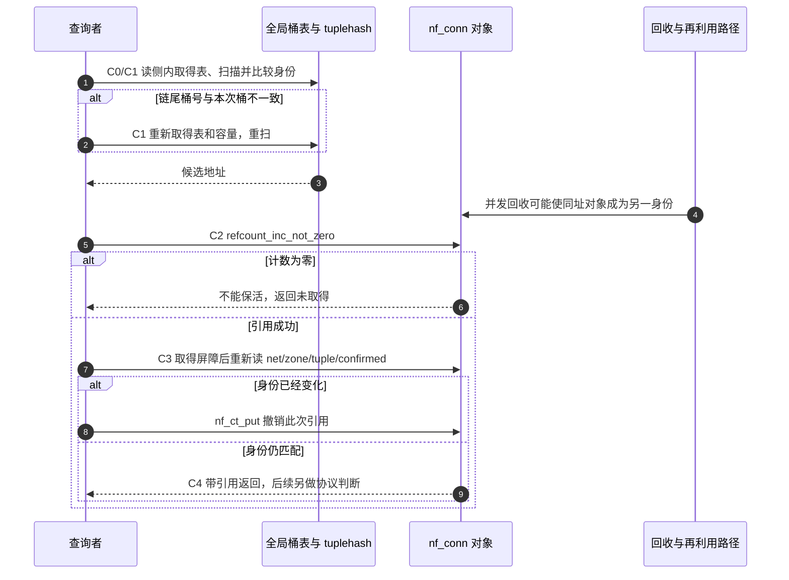

# 第5章\_子系统索引身份与寿命导读

本篇沿 NXP 官方固定提交 dfaf2136deb2af2e60b994421281ba42f1c087e0（Linux 6.12.20）寻找三个子系统的索引边界，版本身份回到[总索引](P01_Linux_6.12_哈希计算源码阅读索引.md)。教材 P06 比较完整身份和业务判断，本篇负责源码位置、阶段与调用顺序，不展开另一套文件系统或网络协议课程。

## 5.1\_先区分索引任务与业务结论

| 场景 | 候选状态在哪里 | 谁消费它，仍要证明什么 |
| --- | --- | --- |
| 名称缓存 | dentry_hashtable 的桶、dentry 的 d_parent/d_name/d_seq | 路径遍历者取得候选和序列样本，检查名字状态没有在使用期间变化 |
| 连接跟踪 | 全局桶表的 tuplehash、nf_conn.ct_general.use、ct_net/zone | 查找者先匹配，再取得引用并重新匹配；协议处理另看 status/proto |
| 邻居表 | tbl.nht 的桶、neighbour.dev/primary_key/refcnt | 调用者取得引用后，发送路径仍按 nud_state/output 处理链路解析 |

三个表都没有“哈希结果就是身份”的契约，返回值也不是权限或报文合法性的证明。原 PID 哈希范例在该版本应改沿 pid_namespace.idr 阅读，见[历史核对](P02_键位宽与落桶导读.md#2.4_沿实际函数核对PID示例)。

## 5.2\_名称候选怎样交给路径遍历者

[fs/dcache.c 实现](../source_explanations/fs/dcache.c.md#1.1_候选匹配与序列交接)按 d_hash → __d_lookup_rcu → 序列交接阅读。d_hash 只选桶；一般比较逐项检查父目录、仍在表、哈希及长度、名字。启用文件系统自定义比较时，另走 __d_lookup_rcu_op_compare。

d_seq 是针对可变化名字状态的序列计数，不是 dentry 引用。查找函数给出 seqp，调用者在相应保护中验证，必要时退出快速路径。RCU、序列一致性、引用分别回答不同问题。[d_lookup 的重试](../source_explanations/fs/dcache.c.md#1.2_并发改名下的未命中边界)使用 rename_lock 的序列观察；不能把两种入口的结果与引用职责互换。

## 5.3\_连接跟踪的一轮取得流程

这是多组正交状态：桶表拓扑、对象引用计数、身份字段和协议状态。不能用一个“已命中”布尔值概括。沿同一轮 C0～C4 阅读：

| 阶段 | 写入或读取与退出条件 |
| --- | --- |
| C0 进入读侧 | 公共 nf_conntrack_find_get 建立 RCU 保护，选择本次方向对应 zone id |
| C1 扫描候选 | ____nf_conntrack_find 取得桶表和容量；读 tuplehash 的 tuple、所属对象的 net/zone/confirmed；链尾身份不符则重新取得表扫描 |
| C2 尝试保活 | __nf_conntrack_find_get 写 ct_general.use，零值不能被复活；失败返回未取得 |
| C3 复核身份 | 引用成功后经过取得屏障，再读完整身份；不匹配则 nf_ct_put 撤销引用 |
| C4 返回拥有引用的结果 | 公共入口退出 RCU；调用者以后 nf_ct_put；TCP 等协议有效性由其他处理路径判断 |

[hash_conntrack_raw 与候选扫描](../source_explanations/net/netfilter/nf_conntrack_core.c.md#1.1_从上下文到候选桶)说明哈希输入和桶尾重扫；[引用与复核](../source_explanations/net/netfilter/nf_conntrack_core.c.md#1.2_候选之后还要取得并复核)解释为什么 C2 不能替代 C3。

SLAB_TYPESAFE_BY_RCU 保护的是分配器页回收边界，不能把原地址永久绑定到原连接。该图只呈现读取与再利用的必要交错；确认、删除、NAT 和全部超时状态机不在本篇已展开范围。

## 5.4\_邻居身份与地址解析分开阅读

先看[include/net/neighbour.h 的候选函数](../source_explanations/include/net/neighbour.h.md#1.1_桶链与完整身份)：tbl 提供 hash/key_eq，nht 提供桶、位数和种子；neighbour 保存 dev 和协议地址。再看[neigh_lookup 的引用包装](../source_explanations/net/core/neighbour.c.md#1.1_设备和协议地址共同匹配)。前者要求外部读侧保护并返回无引用候选，后者负责本次读侧和非零引用取得。

NUD（Neighbor Unreachability Detection）表示邻居可达性检测；INCOMPLETE 是尚未完成解析，REACHABLE 是已确认可达，FAILED 是探测失败。这些状态不参与“设备与协议地址是否相同”的键判断，却影响发送。一个对象可继续存在而解析失败；引用防止对象释放，不使链路恢复。发送队列、定时器和探测次数见原始 neighbour 字段，完整协议后续按网络专题学习。

[随机因子与容量](../source_explanations/net/core/neighbour.c.md#1.2_随机因子与回收预算)由新哈希存储的分配路径解释，不把 last_rand 字段名猜成定期刷新实现。垃圾回收只在满足状态与引用条件时移除，不能用“阈值到了便释放所有旧项”推导分配一定成功。

本批只读官方对象和既有原文；当前访问配置的 ARM/Tiny/非 SMP 边界不构成网络流量、SMP 或性能实测。返回[源码大纲](../大纲.md)或[教材 P06](../../../../knowledge/linux/data_structures/哈希表_Hash_Table/P04_内核实战与应用/P06_哈希表在内核子系统中的影子%28深度拆解篇%29.md)。
