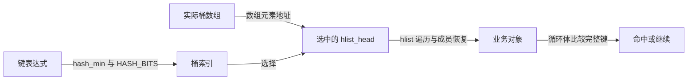

# 第1章\_hashtable.h的固定桶数组包装

证据为固定 [include/linux/hashtable.h](../../../../linux/include/linux/hashtable.h)，版本从[总索引](../../../navigation/P01_Linux_6.12_哈希计算源码阅读索引.md)进入。本页只解释固定数组层的包装，单桶连接转入 [list.h](list.h.md)，乘法转入 [hash.h](hash.h.md)，不重复函数体。中文 Doxygen 为仓库阅读说明。

## 1.1\_数组身份与初始化

这里先固定几个宏的对象类型：DEFINE_HASHTABLE 定义带初值的桶数组，DECLARE_HASHTABLE 声明不带显式初值的桶数组；HASH_SIZE 通过 ARRAY_SIZE 宏取得数组元素数，HASH_BITS 通过 ilog2 取得相应二进制位数。HLIST_HEAD_INIT 是单桶初始化式，INIT_HLIST_HEAD 则把已有桶头置空。二者的字段实现见下方单桶入口。

```c
/**
 * DEFINE_HASHTABLE - 仓库补充阅读说明：定义 2^bits 个桶，并为每一项提供 HLIST_HEAD_INIT。
 */
#define DEFINE_HASHTABLE(name, bits)						\
	struct hlist_head name[1 << (bits)] =					\
			{ [0 ... ((1 << (bits)) - 1)] = HLIST_HEAD_INIT }
/**
 * DECLARE_HASHTABLE - 仓库补充阅读说明：声明桶数组，不提供显式初始化式。
 */
#define DECLARE_HASHTABLE(name, bits)                                   	\
	struct hlist_head name[1 << (bits)]
/**
 * HASH_SIZE - 仓库补充阅读说明：由真实数组表达式取得元素数。
 */
#define HASH_SIZE(name) (ARRAY_SIZE(name))
/**
 * HASH_BITS - 仓库补充阅读说明：由数组桶数求二进制位数。
 */
#define HASH_BITS(name) ilog2(HASH_SIZE(name))
/**
 * __hash_init - 仓库补充阅读说明：遍历 sz 个桶头，逐个写成空头；不分配节点。
 */
static inline void __hash_init(struct hlist_head *ht, unsigned int sz)
{
	unsigned int i;

	for (i = 0; i < sz; i++)
		INIT_HLIST_HEAD(&ht[i]);
}
/**
 * hash_init - 仓库补充阅读说明：传入数组及其元素数；不是运行时任意指针容量推断。
 */
#define hash_init(hashtable) __hash_init(hashtable, HASH_SIZE(hashtable))
```

DEFINE 中的 [0 ... last] 是 GNU C 范围初始化器。ARRAY_SIZE 使用数组的大小关系，ilog2 求二进制数量级；这里要求声明出的 2 的幂桶数。HLIST_HEAD_INIT 和 INIT_HLIST_HEAD 的具体落点见[头初始化](list.h.md#1.1_头节点与初始化)。

函数形参写成数组形式后会退化为指针，不能继续用 HASH_SIZE/HASH_BITS 恢复原数组长度。hash_init 也不收回旧成员；在非空表上直接重新初始化会丢掉访问入口。修改 bits 时要检查移位、对象大小和分配方式，并在重新建表时迁移全部成员。

## 1.2\_选桶与成员操作

```c
/**
 * hash_min - 仓库补充阅读说明：按键表达式大小选择 hash_32 或 hash_long，后者仍受机器 long 宽度约束。
 */
#define hash_min(val, bits)							\
	(sizeof(val) <= 4 ? hash_32(val, bits) : hash_long(val, bits))
/**
 * hash_add - 仓库补充阅读说明：计算桶号，再把业务成员 node 交给 hlist_add_head。
 */
#define hash_add(hashtable, node, key)						\
	hlist_add_head(node, &hashtable[hash_min(key, HASH_BITS(hashtable))])
/**
 * hash_add_rcu - 仓库补充阅读说明：选桶规则相同，发布改由 hlist_add_head_rcu 承担。
 */
#define hash_add_rcu(hashtable, node, key)					\
	hlist_add_head_rcu(node, &hashtable[hash_min(key, HASH_BITS(hashtable))])
/**
 * hash_del - 仓库补充阅读说明：采用普通 hlist_del_init 后置状态。
 */
static inline void hash_del(struct hlist_node *node)
{
	hlist_del_init(node);
}
/**
 * hash_del_rcu - 仓库补充阅读说明：仅重置回指的 RCU 删除，保留旧读者需要的 next。
 */
static inline void hash_del_rcu(struct hlist_node *node)
{
	hlist_del_init_rcu(node);
}
```

键表达式的计算边界见[位宽导读](../../../navigation/P02_键位宽与落桶导读.md#2.2_稳定的类型是表协议的一部分)。这里不能在插入时传完整键，查找时却传已计算的桶号；也不能在两处换类型后假定落桶不变。删除从 node 的 pprev 已能定位入口，不必重新计算键。

RCU 的两个包装分别链接[发布](rculist.h.md#1.1_先构建再发布)与[删除](rculist.h.md#1.2_删除保留前向连接)。区别不是多加一个名字后缀：普通 hash_del 清 next，hash_del_rcu 保留 next，都会影响旧读者能否继续。

## 1.3\_候选遍历与全表清理

```c
/**
 * hash_for_each_possible - 仓库补充阅读说明：只遍历按 key 计算的候选桶，完整键比较由循环体执行。
 */
#define hash_for_each_possible(name, obj, member, key)			\
	hlist_for_each_entry(obj, &name[hash_min(key, HASH_BITS(name))], member)
/**
 * hash_for_each_possible_safe - 仓库补充阅读说明：在单个候选桶提前保存下一节点。
 */
#define hash_for_each_possible_safe(name, obj, tmp, member, key)	\
	hlist_for_each_entry_safe(obj, tmp,\
		&name[hash_min(key, HASH_BITS(name))], member)
/**
 * hash_for_each_safe - 仓库补充阅读说明：外层推进桶游标，内层以保存的节点游标继续删除。
 */
#define hash_for_each_safe(name, bkt, tmp, obj, member)			\
	for ((bkt) = 0, obj = NULL; obj == NULL && (bkt) < HASH_SIZE(name);\
			(bkt)++)\
		hlist_for_each_entry_safe(obj, tmp, &name[bkt], member)
```



bkt 是桶索引，tmp 是单桶的节点游标，obj 是业务对象游标；三者不是同一种地址。safe 不取得锁，也不延长 tmp 的寿命。外层循环中的 obj==NULL 使正常走完当前桶后进入下一桶，也影响内层提前 break 的行为；有提前退出需求时应读清嵌套循环，不能把宏当成单个普通 for。

一次清理按“桶序号选择 head → 保存当前成员的 next → 循环体调用 hash_del → 从已保存节点恢复下一对象”推进。字段层的写入和后置状态复用 [list.h 删除时序](list.h.md#1.2_摘除与节点后置状态)，RCU 包装则复用 [S1～S5 的旧路径时序](rculist.h.md#1.2_删除保留前向连接)。本页包装不另存生命周期状态，不重新实现这两个周期。

修改边界：类型、bits、哈希规则、数组身份和所有候选遍历必须一致；业务去重、写者互斥与对象回收始终在本层之外。返回[节点导读](../../../navigation/P03_节点连接与并发边界导读.md#3.1_节点与桶数组分别负责什么)。
