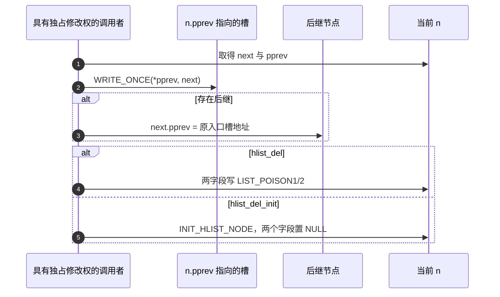
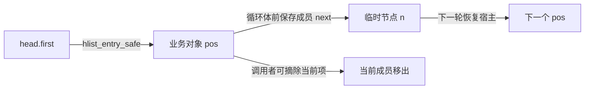

# 第1章\_list.h的单桶连接与遍历

按固定 NXP Linux 6.12.20 的 [list.h](../../../../linux/include/linux/list.h)和[types.h](../../../../linux/include/linux/types.h)展开。先由[总索引](../../../navigation/P01_Linux_6.12_哈希计算源码阅读索引.md)确认身份，再读[节点模块导读](../../../navigation/P03_节点连接与并发边界导读.md)。以下中文 Doxygen 为仓库补充，原语句保留；普通 list_head 的实现仍由[链表实现文档](../../../../linked_list/source_explanations/include/linux/list.h.md)维护，不在这里复制。

## 1.1\_头节点与初始化

hlist_head 与 hlist_node 是内核公开连接类型；前者有一个入口指针，后者的 pprev 指向入口槽。只有嵌入它们的宿主对象才保存业务键和值。以下两种类型取自 types.h：

```c
/** 仓库补充：first 指向首节点；next 指向后继；pprev 保存通向本节点的指针槽地址。 */
struct hlist_head {
	struct hlist_node *first;
};

struct hlist_node {
	struct hlist_node *next, **pprev;
};
```

以下取自 list.h。HLIST_HEAD_INIT 是初始化式宏，HLIST_HEAD 是同时定义对象的宏；INIT_HLIST_HEAD 宏操作已有头，INIT_HLIST_NODE 内联函数操作已有节点，均不分配或释放内存。READ_ONCE/WRITE_ONCE 是限制单次访问的宏，沿用链表并发课的边界，不提供互斥或对象保活。

```c
/**
 * HLIST_HEAD_INIT - 仓库补充阅读说明：产生空头初始化式。
 */
#define HLIST_HEAD_INIT { .first = NULL }
/**
 * HLIST_HEAD - 仓库补充阅读说明：定义名为 name 的空桶头。
 */
#define HLIST_HEAD(name) struct hlist_head name = {  .first = NULL }
/**
 * INIT_HLIST_HEAD - 仓库补充阅读说明：把已有头的 first 置空；不替旧成员完成回收。
 */
#define INIT_HLIST_HEAD(ptr) ((ptr)->first = NULL)
/**
 * INIT_HLIST_NODE - 仓库补充阅读说明：把未发布节点的 next 和 pprev 置空。
 */
static inline void INIT_HLIST_NODE(struct hlist_node *h)
{
	h->next = NULL;
	h->pprev = NULL;
}
/**
 * hlist_unhashed - 仓库补充阅读说明：读取 pprev 是否为空，不证明对象已无人使用。
 */
static inline int hlist_unhashed(const struct hlist_node *h)
{
	return !h->pprev;
}
/**
 * hlist_unhashed_lockless - 仓库补充阅读说明：以 READ_ONCE 读取 pprev，仅约束这次观察。
 */
static inline int hlist_unhashed_lockless(const struct hlist_node *h)
{
	return !READ_ONCE(h->pprev);
}
/**
 * hlist_empty - 仓库补充阅读说明：以 READ_ONCE 观察桶头，不预留后续仍为空的条件。
 */
static inline int hlist_empty(const struct hlist_head *h)
{
	return !READ_ONCE(h->first);
}
```

READ_ONCE 的单次访问边界沿[链表并发章](../../../../../../knowledge/linux/data_structures/单链表_linked_list/P03_并发原语与原子性.md#3.3_READ_ONCE究竟多保证了什么)；它不获取对象引用，不防止观察后立刻变化。对未初始化的垃圾指针作 unhashed 检查并不能修复对象。

## 1.2\_摘除与节点后置状态

头插接好新节点的 next、旧首项的回指以及桶头入口。所有修改者必须遵守外部串行协议；下面的函数自己不获取锁。

```c
/**
 * hlist_add_head - 仓库补充阅读说明：把 n 放在 h 的首部；调用者保证 n 未在别处连接且修改者不竞争。
 */
static inline void hlist_add_head(struct hlist_node *n, struct hlist_head *h)
{
	struct hlist_node *first = h->first;
	WRITE_ONCE(n->next, first);
	if (first)
		WRITE_ONCE(first->pprev, &n->next);
	WRITE_ONCE(h->first, n);
	WRITE_ONCE(n->pprev, &h->first);
}
/**
 * __hlist_del - 仓库补充阅读说明：改写 n->pprev 所指入口槽，并把后继回指移交给该槽。
 */
static inline void __hlist_del(struct hlist_node *n)
{
	struct hlist_node *next = n->next;
	struct hlist_node **pprev = n->pprev;

	WRITE_ONCE(*pprev, next);
	if (next)
		WRITE_ONCE(next->pprev, pprev);
}
/**
 * hlist_del - 仓库补充阅读说明：摘除后把两个连接字段毒化，不把节点标成 unhashed。
 */
static inline void hlist_del(struct hlist_node *n)
{
	__hlist_del(n);
	n->next = LIST_POISON1;
	n->pprev = LIST_POISON2;
}
/**
 * hlist_del_init - 仓库补充阅读说明：仅对非空 pprev 摘除，再恢复两个 NULL 字段。
 */
static inline void hlist_del_init(struct hlist_node *n)
{
	if (!hlist_unhashed(n)) {
		__hlist_del(n);
		INIT_HLIST_NODE(n);
	}
}
```



LIST_POISON1/2 来自 [poison.h](../../../../linux/include/linux/poison.h)，意在暴露错误继续使用，不是合法链接。WRITE_ONCE 约束写访问，不等于 RCU 发布。__hlist_del 读取的是当前修改协议保证稳定的连接；普通读取不构成“库函数已自动持锁”的证据。

修改边界：改变入口槽更新必须同时维护后继 pprev；改变毒化/初始化不能让调用者继续按旧状态规则重删。下面的遍历依赖 next，RCU 旧读者则要求撤下节点的 next 暂时保留，因此不能随意复用本节的 del/init 后置写入。

## 1.3\_成员恢复与遍历游标

hlist_entry 由成员地址通过 container_of 恢复宿主；type 和 member 必须与真实对象相符。container_of 的偏移原理已在教材模型用 offsetof 展示，此处不重新展开通用宏。hlist_entry_safe 先保存输入，空值直接返回 NULL。

```c
/**
 * hlist_entry - 仓库补充阅读说明：按真实宿主类型及成员偏移恢复业务对象。
 */
#define hlist_entry(ptr, type, member) container_of(ptr,type,member)
/**
 * hlist_entry_safe - 仓库补充阅读说明：对输入单次求值并处理 NULL；不检查任意非空地址的有效性。
 */
#define hlist_entry_safe(ptr, type, member) \
	({ typeof(ptr) ____ptr = (ptr); \
	   ____ptr ? hlist_entry(____ptr, type, member) : NULL; \
	})
/**
 * hlist_for_each_entry - 仓库补充阅读说明：以业务对象 pos 遍历，循环后从当前成员读取 next。
 */
#define hlist_for_each_entry(pos, head, member)				\
	for (pos = hlist_entry_safe((head)->first, typeof(*(pos)), member);\
	     pos;							\
	     pos = hlist_entry_safe((pos)->member.next, typeof(*(pos)), member))
/**
 * hlist_for_each_entry_safe - 仓库补充阅读说明：循环体前把 next 保存到 n，允许调用者按协议删除当前项。
 */
#define hlist_for_each_entry_safe(pos, n, head, member) 		\
	for (pos = hlist_entry_safe((head)->first, typeof(*pos), member);\
	     pos && ({ n = pos->member.next; 1; });			\
	     pos = hlist_entry_safe(n, typeof(*pos), member))
```

typeof 是 GNU C 类型取得，({ ... }) 是语句表达式，最后的表达式值用来初始化指针或给循环条件提供 1；它不是从外围函数 return。____ptr 是宏局部临时名，避免重复求值。safe 中保存的 n 是 hlist_node 指针，不是业务对象指针，也不是保活引用。



图只展示单次受控遍历；其他执行者回收 n 时，该游标仍会悬空。修改循环条件、宏参数类型或求值次数前，应验证空表、单项、删除首中尾、删除后继续以及立即 break 等分支；不能用“safe”名字替代这些调用契约。返回[节点导读](../../../navigation/P03_节点连接与并发边界导读.md#3.1_节点与桶数组分别负责什么)。
