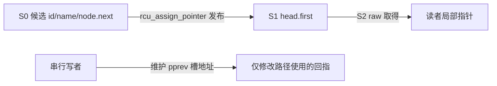
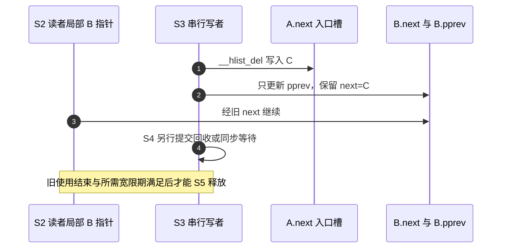

# 第1章\_rculist.h的单桶发布与旧路径

固定源码为 [include/linux/rculist.h](../../../../linux/include/linux/rculist.h)。从[总索引](../../../navigation/P01_Linux_6.12_哈希计算源码阅读索引.md)确认版本，再读[模块导读](../../../navigation/P03_节点连接与并发边界导读.md#3.2_普通修改与RCU发布的分界)。本页的 S0～S5 与教材和导读共用，中文 Doxygen 为仓库补充；不在哈希专题重复 RCU 全局宽限期实现。

## 1.1\_先构建再发布

hlist_first_rcu/hlist_next_rcu 把已有 first/next 字段呈现为带 __rcu 标注的指针左值，并没有另分配一份状态。Sparse 使用标注检查地址使用；它不是运行期互斥锁。

WRITE_ONCE 是约束相应写访问的宏，沿用普通节点实现的契约；后面的 LIST_POISON2 是毒化回指的宏值。它们都不推进宽限期。读者应已理解前一页的入口槽和单次访问边界，再追踪本页新增的发布时机。

```c
/**
 * hlist_first_rcu - 仓库补充阅读说明：返回头的 first 字段对应的 RCU 指针左值，地址仍为原字段。
 */
#define hlist_first_rcu(head)	(*((struct hlist_node __rcu **)(&(head)->first)))
/**
 * hlist_next_rcu - 仓库补充阅读说明：返回节点 next 字段对应的 RCU 指针左值。
 */
#define hlist_next_rcu(node)	(*((struct hlist_node __rcu **)(&(node)->next)))
/**
 * hlist_add_head_rcu - 仓库补充阅读说明：S1 发布；调用者已在 S0 填好业务字段，并排除并发修改者。
 */
static inline void hlist_add_head_rcu(struct hlist_node *n,
					struct hlist_head *h)
{
	struct hlist_node *first = h->first;

	n->next = first;
	WRITE_ONCE(n->pprev, &h->first);
	rcu_assign_pointer(hlist_first_rcu(h), n);
	if (first)
		WRITE_ONCE(first->pprev, &n->next);
}
```

原首项暂存在 first，新节点的前向 next 在私有时填写；pprev 回指桶头入口槽。rcu_assign_pointer 发布 head.first 后，读者已经可能取得新节点，随后才修正旧首项的 pprev。这个顺序成立的前提是读者沿 next 前进，不依赖后向回指；写者则由自己的串行协议隔开。



rcu_assign_pointer 的非空 release 发布与常量空值分支在[通用框架唯一实现](../../../../rcu/source_explanations/P01_Linux_6.12_RCU_公共接口与检查机制源码详解.md#1.3.1_rcu_assign_pointer发布实现)。修改本函数前必须分别检验读者前向依赖和写者后向依赖；不能因最终四个字段相同而任意重排发布点。

## 1.2\_删除保留前向连接

```c
/**
 * hlist_del_rcu - 仓库补充阅读说明：S3 摘除并毒化 pprev，保留旧读者可能访问的 next。
 */
static inline void hlist_del_rcu(struct hlist_node *n)
{
	__hlist_del(n);
	WRITE_ONCE(n->pprev, LIST_POISON2);
}
/**
 * hlist_del_init_rcu - 仓库补充阅读说明：S3 对仍 hashed 的节点摘除，仅把 pprev 置 NULL，不改 next。
 */
static inline void hlist_del_init_rcu(struct hlist_node *n)
{
	if (!hlist_unhashed(n)) {
		__hlist_del(n);
		WRITE_ONCE(n->pprev, NULL);
	}
}
```

二者共享 [__hlist_del 的入口槽改写](list.h.md#1.2_摘除与节点后置状态)。LIST_POISON2 用于暴露错误继续把回指当作合法地址；NULL 允许写者按 unhashed 状态判断，但不代表旧读者已结束。函数均不排队回调、不等待宽限期，也不释放宿主对象。



修改边界：提前清 next、重用对象、重复删除或提前 free 都可能破坏旧路径。即使最终 free 被推迟，第一次重用写 next 也已经可能太早。回调头、独立引用和停止生产者属于调用方的寿命协议。

## 1.3\_遍历的取得与检查分开

```c
/**
 * hlist_for_each_entry_rcu - 仓库补充阅读说明：S2 沿 first/next 取得节点，经 hlist_entry_safe 恢复宿主；cond 是可选检查条件。
 */
#define hlist_for_each_entry_rcu(pos, head, member, cond...)		\
	for (__list_check_rcu(dummy, ## cond, 0),			\
	     pos = hlist_entry_safe(rcu_dereference_raw(hlist_first_rcu(head)),\
			typeof(*(pos)), member);			\
		pos;							\
		pos = hlist_entry_safe(rcu_dereference_raw(hlist_next_rcu(\
			&(pos)->member)), typeof(*(pos)), member))
```

hlist_entry_safe 的空值处理与成员恢复见[list.h 遍历实现](list.h.md#1.3_成员恢复与遍历游标)。rcu_dereference_raw 使用有约束的取得，但不自己做普通 rcu_dereference 的动态上下文警告，具体原语在[RCU 通用 raw 取得实现](../../../../rcu/source_explanations/P01_Linux_6.12_RCU_公共接口与检查机制源码详解.md#1.3.4_rcu_dereference_raw的无检查取得)唯一展开。

循环前的 __list_check_rcu 承担检查职责，cond 可用于声明另一种确实成立的保护条件。把 cond 填成 1 只会使检查接受，不会自动建立那种保护。Kconfig 布尔项 CONFIG_PROVE_RCU_LIST 控制 RCU 链表的运行期检查；当前工作配置未启用该项。下面裁剪掉独立的可睡眠 RCU（Sleepable RCU，SRCU）检查宏，保留本宏的两种配置分支：

```c
/** 仓库补充：空宏利用参数数量诊断，只允许指定数量的额外条件。 */
#define check_arg_count_one(dummy)

#ifdef CONFIG_PROVE_RCU_LIST
/** 仓库补充：检查 cond 或普通 RCU 读侧保护，警告机制不获取业务锁。 */
#define __list_check_rcu(dummy, cond, extra...) \
	({ \
	check_arg_count_one(extra); \
	RCU_LOCKDEP_WARN(!(cond) && !rcu_read_lock_any_held(), \
			 "RCU-list traversed in non-reader section!"); \
	})
#else
/** 仓库补充：配置关闭仍检查宏参数数量，不执行运行期 RCU-list 警告。 */
#define __list_check_rcu(dummy, cond, extra...) \
	({ check_arg_count_one(extra); })
#endif
```

rcu_read_lock_any_held 查询检查侧可接受的读侧条件，RCU_LOCKDEP_WARN 是否真正发出告警还取决于配置与检查器状态，见[通用警告适配](../../../../rcu/source_explanations/P01_Linux_6.12_RCU_公共接口与检查机制源码详解.md#1.6_RCU_LOCKDEP_WARN检查适配层)。dummy、extra 和 GNU 可变参数拼接服务于可选参数展开，不表示额外功能状态。

修改边界：取得的地址、字段访问和对象寿命必须正确，即使检查被配置关闭或返回未告警也不能省略。改变 cond 或宏展开要检查带条件和不带条件两种调用，以及 PROVE_RCU_LIST 开关；变更检查器不应悄悄改变功能发布顺序。返回[节点导读](../../../navigation/P03_节点连接与并发边界导读.md#3.3_从撤下到回调完成)。
