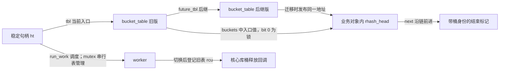

# 第1章\_rhashtable的对象布局与参数

本页固定 NXP Linux 6.12.20、提交 dfaf2136deb2af2e60b994421281ba42f1c087e0。源位置为 [include/linux/rhashtable-types.h](../../../../linux/include/linux/rhashtable-types.h)及 [include/linux/rhashtable.h](../../../../linux/include/linux/rhashtable.h)；后者定义 bucket_table。总入口见[索引](../../../navigation/P01_Linux_6.12_哈希计算源码阅读索引.md)，阅读任务见[动态表导读](../../../navigation/P04_动态表迁移与接口边界导读.md#4.1_表句柄桶数组与业务节点)。中文 Doxygen 均为仓库补充。

## 1.1\_从句柄到节点的状态落点

下面结构体里的 CONFIG_MEM_ALLOC_PROFILING 是 Kconfig 的分配统计开关；开启时才保存 alloc_tag 指针，用来记录分配归属，不是迁移状态。atomic_t 为原子计数类型，work_struct 是工作队列登记对象，mutex/spinlock_t 分别承担后文指定的锁范围；它们沿用同步与模块先修课的类型。

```c
/** rhash_head - 仓库补充阅读说明：嵌入业务对象的单向连接；next 可连接后继对象或带桶身份的链尾标记。 */
struct rhash_head {
	struct rhash_head __rcu		*next;
};
```

```c
/** rhashtable - 仓库补充阅读说明：跨表版本的稳定句柄；tbl、工作项、两种锁和元素数各有不同所有者。 */
struct rhashtable {
	struct bucket_table __rcu	*tbl;
	unsigned int			key_len;
	unsigned int			max_elems;
	struct rhashtable_params	p;
	bool				rhlist;
	struct work_struct		run_work;
	struct mutex                    mutex;
	spinlock_t			lock;
	atomic_t			nelems;
#ifdef CONFIG_MEM_ALLOC_PROFILING
	struct alloc_tag		*alloc_tag;
#endif
};
```

```c
/** bucket_table - 仓库补充阅读说明：一次具体容量与种子的桶存储；future_tbl、桶头锁位和链尾标记是不同状态。 */
struct bucket_table {
	unsigned int		size;
	unsigned int		nest;
	u32			hash_rnd;
	struct list_head	walkers;
	struct rcu_head		rcu;

	struct bucket_table __rcu *future_tbl;

	struct lockdep_map	dep_map;

	struct rhash_lock_head __rcu *buckets[] ____cacheline_aligned_in_smp;
};
```

| 字段簇 | 写入者和读取者 | 角色与边界 |
| --- | --- | --- |
| ht.tbl、tbl.future_tbl | 初始化、挂接与迁移路径写；查找、更新及 worker 读 | R0～R4 的当前入口与后继关系；挂接在分配初始化以后，旧表不立即释放 |
| tbl.size、hash_rnd、nest | 分配路径初始化，之后计算和寻桶使用 | 桶数、每表随机种子和嵌套层级；nest 非零时不能把存储当成普通平坦数组 |
| ht.p、key_len、max_elems | 初始化复制和派生，查找/更新读 | 参数副本、内部哈希长度单位及数量门限；不是每次业务请求可任意改写的调参区 |
| ht.run_work、ht.mutex | 插入/删除等路径安排工作，worker 获取 mutex | 表版本管理；schedule_work 不等于已经搬完 |
| 每个 buckets 槽的低位 | 修改者持位锁改连接；读取入口时屏蔽锁位 | 局部互斥，不是搬迁方向 |
| ht.nelems | 成功插入/移除按协议原子增减，阈值判断读 | 数量观察不等于全表内容快照 |
| ht.lock、tbl.walkers | walk 与迁移路径共同保护登记链 | 与桶锁、mutex 不是同一个保护范围 |
| tbl.rcu | 旧表切换后登记，RCU 核心回调消费 | 只负责旧桶存储寿命，不直接销毁业务对象 |
| tbl.dep_map | 分配时初始化，桶锁适配时读写检查状态 | Lockdep 的检查对象，不是功能位锁本身 |
| ht.alloc_tag | CONFIG_MEM_ALLOC_PROFILING 开启时记录分配归属 | 内存分配统计配置字段；不承担迁移正确性 |

CONFIG_MEM_ALLOC_PROFILING 是 Kconfig 分配统计选项；关闭时相关宏可以裁去统计接入，不能因源码仍出现宏参数就断言结构体字段总存在。____cacheline_aligned_in_smp 是 SMP 配置相关对齐标注，不改变桶锁和对象寿命协议。源码注释中遗留的 rehash/ntbl 字段描述不对应本结构的实际成员，不能据注释虚构一个 rehash 进度字段。



R0～R5 与[教材完整周期](../../../../../../knowledge/linux/data_structures/哈希表_Hash_Table/P03_高级进阶与性能调优/P05_动态伸缩的rhashtable_无感扩容的艺术.md#5.4_一次迁移怎样保持可以继续查找)相同，下面各实现页复用该组阶段。生命周期时序见[表入口交接](../../../source_explanations/lib/rhashtable.c.md#1.2_尾节点迁移与表入口交接)。

修改边界：业务对象可以保持原地址，但桶存储会换版本；改布局、偏移或配置不能只改一种调用。尤其不能把 ht.lock 当作桶锁使用，不能让对象提前移动或把链尾标记当真实 rhash_head 解引用。

## 1.2\_参数怎样描述用户结构

```c
/** rhashtable_params - 仓库补充阅读说明：由用户提供并在初始化复制；偏移描述真实结构，回调规定键的哈希和完整比较。 */
struct rhashtable_params {
	u16			nelem_hint;
	u16			key_len;
	u16			key_offset;
	u16			head_offset;
	unsigned int		max_size;
	u16			min_size;
	bool			automatic_shrinking;
	rht_hashfn_t		hashfn;
	rht_obj_hashfn_t	obj_hashfn;
	rht_obj_cmpfn_t		obj_cmpfn;
};
```

nelem_hint/key_len/key_offset/head_offset/min_size 的类型是 u16，max_size 为 unsigned int。调用方应检查真实 sizeof/offsetof 能否表示，而不是静默截断。初始化会规范最小/最大桶数，并据最大值推导 max_elems，过程见[初始化实现](../../../source_explanations/lib/rhashtable.c.md#1.4_初始化与销毁边界)。

hashfn 的签名为返回 u32、输入键地址、长度和种子；obj_hashfn 输入整个对象用于产生可比的哈希，obj_cmpfn 输入 rhashtable_compare_arg（其中 ht 为当前句柄、key 为查询键）与业务对象，返回零表示相等。指定 obj_hashfn 时还需 obj_cmpfn；库无法自动猜出变长业务键。

默认 memcmp 从对象起点加 key_offset，比较 key_len 字节；默认哈希选择 jhash 或 jhash2。后者按 u32 单元计长度，内部 ht.key_len 与公开参数的字节长度不可混淆。具体取键/选桶见[计算辅助函数](rhashtable.h.md#1.2_从键到候选桶)。jhash 的混合轮次不是本批迁移命题的展开范围；本页只要求同一规范化键在插入、查找、删除中使用一致计算和比较。

## 1.3\_遍历器与重复键分组

```c
/** rhlist_head - 仓库补充阅读说明：rhead 连接不同键的候选链，next 连接同键组；两种链不能互换。 */
struct rhlist_head {
	struct rhash_head		rhead;
	struct rhlist_head __rcu	*next;
};
```

rhltable 仅以 rhashtable ht 为成员，初始化时设置同键链模式。rhash_head.next 仍负责桶间候选，rhlist_head.next 才负责同键组。哈希冲突是不同键落到同桶，同键多对象是业务关系，必须分别比较。

```c
/** rhashtable_walker - 仓库补充阅读说明：登记暂停或尚未开始的遍历所属表；迁移会使旧版本登记失效。 */
struct rhashtable_walker {
	struct list_head list;
	struct bucket_table *tbl;
};
```
```c
/** rhashtable_iter - 仓库补充阅读说明：保存当前成员、同键组、桶序号与跳过位置；并非永久对象引用或稳定快照。 */
struct rhashtable_iter {
	struct rhashtable *ht;
	struct rhash_head *p;
	struct rhlist_head *list;
	struct rhashtable_walker walker;
	unsigned int slot;
	unsigned int skip;
	bool end_of_table;
};
```

walker.list 在 ht.lock 下进入 tbl.walkers；迁移切换旧表时把登记者的 walker.tbl 置 NULL。walk_start_check 在任何返回路径都已进入 RCU 读侧，若发现版本失效会从新表重启并返回 -EAGAIN；调用者仍必须 walk_stop。walk_next 也能因后继表出现而返回错误指针 -EAGAIN，不能当普通对象解引用。walk_exit 处理登记关系，不能替代读侧 stop。

这些调用定义在 lib/rhashtable.c 的 rhashtable_walk_enter/start_check/next/stop/exit。完整迭代器算法不是本次实验使用的路径，故不展开函数体；这里保留它作为“为什么 ht.lock 与 walkers 存在”的接口和生命周期边界，不宣称 walker 的所有并发分支已由本实验验证。稳定排序或严格一次快照需要独立业务协议。

修改边界：改变 walker 登记必须同时审查切换、stop 与回调已登记的判断；改变同键组结构必须覆盖插入、删除、遍历与 free_one 的整组回收。不得只改普通 rhashtable 路径后声称 rhltable 等价成立。返回[动态表导读](../../../navigation/P04_动态表迁移与接口边界导读.md#4.3_业务对象的回收不等于桶表回收)。
