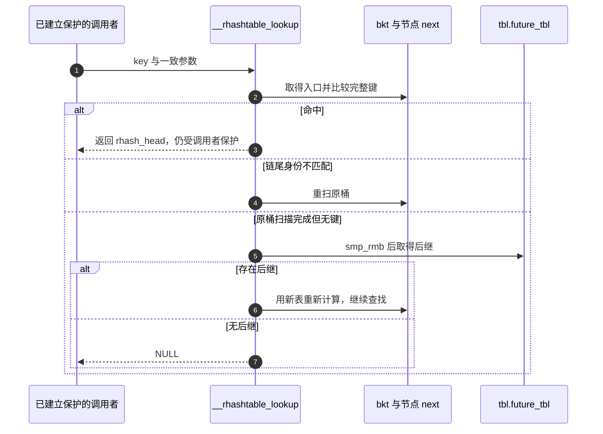

# 第1章\_rhashtable.h的标记查找与公开包装

固定原文为 [include/linux/rhashtable.h](../../../../linux/include/linux/rhashtable.h)，身份从[总索引](../../../navigation/P01_Linux_6.12_哈希计算源码阅读索引.md)进入，职责从[动态表导读](../../../navigation/P04_动态表迁移与接口边界导读.md#4.2_沿R0到R5追踪一次迁移)进入。结构先读[对象布局](rhashtable-types.h.md#1.1_从句柄到节点的状态落点)。下述 Doxygen 是仓库补充，R0～R5 复用教材完整周期。

## 1.1\_桶锁位与链尾身份

rht_is_a_nulls 检查节点值的最低位；它的输入已经是链节点或结束标记，不能把原始带锁桶头直接交给这个判断。__rht_ptr 负责先屏蔽桶头的锁位，若剩余值为空，再按桶槽地址产生结束标记。RHT_NULLS_MARKER 依赖 list_nulls.h 的通用编码宏 NULLS_MARKER：它把输入左移一位并置最低位。本包装先把槽地址右移一位，因此结果保留桶地址身份并置位；不分配真实节点。

```c
/** RHT_NULLS_MARKER - 仓库补充：把桶槽地址转换为带低位的链尾身份。 */
#define	RHT_NULLS_MARKER(ptr)	\
	((void *)NULLS_MARKER(((unsigned long) (ptr)) >> 1))
/** INIT_RHT_NULLS_HEAD - 仓库补充：数组槽保存 NULL，不能直接存入带低位的链尾标记。 */
#define INIT_RHT_NULLS_HEAD(ptr)	\
	((ptr) = NULL)
```

```c
/** rht_is_a_nulls - 仓库补充阅读说明：判断已经取得的链节点是否为结束标记。 */
static inline bool rht_is_a_nulls(const struct rhash_head *ptr)
{
	return ((unsigned long) ptr & 1);
}
/** __rht_ptr - 仓库补充阅读说明：清桶锁位；空桶转换为与原槽地址绑定的标记。 */
static inline struct rhash_head *__rht_ptr(
	struct rhash_lock_head *p, struct rhash_lock_head __rcu *const *bkt)
{
	return (struct rhash_head *)
		((unsigned long)p & ~BIT(0) ?:
		 (unsigned long)RHT_NULLS_MARKER(bkt));
}
/** rht_ptr_rcu - 仓库补充阅读说明：以 RCU 方式读取槽值，再按桶头编码解释。 */
static inline struct rhash_head *rht_ptr_rcu(
	struct rhash_lock_head __rcu *const *bkt)
{
	return __rht_ptr(rcu_dereference(*bkt), bkt);
}
```

BIT(0) 为最低位掩码，GNU 的省略中间操作数条件表达式选择清位后的非零指针或标记；不在非空节点地址上强行加偏移。普通 rcu_dereference 的取得与检查在[RCU 公共实现](../../../../rcu/source_explanations/P01_Linux_6.12_RCU_公共接口与检查机制源码详解.md#1.3.2_rcu_dereference取得实现)展开。


rht_lock/rht_unlock 在同一槽地址上操作位锁，并保存/恢复本地 IRQ 状态；dep_map 接入 Lockdep，仅记录检查状态。rht_lock_nested 用独立 subclass 描述同时持有新旧桶锁的嵌套。rht_assign_locked 发布时保留锁位；rht_assign_unlock 以 release 发布清锁位的新入口，并恢复位锁路径改变的抢占/IRQ 状态。它们位于同一头文件，不是旧稿的 bucket_lock 自定义自旋锁数组。这一簇的函数体不重复展开通用位锁或 Lockdep 适配，使用处的加锁和发布次序在[迁移实现](../../../source_explanations/lib/rhashtable.c.md#1.2_尾节点迁移与表入口交接)。

修改边界：桶槽编码、节点结束编码和 future_tbl 各自独立。改取值函数必须同时检查空桶、锁定空桶、锁定非空桶和已取得节点的 next；不能只测非空无锁桶。

## 1.2\_从键到候选桶

```c
/** rht_obj - 仓库补充阅读说明：由成员地址减 head_offset 恢复同一宿主对象。 */
static inline void *rht_obj(const struct rhashtable *ht,
			    const struct rhash_head *he)
{
	return (char *)he - ht->p.head_offset;
}
/** rht_bucket_index - 仓库补充阅读说明：以二的幂桶数掩码选择索引；输入是混合后的哈希值。 */
static inline unsigned int rht_bucket_index(const struct bucket_table *tbl,
					    unsigned int hash)
{
	return hash & (tbl->size - 1);
}
```

```c
/** rht_key_get_hash - 仓库补充阅读说明：按常量参数和键长度选择哈希入口，不把字节长度与 u32 数量混用。 */
static inline unsigned int rht_key_get_hash(struct rhashtable *ht,
	const void *key, const struct rhashtable_params params,
	unsigned int hash_rnd)
{
	unsigned int hash;

	/* params must be equal to ht->p if it isn't constant. */
	if (!__builtin_constant_p(params.key_len))
		hash = ht->p.hashfn(key, ht->key_len, hash_rnd);
	else if (params.key_len) {
		unsigned int key_len = params.key_len;

		if (params.hashfn)
			hash = params.hashfn(key, key_len, hash_rnd);
		else if (key_len & (sizeof(u32) - 1))
			hash = jhash(key, key_len, hash_rnd);
		else
			hash = jhash2(key, key_len / sizeof(u32), hash_rnd);
	} else {
		unsigned int key_len = ht->p.key_len;

		if (params.hashfn)
			hash = params.hashfn(key, key_len, hash_rnd);
		else
			hash = jhash(key, key_len, hash_rnd);
	}

	return hash;
}
/** rht_key_hashfn - 仓库补充阅读说明：用当前表的 hash_rnd 计算，再按当前表的 size 选桶。 */
static inline unsigned int rht_key_hashfn(
	struct rhashtable *ht, const struct bucket_table *tbl,
	const void *key, const struct rhashtable_params params)
{
	unsigned int hash = rht_key_get_hash(ht, key, params, tbl->hash_rnd);

	return rht_bucket_index(tbl, hash);
}
/** rht_head_hashfn - 仓库补充阅读说明：由节点恢复对象，选择对象哈希或固定区域键哈希。 */
static inline unsigned int rht_head_hashfn(
	struct rhashtable *ht, const struct bucket_table *tbl,
	const struct rhash_head *he, const struct rhashtable_params params)
{
	const char *ptr = rht_obj(ht, he);

	return likely(params.obj_hashfn) ?
	       rht_bucket_index(tbl, params.obj_hashfn(ptr, params.key_len ?:
							    ht->p.key_len,
						       tbl->hash_rnd)) :
	       rht_key_hashfn(ht, tbl, ptr + params.key_offset, params);
}
```

ht.p 是初始化后的参数副本。__builtin_constant_p 让编译器在已知参数时选择可展开路径；非恒定调用参数必须与 ht.p 一致。jhash 接受字节长度，jhash2 接受 u32 个数；这些算法的混合轮次不承担本批迁移命题，故只核对入参协议，不展开内部轮次。params.obj_hashfn 接收整个宿主，默认路径则从 ptr + key_offset 取键；哈希与 obj_cmpfn 的等价关系必须由调用者保证。

本轮固定键实验采用 u32，避免填充和变长编码问题。rht_bucket/rht_bucket_var/rht_bucket_insert 把计算结果转换为槽地址：nest 为零时直接取 buckets[hash]；非零时通过嵌套表辅助函数定位，insert 还可能分配缺失层级。嵌套分配失败不是正常“查无键”，插入应继续按错误或重试协议处理。

修改边界：更改 hash_rnd、size 或键解释必须对该表全部成员重哈希，不能原地改一项参数后继续按旧连接查找。offsetof 与 container_of 不存在天然的运行性能高低关系，偏移接口只是让独立编译的库不必知道用户类型。

## 1.3\_查找的重扫与后继路径

默认比较函数返回零表示完整键相等，哈希相同本身不够。rhashtable_compare_arg 保存本次 ht 与 key，属于调用栈状态，不是全局查找上下文。

```c
/** rhashtable_compare - 仓库补充阅读说明：从业务对象取键区域，与本次查询键进行完整字节比较。 */
static inline int rhashtable_compare(struct rhashtable_compare_arg *arg,
				     const void *obj)
{
	struct rhashtable *ht = arg->ht;
	const char *ptr = obj;

	return memcmp(ptr + ht->p.key_offset, arg->key, ht->p.key_len);
}
```

```c
/** rht_for_each_rcu_from - 仓库补充：沿 next 遍历到 nulls；barrier 是编译器屏障，不代替后面的读取屏障。 */
#define rht_for_each_rcu_from(pos, head, tbl, hash)			\
	for (({barrier(); }),						\
	     pos = head;						\
	     !rht_is_a_nulls(pos);					\
	     pos = rcu_dereference_raw(pos->next))
```

rcu_dereference_raw 不自行进行普通动态上下文警告，唯一实现见[RCU raw 取得](../../../../rcu/source_explanations/P01_Linux_6.12_RCU_公共接口与检查机制源码详解.md#1.3.4_rcu_dereference_raw的无检查取得)。ht/tbl 的 rht_dereference_rcu 使用 rcu_dereference_check，可把已持有表管理 mutex 作为检查允许的替代条件；检查接受不等于函数替调用者加锁。

```c
/** __rhashtable_lookup - 仓库补充阅读说明：R3 中允许跨链；未命中时先核对结束桶身份，再沿 future_tbl 重算并搜索。 */
static inline struct rhash_head *__rhashtable_lookup(
	struct rhashtable *ht, const void *key,
	const struct rhashtable_params params)
{
	struct rhashtable_compare_arg arg = {
		.ht = ht,
		.key = key,
	};
	struct rhash_lock_head __rcu *const *bkt;
	struct bucket_table *tbl;
	struct rhash_head *he;
	unsigned int hash;

	tbl = rht_dereference_rcu(ht->tbl, ht);
restart:
	hash = rht_key_hashfn(ht, tbl, key, params);
	bkt = rht_bucket(tbl, hash);
	do {
		rht_for_each_rcu_from(he, rht_ptr_rcu(bkt), tbl, hash) {
			if (params.obj_cmpfn ?
			    params.obj_cmpfn(&arg, rht_obj(ht, he)) :
			    rhashtable_compare(&arg, rht_obj(ht, he)))
				continue;
			return he;
		}
		/* An object might have been moved to a different hash chain,
		 * while we walk along it - better check and retry.
		 */
	} while (he != RHT_NULLS_MARKER(bkt));

	/* Ensure we see any new tables. */
	smp_rmb();

	tbl = rht_dereference_rcu(tbl->future_tbl, ht);
	if (unlikely(tbl))
		goto restart;

	return NULL;
}
```

he 在遇到结束标记后仍保留该值，用于和原 bkt 的标记比较。不同则重扫同一个桶；相同且查无键时，smp_rmb 后再读取 future_tbl。存在后继就从它的容量和种子重新计算，可能继续经过多个版本。这个协议不能删成“读到任何低位一就换表”，也不保证循环次数恒定。



修改边界：尾标记、取得、屏障和后继挂接必须作为一套协议审查；移除其中一个条件需要重新证明跨链期间不会漏掉尚未删除的对象。成功返回只证明一次查找命中，不证明对象随后不再变化或可以脱离保护。

## 1.4\_公开包装不会增加对象所有权

```c
/** rhashtable_lookup - 仓库补充阅读说明：在调用者读侧内恢复业务对象地址。 */
static inline void *rhashtable_lookup(
	struct rhashtable *ht, const void *key,
	const struct rhashtable_params params)
{
	struct rhash_head *he = __rhashtable_lookup(ht, key, params);

	return he ? rht_obj(ht, he) : NULL;
}
/** rhashtable_lookup_fast - 仓库补充阅读说明：仅在函数内部建立短读侧，返回以后必须另有对象保活保证。 */
static inline void *rhashtable_lookup_fast(
	struct rhashtable *ht, const void *key,
	const struct rhashtable_params params)
{
	void *obj;

	rcu_read_lock();
	obj = rhashtable_lookup(ht, key, params);
	rcu_read_unlock();

	return obj;
}
```

```c
/** rhashtable_insert_fast - 仓库补充阅读说明：向内部插入传 NULL 查重键，不自行保证同键唯一。 */
static inline int rhashtable_insert_fast(
	struct rhashtable *ht, struct rhash_head *obj,
	const struct rhashtable_params params)
{
	void *ret;

	ret = __rhashtable_insert_fast(ht, NULL, obj, params, false);
	if (IS_ERR(ret))
		return PTR_ERR(ret);

	return ret == NULL ? 0 : -EEXIST;
}
/** rhashtable_lookup_insert_fast - 仓库补充阅读说明：从对象取得固定键并进行查重插入，不支持本包装的 obj_hashfn 用法。 */
static inline int rhashtable_lookup_insert_fast(
	struct rhashtable *ht, struct rhash_head *obj,
	const struct rhashtable_params params)
{
	const char *key = rht_obj(ht, obj);
	void *ret;

	BUG_ON(ht->p.obj_hashfn);

	ret = __rhashtable_insert_fast(ht, key + ht->p.key_offset, obj, params,
				       false);
	if (IS_ERR(ret))
		return PTR_ERR(ret);

	return ret == NULL ? 0 : -EEXIST;
}
```

两个插入包装返回零才表示本候选成功加入；内部错误指针转成负错误码；已有同键对象转换为 -EEXIST。固定键包装的 BUG_ON 防止错误使用对象哈希模式，不应在教学代码里通过触发 BUG 观察“正常错误处理”。IS_ERR/PTR_ERR 的编码契约沿用[错误指针专题](../../../../../../knowledge/linux/error_handling/error_pointer/大纲.md)。

内部 __rhashtable_insert_fast 的分支按[动态表导读](../../../navigation/P04_动态表迁移与接口边界导读.md#4.2_沿R0到R5追踪一次迁移)追踪：取得表和桶、桶锁内检查后继、逐项比较键并计算链长预算、检查元素上界、初始化候选 next 并发布、计数与调度。它把需要进一步调整的请求交给 lib/rhashtable.c 的慢路径；同键组模式另维护 rhlist_head.next。RHT_ELASTICITY=16 是该版本用于异常长链判断的预算，不是最大链长永远不会超过 16 的保证。

rhashtable_remove_fast 包装内部按表版本查找指定节点地址的移除：逐桶持锁改前驱连接或桶入口，成功时更新 nelems，必要时安排收缩；未找到则检查后继。它不 kfree 业务对象。完整使用见[接口实验](../../../../../../knowledge/linux/data_structures/哈希表_Hash_Table/P03_高级进阶与性能调优/P08_rhashtable接口与回收实验.md#8.1_先固定本例的拥有者)。

修改边界：换包装就是换契约，不能把普通 insert 当成 lookup_insert；读侧退出、错误返回、对象回收与容器销毁仍分别配对。返回[总索引](../../../navigation/P01_Linux_6.12_哈希计算源码阅读索引.md#1.2_从问题选择入口)。
