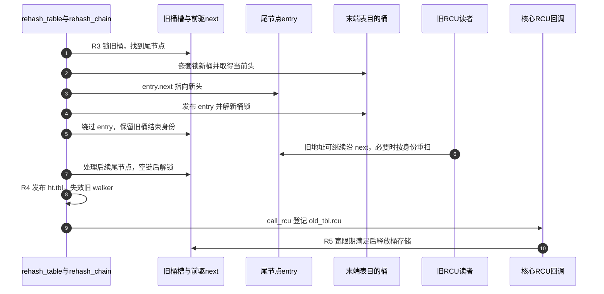
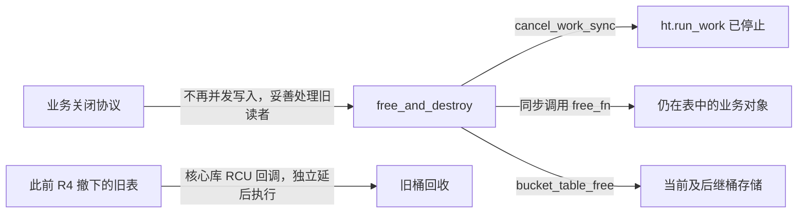

# 第1章\_rhashtable.c的迁移调度与销毁

本页固定 [lib/rhashtable.c](../../../linux/lib/rhashtable.c) 的 NXP Linux 6.12.20 提交，身份见[总索引](../../navigation/P01_Linux_6.12_哈希计算源码阅读索引.md)，函数阅读次序见[动态表导读](../../navigation/P04_动态表迁移与接口边界导读.md)。中文 Doxygen 为仓库补充。R0～R5 与[教材公共周期](../../../../../knowledge/linux/data_structures/哈希表_Hash_Table/P03_高级进阶与性能调优/P05_动态伸缩的rhashtable_无感扩容的艺术.md#5.4_一次迁移怎样保持可以继续查找)相同，不另设第二套阶段。

## 1.1\_新表分配与后继挂接

bucket_table_alloc 分配容器存储，设置桶数、检查对象、回调头、遍历器链和每表随机种子；此时尚未修改旧表入口。kvmalloc_node_noprof 允许实现选择适当的分配方式，不能将所有桶数组概括成 SLAB 连续物理内存。alloc_hooks_tag 承担配置相关的分配归属统计，不改变后继发布职责。

这里的 GFP 是内核分配标志族，允许睡眠与非睡眠分配沿用模块课程。NUMA（Non-Uniform Memory Access，非统一内存访问）节点参数表达分配位置偏好，NUMA_NO_NODE 表示本次不指定节点；它不要求当前 ARM 目标实际采用 NUMA。INIT_LIST_HEAD 初始化 walker 登记链，INIT_RHT_NULLS_HEAD 初始化空桶槽，两者都不登记业务对象。

```c
/** bucket_table_alloc - 仓库补充阅读说明：R1 准备平坦或嵌套桶表；所有返回的新表都有独立随机种子和初始化状态。 */
static struct bucket_table *bucket_table_alloc(struct rhashtable *ht,
					       size_t nbuckets,
					       gfp_t gfp)
{
	struct bucket_table *tbl = NULL;
	size_t size;
	int i;
	static struct lock_class_key __key;

	tbl = alloc_hooks_tag(ht->alloc_tag,
			kvmalloc_node_noprof(struct_size(tbl, buckets, nbuckets),
					     gfp|__GFP_ZERO, NUMA_NO_NODE));

	size = nbuckets;

	if (tbl == NULL && !gfpflags_allow_blocking(gfp)) {
		tbl = nested_bucket_table_alloc(ht, nbuckets, gfp);
		nbuckets = 0;
	}

	if (tbl == NULL)
		return NULL;

	lockdep_init_map(&tbl->dep_map, "rhashtable_bucket", &__key, 0);

	tbl->size = size;

	rcu_head_init(&tbl->rcu);
	INIT_LIST_HEAD(&tbl->walkers);

	tbl->hash_rnd = get_random_u32();

	for (i = 0; i < nbuckets; i++)
		INIT_RHT_NULLS_HEAD(tbl->buckets[i]);

	return tbl;
}
```

__GFP_ZERO 要求初始存储清零，NUMA_NO_NODE 不指定 NUMA 节点。不允许阻塞分配且平坦分配失败时尝试 nested_bucket_table_alloc，nest 标记使寻桶接口走分层路径。嵌套分配内部的页数组层次不影响本批标记和发布命题，故只列它的输入/失败返回与 nest 消费边界，不展开分配器函数体。__key 为本调用点静态 Lockdep 类 key，dep_map 是每表检查实例；它们都不是桶里的功能锁位。

```c
/** rhashtable_rehash_attach - 仓库补充阅读说明：R2 竞争安装唯一后继；cmpxchg 返回旧值，非空表示已有竞争者成功。 */
static int rhashtable_rehash_attach(struct rhashtable *ht,
				    struct bucket_table *old_tbl,
				    struct bucket_table *new_tbl)
{
	/* Make insertions go into the new, empty table right away. Deletions
	 * and lookups will be attempted in both tables until we synchronize.
	 * As cmpxchg() provides strong barriers, we do not need
	 * rcu_assign_pointer().
	 */

	if (cmpxchg((struct bucket_table **)&old_tbl->future_tbl, NULL,
		    new_tbl) != NULL)
		return -EEXIST;

	return 0;
}
/** rhashtable_last_table - 仓库补充阅读说明：沿后继链找到当前末端，不把版本数写死为二。 */
static struct bucket_table *rhashtable_last_table(struct rhashtable *ht,
						  struct bucket_table *tbl)
{
	struct bucket_table *new_tbl;

	do {
		new_tbl = tbl;
		tbl = rht_dereference_rcu(tbl->future_tbl, ht);
	} while (tbl);

	return new_tbl;
}
```

cmpxchg 成功才把完整新表交给后续路径；失败返回 EEXIST，调用者负责释放自己未挂接的候选。注释指出此处采用比较交换的排序保证，因此不能机械补一条独立 rcu_assign_pointer 覆盖竞争结果。rht_dereference_rcu 的检查前提见[取得辅助函数](../include/linux/rhashtable.h.md#1.3_查找的重扫与后继路径)。

修改边界：不能先暴露未初始化的 size、种子或空桶；改变分配策略必须同时检查 GFP 上下文、平坦/嵌套寻桶和分配统计配置。改变挂接方式必须保留竞争者不会覆盖已有后继的保证。

## 1.2\_尾节点迁移与表入口交接

调用者持 ht.mutex 协调表版本，同时 rhashtable_rehash_chain 持旧桶位锁。rehash_one 再对目的桶取得嵌套锁。普通业务插入可能只使用桶锁，不能由 mutex 推断所有业务写者都被挡住。

SINGLE_DEPTH_NESTING 是桶锁检查使用的一层嵌套类别常量，不是额外的功能锁。EAGAIN 表示需要重新尝试，ENOENT 在此内部调用中表示链已空，EEXIST 表示后继竞争已有胜者；这些负错误码必须在各自调用点解释，不能都当作最终业务失败。

```c
/** rhashtable_rehash_one - 仓库补充阅读说明：R3 从旧链选择尾节点，先放入末端表，再绕过旧入口；不是给旧桶写 redirect tag。 */
static int rhashtable_rehash_one(struct rhashtable *ht,
				 struct rhash_lock_head __rcu **bkt,
				 unsigned int old_hash)
{
	struct bucket_table *old_tbl = rht_dereference(ht->tbl, ht);
	struct bucket_table *new_tbl = rhashtable_last_table(ht, old_tbl);
	int err = -EAGAIN;
	struct rhash_head *head, *next, *entry;
	struct rhash_head __rcu **pprev = NULL;
	unsigned int new_hash;
	unsigned long flags;

	if (new_tbl->nest)
		goto out;

	err = -ENOENT;

	rht_for_each_from(entry, rht_ptr(bkt, old_tbl, old_hash),
			  old_tbl, old_hash) {
		err = 0;
		next = rht_dereference_bucket(entry->next, old_tbl, old_hash);

		if (rht_is_a_nulls(next))
			break;

		pprev = &entry->next;
	}

	if (err)
		goto out;

	new_hash = head_hashfn(ht, new_tbl, entry);

	flags = rht_lock_nested(new_tbl, &new_tbl->buckets[new_hash],
				SINGLE_DEPTH_NESTING);

	head = rht_ptr(new_tbl->buckets + new_hash, new_tbl, new_hash);

	RCU_INIT_POINTER(entry->next, head);

	rht_assign_unlock(new_tbl, &new_tbl->buckets[new_hash], entry, flags);

	if (pprev)
		rcu_assign_pointer(*pprev, next);
	else
		/* Need to preserved the bit lock. */
		rht_assign_locked(bkt, next);

out:
	return err;
}
```

entry/next/pprev 是本次调用的局部游标：entry 最终是旧尾，next 保存旧桶的结束标记，pprev 是旧尾前驱的 next 地址，首项时为空。head_hashfn 以新表容量和种子重新计算；rht_obj、对象/键哈希与索引掩码在[头文件计算簇](../include/linux/rhashtable.h.md#1.2_从键到候选桶)。目的表仍为嵌套分配时返回 EAGAIN，交由表管理安排后续处理。

函数先改变 entry.next、发布新桶，再更新旧入口。旧读者已持有的 entry 因此可能跨链；[查找重扫](../include/linux/rhashtable.h.md#1.3_查找的重扫与后继路径)是该修改的配套协议。rht_assign_locked 处理“旧桶只有这一项”时仍保持旧桶锁位；next 是标记时会把数组槽转换为 NULL，不能直接存入链尾值。

```c
/** rhashtable_rehash_chain - 仓库补充阅读说明：持旧桶锁反复迁移尾节点；空链 ENOENT 转为成功，其余错误交给表管理。 */
static int rhashtable_rehash_chain(struct rhashtable *ht,
				    unsigned int old_hash)
{
	struct bucket_table *old_tbl = rht_dereference(ht->tbl, ht);
	struct rhash_lock_head __rcu **bkt = rht_bucket_var(old_tbl, old_hash);
	unsigned long flags;
	int err;

	if (!bkt)
		return 0;
	flags = rht_lock(old_tbl, bkt);

	while (!(err = rhashtable_rehash_one(ht, bkt, old_hash)))
		;

	if (err == -ENOENT)
		err = 0;
	rht_unlock(old_tbl, bkt, flags);

	return err;
}
```

```c
/** rhashtable_rehash_table - 仓库补充阅读说明：R3 遍历旧桶；R4 发布后继为当前入口，失效旧 walker 并登记 R5 回收。 */
static int rhashtable_rehash_table(struct rhashtable *ht)
{
	struct bucket_table *old_tbl = rht_dereference(ht->tbl, ht);
	struct bucket_table *new_tbl;
	struct rhashtable_walker *walker;
	unsigned int old_hash;
	int err;

	new_tbl = rht_dereference(old_tbl->future_tbl, ht);
	if (!new_tbl)
		return 0;

	for (old_hash = 0; old_hash < old_tbl->size; old_hash++) {
		err = rhashtable_rehash_chain(ht, old_hash);
		if (err)
			return err;
		cond_resched();
	}

	/* Publish the new table pointer. */
	rcu_assign_pointer(ht->tbl, new_tbl);

	spin_lock(&ht->lock);
	list_for_each_entry(walker, &old_tbl->walkers, list)
		walker->tbl = NULL;

	/* Wait for readers. All new readers will see the new
	 * table, and thus no references to the old table will
	 * remain.
	 * We do this inside the locked region so that
	 * rhashtable_walk_stop() can use rcu_head_after_call_rcu()
	 * to check if it should not re-link the table.
	 */
	call_rcu(&old_tbl->rcu, bucket_table_free_rcu);
	spin_unlock(&ht->lock);

	return rht_dereference(new_tbl->future_tbl, ht) ? -EAGAIN : 0;
}
```

cond_resched 在桶与桶之间提供调度机会，不表示每个节点都花固定时间。切换使用紧邻后继 new_tbl；如果后继之后还有后继，末尾返回 EAGAIN，要求继续推进。迁移节点可能直接到末端表，读者因此必须遵循整条后继链。

ht.lock 下的 walker.tbl=NULL 让尚未活动的旧版本遍历登记失效；与 walk_stop 判断旧表回调是否已排队配合。bucket_table_free_rcu 从旧表 rcu 头恢复 bucket_table，调用 bucket_table_free；后者释放平坦或嵌套桶存储，不释放业务对象。这是核心库回调，不是用户传入的 free_fn。



修改边界：节点 next、两个桶入口、锁位恢复和读侧重扫必须一起证明。倒置“发布新桶/绕过旧桶”或删除结束标记检查，会改变读者可达性论证。表回收与业务回收分开，不能把 bucket_table_free_rcu 换成用户对象析构。

## 1.3\_后台调整与插入慢路径

以下阈值叶函数来自 include/linux/rhashtable.h，唯一在本节展开，便于和 worker 决策并读。atomic_read 获取数量观察，不形成整表快照；p.max_size 是增长边界，p.min_size 是缩小下界，max_elems 是初始化派生的元素数上界。

```c
/** rht_grow_above_75 - 仓库补充阅读说明：判断普通增长压力及桶数上界。 */
static inline bool rht_grow_above_75(const struct rhashtable *ht,
				     const struct bucket_table *tbl)
{
	/* Expand table when exceeding 75% load */
	return atomic_read(&ht->nelems) > (tbl->size / 4 * 3) &&
	       (!ht->p.max_size || tbl->size < ht->p.max_size);
}
/** rht_shrink_below_30 - 仓库补充阅读说明：判断允许收缩的数量区间及最小桶数。 */
static inline bool rht_shrink_below_30(const struct rhashtable *ht,
				       const struct bucket_table *tbl)
{
	/* Shrink table beneath 30% load */
	return atomic_read(&ht->nelems) < (tbl->size * 3 / 10) &&
	       tbl->size > ht->p.min_size;
}
/** rht_grow_above_100 - 仓库补充阅读说明：插入时判断超过当前容量的增长压力。 */
static inline bool rht_grow_above_100(const struct rhashtable *ht,
				      const struct bucket_table *tbl)
{
	return atomic_read(&ht->nelems) > tbl->size &&
		(!ht->p.max_size || tbl->size < ht->p.max_size);
}
/** rht_grow_above_max - 仓库补充阅读说明：检查派生元素上界，独立于桶数。 */
static inline bool rht_grow_above_max(const struct rhashtable *ht,
				      const struct bucket_table *tbl)
{
	return atomic_read(&ht->nelems) >= ht->max_elems;
}
```

```c
/** rht_deferred_worker - 仓库补充阅读说明：R1～R4 的后台协调者；mutex 保护表管理，错误时重新安排工作。 */
static void rht_deferred_worker(struct work_struct *work)
{
	struct rhashtable *ht;
	struct bucket_table *tbl;
	int err = 0;

	ht = container_of(work, struct rhashtable, run_work);
	mutex_lock(&ht->mutex);

	tbl = rht_dereference(ht->tbl, ht);
	tbl = rhashtable_last_table(ht, tbl);

	if (rht_grow_above_75(ht, tbl))
		err = rhashtable_rehash_alloc(ht, tbl, tbl->size * 2);
	else if (ht->p.automatic_shrinking && rht_shrink_below_30(ht, tbl))
		err = rhashtable_shrink(ht);
	else if (tbl->nest)
		err = rhashtable_rehash_alloc(ht, tbl, tbl->size);

	if (!err || err == -EEXIST) {
		int nerr;

		nerr = rhashtable_rehash_table(ht);
		err = err ?: nerr;
	}

	mutex_unlock(&ht->mutex);

	if (err)
		schedule_work(&ht->run_work);
}
```

worker 的 container_of 从 run_work 恢复稳定 ht。rhashtable_rehash_alloc 以 GFP_KERNEL 分配候选并调用 attach，挂接失败释放自己的候选；rhashtable_shrink 根据 nelems 的约 1.5 倍向上取二的幂，至少 min_size，已有后继则报告 EEXIST。两者不销毁业务对象。若 tbl.nest 非零但不需改变大小，worker 也可能以相同桶数重建平坦表；重哈希不等于必须翻倍。

```c
/** rhashtable_insert_rehash - 仓库补充阅读说明：插入慢路径可在当前上下文尝试非睡眠分配与挂接，并安排后台迁移。 */
static int rhashtable_insert_rehash(struct rhashtable *ht,
				    struct bucket_table *tbl)
{
	struct bucket_table *old_tbl;
	struct bucket_table *new_tbl;
	unsigned int size;
	int err;

	old_tbl = rht_dereference_rcu(ht->tbl, ht);

	size = tbl->size;

	err = -EBUSY;

	if (rht_grow_above_75(ht, tbl))
		size *= 2;
	/* Do not schedule more than one rehash */
	else if (old_tbl != tbl)
		goto fail;

	err = -ENOMEM;

	new_tbl = bucket_table_alloc(ht, size, GFP_ATOMIC | __GFP_NOWARN);
	if (new_tbl == NULL)
		goto fail;

	err = rhashtable_rehash_attach(ht, tbl, new_tbl);
	if (err) {
		bucket_table_free(new_tbl);
		if (err == -EEXIST)
			err = 0;
	} else
		schedule_work(&ht->run_work);

	return err;

fail:
	/* Do not fail the insert if someone else did a rehash. */
	if (likely(rcu_access_pointer(tbl->future_tbl)))
		return 0;

	/* Schedule async rehash to retry allocation in process context. */
	if (err == -ENOMEM)
		schedule_work(&ht->run_work);

	return err;
}
```

GFP_ATOMIC 与 __GFP_NOWARN 只描述这次分配约束，不承诺成功或无成本。另一调用者已经挂接后继时，本路径可继续；无后继且分配失败时，安排后台尝试后仍可返回错误。旧表与末端表的关系还限制重复发起重哈希，不能无限无条件创建后继。

```c
/** rhashtable_insert_slow - 仓库补充阅读说明：每次尝试建立读侧，EAGAIN 时重试；其他成功或错误交回公开包装。 */
void *rhashtable_insert_slow(struct rhashtable *ht, const void *key,
			     struct rhash_head *obj)
{
	void *data;

	do {
		rcu_read_lock();
		data = rhashtable_try_insert(ht, key, obj);
		rcu_read_unlock();
	} while (PTR_ERR(data) == -EAGAIN);

	return data;
}
```

rhashtable_try_insert 的完整控制链为：从 ht.tbl 开始，选择现有槽或可分配槽；桶锁内 rhashtable_lookup_one 检查同键/同键组与链长预算；rhashtable_insert_one 若有后继就返回该表，末端且条件允许才连接新对象；成功时更新 nelems，解锁后按阈值安排工作。循环结束仍需调整时调用 insert_rehash，并以 EAGAIN 回到上述重试。这些内部函数原文在同一 lib 文件，不新增伪造的 insert_into_new_table 接口。

rhashtable_lookup_one 的 data 返回值区分已有对象、成功同键组操作和 ENOENT/EAGAIN；insert_one 返回值又区分后继表、错误指针与 NULL。try_insert 将两类结果合并，避免把“需要去下一张表”当作“候选已经插入”。读代码时必须保留这两个不同的变量类型角色。

修改边界：阈值整数运算、max_size/min_size、链长预算、嵌套表、分配失败及同键组都要覆盖。不能因 worker 存在就删掉插入慢路径的分配或重试，也不能把 schedule_work 返回解释成迁移已经完成。以上函数簇较长，是同一个前台/后台错误传播周期；读者应按导读先建立 R1～R4 再逐段核对。

## 1.4\_初始化与销毁边界

公开 rhashtable_init 宏经 alloc_hooks 调用 rhashtable_init_noprof；分配统计包装不额外创造第二张表。本段核对构造，配对销毁在下一节。

```c
/** rounded_hashtable_size - 仓库补充阅读说明：把元素提示换算成二的幂初始桶数，并遵守最小值。 */
static size_t rounded_hashtable_size(const struct rhashtable_params *params)
{
	size_t retsize;

	if (params->nelem_hint)
		retsize = max(roundup_pow_of_two(params->nelem_hint * 4 / 3),
			      (unsigned long)params->min_size);
	else
		retsize = max(HASH_DEFAULT_SIZE,
			      (unsigned long)params->min_size);

	return retsize;
}
/** rhashtable_init_noprof - 仓库补充阅读说明：复制和校验参数，建立锁/计数/工作项并发布初始表。 */
int rhashtable_init_noprof(struct rhashtable *ht,
		    const struct rhashtable_params *params)
{
	struct bucket_table *tbl;
	size_t size;

	if ((!params->key_len && !params->obj_hashfn) ||
	    (params->obj_hashfn && !params->obj_cmpfn))
		return -EINVAL;

	memset(ht, 0, sizeof(*ht));
	mutex_init(&ht->mutex);
	spin_lock_init(&ht->lock);
	memcpy(&ht->p, params, sizeof(*params));

	alloc_tag_record(ht->alloc_tag);

	if (params->min_size)
		ht->p.min_size = roundup_pow_of_two(params->min_size);

	/* Cap total entries at 2^31 to avoid nelems overflow. */
	ht->max_elems = 1u << 31;

	if (params->max_size) {
		ht->p.max_size = rounddown_pow_of_two(params->max_size);
		if (ht->p.max_size < ht->max_elems / 2)
			ht->max_elems = ht->p.max_size * 2;
	}

	ht->p.min_size = max_t(u16, ht->p.min_size, HASH_MIN_SIZE);

	size = rounded_hashtable_size(&ht->p);

	ht->key_len = ht->p.key_len;
	if (!params->hashfn) {
		ht->p.hashfn = jhash;

		if (!(ht->key_len & (sizeof(u32) - 1))) {
			ht->key_len /= sizeof(u32);
			ht->p.hashfn = rhashtable_jhash2;
		}
	}

	/*
	 * This is api initialization and thus we need to guarantee the
	 * initial rhashtable allocation. Upon failure, retry with the
	 * smallest possible size with __GFP_NOFAIL semantics.
	 */
	tbl = bucket_table_alloc(ht, size, GFP_KERNEL);
	if (unlikely(tbl == NULL)) {
		size = max_t(u16, ht->p.min_size, HASH_MIN_SIZE);
		tbl = bucket_table_alloc(ht, size, GFP_KERNEL | __GFP_NOFAIL);
	}

	atomic_set(&ht->nelems, 0);

	RCU_INIT_POINTER(ht->tbl, tbl);

	INIT_WORK(&ht->run_work, rht_deferred_worker);

	return 0;
}
```

HASH_DEFAULT_SIZE=64、HASH_MIN_SIZE=4 是这个版本的内部常量。max_size 向下规范为二的幂，min_size 向上规范，max_elems 受避免计数溢出的上界及最大桶数派生值约束；调用方仍应提供有意义且相互一致的值。

默认 jhash2 包装把长度单位切到 u32；ht.p.key_len 仍保存公开的字节长度。第一次桶分配失败会退回最小表，以带 __GFP_NOFAIL 的允许睡眠分配重试，故“初始化总能立刻用 ENOMEM 返回”不符合此源码。公开调用者仍应检查返回码，特别是参数无效路径。

mutex_init/spin_lock_init 建立不同保护范围，atomic_set 初始化数量，RCU_INIT_POINTER 用于尚未公开给业务的初始状态，INIT_WORK 把 run_work 与 rht_deferred_worker 绑定。alloc_tag_record 属配置相关统计，角色见[布局页](../include/linux/rhashtable-types.h.md#1.1_从句柄到节点的状态落点)。

修改边界：初始化失败是否已建立可销毁状态、参数宽度/单位、内存统计配置和默认回调都要同步检查。本实现参数校验在构造动作之前，错误返回不能简单套用“总要 destroy”的规则。

## 1.5\_同步销毁与两种回调寿命

```c
/** rhashtable_free_one - 仓库补充阅读说明：同步调用用户 free_fn；同键组模式逐个释放组内对象。 */
static void rhashtable_free_one(struct rhashtable *ht, struct rhash_head *obj,
				void (*free_fn)(void *ptr, void *arg),
				void *arg)
{
	struct rhlist_head *list;

	if (!ht->rhlist) {
		free_fn(rht_obj(ht, obj), arg);
		return;
	}

	list = container_of(obj, struct rhlist_head, rhead);
	do {
		obj = &list->rhead;
		list = rht_dereference(list->next, ht);
		free_fn(rht_obj(ht, obj), arg);
	} while (list);
}
/** rhashtable_free_and_destroy - 仓库补充阅读说明：停止后台调整，按版本链释放剩余成员和桶存储；调用方保证不再并发写入并提供相容的读者寿命。 */
void rhashtable_free_and_destroy(struct rhashtable *ht,
				 void (*free_fn)(void *ptr, void *arg),
				 void *arg)
{
	struct bucket_table *tbl, *next_tbl;
	unsigned int i;

	cancel_work_sync(&ht->run_work);

	mutex_lock(&ht->mutex);
	tbl = rht_dereference(ht->tbl, ht);
restart:
	if (free_fn) {
		for (i = 0; i < tbl->size; i++) {
			struct rhash_head *pos, *next;

			cond_resched();
			for (pos = rht_ptr_exclusive(rht_bucket(tbl, i)),
			     next = !rht_is_a_nulls(pos) ?
					rht_dereference(pos->next, ht) : NULL;
			     !rht_is_a_nulls(pos);
			     pos = next,
			     next = !rht_is_a_nulls(pos) ?
					rht_dereference(pos->next, ht) : NULL)
				rhashtable_free_one(ht, pos, free_fn, arg);
		}
	}

	next_tbl = rht_dereference(tbl->future_tbl, ht);
	bucket_table_free(tbl);
	if (next_tbl) {
		tbl = next_tbl;
		goto restart;
	}
	mutex_unlock(&ht->mutex);
}
```

cancel_work_sync 等待本表后台工作；它不是关闭业务入口。mutex 保护销毁遍历的容器状态；每次桶遍历先保存 next，才能允许 free_fn 释放当前宿主。rht_ptr_exclusive 在已有独占协议下解释桶槽；不获取额外的对象引用。free_fn 是调用期间同步执行的用户函数；与旧表 R5 的 bucket_table_free_rcu 不同。

next_tbl 在当前桶表释放前保存，继续销毁可能存在的后继链。rhashtable_destroy 只是以 NULL free_fn 调用本函数，因此只销毁容器，不替调用者释放全部业务对象。已有 RCU 业务读者仍可能使用对象，调用者必须先排空它们或提供相容的回收回调；不能把这里的同步工作取消等同于 synchronize_rcu。



修改边界：先停产、再排空使用者、最后销毁的调用方协议不得省略；新增用户回调排队还需模块代码寿命证明。完整的受控模块用同步 free_record，明确没有外部业务入口，见[教材实验](../../../../../knowledge/linux/data_structures/哈希表_Hash_Table/P03_高级进阶与性能调优/P08_rhashtable接口与回收实验.md#8.4_为什么销毁表之前还需要关闭协议)。返回[动态表导读](../../navigation/P04_动态表迁移与接口边界导读.md#4.3_业务对象的回收不等于桶表回收)。
