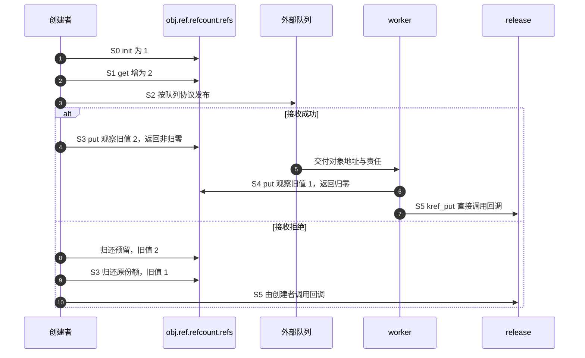

# 第2章\_普通引用与归零回调导读

## 2.1\_从责任图进入函数协作

先读[P01 的 S0～S5](../../../../knowledge/linux/object_lifetime/kref/P01_kref_要解决什么问题.md#1.5_为什么引用计数可以解决生命周期问题)。同一对象既有分散的持有责任，又有集中在内存中的计数；kref 不维护队列位置或业务状态。这里用已正确取得的引用限定参与集合，暂不讨论从失效入口取得新引用。

## 2.2\_把S0到S5落到状态地址

| 阶段 | 执行者和状态落点 | 协作及证据 |
| --- | --- | --- |
| S0 创建 | 创建者写 obj.ref.refcount.refs | [init/set](../source_explanations/include/linux/kref.h.md#1.2_建立初始引用) 建立一份，外层成员尚待完整初始化与发布 |
| S1 预留 | 已有持有者在同一 refs 地址增加 | [get/inc](../source_explanations/include/linux/kref.h.md#1.3_为独立使用追加引用) 预留接收者责任 |
| S2 交付 | 队列或容器保存对象/成员地址 | 由外层同步发布；kref 不写队列、不会自动唤醒 worker |
| S3 创建者退出 | 创建者对同一 refs 原子归还 | [put](../source_explanations/include/linux/kref.h.md#1.4_最后归还调用清理) 将责任减少；接收拒绝时创建者也需归还预留份额 |
| S4 处理者退出 | worker 完成业务后归还它的一份 | [减并检测](../source_explanations/include/linux/refcount.h.md#1.3_旧值决定归零与异常分支) 的旧值决定本次是否归零，S3/S4 可交换 |
| S5 最后清理 | 正常归零的执行者直接调用 release | 传入同一个 ref 地址，不需要另一个全局线程等所有通知；回调处理对象资源；不存储此前 put 的回调 |

这不是每 CPU 汇聚算法：所有普通引用增减访问对象内同一 refs 存储。原子操作提供修改次序，归零操作观察自己的旧值，从而决定谁继续清理；多 CPU 高频操作同一计数的共享成本不会因“无外部锁”自动消失。

## 2.3\_观察一轮端到端转换

最后归还者在自己的调用栈上消费结果，不是靠 kref_read 轮询归零，也没有由 kref 单独发送 IPI 或唤醒。释放若需要延后、或者模块需要等待回调退出，那是外层协议的另一阶段。

## 2.4\_正常退出与异常收敛

正常路径原子减的旧值为 1 时，单份归还得到最后清理资格。错误的零/负值或过量减少进入[饱和告警](../source_explanations/lib/refcount.c.md#1.1_告警之前先收敛到饱和)，不调用正常 release；异常处理不会补齐丢失的责任账本。

[读取快照](../source_explanations/include/linux/kref.h.md#1.5_读取快照不新增责任)只用于已有保活窗口里的观察，不是判断下次 get 安全的同步。普通 get 还需要正引用保证：仅延迟内存回收不够；容器锁必须结合容器持有与撤下协议。正文[快照对照](../../../../knowledge/linux/object_lifetime/kref/P02_源码入口与结构定义.md#2.17.1_运行快照与持有的对照程序)用对象外回收记录观察这一区别。[回调选择](../../../../knowledge/linux/object_lifetime/kref/P02_源码入口与结构定义.md#2.24_kref_不保存_release_函数)显示一致清理协议必须由类型层保证。具体 helper 的旧值、oldp 及返回分支见[原语实现](../source_explanations/include/linux/refcount.h.md#1.2_普通增加与异常检测)。

[RCU 与复合对象](../../../../knowledge/linux/synchronization_and_asynchrony/synchronization/rcu/P21_RCU_kref与复合对象生命周期.md#21.1_先按分配与所有权拓扑选模板)在应用层把发布引用、宽限期和最后 put 排成不同拓扑；这些组合不改变本页普通归零函数的实现，也不意味着 kref 自动等待 RCU。

## 2.5\_编译语义与检查器边界

[__signed_wrap](../source_explanations/include/linux/compiler_types.h.md#1.1_检查器属性与构建选项分工)按配置屏蔽一种溢出插桩；[Makefile 选项](../source_explanations/Makefile.md#1.1_优化选项与函数属性分开核对)决定另一层编译约束；[__must_check](../source_explanations/include/linux/compiler_attributes.h.md#1.1_返回值诊断不是自动清理)提示返回值不可随意丢弃。三者都不负责修复错误的对象身份或归还责任。

本轮固定函数体配合显式顺序原子/屏障替身只检查控制分支，不验证真实并发、硬件内存序或内核告警。完整目标工作模块仍未装卸。返回[总索引](P01_Linux_6.12_kref源码阅读索引.md#1.2_按问题进入已落地证据)。

## 2.6\_初始化形式与存储寿命

S0 不一定通过运行时 init 进入。定义静态对象时，[KREF_INIT](../source_explanations/include/linux/kref.h.md#1.6_定义对象时建立计数) 直接给同一个计数存储提供初值；沿 [REFCOUNT_INIT](../source_explanations/include/linux/refcount.h.md#1.4_逐层构造初始值) 进入 [atomic_t](../source_explanations/include/linux/types.h.md#1.1_整数外还有一层结构)，最终仍是 refs.counter。宏不向其他参与者发送消息，不建立查找入口，也不保存 release。

[P02 静态模块](../../../../knowledge/linux/object_lifetime/kref/P02_源码入口与结构定义.md#2.14.2_运行一个不释放静态内存的完整模块)把普通周期缩成同步过程：模块初始一份对应 S0；初始化函数临时 get/put 对应 S1 以及这份临时责任退出；不做 S2 外部交付；卸载函数归还模块份额后进入 S5。最后执行者直接调用回调，回调记录一次结束，不 kfree 静态对象。

这里有两组相互约束但不同的状态：计数是否仍有合法责任，与模块存储是否仍存在。计数到零不直接回收静态数据区；模块卸载也不能在外部引用仍可能运行时靠正计数自行推迟。若引入外部调用者，必须另行设计关闭入口、等待退出和模块代码保活。本例无外部参与者，不能把它推广成任意驱动的卸载模板。

## 2.7\_新对象在发布之前失败

正文[对象模块](../../../../knowledge/linux/object_lifetime/kref/P02_源码入口与结构定义.md#2.19_标准自定义引用对象模板)把 S0 细分为外壳分配、计数初始化、业务资源准备和成功返回。失败发生在 init 之前时，没有引用可 put；失败发生在建立初始份额之后时，创建者归还该份额，直接进入 S5。本例 release 能清理部分初始化状态，所以不需要另外一条绕过引用协议的清理路径。

正常分支仍沿 S1 追加使用者、分别归还、S5 最后清理推进；没有外部 S2 队列发布。ref 地址保持在外壳内，data 是另外一块拥有的存储。回调先读取并清理 data，再清理外壳；代码类型封装选择回调，kref 本身不记录资源清单。具体普通函数没有改变，应用例子不能反推 kref 能替所有对象处理任意半初始化字段。

## 2.8\_容器入口与引用状态协作

正文[单槽模块](../../../../knowledge/linux/object_lifetime/kref/P02_源码入口与结构定义.md#2.30.1_设计_A_容器持有引用)把普通引用路径接入三个状态地址：全局 registry_entry 保存可见对象地址，registry_lock 串行化槽操作，obj.ref 保存责任计数。S0 创建、S1 预留槽份额、S2 锁内交付、S3 创建者退出、S4 锁内取得及槽撤下/读者退出、S5 最后回调，对应既有普通函数，不改变其固定实现。

非空槽自己的份额让锁内普通 get 有正引用保证；锁同时保证查找不能跨过撤下后去读取旧槽。撤下之后归还容器份额，已取得的读者由自己的责任保活。不持份额的索引必须另行接合归零与撤下/查找，不能只保留“有把锁”这个表面结构。

[P03 清理诊断](../../../../knowledge/linux/object_lifetime/kref/P03_kref_生命周期状态机.md#3.7.1_release_阶段_对象销毁点)将引用归零、资源归还与类型约定检查分开；节点自环和毒化是 list 的状态，普通 kref 不读取这些字段。最终回调沿最后 put 的上下文执行，不能在 worker 最后归还时再同步等待同一个 work；RCU 的存储延迟与引用退出先后也由对象拓扑决定。它们属于外层生命周期协议，具体边界见[清理上下文](../../../../knowledge/linux/object_lifetime/kref/P02_源码入口与结构定义.md#2.31_kref_和_release_的关系)。[P03 业务模型](../../../../knowledge/linux/object_lifetime/kref/P03_kref_生命周期状态机.md#3.3.1_用C模型观察仍持有却被拒绝)另行建立可见性、许可和存储三轴的观察账本，它不是固定内核字段；普通 kref 函数仍只改变本节所述计数状态。[类型封装契约](../../../../knowledge/linux/object_lifetime/kref/P05_基础_API_源码逐行讲解.md#5.10_API_封装模板)把输入非空、创建失败、允许 NULL 的空槽归还和查找取得分别组织；增加诊断不改变原函数地址前提。[P03 工作票据](../../../../knowledge/linux/object_lifetime/kref/P03_kref_生命周期状态机.md#%287%29_所有权表要补充失败路径和取消路径)再把一次成功接收、拒绝和取消与责任归还者配对，不是 kref 或 workqueue 自动保存的持有者表。本模块无外部线程，宿主顺序替身不证明真实锁竞争或跨 CPU 可见性。

[P08 完整登记模块](../../../../knowledge/linux/object_lifetime/kref/P08_lookup_场景与_kref_get_unless_zero%28%29.md#8.3.1_正确模型一_mutex/list_lookup_+_kref_get%28%29)进一步按 S0～S5 追踪槽份额、查找者新增份额和撤销者暂存的待归还责任。查找锁必须覆盖 get；重复撤下只有实际取得旧槽值的那次才归还，不能由节点为空推导无条件 put。上面的普通实现不因此增加“容器拥有者”字段。

## 2.9\_停止业务的外层状态

[P03 完整模块](../../../../knowledge/linux/object_lifetime/kref/P03_kref_生命周期状态机.md#3.16_一个完整的生命周期模板)在普通 init/get/put 链外增加 service_entry、entry_lock、对象内 accepting 和 access_lock。S2 发布成功转交初始份额；S4 关闭者清槽后接管入口责任，完成业务状态切换并退出对象锁才 put。普通引用函数既不读取 accepting，也不替调用者等待业务操作。

阅读源码时先沿本页 2.2 的引用地址定位，再回到调用者的两个锁窗口：查找与清槽排定“是否取得份额”，操作与停止排定“是否获准执行”。两窗口之间依引用保活，并非同一原子动作。该示例的单一关闭者及无异步操作限制属于调用者协议；若添加排队工作或多个关闭者，应另建退出通知和等待状态，不改变已有 kref 函数体讲解。

[P09 锁职责实例](../../../../knowledge/linux/object_lifetime/kref/P09_kref_与锁的组合.md#9.2.1_kref_和锁分别保护什么)按同一服务模块追踪 entry_lock、access_lock 与 ref 的分工：关闭者接管原入口份额后才能解除入口锁，再取对象锁关闭业务门。两个临界区之间旧读者仍可操作，保证点在 shutdown 返回；普通引用实现不承担原子关闭或业务通知。

[P09 成员移除](../../../../knowledge/linux/object_lifetime/kref/P09_kref_与锁的组合.md#9.3.2_remove_时_先_unlink_再_put_但必须匹配集合引用)进一步说明本次是否摘下由容器协议决定，普通 put 的返回不能判断成员责任是否存在；诊断宏也不会自动跳过后面的归还。引用原语与应用控制流保持分层。

[P09 双状态应用](../../../../knowledge/linux/object_lifetime/kref/P09_kref_与锁的组合.md#9.3.7_对象状态_集合锁与对象锁组合)分别把成员阶段交给集合锁、同步业务状态交给对象锁，保留额外嵌套写段并说明它的锁顺序。额外拿锁不等于已经停止业务，普通 kref 也不校验编号或阻止反向锁等待；这些是应用协议的独立职责。

[P09 关闭票据与上下文](../../../../knowledge/linux/object_lifetime/kref/P09_kref_与锁的组合.md#9.5.5_对象锁内只做决定_实际_put_尽量放到锁外)区分额外预留的关闭份额和各调用者独立份额。状态标志不创造引用，IRQ dev_id也不自动交付一份；普通归零链只执行调用者实际负责的归还，其回调继承原调用路径。

[P09 完整链表服务](../../../../knowledge/linux/object_lifetime/kref/P09_kref_与锁的组合.md#9.6.1_一个完整的锁_+_kref_对象模板)把成员份额、对象业务门和嵌套锁接到一次完整周期：成功发布才追加表份额，真正摘下才归还，旧读者仍保活但请求被拒绝。它复用普通引用链，集合锁→对象锁为应用协议；不是 kref 自带的锁或状态。

## 2.10\_三条规则与两类查找协议

固定 Documentation/core-api/kref.rst 的 Kref rules 先给三条规则，再给直接转交省去 get/put 的场景，随后展示查找与归零的同步。阅读时不要把第一条误当成每次指针赋值都增加计数，也不要把第二条用于只借用的函数；调用者责任比较见[P04](../../../../knowledge/linux/object_lifetime/kref/P04_kref_三条核心规则.md#4.12_mutex/list_lookup_的最小模型)。

该文档的普通 list 示例中，get_entry 查找/增加与 put_entry 减少使用同一把 mutex，归零回调在该锁内摘除。它与本教材容器拥有一份、撤下后归还的单槽模型采用不同寿命依据；后一模型不要求其他独立持有者的每次 put 都取容器锁。

同文后续改用条件取得，允许普通 put 在锁外执行，清理回调再取 mutex 摘除；因此查找锁内可能遇到地址尚有效而计数已零的对象，必须处理取得失败。RCU 示例则把计数成员的存储保留到相应宽限期。此处定位各协议差异，条件链转入[独立模块](P03_条件取得与查找窗口导读.md#3.2_从观察到自己持有)，不在此复制函数体；普通 get/put 仍精确回到[追加引用](../source_explanations/include/linux/kref.h.md#1.3_为独立使用追加引用)和[归零回调](../source_explanations/include/linux/kref.h.md#1.4_最后归还调用清理)的唯一讲解。

最后归零与查找串行化还可通过[锁交接模块](P04_最后归还与锁交接导读.md#4.2_把最后减少留在锁内)核对：普通非最后减少绕开容器锁，可能最后时保留责任、取锁再减少，回调负责最终撤下及锁归还。

## 2.11\_借用退出与最后归还

[P06 完整模块](../../../../knowledge/linux/object_lifetime/kref/P06_release_回调与复杂销毁模式.md#6.2.2_运行一个由管理者等待借用退出的模块)使用普通 kref 链保存管理者和调用者的责任，worker 借用不追加引用。该对象的停止字段与 gate 锁位于计数之外：关闭者先在 gate 下拒绝新投递，随后锁外调用 cancel_work_sync，等待结束后才归还管理者的一份。最后调用者 put 才可能走进[普通回调](../source_explanations/include/linux/kref.h.md#1.4_最后归还调用清理)。

固定 kernel/workqueue.c 的同步取消注释要求不存在竞争投递；实现通过 workqueue 自身状态和等待路径确认退出，不靠 kref 计数或本例 completed 字段确认。源码从[工作队列总索引](../../workqueue/navigation/P01_Linux_6.12_工作队列源码总阅读索引.md#1.6_建议阅读顺序)进入[取消模块](../../workqueue/navigation/P04_Linux_6.12_flush取消与生命周期模块源码概念导读.md#4.4_cancel调用链)，再到[唯一实现](../../workqueue/source_explanations/P03_Linux_6.12_worker_flush与取消源码实现.md#3.5_cancel_work_sync撤销与等待)。这里组合两项接口契约，不复制工作队列函数体。

正文[回调上下文](../../../../knowledge/linux/object_lifetime/kref/P06_release_回调与复杂销毁模式.md#6.6.2_普通_kref_put_下的_release_上下文)从使用者任务比较同步调用、函数尚未返回和另行交付清理责任；这里的普通 put 函数仍直接调用回调，不创建清理线程。RCU 延迟存储不能替代可睡眠执行环境。原有单槽、最终减少锁交接和借用模块分别保留，不把它们合并成相同索引协议。

当活动来源改为 timer，不能按每次 mod_timer 调用生成一份工作票据；[定时器模块](P05_定时器重启与退出导读.md#5.2_从排队到最终关闭)解释同一 pending 节点的改期、running 登记和 shutdown。普通引用实现不变，引用份额仍必须来自外层协议。

正文[归零与存储退休](../../../../knowledge/linux/object_lifetime/kref/P06_release_回调与复杂销毁模式.md#6.8.1_release_和_RCU_的边界)比较发布份额立即归还、跨 GP 归还及根/块复合拓扑。普通 kref 的回调触发链没有因此改变；RCU 状态按其独立协议推进。诊断只观察类型约定，不能从 list_empty、timer_pending 或业务布尔值替代退出同步。

[P24退出工程模板](../../../../knowledge/linux/object_lifetime/kref/P24_删除入口与活动排空工程模板.md#24.1_关闭业务不等于回收所有对象)沿G0～G4核对关门、等待、队列销毁与管理者归还；完整owned_work程序保持不变。它还区分真正摘下的集合份额、一次性的管理者份额、旧用户保留的name与已退出queue，指出脱锁资源使用需要额外在途登记。九组既有宿主夹具与程序一致性复核，不把顺序替身当成真实阻塞或硬件排空验证。

## 2.12\_指定份额的交付与调用者责任

固定 kref.rst 的直接转交例子表明，既有的一份可以交给接收者，不必为交付机械增加后又减少；普通 kref 函数本身不保存当前责任人的地址。[P07 责任槽](../../../../knowledge/linux/object_lifetime/kref/P07_handoff_所有权转移模型.md#7.2.1_指针传递不等于引用转移)用 producer、candidate、pending、worker 的 ptr 变化展示追加、借用和转交。它是应用协议模型，不是固定内核的新数据结构。

协议必须在接收者有机会使用并归还以前建立；提交函数返回不是统一的发布边界。发送者若仍保留另一份或有明确借用窗口，可以继续按业务同步规则使用；否则不能凭旧指针操作。拒绝是否消费由具体接口规定，名字不能代替函数真实契约。这里复用普通 get/put 的唯一实现，无新上游函数体。

## 2.13\_完成事件不消费引用

[P07 完整模块](../../../../knowledge/linux/object_lifetime/kref/P07_handoff_所有权转移模型.md#7.3.5_completion_场景里的引用归属)将等待者初始份额和唯一 worker 预留分开：complete 写的是完成量状态，不操作 kref；超时也不取消 worker。等待者保留责任到 cancel_work_sync 返回，若撤销唯一 pending 实例则接管其份额，否则由执行者归还；最后等待者才 put。

从[等待总索引](../../waiting_notification/navigation/P01_Linux_6.12_等待与完成量源码总阅读索引.md#1.5_建议阅读顺序)进入[completion 模块](../../waiting_notification/navigation/P03_Linux_6.12_completion模块源码概念导读.md#3.2_状态所有权)，再查[等待消费](../../waiting_notification/source_explanations/P02_Linux_6.12_completion_c令牌与等待源码实现.md#2.4_do_wait_for_common等待与消费)。工作退出另经[工作队列总索引](../../workqueue/navigation/P01_Linux_6.12_工作队列源码总阅读索引.md#1.6_建议阅读顺序)到[同步取消](../../workqueue/source_explanations/P03_Linux_6.12_worker_flush与取消源码实现.md#3.5_cancel_work_sync撤销与等待)。这些状态彼此独立，普通 kref 函数仍只完成计数和回调，不复制异步子系统的实现。

[P22工程模板](../../../../knowledge/linux/object_lifetime/kref/P22_完成事件与等待者工程模板.md#22.1_等待之前先取得合法对象)继续检查wait入口资格、单次结果和广播复用：有独立份额才可按责任归还，有明确管理者期限也可以借用；complete_all改变完成量状态，不创建新拥有者。新增等待者或重复完成需要业务发布与代次协议，不修改普通引用函数的职责。完整note_kref_completion及七组既有夹具逐项复核保持不变，本批未重跑目标或ARM验证。

## 2.14\_队列责任沿同一份移动

[P07 双协议请求模块](../../../../knowledge/linux/object_lifetime/kref/P07_handoff_所有权转移模型.md#7.6.1_一个完整请求对象_handoff_示例)把队列锁内的 phase/slot 变化与 request.ref 分开。接管式成功只改变责任方，出队再把同一份交给消费者；没有对应的内核 move_ref 函数，普通 kref 存储不写拥有者。追加式包装先调用 get，再把新候选交给相同的 take 底层，拒绝才退回候选。

私有 work 接收后，执行者归还经队列转来的份额。直接转交轮可能在 worker 尾部最终回收；共享轮保留创建者的一份到 flush 后读取结果，最后回调来自创建者。已有[普通归零实现](../source_explanations/include/linux/kref.h.md#1.4_最后归还调用清理)始终一样，差别来自调用协议，不需要两套原语实现。该示例无其他业务队列消费者、每请求只执行一次，不能直接推到多队列争用同一阶段字段。

## 2.15\_计数原语与调用者清理的边界

[P11 计数层次回访](../../../../knowledge/linux/object_lifetime/kref/P11_kref_refcount_t_kobject_的边界.md#11.2.3_kref_对象生命周期引用计数封装)沿既有完整对象的 S0～S5 区分应用资源初始化、refcount 数值操作和 kref 最后回调接续。固定 Documentation/core-api/refcount-vs-atomic.rst 提醒：部分 atomic 与 refcount 接口的内存序不同，迁移不能只改函数名；发布可见性仍须从地址取得协议证明。本文普通链与唯一实现未变，不因高层框架也有引用就授权直接操作其内部 kref。

## 2.16\_异常报告与检查覆盖

[P12诊断入口](../../../../knowledge/linux/object_lifetime/kref/P12_典型错误模式与调试线索.md#12.2.1_调试工具先导)先以离线C账本区分真实引用状态和已采集的责任记录。固定refcount异常进入[告警前饱和](../source_explanations/lib/refcount.c.md#1.1_告警之前先收敛到饱和)：函数能根据特定数值与操作条件诊断，但不知道一份本来属于创建者还是工作者。转交后错误归还可能只造成正常数值归零，不能据此期待一定出现underflow报告。

| 固定源码树文档 | 当前阅读任务 | 不能外推的保证 |
| --- | --- | --- |
| Documentation/dev-tools/kasan.rst | 检查模式、覆盖内存类型及报告栈条件 | 未报告不证明所有地址访问都被覆盖；ARM不具有ARM64标签模式的同等前提 |
| Documentation/dev-tools/kcsan.rst | 观察点采样、插桩与注解边界 | 未报告不证明无数据竞争 |
| Documentation/dev-tools/kmemleak.rst | 分配跟踪与可达性扫描、误报漏报 | 候选列表不是引用账本，逻辑泄漏可能仍可达 |
| Documentation/locking/lockdep-design.rst | 当前持锁与历史锁类依赖 | 正确接入与路径覆盖是证明输入，不保证任意业务退出活性 |

四份文档身份见[基线记录](../../linux/SOURCE_BASELINE.md#1.72_责任日志与动态诊断的证据边界)。Lockdep继续从其[源码总索引](../../lockdep/navigation/P01_Linux_6.12_Lockdep源码导读.md#1.5_状态地址与所有权)进入[运行生命状态与容量](../../lockdep/navigation/P04_Linux_6.12_Lockdep查询适配与诊断模块导读.md#4.1_模块问题)，不在kref目录复制其宏体和检查引擎。

离线模型只使用显式有序的单对象事件，complete和closed是外部输入前提；六条轨迹及两个练习变体通过C11严格编译运行，不是内核诊断器测试。工作树配置快照启用PROVE_LOCKING/LOCKDEP、未启用KASAN/DEBUG_KMEMLEAK且未见KCSAN启用，不能据此推断实际运行镜像或检查器当前健康状态。

## 2.17\_工作与文件份额的诊断落点

[P12少取得与漏归还](../../../../knowledge/linux/object_lifetime/kref/P12_典型错误模式与调试线索.md#12.3.1_错误一_少_get_异步路径_UAF)使用同一普通引用链，但先确定共享、转交或管理者借用契约。固定include/linux/workqueue.h中schedule_work经queue_work进入queue_work_on；kernel/workqueue.c的pending判定还结合禁用检查，process_one_work在回调前清除pending。因此pending与running不是同一状态，未建立新执行时只能回滚本次候选份额。

具体工作队列实现仍在其[总索引](../../workqueue/navigation/P01_Linux_6.12_工作队列源码总阅读索引.md#1.3_三条模块分支)下单一展开：[投递](../../workqueue/source_explanations/P02_Linux_6.12_工作队列投递与激活源码实现.md#2.4_queue_work选择pool并保持非重入)、[执行](../../workqueue/source_explanations/P03_Linux_6.12_worker_flush与取消源码实现.md#3.3_worker_thread与process_one_work执行边界)、[取消](../../workqueue/source_explanations/P03_Linux_6.12_worker_flush与取消源码实现.md#3.5_cancel_work_sync撤销与等待)。kref只负责给定份额的取得/归还，不自动登记工作持有者。

文件片段只承担应用private_data的一份。固定fs/file.c的描述符复制路径维持对同一struct file的引用，fs/file_table.c的fput归零后可以通过task_work/延迟路径进入最终清理，__fput才调用文件操作release；不应按每次close给私有对象多put。这里仅说明交叉生命周期边界，不展开VFS完整实现；四文件身份见[基线](../../linux/SOURCE_BASELINE.md#1.73_工作执行与文件最终清理的责任边界)。

三组宿主夹具直接编译正文正确/错误release片段，使用固定普通refcount/kref函数，检查两份文件实例责任分别归还、空private_data及丢地址仍剩份额。file/inode为替身，回调只计次数，未运行VFS/dup/close、真实调度和内核模块。完整既有工作模块与C诊断账本均未修改，不重报为新运行结果。

## 2.18\_正确减法也可能消费错误份额

[P12候选引用片段](../../../../knowledge/linux/object_lifetime/kref/P12_典型错误模式与调试线索.md#12.3.3_错误三_多_put_提前_release_或_underflow)让调用者保留原份额，函数临时get候选，成功通过out交付，任一步失败只退回候选。错误的两个清理标签却使第二步失败连put两次：计数2→1→0，使用的仍是固定[普通归还](../source_explanations/include/linux/kref.h.md#1.4_最后归还调用清理)，没有数值下溢，却把调用者原份额一起消费。

四组宿主检查直接抽取正文两函数，以固定普通refcount/kref实现执行两失败、成功和错误失败路径。对象为静态存储，release只记录次数，不执行真实free；检查到错误例无refcount告警而回调提前发生。step检查是可控返回值替身，其不取得额外资源是明确输入契约。

归还后的访问边界跟随具体份额：调用者自己还有另一份或明确借用期限时可以继续使用；仅知道远端曾有引用不够。复制标量与保存内部字符串指针也不同，后者仍需证明所指存储有效。原语不会记录这些应用责任，不能以没有underflow替代协议审查。

## 2.19\_始终消费包装的成功与拒绝

[P12交付返回契约](../../../../knowledge/linux/object_lifetime/kref/P12_典型错误模式与调试线索.md#12.4.2_错误六_handoff_成功和失败路径归属不清)在既有enqueue_take底层增加enqueue_take_always：成功交给队列，失败request_put消费输入份额。与共享式预留候选不同，调用者失败也不能再消费原份额。

两组新增宿主检查直接编译正文包装，配合实际note_kref_queue主体与固定普通引用函数，覆盖成功入槽、满槽拒绝并验证已占槽对象不受影响；同时重跑既有十组底层控制路径。锁、分配和工作调度仍为替身，未运行目标并发。包装没有新内核原语，归还仍进入[普通kref_put](../source_explanations/include/linux/kref.h.md#1.4_最后归还调用清理)，不增加唯一实现副本。

## 2.20\_从诊断轨迹回到真实责任

[P12章末审查](../../../../knowledge/linux/object_lifetime/kref/P12_典型错误模式与调试线索.md#12.10.2_最小审查流程)以顺序C11账本比较转交后正常访问与先归还再访问：最终份额同为零不能推出每次访问合法。四个新增练习检查覆盖两条次序、日志不完整和区间未结束；复用原检查器，既有六例也通过，没有真实引用对象释放或多CPU日志测试。

源码入口仍是[建立初始份额](../source_explanations/include/linux/kref.h.md#1.2_建立初始引用)、[普通追加](../source_explanations/include/linux/kref.h.md#1.3_为独立使用追加引用)和[最终归还](../source_explanations/include/linux/kref.h.md#1.4_最后归还调用清理)。转交本身不必调用这些函数，日志意图也不代表函数已完成。诊断还须结合条件取得、索引退出和框架桥接模块；不从数值或工具无告警单独证明协议。

## 2.21\_创建阶段与单一清理入口

[P13分层创建](../../../../knowledge/linux/object_lifetime/kref/P16_对象创建与失败清理模板.md#16.2.2_模板二_alloc/init/get/put/release_分层模板)通过note_kref_create完整模块把创建阶段接回固定普通引用链：外壳分配成功才[建立初始一份](../source_explanations/include/linux/kref.h.md#1.2_建立初始引用)，准备失败由创建者[归还并调用清理](../source_explanations/include/linux/kref.h.md#1.4_最后归还调用清理)，成功返回以后才允许其他责任槽位[另取一份](../source_explanations/include/linux/kref.h.md#1.3_为独立使用追加引用)。object_prepare是独占创建阶段，不重置ref，也不发布半初始化对象。

应用release用NULL缓冲区表达未建资源；错误指针只传出错误码，外部无份额可put。宿主八例覆盖完整周期、三阶段模拟失败、两次分配失败替身及两种非法参数，使用既有固定普通函数，分配/模块/错误指针为替身；ARM前端通过，354份头中342份非生成源码与固定提交无差异。没有目标链接装卸、并发或实际内存耗尽验证，源码实现标题保持唯一。

## 2.22\_工作交付的份额与关闭窗口

[P20完整对照](../../../../knowledge/linux/object_lifetime/kref/P20_工作交付与关闭工程模板.md#20.1_先选择分享还是转交)用同一request和worker比较分享、转交：分享在发布前[另取候选](../source_explanations/include/linux/kref.h.md#1.3_为独立使用追加引用)，转交只改变原份额归属；两者都由worker最终[归还一份](../source_explanations/include/linux/kref.h.md#1.4_最后归还调用清理)。即使worker先于queue_work返回完成，分享者仍有原份额，转交者则不再访问对象。

关门状态与实际投递还需同锁排序；对象计数不保存队列、硬件和模块代码寿命。正文G0～G4复用既有管理者借用模块，先关门、锁外取消并销毁队列，再结束管理者份额。动态PENDING与应用票据分开，重复投递和取消仍须逐实例定义责任。

新完整note_kref_work_modes的两模式各五种顺序安排共十例通过，固定普通引用链保留，分配及工作调度为替身；ARM前端354头中342非生成源码无固定提交差异。未目标链接装卸、真实工作线程并发、模块竞争退出或硬件验证。借用完整模块未改，不重复其已有运行声明。

## 2.23\_分阶段失败的清理责任

[P23失败模板](../../../../knowledge/linux/object_lifetime/kref/P23_分阶段失败与资源回滚模板.md#23.1_先列出失败时已经成立的责任)以F0～F5对照外壳、子资源与拥有型发布槽。普通[初始化](../source_explanations/include/linux/kref.h.md#1.2_建立初始引用)只建立初始责任，[最后归还](../source_explanations/include/linux/kref.h.md#1.4_最后归还调用清理)只按当次回调清理，不检查buffer、channel或发布表。因此错误路径显式清理子资源后，必须明确最终回调看到的状态；NULL可以表达未建立或已经结束，不能把同一非空资源重复消费。

独立C11顺序模型比较两种清理安排、正常和五个失败阶段共十二条路径，宿主严格编译执行通过；它没有采用Linux计数原语，也不验证并发/硬件。P16实际创建模块及既有固定引用实现保持不变，发布后存在真实读者的退出需要额外排空证据，不能用模型refs断言代替。

## 2.24\_父子桥接与非拥有节点

[P27完整父子模块](../../../../knowledge/linux/object_lifetime/kref/P27_父子桥接与非拥有链表模板.md#27.1_一条关系对应几份引用)按P0～P5建立管理者初始份额、每个child的一份父桥接及独立child用户。P2关系发布时[增加父份额](../source_explanations/include/linux/kref.h.md#1.3_为独立使用追加引用)，P5最后child[归还触发清理](../source_explanations/include/linux/kref.h.md#1.4_最后归还调用清理)，先在父锁下摘非拥有节点，再free child并put父桥接。子对象多个用户不等于多份父桥接，父链表本身也不持child引用。

普通最后put同步执行child_release，本例会取得mutex，因此调用者不可持父锁再做可能归零的child_put，也不适用于硬中断。父关闭门只覆盖本例短业务和新关系，不冒充全部child销毁或硬件排空。非拥有索引若将来增加lookup，须另外处理零计数对象等待同锁摘链的窗口，不能从有节点推出正计数。

八组宿主协议和ARM前端通过，354头/342非生成源码对官方dfaf2136无差异；固定普通引用与既有链表删除辅助保留，锁、分配和插入为顺序替身。目标装卸、真实并发分配、阻塞和硬件内存序未验证。

## 2.25\_文件实例的候选与交付

[P28文件模块](../../../../knowledge/linux/object_lifetime/kref/P28_文件实例与私有对象持有模板.md#28.1_计数单位是文件实例)以F0～F6分别登记管理者初始份额、open局部候选和成功文件拥有的一份。F1在入口锁下依据仍被管理者持有的地址[普通取得](../source_explanations/include/linux/kref.h.md#1.3_为独立使用追加引用)，F2失败自行归还，成功转交private_data。F5最终release[归还对象](../source_explanations/include/linux/kref.h.md#1.4_最后归还调用清理)，dup不重复这一交付。

VFS细节沿[文件操作模块](../../character_device/navigation/P03_文件操作与打开寿命导读.md#3.1_打开对象由谁持有)与[打开交付实现](../../character_device/source_explanations/fs/open.c.md#1.3_打开回调失败与交付边界)核对。驱动回调返回错误时尚未建立FMODE_OPENED；回调已成功而VFS后续失败则仍须最终清理，不能按用户是否得到fd判断责任。fops.owner保代码，kref保服务存储，gate保护完整短业务；任何一个都不能替代其余两者。

八组宿主协议通过，VFS/系统调用/锁/注册为顺序替身；ARM前端450头中437非生成源码与官方固定提交无差异。未执行真实模块链接装卸、Linux用户探测、并发或硬件，本例正常模块退出也不代表设备热拔插。

## 2.26\_封装不改变原语前提

[P29引用包装模块](../../../../knowledge/linux/object_lifetime/kref/P29_引用封装与调试责任模板.md#29.1_接口先交代谁拥有哪一份)按W0～W5记录初始份额、追加、转交、清槽归还和最终清理。[普通get](../source_explanations/include/linux/kref.h.md#1.3_为独立使用追加引用)仍依赖有效地址与正计数依据，[put](../source_explanations/include/linux/kref.h.md#1.4_最后归还调用清理)仍可能同步回调；函数名、日志和非空判断都不能补齐这些前提。

包装层固定释放回调并传入宏展开位置，参数只求值一次。put_slot先清空独占局部槽再归还，不同步共享槽；操作请求在引用原语之前记录，最终清理日志在free以前，put返回后只读取外部统计。该应用封装没有新增上游实现函数体，已有唯一get/put讲解保持不变。

六组宿主C协议通过，两种日志设置均为get=1、put=2、release=1、实参求值=1；另含分配失败、空槽和独立拥有槽。ARM前端354头中342非生成源码对官方固定提交无差异。未目标链接装卸、并发共享槽、动态跟踪器或硬件验证，顺序统计不能直接搬为并发计数。

## 2.27\_业务状态与引用原语的分工

[P30状态模型](../../../../knowledge/linux/object_lifetime/kref/P30_状态观察与活动接纳模板.md#30.1_LIVE不是一张永久通行证)按S0～S6区分NEW初始化、发布、活动登记、关闭、局部完成汇聚、资源退出和最终存储回收。Linux[普通get](../source_explanations/include/linux/kref.h.md#1.3_为独立使用追加引用)只追加存储责任，[最后put](../source_explanations/include/linux/kref.h.md#1.4_最后归还调用清理)只调用应用清理；它们不维护业务门、活动数、索引成员和通知。

原try_enter和lookup_get_live最多保证当时的状态快照与取得窗口，不能预订解锁后的业务。短操作同锁完成，长操作同锁检查并登记active，再由最后活动或零活动关门者发布排空。完成事件与回调栈退出分开，具体接口沿[等待模块](../../waiting_notification/navigation/P03_Linux_6.12_completion模块源码概念导读.md#3.2_状态所有权)和既有工作关闭证据阅读，不新增重复实现体。

十条独立C11顺序轨迹宿主严格编译执行通过；refs与notifications是教学状态，不是Linux kref或唤醒原语。未新执行ARM、内核锁/事件、真实线程或硬件验证，既有P24/P28实际模块源码保持不变。
