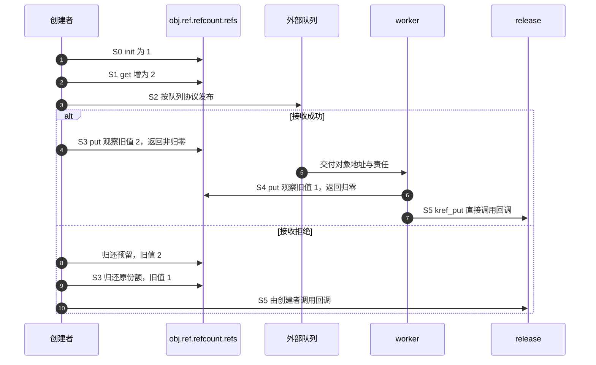

# 第2章\_普通引用与归零回调导读

## 2.1\_从责任图进入函数协作

先读[P01 的 S0～S5](../../../../knowledge/linux/object_lifetime/kref/P01_kref_要解决什么问题.md#1.5_为什么引用计数可以解决生命周期问题)。同一对象既有分散的持有责任，又有集中在内存中的计数；kref 不维护队列位置或业务状态。这里用已正确取得的引用限定参与集合，暂不讨论从失效入口取得新引用。

## 2.2\_把S0到S5落到状态地址

| 阶段 | 执行者和状态落点 | 协作及证据 |
| --- | --- | --- |
| S0 创建 | 创建者写 obj.ref.refcount.refs | [init/set](../source_explanations/include/linux/kref.h.md#1.2_建立初始引用) 建立一份，外层成员尚待完整初始化与发布 |
| S1 预留 | 已有持有者在同一 refs 地址增加 | [get/inc](../source_explanations/include/linux/kref.h.md#1.3_为独立使用追加引用) 预留接收者责任 |
| S2 交付 | 队列或容器保存对象/成员地址 | 由外层同步发布；kref 不写队列、不会自动唤醒 worker |
| S3 创建者退出 | 创建者对同一 refs 原子归还 | [put](../source_explanations/include/linux/kref.h.md#1.4_最后归还调用清理) 将责任减少；接收拒绝时创建者也需归还预留份额 |
| S4 处理者退出 | worker 完成业务后归还它的一份 | [减并检测](../source_explanations/include/linux/refcount.h.md#1.3_旧值决定归零与异常分支) 的旧值决定本次是否归零，S3/S4 可交换 |
| S5 最后清理 | 正常归零的执行者直接调用 release | 传入同一个 ref 地址，不需要另一个全局线程等所有通知；回调处理对象资源；不存储此前 put 的回调 |

这不是每 CPU 汇聚算法：所有普通引用增减访问对象内同一 refs 存储。原子操作提供修改次序，归零操作观察自己的旧值，从而决定谁继续清理；多 CPU 高频操作同一计数的共享成本不会因“无外部锁”自动消失。

## 2.3\_观察一轮端到端转换

最后归还者在自己的调用栈上消费结果，不是靠 kref_read 轮询归零，也没有由 kref 单独发送 IPI 或唤醒。释放若需要延后、或者模块需要等待回调退出，那是外层协议的另一阶段。

## 2.4\_正常退出与异常收敛

正常路径原子减的旧值为 1 时，单份归还得到最后清理资格。错误的零/负值或过量减少进入[饱和告警](../source_explanations/lib/refcount.c.md#1.1_告警之前先收敛到饱和)，不调用正常 release；异常处理不会补齐丢失的责任账本。

[读取快照](../source_explanations/include/linux/kref.h.md#1.5_读取快照不新增责任)只用于已有保活窗口里的观察，不是判断下次 get 安全的同步。普通 get 还需要正引用保证：仅延迟内存回收不够；容器锁必须结合容器持有与撤下协议。正文[快照对照](../../../../knowledge/linux/object_lifetime/kref/P02_源码入口与结构定义.md#2.17.1_运行快照与持有的对照程序)用对象外回收记录观察这一区别。[回调选择](../../../../knowledge/linux/object_lifetime/kref/P02_源码入口与结构定义.md#2.24_kref_不保存_release_函数)显示一致清理协议必须由类型层保证。具体 helper 的旧值、oldp 及返回分支见[原语实现](../source_explanations/include/linux/refcount.h.md#1.2_普通增加与异常检测)。

[RCU 与复合对象](../../../../knowledge/linux/synchronization_and_asynchrony/synchronization/rcu/P21_RCU_kref与复合对象生命周期.md#21.1_先按分配与所有权拓扑选模板)在应用层把发布引用、宽限期和最后 put 排成不同拓扑；这些组合不改变本页普通归零函数的实现，也不意味着 kref 自动等待 RCU。

## 2.5\_编译语义与检查器边界

[__signed_wrap](../source_explanations/include/linux/compiler_types.h.md#1.1_检查器属性与构建选项分工)按配置屏蔽一种溢出插桩；[Makefile 选项](../source_explanations/Makefile.md#1.1_优化选项与函数属性分开核对)决定另一层编译约束；[__must_check](../source_explanations/include/linux/compiler_attributes.h.md#1.1_返回值诊断不是自动清理)提示返回值不可随意丢弃。三者都不负责修复错误的对象身份或归还责任。

本轮固定函数体配合显式顺序原子/屏障替身只检查控制分支，不验证真实并发、硬件内存序或内核告警。完整目标工作模块仍未装卸。返回[总索引](P01_Linux_6.12_kref源码阅读索引.md#1.2_按问题进入已落地证据)。

## 2.6\_初始化形式与存储寿命

S0 不一定通过运行时 init 进入。定义静态对象时，[KREF_INIT](../source_explanations/include/linux/kref.h.md#1.6_定义对象时建立计数) 直接给同一个计数存储提供初值；沿 [REFCOUNT_INIT](../source_explanations/include/linux/refcount.h.md#1.4_逐层构造初始值) 进入 [atomic_t](../source_explanations/include/linux/types.h.md#1.1_整数外还有一层结构)，最终仍是 refs.counter。宏不向其他参与者发送消息，不建立查找入口，也不保存 release。

[P02 静态模块](../../../../knowledge/linux/object_lifetime/kref/P02_源码入口与结构定义.md#2.14.2_运行一个不释放静态内存的完整模块)把普通周期缩成同步过程：模块初始一份对应 S0；初始化函数临时 get/put 对应 S1 以及这份临时责任退出；不做 S2 外部交付；卸载函数归还模块份额后进入 S5。最后执行者直接调用回调，回调记录一次结束，不 kfree 静态对象。

这里有两组相互约束但不同的状态：计数是否仍有合法责任，与模块存储是否仍存在。计数到零不直接回收静态数据区；模块卸载也不能在外部引用仍可能运行时靠正计数自行推迟。若引入外部调用者，必须另行设计关闭入口、等待退出和模块代码保活。本例无外部参与者，不能把它推广成任意驱动的卸载模板。

## 2.7\_新对象在发布之前失败

正文[对象模块](../../../../knowledge/linux/object_lifetime/kref/P02_源码入口与结构定义.md#2.19_标准自定义引用对象模板)把 S0 细分为外壳分配、计数初始化、业务资源准备和成功返回。失败发生在 init 之前时，没有引用可 put；失败发生在建立初始份额之后时，创建者归还该份额，直接进入 S5。本例 release 能清理部分初始化状态，所以不需要另外一条绕过引用协议的清理路径。

正常分支仍沿 S1 追加使用者、分别归还、S5 最后清理推进；没有外部 S2 队列发布。ref 地址保持在外壳内，data 是另外一块拥有的存储。回调先读取并清理 data，再清理外壳；代码类型封装选择回调，kref 本身不记录资源清单。具体普通函数没有改变，应用例子不能反推 kref 能替所有对象处理任意半初始化字段。

## 2.8\_容器入口与引用状态协作

正文[单槽模块](../../../../knowledge/linux/object_lifetime/kref/P02_源码入口与结构定义.md#2.30.1_设计_A_容器持有引用)把普通引用路径接入三个状态地址：全局 registry_entry 保存可见对象地址，registry_lock 串行化槽操作，obj.ref 保存责任计数。S0 创建、S1 预留槽份额、S2 锁内交付、S3 创建者退出、S4 锁内取得及槽撤下/读者退出、S5 最后回调，对应既有普通函数，不改变其固定实现。

非空槽自己的份额让锁内普通 get 有正引用保证；锁同时保证查找不能跨过撤下后去读取旧槽。撤下之后归还容器份额，已取得的读者由自己的责任保活。不持份额的索引必须另行接合归零与撤下/查找，不能只保留“有把锁”这个表面结构。

[P03 清理诊断](../../../../knowledge/linux/object_lifetime/kref/P03_kref_生命周期状态机.md#3.7.1_release_阶段_对象销毁点)将引用归零、资源归还与类型约定检查分开；节点自环和毒化是 list 的状态，普通 kref 不读取这些字段。最终回调沿最后 put 的上下文执行，不能在 worker 最后归还时再同步等待同一个 work；RCU 的存储延迟与引用退出先后也由对象拓扑决定。它们属于外层生命周期协议，具体边界见[清理上下文](../../../../knowledge/linux/object_lifetime/kref/P02_源码入口与结构定义.md#2.31_kref_和_release_的关系)。[P03 业务模型](../../../../knowledge/linux/object_lifetime/kref/P03_kref_生命周期状态机.md#3.3.1_用C模型观察仍持有却被拒绝)另行建立可见性、许可和存储三轴的观察账本，它不是固定内核字段；普通 kref 函数仍只改变本节所述计数状态。[类型封装契约](../../../../knowledge/linux/object_lifetime/kref/P05_基础_API_源码逐行讲解.md#5.10_API_封装模板)把输入非空、创建失败、允许 NULL 的空槽归还和查找取得分别组织；增加诊断不改变原函数地址前提。[P03 工作票据](../../../../knowledge/linux/object_lifetime/kref/P03_kref_生命周期状态机.md#%287%29_所有权表要补充失败路径和取消路径)再把一次成功接收、拒绝和取消与责任归还者配对，不是 kref 或 workqueue 自动保存的持有者表。本模块无外部线程，宿主顺序替身不证明真实锁竞争或跨 CPU 可见性。

[P08 完整登记模块](../../../../knowledge/linux/object_lifetime/kref/P08_lookup_场景与_kref_get_unless_zero%28%29.md#8.3.1_正确模型一_mutex/list_lookup_+_kref_get%28%29)进一步按 S0～S5 追踪槽份额、查找者新增份额和撤销者暂存的待归还责任。查找锁必须覆盖 get；重复撤下只有实际取得旧槽值的那次才归还，不能由节点为空推导无条件 put。上面的普通实现不因此增加“容器拥有者”字段。

## 2.9\_停止业务的外层状态

[P03 完整模块](../../../../knowledge/linux/object_lifetime/kref/P03_kref_生命周期状态机.md#3.16_一个完整的生命周期模板)在普通 init/get/put 链外增加 service_entry、entry_lock、对象内 accepting 和 access_lock。S2 发布成功转交初始份额；S4 关闭者清槽后接管入口责任，完成业务状态切换并退出对象锁才 put。普通引用函数既不读取 accepting，也不替调用者等待业务操作。

阅读源码时先沿本页 2.2 的引用地址定位，再回到调用者的两个锁窗口：查找与清槽排定“是否取得份额”，操作与停止排定“是否获准执行”。两窗口之间依引用保活，并非同一原子动作。该示例的单一关闭者及无异步操作限制属于调用者协议；若添加排队工作或多个关闭者，应另建退出通知和等待状态，不改变已有 kref 函数体讲解。

## 2.10\_三条规则与两类查找协议

固定 Documentation/core-api/kref.rst 的 Kref rules 先给三条规则，再给直接转交省去 get/put 的场景，随后展示查找与归零的同步。阅读时不要把第一条误当成每次指针赋值都增加计数，也不要把第二条用于只借用的函数；调用者责任比较见[P04](../../../../knowledge/linux/object_lifetime/kref/P04_kref_三条核心规则.md#4.12_mutex/list_lookup_的最小模型)。

该文档的普通 list 示例中，get_entry 查找/增加与 put_entry 减少使用同一把 mutex，归零回调在该锁内摘除。它与本教材容器拥有一份、撤下后归还的单槽模型采用不同寿命依据；后一模型不要求其他独立持有者的每次 put 都取容器锁。

同文后续改用条件取得，允许普通 put 在锁外执行，清理回调再取 mutex 摘除；因此查找锁内可能遇到地址尚有效而计数已零的对象，必须处理取得失败。RCU 示例则把计数成员的存储保留到相应宽限期。此处定位各协议差异，条件链转入[独立模块](P03_条件取得与查找窗口导读.md#3.2_从观察到自己持有)，不在此复制函数体；普通 get/put 仍精确回到[追加引用](../source_explanations/include/linux/kref.h.md#1.3_为独立使用追加引用)和[归零回调](../source_explanations/include/linux/kref.h.md#1.4_最后归还调用清理)的唯一讲解。

最后归零与查找串行化还可通过[锁交接模块](P04_最后归还与锁交接导读.md#4.2_把最后减少留在锁内)核对：普通非最后减少绕开容器锁，可能最后时保留责任、取锁再减少，回调负责最终撤下及锁归还。

## 2.11\_借用退出与最后归还

[P06 完整模块](../../../../knowledge/linux/object_lifetime/kref/P06_release_回调与复杂销毁模式.md#6.2.2_运行一个由管理者等待借用退出的模块)使用普通 kref 链保存管理者和调用者的责任，worker 借用不追加引用。该对象的停止字段与 gate 锁位于计数之外：关闭者先在 gate 下拒绝新投递，随后锁外调用 cancel_work_sync，等待结束后才归还管理者的一份。最后调用者 put 才可能走进[普通回调](../source_explanations/include/linux/kref.h.md#1.4_最后归还调用清理)。

固定 kernel/workqueue.c 的同步取消注释要求不存在竞争投递；实现通过 workqueue 自身状态和等待路径确认退出，不靠 kref 计数或本例 completed 字段确认。源码从[工作队列总索引](../../workqueue/navigation/P01_Linux_6.12_工作队列源码总阅读索引.md#1.6_建议阅读顺序)进入[取消模块](../../workqueue/navigation/P04_Linux_6.12_flush取消与生命周期模块源码概念导读.md#4.4_cancel调用链)，再到[唯一实现](../../workqueue/source_explanations/P03_Linux_6.12_worker_flush与取消源码实现.md#3.5_cancel_work_sync撤销与等待)。这里组合两项接口契约，不复制工作队列函数体。

正文[回调上下文](../../../../knowledge/linux/object_lifetime/kref/P06_release_回调与复杂销毁模式.md#6.6.2_普通_kref_put_下的_release_上下文)从使用者任务比较同步调用、函数尚未返回和另行交付清理责任；这里的普通 put 函数仍直接调用回调，不创建清理线程。RCU 延迟存储不能替代可睡眠执行环境。原有单槽、最终减少锁交接和借用模块分别保留，不把它们合并成相同索引协议。

当活动来源改为 timer，不能按每次 mod_timer 调用生成一份工作票据；[定时器模块](P05_定时器重启与退出导读.md#5.2_从排队到最终关闭)解释同一 pending 节点的改期、running 登记和 shutdown。普通引用实现不变，引用份额仍必须来自外层协议。

正文[归零与存储退休](../../../../knowledge/linux/object_lifetime/kref/P06_release_回调与复杂销毁模式.md#6.8.1_release_和_RCU_的边界)比较发布份额立即归还、跨 GP 归还及根/块复合拓扑。普通 kref 的回调触发链没有因此改变；RCU 状态按其独立协议推进。诊断只观察类型约定，不能从 list_empty、timer_pending 或业务布尔值替代退出同步。

## 2.12\_指定份额的交付与调用者责任

固定 kref.rst 的直接转交例子表明，既有的一份可以交给接收者，不必为交付机械增加后又减少；普通 kref 函数本身不保存当前责任人的地址。[P07 责任槽](../../../../knowledge/linux/object_lifetime/kref/P07_handoff_所有权转移模型.md#7.2.1_指针传递不等于引用转移)用 producer、candidate、pending、worker 的 ptr 变化展示追加、借用和转交。它是应用协议模型，不是固定内核的新数据结构。

协议必须在接收者有机会使用并归还以前建立；提交函数返回不是统一的发布边界。发送者若仍保留另一份或有明确借用窗口，可以继续按业务同步规则使用；否则不能凭旧指针操作。拒绝是否消费由具体接口规定，名字不能代替函数真实契约。这里复用普通 get/put 的唯一实现，无新上游函数体。

## 2.13\_完成事件不消费引用

[P07 完整模块](../../../../knowledge/linux/object_lifetime/kref/P07_handoff_所有权转移模型.md#7.3.5_completion_场景里的引用归属)将等待者初始份额和唯一 worker 预留分开：complete 写的是完成量状态，不操作 kref；超时也不取消 worker。等待者保留责任到 cancel_work_sync 返回，若撤销唯一 pending 实例则接管其份额，否则由执行者归还；最后等待者才 put。

从[等待总索引](../../waiting_notification/navigation/P01_Linux_6.12_等待与完成量源码总阅读索引.md#1.5_建议阅读顺序)进入[completion 模块](../../waiting_notification/navigation/P03_Linux_6.12_completion模块源码概念导读.md#3.2_状态所有权)，再查[等待消费](../../waiting_notification/source_explanations/P02_Linux_6.12_completion_c令牌与等待源码实现.md#2.4_do_wait_for_common等待与消费)。工作退出另经[工作队列总索引](../../workqueue/navigation/P01_Linux_6.12_工作队列源码总阅读索引.md#1.6_建议阅读顺序)到[同步取消](../../workqueue/source_explanations/P03_Linux_6.12_worker_flush与取消源码实现.md#3.5_cancel_work_sync撤销与等待)。这些状态彼此独立，普通 kref 函数仍只完成计数和回调，不复制异步子系统的实现。

## 2.14\_队列责任沿同一份移动

[P07 双协议请求模块](../../../../knowledge/linux/object_lifetime/kref/P07_handoff_所有权转移模型.md#7.6.1_一个完整请求对象_handoff_示例)把队列锁内的 phase/slot 变化与 request.ref 分开。接管式成功只改变责任方，出队再把同一份交给消费者；没有对应的内核 move_ref 函数，普通 kref 存储不写拥有者。追加式包装先调用 get，再把新候选交给相同的 take 底层，拒绝才退回候选。

私有 work 接收后，执行者归还经队列转来的份额。直接转交轮可能在 worker 尾部最终回收；共享轮保留创建者的一份到 flush 后读取结果，最后回调来自创建者。已有[普通归零实现](../source_explanations/include/linux/kref.h.md#1.4_最后归还调用清理)始终一样，差别来自调用协议，不需要两套原语实现。该示例无其他业务队列消费者、每请求只执行一次，不能直接推到多队列争用同一阶段字段。
