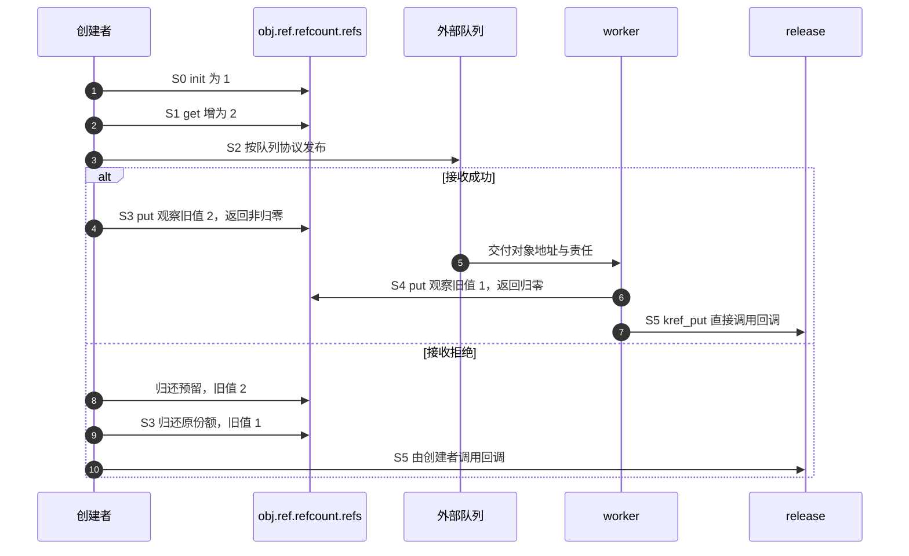

# 第2章\_普通引用与归零回调导读

## 2.1\_从责任图进入函数协作

先读[P01 的 S0～S5](../../../../knowledge/linux/object_lifetime/kref/P01_kref_要解决什么问题.md#1.5_为什么引用计数可以解决生命周期问题)。同一对象既有分散的持有责任，又有集中在内存中的计数；kref 不维护队列位置或业务状态。这里用已正确取得的引用限定参与集合，暂不讨论从失效入口取得新引用。

## 2.2\_把S0到S5落到状态地址

| 阶段 | 执行者和状态落点 | 协作及证据 |
| --- | --- | --- |
| S0 创建 | 创建者写 obj.ref.refcount.refs | [init/set](../source_explanations/include/linux/kref.h.md#1.2_建立初始引用) 建立一份，外层成员尚待完整初始化与发布 |
| S1 预留 | 已有持有者在同一 refs 地址增加 | [get/inc](../source_explanations/include/linux/kref.h.md#1.3_为独立使用追加引用) 预留接收者责任 |
| S2 交付 | 队列或容器保存对象/成员地址 | 由外层同步发布；kref 不写队列、不会自动唤醒 worker |
| S3 创建者退出 | 创建者对同一 refs 原子归还 | [put](../source_explanations/include/linux/kref.h.md#1.4_最后归还调用清理) 将责任减少；接收拒绝时创建者也需归还预留份额 |
| S4 处理者退出 | worker 完成业务后归还它的一份 | [减并检测](../source_explanations/include/linux/refcount.h.md#1.3_旧值决定归零与异常分支) 的旧值决定本次是否归零，S3/S4 可交换 |
| S5 最后清理 | 正常归零的执行者直接调用 release | 传入同一个 ref 地址，不需要另一个全局线程等所有通知；回调处理对象资源；不存储此前 put 的回调 |

这不是每 CPU 汇聚算法：所有普通引用增减访问对象内同一 refs 存储。原子操作提供修改次序，归零操作观察自己的旧值，从而决定谁继续清理；多 CPU 高频操作同一计数的共享成本不会因“无外部锁”自动消失。

## 2.3\_观察一轮端到端转换

最后归还者在自己的调用栈上消费结果，不是靠 kref_read 轮询归零，也没有由 kref 单独发送 IPI 或唤醒。释放若需要延后、或者模块需要等待回调退出，那是外层协议的另一阶段。

## 2.4\_正常退出与异常收敛

正常路径原子减的旧值为 1 时，单份归还得到最后清理资格。错误的零/负值或过量减少进入[饱和告警](../source_explanations/lib/refcount.c.md#1.1_告警之前先收敛到饱和)，不调用正常 release；异常处理不会补齐丢失的责任账本。

[读取快照](../source_explanations/include/linux/kref.h.md#1.5_读取快照不新增责任)只用于已有保活窗口里的观察，不是判断下次 get 安全的同步。普通 get 还需要正引用保证：仅延迟内存回收不够；容器锁必须结合容器持有与撤下协议。正文[快照对照](../../../../knowledge/linux/object_lifetime/kref/P02_源码入口与结构定义.md#2.17.1_运行快照与持有的对照程序)用对象外回收记录观察这一区别。[回调选择](../../../../knowledge/linux/object_lifetime/kref/P02_源码入口与结构定义.md#2.24_kref_不保存_release_函数)显示一致清理协议必须由类型层保证。具体 helper 的旧值、oldp 及返回分支见[原语实现](../source_explanations/include/linux/refcount.h.md#1.2_普通增加与异常检测)。

[RCU 与复合对象](../../../../knowledge/linux/synchronization_and_asynchrony/synchronization/rcu/P21_RCU_kref与复合对象生命周期.md#21.1_先按分配与所有权拓扑选模板)在应用层把发布引用、宽限期和最后 put 排成不同拓扑；这些组合不改变本页普通归零函数的实现，也不意味着 kref 自动等待 RCU。

## 2.5\_编译语义与检查器边界

[__signed_wrap](../source_explanations/include/linux/compiler_types.h.md#1.1_检查器属性与构建选项分工)按配置屏蔽一种溢出插桩；[Makefile 选项](../source_explanations/Makefile.md#1.1_优化选项与函数属性分开核对)决定另一层编译约束；[__must_check](../source_explanations/include/linux/compiler_attributes.h.md#1.1_返回值诊断不是自动清理)提示返回值不可随意丢弃。三者都不负责修复错误的对象身份或归还责任。

本轮固定函数体配合显式顺序原子/屏障替身只检查控制分支，不验证真实并发、硬件内存序或内核告警。完整目标工作模块仍未装卸。返回[总索引](P01_Linux_6.12_kref源码阅读索引.md#1.2_按问题进入已落地证据)。

## 2.6\_初始化形式与存储寿命

S0 不一定通过运行时 init 进入。定义静态对象时，[KREF_INIT](../source_explanations/include/linux/kref.h.md#1.6_定义对象时建立计数) 直接给同一个计数存储提供初值；沿 [REFCOUNT_INIT](../source_explanations/include/linux/refcount.h.md#1.4_逐层构造初始值) 进入 [atomic_t](../source_explanations/include/linux/types.h.md#1.1_整数外还有一层结构)，最终仍是 refs.counter。宏不向其他参与者发送消息，不建立查找入口，也不保存 release。

[P02 静态模块](../../../../knowledge/linux/object_lifetime/kref/P02_源码入口与结构定义.md#2.14.2_运行一个不释放静态内存的完整模块)把普通周期缩成同步过程：模块初始一份对应 S0；初始化函数临时 get/put 对应 S1 以及这份临时责任退出；不做 S2 外部交付；卸载函数归还模块份额后进入 S5。最后执行者直接调用回调，回调记录一次结束，不 kfree 静态对象。

这里有两组相互约束但不同的状态：计数是否仍有合法责任，与模块存储是否仍存在。计数到零不直接回收静态数据区；模块卸载也不能在外部引用仍可能运行时靠正计数自行推迟。若引入外部调用者，必须另行设计关闭入口、等待退出和模块代码保活。本例无外部参与者，不能把它推广成任意驱动的卸载模板。

## 2.7\_新对象在发布之前失败

正文[对象模块](../../../../knowledge/linux/object_lifetime/kref/P02_源码入口与结构定义.md#2.19_标准自定义引用对象模板)把 S0 细分为外壳分配、计数初始化、业务资源准备和成功返回。失败发生在 init 之前时，没有引用可 put；失败发生在建立初始份额之后时，创建者归还该份额，直接进入 S5。本例 release 能清理部分初始化状态，所以不需要另外一条绕过引用协议的清理路径。

正常分支仍沿 S1 追加使用者、分别归还、S5 最后清理推进；没有外部 S2 队列发布。ref 地址保持在外壳内，data 是另外一块拥有的存储。回调先读取并清理 data，再清理外壳；代码类型封装选择回调，kref 本身不记录资源清单。具体普通函数没有改变，应用例子不能反推 kref 能替所有对象处理任意半初始化字段。

## 2.8\_容器入口与引用状态协作

正文[单槽模块](../../../../knowledge/linux/object_lifetime/kref/P02_源码入口与结构定义.md#2.30.1_设计_A_容器持有引用)把普通引用路径接入三个状态地址：全局 registry_entry 保存可见对象地址，registry_lock 串行化槽操作，obj.ref 保存责任计数。S0 创建、S1 预留槽份额、S2 锁内交付、S3 创建者退出、S4 锁内取得及槽撤下/读者退出、S5 最后回调，对应既有普通函数，不改变其固定实现。

非空槽自己的份额让锁内普通 get 有正引用保证；锁同时保证查找不能跨过撤下后去读取旧槽。撤下之后归还容器份额，已取得的读者由自己的责任保活。不持份额的索引必须另行接合归零与撤下/查找，不能只保留“有把锁”这个表面结构。

最终回调沿最后 put 的上下文执行，不能在 worker 最后归还时再同步等待同一个 work；RCU 的存储延迟与引用退出先后也由对象拓扑决定。它们属于外层生命周期协议，具体边界见[清理上下文](../../../../knowledge/linux/object_lifetime/kref/P02_源码入口与结构定义.md#2.31_kref_和_release_的关系)。[P03 业务模型](../../../../knowledge/linux/object_lifetime/kref/P03_kref_生命周期状态机.md#3.3.1_用C模型观察仍持有却被拒绝)另行建立可见性、许可和存储三轴的观察账本，它不是固定内核字段；普通 kref 函数仍只改变本节所述计数状态。本模块无外部线程，宿主顺序替身不证明真实锁竞争或跨 CPU 可见性。
