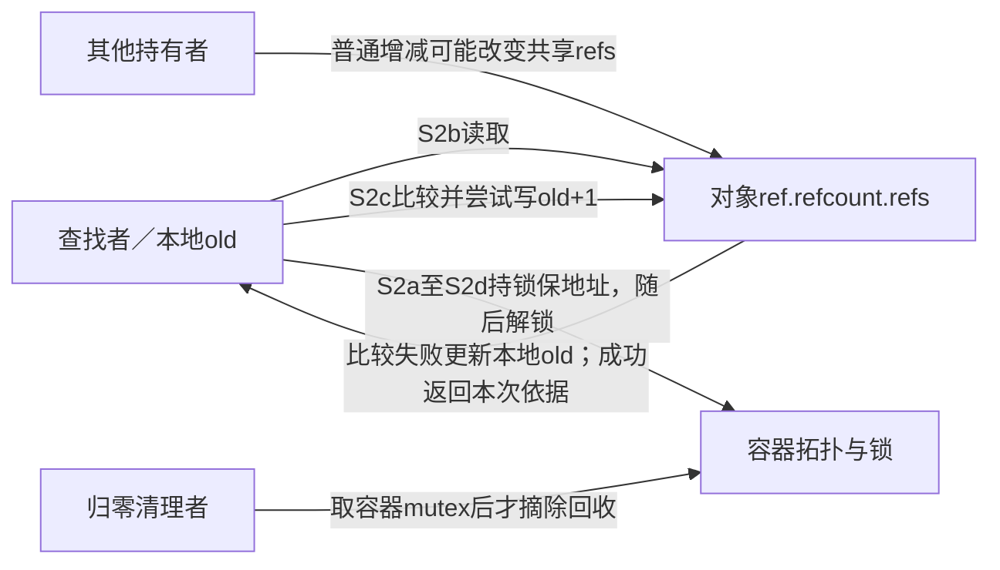
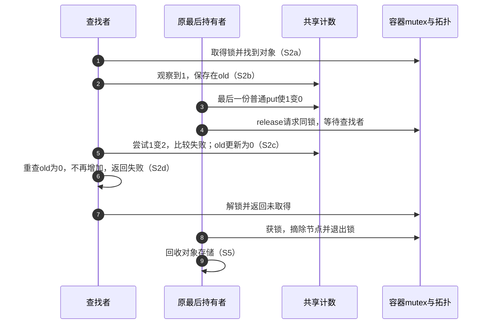

# 第3章\_条件取得与查找窗口导读

## 3.1\_本模块回答什么

固定 NXP linux-imx 提交 dfaf2136deb2af2e60b994421281ba42f1c087e0、Linux 6.12.20，身份见[基线](../../linux/SOURCE_BASELINE.md#1.1_当前来源)。前面的[普通引用模块](P02_普通引用与归零回调导读.md#2.10_三条规则与两类查找协议)已经区分容器持有与非拥有索引。本模块沿一次 lookup 取得，定位“地址仍有效，但计数能否增加尚未确定”的状态与函数协作。

这里不展开新的对象回收设计。沿固定 Documentation/core-api/kref.rst 的一种非拥有链表协议：查找持容器 mutex；最后 put 可以在锁外归零，release 要拿同一把 mutex 才摘除和回收。因此查找锁内可以遇到计数为零、存储尚在的对象。正文的跨版本判断与完整 C 观察见[P05 条件取得](../../../../knowledge/linux/object_lifetime/kref/P05_基础_API_源码逐行讲解.md#5.7.2_kref_get_unless_zero%28%29_的使用场景)。

## 3.2\_从观察到自己持有

仍沿 S0～S5 的责任周期，本模块把 S2 的一次取得划分为 S2a～S2d，退出仍回到 S4/S5：

| 阶段 | 触发和参与者 | 状态落点与读写 | 通信及退出 |
| --- | --- | --- | --- |
| S2a | 查找者持锁定位节点 | 容器拓扑保护对象内 ref.refcount.refs 存储；计数不一定正 | 清理者可能等待同一锁，不能先回收 |
| S2b | 条件链第一次观察 | refcount_read 读共享 refs，值放进当前调用栈 old | 零直接失败；非零进入比较更新 |
| S2c | 比较交换 | 比较共享 refs 与本地 old，相等才写 old+1；失败把新的共享值带回 old | 失败后重新检查零或继续比较，不需远端回调通知 |
| S2d | 链向调用者返回 | 成功交付新增责任；零值失败不交付 | 失败不依这次调用 put，也不能拿裸地址离开保护继续用 |
| S4/S5 | 成功读者以后归还，或原最后归还者继续清理 | 沿既有 put 链；清理者在查找锁退出后才能摘除/回收 | 取得失败不是通知清理者；mutex 解锁使其继续取得锁 |

kref 层把成员地址传给 refcount_inc_not_zero；后者经 __refcount_inc_not_zero 固定增加量为 1，再进入 __refcount_add_not_zero 的循环。精确实现依次见[kref 条件入口](../source_explanations/include/linux/kref.h.md#1.7_有效地址上的条件取得)、[refcount 比较循环与包装](../source_explanations/include/linux/refcount.h.md#1.5_条件增加与失败重试)。

共享计数通过原子操作和缓存一致性被观察，不是每次 get 主动给其他持有者发送消息。mutex 保护的是本例查找与回收窗口，比较重试则处理该窗口内仍可发生的计数变化。不能把“无额外通知”读成无共享读写成本。

## 3.3\_归零先发生时如何退出

若比较更新先把 1 改成 2，原持有者随后 put 只到 1，新查找者已经有独立责任。若其他路径改成另一个正数，本次比较失败后以更新后的 old 重试；不能一直比较最初读到的旧数，也不能把一次比较失败都解释成对象已死。

## 3.4\_异常与内存序边界

固定实现检查 old<0 或 old+1<0，调用[饱和处理](../source_explanations/lib/refcount.c.md#1.1_告警之前先收敛到饱和)后仍返回 old 的布尔值。异常非零返回不能当作健康状态证明。条件取得没有把计数上限变成可恢复的业务容量接口。

本链使用 relaxed 比较交换。上游所述控制依赖对后续写入的约束不能替代 acquire 发布读取或业务字段锁。地址保护、对象发布、身份核对和字段同步由外部协议提供；此处不从宏名猜测 ARM 指令。宿主固定函数夹具只检查重试、零值退出、oldp 和异常分支，未执行真实并发或内存模型验证。

回到[总阅读索引](P01_Linux_6.12_kref源码阅读索引.md#1.2_按问题进入已落地证据)，继续普通归还与后续锁组合时仍要保留上述外层状态责任。

## 3.5\_把版本协议回接到完整取得过程

[P08 非拥有索引窗口](../../../../knowledge/linux/object_lifetime/kref/P08_lookup_场景与_kref_get_unless_zero%28%29.md#8.4.3_kref_get_unless_zero%28%29_仍然需要锁或_RCU)比较条件取得先完成与最后归零先完成，区分 S2 的临时地址保护和 S4/S5 的计数/回调推进。固定文档所用的回调内取锁，与 P05 最后减少也在锁内的 put_mutex 协议不同；不能只看到 mutex 就假定正计数。

本文的 S2a～S2d 仍负责源码读取顺序；正文的完整 conditional_take.c 只提供顺序插入干扰的 C11 模型，未替代硬件比较交换或内存序证据。失败不交付责任；异常非零返回不证明健康。版本与唯一实现标题均未改变。

[P08 返回契约与业务状态](../../../../knowledge/linux/object_lifetime/kref/P08_lookup_场景与_kref_get_unless_zero%28%29.md#8.7.4_kref_get_unless_zero%28%29_和对象状态不能互相替代)已区分条件取得的计数决定、外层门锁的接纳决定和既有普通增加诊断。这里的固定函数链不读取 state，不因知识正文完成而扩大到业务许可或通用地址验证。

## 3.6\_RCU保护区与退休份额

固定 Documentation/core-api/kref.rst 的 Krefs and RCU 示例让最后归还进入 release，再摘链并 kfree_rcu；因此 S2a～S2d 的地址窗口可由匹配 RCU 协议提供，计数仍可能已经为零。正文[P10 入口与两种退休顺序](../../../../knowledge/linux/object_lifetime/kref/P10_kref_与_RCU.md#10.2.1_RCU_和_kref_分别保护什么)另外选择入口拥有一份、先主动撤下再 put 的应用协议，两者都要求条件尝试时计数存储有效，但集合所有权不同，不能照搬发布/撤下责任。

若模块把入口份额一直保留到 GP 完成再 put，旧读区内还可由该份额证明正计数；这不是条件 helper 自动增加的保证。固定条件链、异常分支与唯一标题沿用 3.2～3.4；公共 RCU 的状态与后端入口见[RCU 总索引](../../rcu/navigation/P01_Linux_6.12_RCU源码总阅读索引.md#1.2_先建立源码分类坐标)。完整 C 模型只验证四条责任轨迹，不运行内核 RCU。

## 3.7\_从旧节点继续到最终回调

[P10 完整模块](../../../../knowledge/linux/object_lifetime/kref/P10_kref_与_RCU.md#10.3.1_基础对象模型)把 S2a～S2d 放进 RCU 查找，S3 在更新锁下主动摘链，S4 归零登记回调，S5 再回收。固定 include/linux/rculist.h 的[list_del_rcu](../source_explanations/include/linux/rculist.h.md#1.1_摘链后保留旧读者的前向路径)连接邻居并保留旧 next，不保存引用、不自加锁或等待 GP；应用 linked 字段防止第二次摘链，ever_published 防止旧读区未结束就重插节点。

取得引用后退出读区，才允许等待业务 mutex；可选状态过滤也只证明检查瞬间。模块关闭 callback 来源并归还各份额之后用 rcu_barrier 等自身回调，具体 Tiny 后端沿[模块导读](../../rcu/navigation/P11_Linux_6.12_Tiny_RCU模块源码概念导读.md)进入既有唯一实现；不得以 synchronize_rcu 替代 callback 完成等待。

[P10 字段和子资源回访](../../../../knowledge/linux/object_lifetime/kref/P10_kref_与_RCU.md#10.5.3_子资源释放不能早于_RCU_读者)进一步限定条件取得所证明的范围：本链只交付对象份额，不能推导尚未取得引用的读者可以访问哪些子分配，也不把成功返回当成业务许可。完整外层协议先列每块资源的访问者与截止点，再决定普通 release 或 GP 回调承担哪些清理；本模块及唯一 helper 不新增这些业务状态。

[P25工程模板](../../../../knowledge/linux/object_lifetime/kref/P25_RCU查找与业务关闭工程模板.md#25.1_同一对象上有三组独立状态)保留同一完整RCU模块，明确创建者与表份额分开、重复摘链/重插防护、普通读区外业务mutex、字段资源及模块回调退出。八组既有夹具与程序逐字复核；原355头/343非生成源码ARM记录保持，本批没有新运行。kfree_rcu与自定义call_rcu在应用层的清理选择不改变条件取得必须先有有效地址的前提。

## 3.8\_按地址期限和正计数审查查找

[P12查找错误](../../../../knowledge/linux/object_lifetime/kref/P12_典型错误模式与调试线索.md#12.4.1_错误五_lookup_后无保护_get)以Q0～Q3展示保护结束到首次取得之间的回收窗口。条件get也必须读取有效ref地址；普通get能否成立取决于是否有正计数证明，而不是锁或RCU的名字。拥有集合在同锁下以成员份额保证正数；非拥有索引可能只能阻止存储回收，计数已归零时要条件失败退出。

固定Documentation/core-api/kref.rst强调查找与条件取得在同一保护临界区，必须检查返回；[条件实现](../source_explanations/include/linux/kref.h.md#1.7_有效地址上的条件取得)的失败不会交付新份额。3.6已比较RCU两种退休顺序：若发布份额保留到旧读者结束，读区内可证明正计数，不能一律要求条件get。本文不重复四轨迹模型，也不改变P08/P10完整程序。

## 3.9\_快照与失败返回不交付引用

[P12 API误用](../../../../knowledge/linux/object_lifetime/kref/P12_典型错误模式与调试线索.md#12.6_并发与_API_误用_kref_不是锁_也不是状态判断)区分真实refs地址、独立业务字段和调用者本地快照。已有两份时重新init写成1不会通知旧拥有者；kref_read仅复制瞬时值；条件取得失败也不会形成待回滚的一份。

固定入口分别为[初始化写值](../source_explanations/include/linux/kref.h.md#1.2_建立初始引用)、[读取快照](../source_explanations/include/linux/kref.h.md#1.5_读取快照不新增责任)、[条件返回](../source_explanations/include/linux/kref.h.md#1.7_有效地址上的条件取得)。四组GNU11宿主检查使用固定普通/条件函数，验证重置后提前回调、旧快照仍为1、零值失败不新增、正值成功配对；存储静态且原子操作为顺序替身，不实际UAF、不验证并发重试或RCU。

业务过滤必须遵守自己的上下文：先拥有型取得、离开普通RCU读区，再等待对象mutex并按契约回滚；过滤只保证检查时点。P10现有完整模块和可选包装未改，字段竞争与READ_ONCE边界仍依据对象协议，不由refcount操作覆盖。

## 3.10\_拥有型链表模板的正计数来源

[P13完整链表模板](../../../../knowledge/linux/object_lifetime/kref/P17_拥有型链表工程模板.md#17.1_拥有型链表的发布与撤下)复用既有note_kref_table。发布在table_lock和obj.lock内另取表份额；查找持同一锁顺序定位，成员存在说明表份额尚在，因此可走[普通取得](../source_explanations/include/linux/kref.h.md#1.3_为独立使用追加引用)。这个证明来自发布与撤下配对，不是mutex名字本身。

撤下在锁内设置DYING并list_del_init，将是否取回表份额保存在本次removed；解锁后才[归还该份](../source_explanations/include/linux/kref.h.md#1.4_最后归还调用清理)。重复撤下需要调用者仍有独立份额，不给悬空参数提供幂等保证。同步请求的状态检查和更新共用obj.lock，不能把同样外观的先检查后解锁模型用于无保护硬件访问。

正文L0～L5组织应用层阶段，固定普通引用函数不变；既有六组宿主与ARM前端记录继续适用，模块及夹具本次均未修改，不新增真实并发或目标装卸结论。

## 3.11\_哈希索引与IRQ上下文的独立边界

[P13哈希模板](../../../../knowledge/linux/object_lifetime/kref/P18_拥有型哈希与IRQ工程模板.md#18.1_拥有型哈希与IRQ上下文)延续表另持一份、锁内[普通取得](../source_explanations/include/linux/kref.h.md#1.3_为独立使用追加引用)、真正撤下后锁外[归还](../source_explanations/include/linux/kref.h.md#1.4_最后归还调用清理)。分桶只改变定位；IRQ保存恢复只约束本地重入和锁路径，二者都不会自动生成引用责任。

完整note_kref_hash用一把table_lock保护桶、state及短统计，避免先增加未需要的每对象锁；代价是不同对象业务也串行。外壳GFP_KERNEL分配发生在创建阶段，持锁区不分配/等待，最后release不睡眠。固定spinlock包装沿既有锁专题，ARM IRQ保存/恢复按[本批配置与证据](../../linux/SOURCE_BASELINE.md#1.75_拥有型哈希模板的上下文边界)核对，不把锁研究主线的SMP配置套到当前非SMP构建。

七组宿主检查包含碰撞与重复撤下、IRQ入口状态恢复的顺序模型；普通引用函数固定，桶/锁/IRQ/分配均为替身。ARM前端354头、342非生成头与固定提交无差异，没有真实中断、SMP、目标链接装卸或硬件结论。

## 3.12\_单个弱缓存槽的撤销与回收

[P26单槽模块](../../../../knowledge/linux/object_lifetime/kref/P26_弱缓存撤销与RCU回收模板.md#26.1_新读区为什么救不了旧缓存)不让cached持有对象份额。W0创建，W1已持引用的setter在cache_lock下发布，W2读区内[条件取得](../source_explanations/include/linux/kref.h.md#1.7_有效地址上的条件取得)，W3最后归还先在同锁下清除仍指向自己的入口，W4安排RCU回调，W5满足旧读区边界再free。若已替换为B，A的release不能清掉B；set的输入必须已经拥有一份，不能从零计数旧地址再发布。

这里同一锁负责更新者之间的身份排序，RCU负责临时读者地址期限，kref负责成功逃出读区后的独立份额。动态holder还须先证明自身地址有效；多弱槽要求全部入口可追踪撤销，单槽代码没有自动提供这种能力。RCU后端仍沿[总索引](../../rcu/navigation/P01_Linux_6.12_RCU源码总阅读索引.md#1.2_先建立源码分类坐标)选择，不增加上游弱引用API或重复函数体。

新增note_kref_weak_cache九组宿主检查与ARM前端通过，354头中342非生成源码与官方dfaf2136固定提交无差异。固定普通/条件引用链保留，原子、锁、分配和回调成熟是显式顺序替身；未执行真实RCU调度、并发发布、目标装卸或硬件内存序。

## 3.13\_查找实验必须先区分两种表责任

[P34实验5与6](../../../../knowledge/linux/object_lifetime/kref/P34_查找窗口与条件取得实验.md#34.1_先确定表是否拥有引用)先用note_kref_table建立同锁下表份额仍在的正计数证明，再回到固定kref.rst中非拥有索引的最后put在锁外、release进锁摘除协议。本模块S2a～S2d依然描述地址保护内的观察/比较/返回；条件函数不会替应用决定成员所有权或dying过滤。

本章3.3归零抢先路径对应C11模型DROP_LAST；正数干扰则比较失败后继续重试。模型计数位于有效自动存储，无真实释放。六组实际表模块夹具、四条模型轨迹、固定条件链六分支及包装两结果本批重跑通过；模块和实现未改，锁/原子等替身不证明真实并发或内存序。未新增ARM、目标装卸和动态检查结果。

## 3.14\_退休实验中的归零和回收完成

[P36实验8](../../../../knowledge/linux/object_lifetime/kref/P36_RCU查找与退休顺序实验.md#36.1_归零与旧读者退出是两份证据)将S2临时取得与S3撤下后的退休份额配对：立即put表份额可能让旧读者在有效地址上看到零；保留退休份额跨过相关GP则能维持该窗口的正数。固定条件函数与list_del_rcu不决定应用选择哪一种；旧node.next仍需保留到相关读者不再访问。

rcu_take_window四路径与note_kref_rcu八组宿主夹具重新通过，程序及固定实现未改。模型finish_gp合并了本地完成与回收动作，不代表真实GP结束即所有回调执行完；模块自定义回调代码退出继续要求关闭来源后rcu_barrier。当前Tiny/PREEMPT_NONE非SMP配置复核，不扩展为目标运行或其他后端结论；无本次ARM、装卸与真实调度结果。
