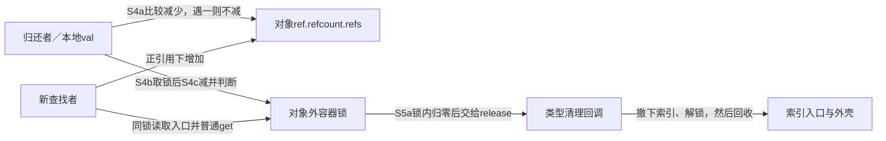
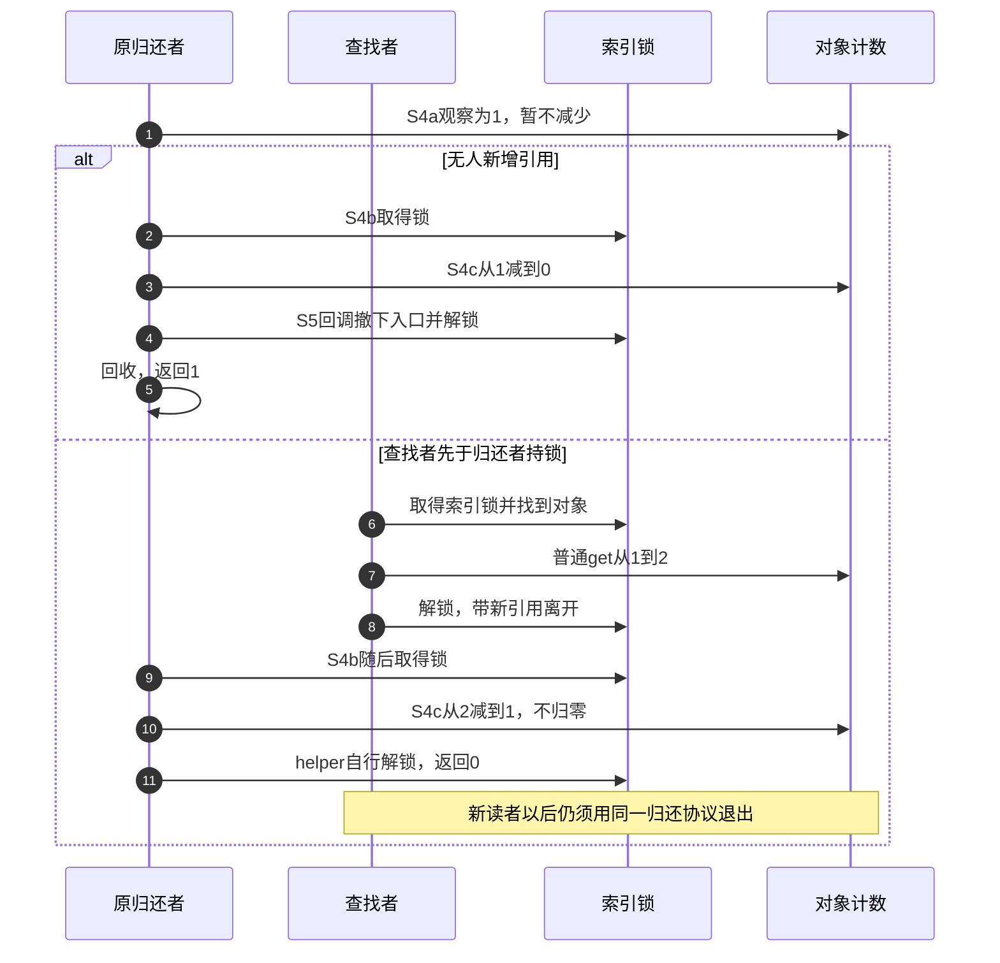

# 第4章\_最后归还与锁交接导读

## 4.1\_为什么不能归零后才补锁

固定 NXP linux-imx 提交 dfaf2136deb2af2e60b994421281ba42f1c087e0、Linux 6.12.20，身份见[基线](../../linux/SOURCE_BASELINE.md#1.1_当前来源)。前面的[条件取得模块](P03_条件取得与查找窗口导读.md#3.3_归零先发生时如何退出)允许查找锁内看见零值并失败。本模块考察另一个选择：让普通 get 仍能在非拥有索引中使用，但最终减少到零必须和查找取得使用同一把锁。

如果先在锁外减到零，再等待容器锁，查找者可能已经持锁、仍看见节点，却读到零计数，普通 get 的前提就消失。锁组合 helper 因此先避免在无锁阶段消费最后一份，取锁后才尝试完成最终减少。它减少的是正常非最后 put 必经集合锁的需要，不保证所有返回 0 的路径都从未取锁。

## 4.2\_把最后减少留在锁内

沿既有 S0～S5，本次细分 S4 的归还与 S5 的清理。共享状态分别是对象 ref.refcount.refs、索引入口以及对象外容器锁；候选旧值 val 在当前调用栈中。

| 阶段 | 写入者与状态 | 后续观察者与退出条件 |
| --- | --- | --- |
| S4a 快路径 | refcount_dec_not_one 比较并减少大于一的正常计数 | 成功后返回，未取容器锁；若观察为一，则保留这份进入 S4b |
| S4b 等待容器锁 | 归还者仍拥有未消费的最后候选份额 | lookup 仍可先持锁新增引用；原对象因这份责任不会提前回收 |
| S4c 锁内重查 | refcount_dec_and_test 此时真正减少一份 | 若剩余非零，本 helper 自行解锁退出；若到零，保留锁交给 kref 层 |
| S5a 回调接锁 | kref 层同步调用 release，入口锁已经持有 | 类型回调在同一锁下撤下非拥有索引，并按契约解锁 |
| S5b 清理完成 | 回调回收资源与外壳，本例在解锁后 kfree | kref 层只返回 1，不再操作对象或自动解锁 |

阅读顺序是[kref 的两个回调入口](../source_explanations/include/linux/kref.h.md#1.8_归零时把锁交给回调)、[快路径](../source_explanations/lib/refcount.c.md#1.2_快路径保留最后一份)、[锁内重查](../source_explanations/lib/refcount.c.md#1.3_取得锁后再次减少判断)，再回到[调用者完整模板](../../../../knowledge/linux/object_lifetime/kref/P05_基础_API_源码逐行讲解.md#5.8.2_kref_put_mutex%28%29_的典型用途)。

## 4.3\_等待期间新增引用怎样改变结局

第二分支说明为什么快路径看到 1 不等于本次必定最后释放。查找者也没有从零复活对象：归还者在拿到锁前一直没有消费那最后候选份额。

## 4.4\_锁与异常边界

普通持有者的所有最终归还路径都必须参与同一协议，不能混入锁外普通 put 后再让回调取锁，否则查找者的正引用证明被破坏。调用者进入锁组合 helper 前不持它将获取的同一把锁，回调则恰好相反：必须知道自己接到了锁，不能重锁，也不能忘记归还。

mutex 路径要求允许取得 mutex 的上下文。spinlock 版本使用普通 spin_lock，没有 irqsave；在本基线非 PREEMPT_RT 配置下，持该锁期间不得睡眠。就算回调先解锁，也不自动把硬中断调用点变成可睡眠上下文。需要禁中断配对或其他版本的实时锁语义时，应另行核对设计，不能从这两个函数推断。

快路径遇饱和值不减并返回 true，零值下溢告警也返回 true，上层因而不调用 release 并返回 0。该返回不是对象健康或“已成功消费一份”的诊断。验证夹具采用顺序锁和比较交换替身，不能模拟真实等待、调度、IRQ、PREEMPT_RT 或 Linux 内存序。

返回[总阅读索引](P01_Linux_6.12_kref源码阅读索引.md#1.2_按问题进入已落地证据)。

应用侧的[可见性比较](../../../../knowledge/linux/object_lifetime/kref/P06_release_回调与复杂销毁模式.md#6.5.3_release_内脱链模型)并列容器持有、非拥有且最终减少同锁、锁外归零后条件取得三种前提；[上下文比较](../../../../knowledge/linux/object_lifetime/kref/P06_release_回调与复杂销毁模式.md#6.6.2_普通_kref_put_下的_release_上下文)说明归还后回调仍在原调用栈。mutex/spinlock 包装的固定函数不变，不自动保存中断状态，也不在回调之后补解锁。

[P09 完整应用对照](../../../../knowledge/linux/object_lifetime/kref/P09_kref_与锁的组合.md#9.4.5_kref_put_mutex%28%29_的典型模式)复用非拥有索引模块，按普通拥有型退出、普通条件取得和两种锁组合比较调用者的保证。回调接锁与最后减少仍采用本模块 S4a～S5b，不新增另一套源码展开；返回非最后也可能走过取锁慢路径，应用不得从返回值猜锁是否曾被取得。

## 4.5\_拥有型集合与非拥有索引的退出诊断

[P12退出错误](../../../../knowledge/linux/object_lifetime/kref/P12_典型错误模式与调试线索.md#12.5.2_错误八_release_时对象仍挂在全局结构中)先判断集合是否持份额：拥有型集合在可见期间仍保留发布份额，不能等归零后才决定remove；非拥有索引允许由最终清理者撤下，但必须匹配查找取得和回收协议。

普通put若先归零、release再等索引锁，锁内旧入口可能已是零，取得要允许条件失败；既有kref_put_mutex模块则由[保留最后一份](../source_explanations/lib/refcount.c.md#1.2_快路径保留最后一份)和[锁内重查](../source_explanations/lib/refcount.c.md#1.3_取得锁后再次减少判断)保证锁内可见时仍正。诊断时序限定先观察可能最后一份、再竞争索引锁，避免把普通非最后快路径也画成必定取锁。

同一release可接手独占延迟清理责任，但不能重新发布旧普通业务；WARN不自动修复成员关系或阻止free。RCU节点的前向保留及pending/running边界分别沿其既有模块，不把list_empty或pending采样当统一退出证明。完整note_kref_locked、note_kref_table及RCU材料未改，本批是源码/协议冷读复核，没有新目标或并发运行结论。
