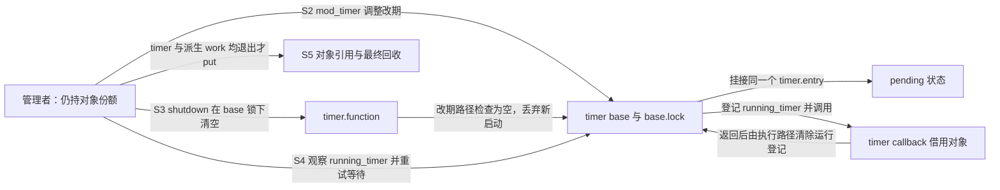
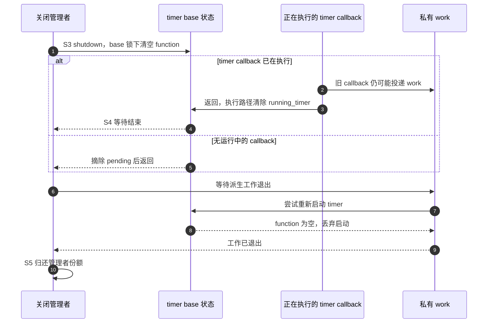

# 第5章\_定时器重启与退出导读

## 5.1\_为什么归还之前还要关闭重启

普通 kref 只知道责任数，不知道同一个 timer 改过几次到期时间。读[P06 异步退出](../../../../knowledge/linux/object_lifetime/kref/P06_release_回调与复杂销毁模式.md#6.7.3_release_和_timer_的收尾关系)后，本模块帮助定位 Linux 6.12.20 的真实状态：谁表示 pending，谁记录回调仍在执行，谁让重新启动停止生效。固定 NXP 提交见[基线](../../linux/SOURCE_BASELINE.md#1.1_当前来源)。

这里组织 timer 与私有 kref 对象的退出组合，不复制完整定时轮、时钟中断或 CPU 迁移专题。默认采用管理者持有初始份额、回调借用、关闭后再归还的模型；timer 并不知道这一份额的存在。

## 5.2\_从排队到最终关闭

与正文同一轮 S0～S5 相接：S0 初始化对象和 timer；S1 持有者就绪；S2 安排或修改到期；S3 关闭重启；S4 等旧回调及其派生工作退出；S5 归还管理者并最终清理。S3/S4 由 timer_shutdown_sync 部分合在一次调用里，仍是两项不同保证。

| 存储 | 写入与读取者 | 在退出中的作用 |
| --- | --- | --- |
| timer.entry | base 锁保护下的挂接/摘除路径 | 表达 pending；不等同 callback 正在运行 |
| timer.expires | mod_timer 等修改路径 | 保存下一次到期要求，同一节点改期不追加一次引用 |
| timer.function | 初始化设置，shutdown 在 base 锁下清空；改期路径在该锁下检查 | 空值使之后的重新启动被丢弃 |
| base.running_timer | timer 执行路径登记/清除；同步删除路径在 base 锁下观察 | 判断旧回调是否尚未结束 |
| 私有对象的 kref | 管理者和独立持有者按类型协议增减 | 保留对象存储；timer helper 不操作它 |

[状态观察与旧名](../source_explanations/include/linux/timer.h.md#1.1_pending只观察队列成员)解释 pending 以及 del_timer_sync 包装。随后读[改期入口](../source_explanations/kernel/time/timer.c.md#1.1_改期不等于追加一次回调)，观察同一到期或同一槽的快速返回、重新挂接和关闭检查。最后读[同步删除/关闭链](../source_explanations/kernel/time/timer.c.md#1.2_等待执行与关闭重启)，以 shutdown 参数对比清空 function 与仅等待执行的区别。

## 5.3\_相互重启时怎样退出

如果 timer 回调投递 work，work 又重新启动 timer，单独等待任意一边都会留下另一边重新产生工作。管理者先停止外部生产者，再最终关闭 timer，随后排空/销毁这组私有工作，保留对象到整个过程结束。这里假定后续退出不需要 timer 再次触发，且没有另一路重新初始化它。

阻止重新启动不等于使任意旧指针永远可访问。调用 mod_timer 的路径仍必须保留 timer 地址；管理者只能在全部访问者退出后归还最后责任。shutdown 也不是一个引用消费者，不会替持票回调结算份额。

宿主 C 模型只观察改期合并、pending/运行分离、删除后再启动及最终关闭阻止 work 重启四条顺序轨迹；不是实际定时轮、原子、调度、中断或 PREEMPT_RT 验证。返回[总索引](P01_Linux_6.12_kref源码阅读索引.md#1.2_按问题进入已落地证据)。
