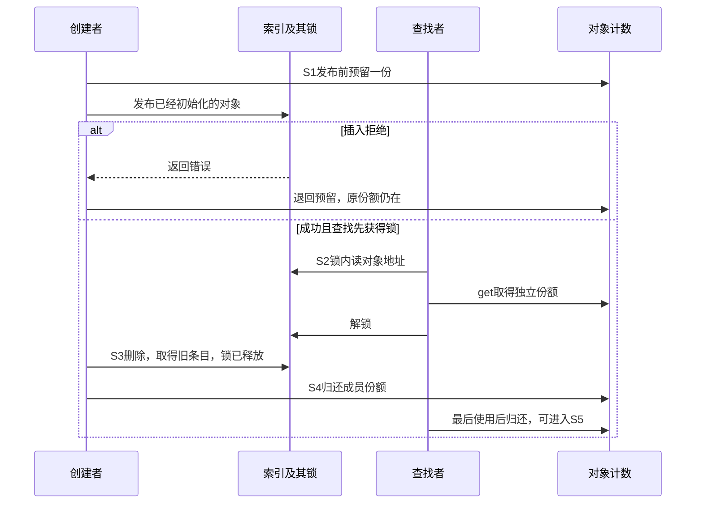
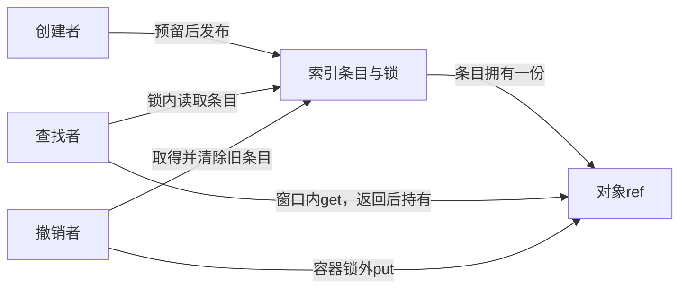

# 第6章\_整数索引与拥有型查找导读

## 6.1\_同一个拥有型协议为什么还要查容器接口

固定 NXP linux-imx 提交 dfaf2136deb2af2e60b994421281ba42f1c087e0，身份见[基线](../../linux/SOURCE_BASELINE.md#1.1_当前来源)。[P08 容器单元](../../../../knowledge/linux/object_lifetime/kref/P08_lookup_场景与_kref_get_unless_zero%28%29.md#8.5_常见容器_lookup_模板)继续使用条目持有一份、锁内查找取得、移除后归还的应用协议；本模块检查具体 API 的锁和发布时机。只存储指针不会自动维护 kref。

## 6.2\_把容器动作接到引用周期

| 阶段 | XArray | IDR 外层 mutex 方案 | 责任位置 |
| --- | --- | --- | --- |
| S0 私有创建 | id 和业务字段先写完 | 其他字段先写完，id 待分配 | 创建者初始一份 |
| S1 发布 | 预留后 xa_insert，自行管理 xa_lock | 预留后锁内 idr_alloc，成功写 obj.id 再解锁 | 成功条目拥有新增的一份，失败退回预留 |
| S2 查找 | 外层 xa_lock 覆盖 xa_load 与 get | 外层同 mutex 覆盖 idr_find 与 get | 返回者新增一份 |
| S3 撤下 | xa_erase 自行加锁，返回旧条目 | mutex 内 idr_remove，返回旧条目 | 移除者暂接条目的份额 |
| S4/S5 归还 | 容器锁释放后 put | mutex 释放后 put | 最后者沿普通归零回调回收 |

XArray 的[插入包装](../source_explanations/include/linux/xarray.h.md#1.1_插入包装自行管理锁)与[删除包装](../source_explanations/lib/xarray.c.md#1.2_删除包装与已持锁入口)都自行加锁。查找调用者却必须外层持锁覆盖 get，因为 [xa_load 的内部窗口](../source_explanations/lib/xarray.c.md#1.1_查询内部读侧窗口在返回前结束)在函数返回前就结束。不能用“这些 API 都有锁”省略它们不同的覆盖范围。

IDR 的[编号发布](../source_explanations/lib/idr.c.md#1.1_返回编号与对象字段初始化)要区分局部 id 与对象字段：本例选择全部使用者服从外层 mutex，成功后在解锁前写 obj.id。[查询和移除](../source_explanations/lib/idr.c.md#1.2_查询与移除不管理对象引用)不自动管理引用。普通 kref 仍沿[唯一取得实现](../source_explanations/include/linux/kref.h.md#1.3_为独立使用追加引用)与[归零实现](../source_explanations/include/linux/kref.h.md#1.4_最后归还调用清理)。

## 6.3\_验证与迁移边界

完整 note_kref_xarray.c 只存非空普通对象指针，id 发布前固定，没有 xa_value、保留条目、多索引条目、IRQ 或外部并发入口。ARM 前端核对目标头；宿主六组执行实际模块与固定 xa_insert/xa_load/xa_erase 外层函数，节点存储、RCU、锁、分配和原子使用显式顺序替身。不能以此声称真实 XArray 节点分配、并发、IRQ 或目标装卸通过。IDR 本批核对源码与应用片段，不宣称 IDR 运行测试。回到[总索引](P01_Linux_6.12_kref源码阅读索引.md#1.2_按问题进入已落地证据)。

## 6.4\_删除当前条目与删除期待对象

[P13工程模板](../../../../knowledge/linux/object_lifetime/kref/P13_工程模板.md#13.4.3_模板五_xarray_+_kref_lookup_模板)复用完整note_kref_xarray，补充编号复用后的调用意图。按ID删除取回该编号当前条目；若调用者持旧A、编号已映射到B，就不能把这种接口当作只撤下A。

可选indexed_remove_same在同一xa_lock内[读取当前条目](../source_explanations/lib/xarray.c.md#1.1_查询内部读侧窗口在返回前结束)、比较期待地址，再调用[已持锁__xa_erase](../source_explanations/lib/xarray.c.md#1.2_删除包装与已持锁入口)。输入调用者已有A份额、id不可变，因此比较期间A存储与身份受保证；锁外仅归还真实取回的成员份额。空映射或已替换为B均不消费A或B份额。

三组新增宿主检查覆盖匹配/重复、旧A保护新B、空映射，六组既有用例也通过。固定普通引用与三公开包装保留，节点存储、下层删除、锁和RCU为顺序替身；含可选包装的模块变体ARM前端通过，354头中342非生成头无固定差异。未执行真实XArray算法、竞争、目标链接装卸；同地址多次发布代际仍需额外协议。
