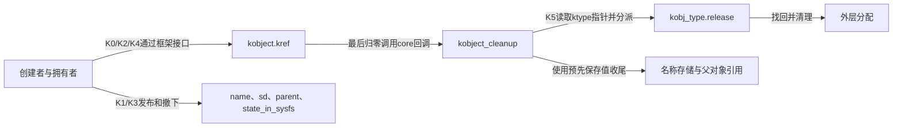
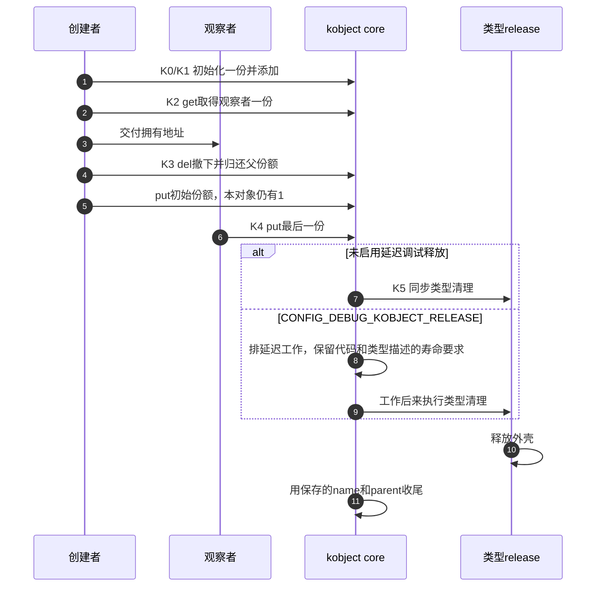

# 第7章\_kobject身份与类型清理导读

## 7.1\_从哪一层问题进入

固定 NXP linux-imx 提交 dfaf2136deb2af2e60b994421281ba42f1c087e0、Linux 6.12.20，身份见[基线](../../linux/SOURCE_BASELINE.md#1.1_当前来源)。本模块定位 kobject 如何把已有 kref 接到名称、sysfs 登记、父关系和类型回调；跨版本用途及完整演示见[P11 kobject边界](../../../../knowledge/linux/object_lifetime/kref/P11_kref_refcount_t_kobject_的边界.md#11.3.1_kobject_不只是引用计数)。不展开设备绑定和 sysfs 节点算法。

## 7.2\_从K0到K5连接状态与回调

kobject 是多组状态的组合：内嵌 kref 管份额，state_initialized 管初始化事实，state_in_sysfs 管登记事实，事件状态位与父/kset关系另有推进规则。不能由引用数判断目录是否还在，也不能因目录删除就认为所有引用结束。

| 阶段 | 地址与写入者 | 后续读取与通信 |
| --- | --- | --- |
| K0 初始化 | kobject_init_internal 写kref=1和状态位，kobject_init设置ktype | kobject_get/put读取初始化状态，最后清理读取类型指针 |
| K1 添加 | 命名与添加路径设置name/parent/sd及登记状态 | sysfs与core使用身份；失败不消耗K0初始份额 |
| K2 取得 | kobject_get进入已有普通kref链 | 拥有者保留同一kobject地址，新增责任 |
| K3 撤下 | kobject_del调用内部删除，清登记/关系，归还父份额 | 不归还本对象份额，旧拥有者仍可持有存储 |
| K4 最后归还 | kobject_put传入固定core回调kobject_release | 归零后普通配置直接清理，调试配置排延迟工作 |
| K5 类型清理 | cleanup先保存name/parent/type，必要时补撤下，再调用类型release | 类型可能释放外壳；core以后只使用保存的名字/父地址收尾 |

## 7.3\_按阶段进入唯一实现

- [对象身份与类型字段](../source_explanations/include/linux/kobject.h.md#1.1_对象身份与独立状态)建立实例和类型描述的地址关系。
- [K0/K1初始化](../source_explanations/lib/kobject.c.md#1.1_初始化后失败仍有初始责任)核对init_and_add失败责任。
- [K2取得](../source_explanations/lib/kobject.c.md#1.2_取得返回同一个框架对象)接回普通kref链。
- [K3撤下](../source_explanations/lib/kobject.c.md#1.3_撤下层次不消费本对象引用)区分父引用和本对象份额。
- [K4/K5清理](../source_explanations/lib/kobject.c.md#1.4_最后归还进入类型清理)说明回调分派、外壳销毁和延迟配置边界。

## 7.4\_证据与检查范围

完整模块只在 SYSFS 开启且 DEBUG_KOBJECT_RELEASE 关闭时执行，提前拒绝其他配置；没有注册属性或发送主动 ADD 事件，不把目录短暂出现当作完整设备注册。添加成功不自动发 ADD uevent，注销与事件策略须按应用另行设计。

ARM 前端通过，354份头中342份非生成源码与固定提交无差异。宿主使用固定九个kobject函数与普通引用链，七组检查包含两类配置拒绝、分配/添加失败、正常模块、隐式/显式撤下及NULL包装。sysfs、命名添加、诊断和分配为顺序替身；调试延迟分支、真实sysfs、事件、并发和目标装卸未执行。模块中没有外部用户，不能外推到任意设备退出。

回到[总阅读索引](P01_Linux_6.12_kref源码阅读索引.md#1.2_按问题进入已落地证据)，下一步分别核对device层的初始化、注销和release分派。
