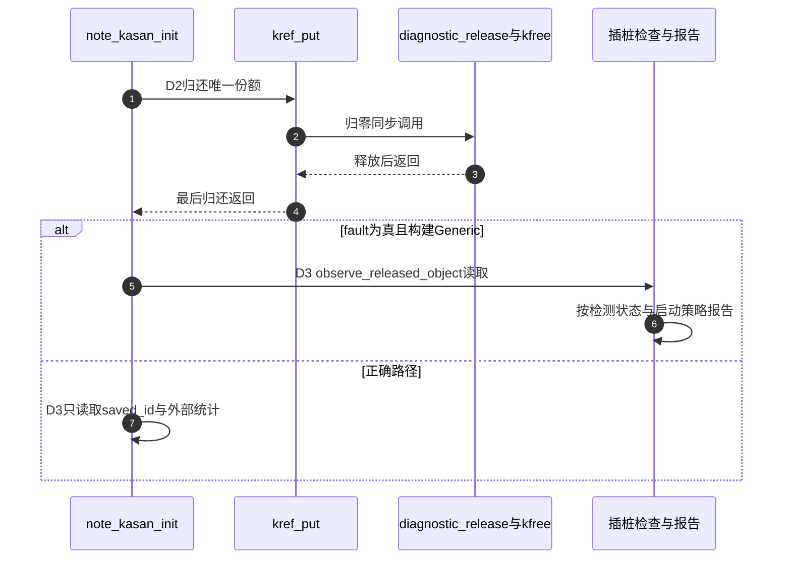

# 第7章\_引用错误的动态诊断导读

## 7.1\_固定来源与阅读任务

固定NXP linux-imx发布lf-6.12.20-2.0.0、提交dfaf2136deb2af2e60b994421281ba42f1c087e0，身份见[基线](../../linux/SOURCE_BASELINE.md#1.1_当前来源)。本模块为P37直接回收后的访问与P38字段竞争实验组织版本证据：先核对Generic KASAN的工作前提，再独立核对KCSAN配置互斥与采样，不把两个检查器当成同一状态机，也不展开全部内部算法。

| 原始位置 | Git blob | 本轮阅读目的 |
| --- | --- | --- |
| [lib/Kconfig.kasan](../../linux/lib/Kconfig.kasan) | 98016e137b7f09f82b168f840565e8121b28ce87 | 能力依赖、三种模式的choice、插桩选择和栈记录 |
| [Documentation/dev-tools/kasan.rst](../../linux/Documentation/dev-tools/kasan.rst) | d7de44f5339d43aee128091930ead29511060925 | 架构/编译器支持、报告格式、首错限制与panic策略 |

两个原始文件按固定对象保存，不由本地实验HEAD提供证据。引用功能入口仍在[kref最后归还](../source_explanations/include/linux/kref.h.md#1.4_最后归还调用清理)，应用回调调用kfree才结束本例存储。不能仅凭kref_put函数名推断任意类型都已经物理回收。

## 7.2\_Generic模式的配置路径

先查menuconfig KASAN依赖：软件模式要求对应HAVE_ARCH与编译器能力，加上可用的no_sanitize_address支持；共同依赖SYSFS且排除SLUB_TINY。再进入KASAN mode的choice，选Generic，满足HAVE_ARCH_KASAN与CC_HAS_KASAN_GENERIC等条件。Generic会选择SLUB_DEBUG和CONSTRUCTORS。最后选择OUTLINE或INLINE插桩，后者还受ARCH_DISABLE_KASAN_INLINE限制。

软件标签与硬件标签模式在本版本文档中只支持arm64，硬件标签还依赖处理器MTE能力。它们不是Generic之后按“新旧芯片”排列的两个必选项，也不能把choice内三项同时作为当前ARM的建议配置。

STACKTRACE用于slab分配/释放栈；物理页的分配历史另有PAGE_OWNER及启动参数要求，本例kzalloc对象不把那组配置列为必需。KASAN_KUNIT_TEST与KASAN_MODULE_TEST是上游检测能力测试入口，与本仓库note_kref_kasan模块不同，不能以名称接近就声称运行了上游测试套件。

本次工作树为ARM/Tiny/PREEMPT_NONE，HAVE_ARCH_KASAN、CC_HAS_KASAN_GENERIC、CC_HAS_WORKING_NOSANITIZE_ADDRESS、SYSFS与STACKTRACE启用，SLUB_TINY与KASAN未启用。当前构建具备部分能力但未启用检测，不说明虚拟机运行镜像；也没有修改外部配置来制造通过结果。

## 7.3\_从应用回收到非法读取

[P37完整模块](../../../../knowledge/linux/object_lifetime/kref/P37_KASAN释放后访问实验.md#37.3_完整模块只改变最后一次读取的位置)的D0分配初始化，D1保存独立整数，D2最后put同步进入diagnostic_release并kfree，D3在正确副本或故障读取之间选择。真实ref、分配器/KASAN元数据和报告策略分属不同状态；默认fault=false不执行故意错误。

本导读不猜测KASAN内部每个hook的先后实现，也不把上图理解成kref直接通知检查器。当前目标是根据固定配置和文档组织可复核实验；需要修改检测器内部时应另建其实现账本，不从本实例推导未展开的算法。

## 7.4\_报告与未报告各有什么边界

该版本文档说明默认只报告第一次非法访问；kasan_multi_shot改变首错限制，panic_on_warn和kasan.fault影响报告后的行为。不同模式还有不同运行时配置，不能把某模式参数的作用推广给全部模式。

报告中应区分访问栈、可用的分配/释放历史与实际对象地址。预期出现UAF文字不是运行证据；缺失历史栈也不能被推测补全。未报告须先查已启用配置、实际插桩模块、目标分支、此前告警与日志采集，再讨论覆盖范围。

本批宿主五条组合只覆盖正确/分配失败/禁用时拒绝，故障读取未执行；当前非KASAN配置的ARM前端通过，354头中342非生成源码无固定差异。没有启用检测后的目标编译链接、装卸或实际报告结果。返回[源码总索引](P01_Linux_6.12_kref源码阅读索引.md#1.2_按问题进入已落地证据)。

## 7.5\_KCSAN配置互斥与字段证据

新增固定原文[lib/Kconfig.kcsan](../../linux/lib/Kconfig.kcsan)，blob 609ddfc73de5d47a31060420ecb5a810610664b3；[Documentation/dev-tools/kcsan.rst](../../linux/Documentation/dev-tools/kcsan.rst)，blob d81c42d1063eab5db0cba1786de287406ca3ebe7。KCSAN依赖HAVE_ARCH_KCSAN、HAVE_KCSAN_COMPILER、DEBUG_KERNEL及!KASAN，选择CONSTRUCTORS和STACKTRACE；文档要求GCC或Clang至少11。实际能力仍以Kconfig编译器探测为准。

本次只读检索固定arch/arm没有HAVE_ARCH_KCSAN选择，当前ARM配置也未启用它；arch/arm64有EXPERT条件，arch/x86有X86_64条件，arch/powerpc有选择。此结果不授权强写当前ARM配置，也不把当前ARM前端检查说成KCSAN目标构建通过。与上一章KASAN必须使用分别满足依赖的实验配置。

[P38完整实验](../../../../knowledge/linux/object_lifetime/kref/P38_字段更新与KCSAN实验.md#38.1_两个有效使用者怎样丢掉一次更新)的C++原子load/store反例没有语言数据竞争，演示的是复合更新丢失；内核mode=2则故意让两个线程无锁更新plain，需另行执行动态检测。两个正确模式用mutex或atomic_inc，工作者份额与管理者初始份额分别归还，开始completion和队列destroy负责执行期限。

KCSAN采用观察点采样，配置、运行时开关、过滤、注解、编译单元是否插桩及访问重叠影响覆盖。双栈报告与unknown origin是不同证据形态，不能补造未记录的另一个访问者；data_race仅改变检查解释，不给读改写加锁。count恰好正确或一次没有报告都不证明没有竞争。

C++20三条真实双线程对照与十二组内核模块宿主协议检查通过。后者工作队列、completion、锁、原子为顺序替身，故意竞争未运行；当前非KCSAN ARM前端354头/342非生成源码固定无差异，无目标链接装卸或实际报告。P07原KASAN配置/报告边界保留，两个检测器不被合成同一状态机。

## 7.6\_最后归还与锁依赖证据

[P39完整模块](../../../../knowledge/linux/object_lifetime/kref/P39_最后归还与Lockdep实验.md#39.1_先把一条隐含依赖画出来)比较A内最后put、A外最后put与A内非最后put。S0建立责任，S1在A内动作，S2在A外完成余下清理，S3执行独立B到A，S4归还功能锁；只有故意最后put在S1同步进入取B的release，给S3留下反向历史。检查器看到的acquire事件可能早于功能取得，unlock移除当前任务记录而不抹掉历史边。

Lockdep本体沿[总导读](../../lockdep/navigation/P01_Linux_6.12_Lockdep源码导读.md#1.1_基线与阅读目标)、[事件接入](../../lockdep/navigation/P02_Linux_6.12_Lockdep身份与事件接入模块导读.md#2.4_取得与释放调用链)及[图规则](../../lockdep/navigation/P03_Linux_6.12_Lockdep依赖图与规则引擎模块导读.md#3.2_规则链而不是一个环检测函数)学习；[功能与检查路径](../../lockdep/source_explanations/P02_Linux_6.12_Lockdep取得释放与持锁账本源码实现.md#2.6_功能路径与检查路径)和[新依赖验证](../../lockdep/source_explanations/P03_Linux_6.12_Lockdep依赖图与规则引擎源码实现.md#3.4_check_prev_add新依赖验证)保留唯一展开，本导读不复制引擎实现。

只读核对固定dfaf2136的kernel/locking/mutex.c、kernel/locking/lockdep.c及lib/Kconfig.debug，与当前候选树差异为空。十四组宿主协议检查使用固定普通引用函数和两锁顺序替身，覆盖三模式、分配失败、无PROVE_LOCKING拒绝与非法模式；它不是完整Lockdep模拟器，未执行真实图引擎。当前ARM前端354头/342非生成源码无固定差异；目标装卸、报告、panic恢复均未执行。配置关系和debug_locks/容量前提仍由[诊断模块](../../lockdep/navigation/P04_Linux_6.12_Lockdep查询适配与诊断模块导读.md#4.5_配置与生命状态)负责。
