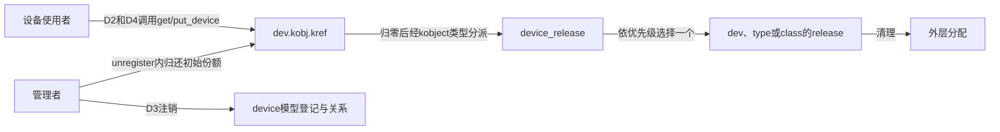
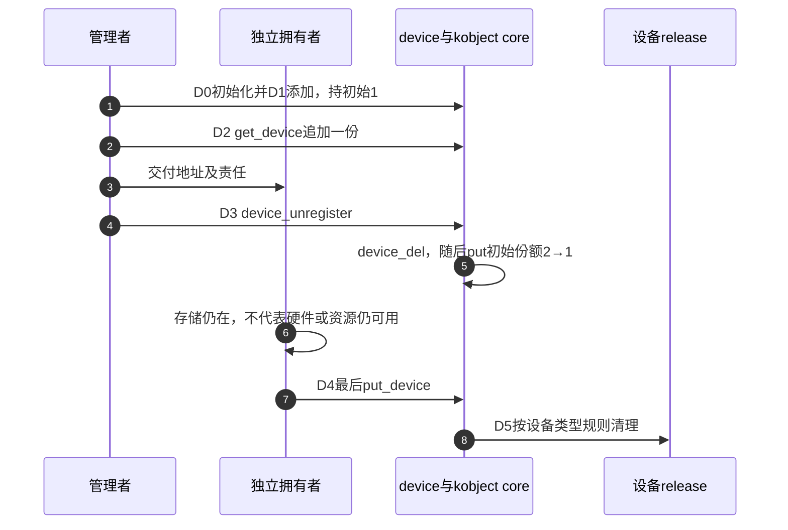

# 第8章\_device引用与资源退出导读

## 8.1\_读者任务与版本

固定NXP linux-imx提交dfaf2136deb2af2e60b994421281ba42f1c087e0、Linux6.12.20，身份见[基线](../../linux/SOURCE_BASELINE.md#1.1_当前来源)。已知[kobject类型清理](P07_kobject身份与类型清理导读.md#7.2_从K0到K5连接状态与回调)以后，本模块说明device的引用包装、注销和最终分派怎样接在其上；完整应用见[P11设备模块](../../../../knowledge/linux/object_lifetime/kref/P11_kref_refcount_t_kobject_的边界.md#11.4.1_device_driver_core_已经封装好的对象模型)。8.5继续区分公共分类/总线描述与内部引用，不展开完整probe匹配或总线注册。

## 8.2\_从D0到D5区分登记与存储

设备存储、设备模型登记、驱动绑定和受管资源是不同组状态。get_device接续存储期限，不把其他组状态固定在取得瞬间。

| 阶段 | 状态位置与责任 | 读取者和通信路径 |
| --- | --- | --- |
| D0 初始化 | device_initialize建立dev.kobj的初始引用和设备内部状态 | 创建者负责失败及成功路径的份额结算 |
| D1 添加 | device_add设置设备模型关系和可见入口 | 子系统按各自协议访问设备；不等于绑定了驱动 |
| D2 独立取得 | get_device→kobject_get→已有普通kref链 | 接收者保存同一dev地址的一份 |
| D3 注销 | device_unregister先device_del再put_device | 撤下与归还初始份额相接，其他拥有者可仍存在 |
| D4 最后归还 | 最后put进入kobject core的类型清理 | device_ktype把类型回调接到device_release |
| D5 回收 | device_release选择设备/type/class回调 | 回调清外壳，core按保存的p完成内部收尾 |

精确入口：[注册包装](../source_explanations/drivers/base/core.c.md#1.1_注册包装建立初始份额)、[取得与归还](../source_explanations/drivers/base/core.c.md#1.2_设备取得与归还进入kobject)、[注销包装](../source_explanations/drivers/base/core.c.md#1.3_注销同时归还初始化份额)、[最终回调选择](../source_explanations/drivers/base/core.c.md#1.4_最终release按对象类型选择)。应用不可直接操作dev.kobj.kref并指定自己的回调绕开这条链。

## 8.3\_设备引用不保留驱动受管资源

固定drivers/base/dd.c的[device_unbind_cleanup](../source_explanations/drivers/base/dd.c.md#1.1_解绑清理不等待设备引用归零)调用devres_release_all并清驱动/DMA等关联，不等待dev.kobj计数归零。这与最终device_release中的devres兜底处于不同阶段。devm API把资源挂入受管清理体系，不追加使用者对设备或资源的一份通用引用。

因此对象外壳仍有效时，旧devm缓冲区也可能已无效。驱动须停止新使用并排空旧使用，或给独立生命周期数据另建协议。源码核对不是实际执行解绑，宿主夹具的devres和添加/删除均为替身。

## 8.4\_证据与验证范围

完整模块ARM前端通过，372份头中360份非生成源码与固定提交无差异。宿主保留五个device函数、既有九个kobject函数和普通引用链，八组检查覆盖配置/分配/命名/添加失败、正常注销、三类release优先级、register包装与NULL取得/归还。设备初始化、添加、删除、命名、sysfs与devres等为显式替身，未执行完整driver core、真实解绑、设备事件、并发或目标装卸。delayed kobject release仍不在该同步模块支持范围。

回到[总阅读索引](P01_Linux_6.12_kref源码阅读索引.md#1.2_按问题进入已落地证据)，再区分类别自身release与设备实例release，以及私有对象如何连接设备份额。

## 8.5\_分类与总线的公共描述及内部份额

沿D0～D5看过设备实例后，改问分类和匹配规则由谁保存。公共class/bus_type描述与core内部subsys_private是不同对象：内部subsys的kset/kobject保存登记和引用状态，class或bus指针标识对应公共描述。驱动不能把此内部计数当成自己的私有对象引用。

| 阶段 | 分类退出中的状态与动作 | 对应源码入口 |
| --- | --- | --- |
| C0 准备退出 | 所属子系统停止新使用并撤下使用者；单个unregister不替代完整退出协议 | [正文的分类与总线选择](../../../../knowledge/linux/object_lifetime/kref/P11_kref_refcount_t_kobject_的边界.md#11.4.4_class_release_也不是_my_obj_release) |
| C1 临时取得 | class_to_subsys持class_kset列表锁定位，通过subsys_get保证返回内部对象有效 | [查找与取得](../source_explanations/drivers/base/class.c.md#1.1_查找内部对象会取得临时份额) |
| C2 结束登记 | class_unregister移除属性、注销内部kset，再subsys_put临时份额 | [注销配对](../source_explanations/drivers/base/class.c.md#1.2_注销配对登记与临时查找份额) |
| C3 最终清理 | 内部class_release调用公共class_release，再释放内部私有对象；动态公共描述由create_release释放 | [两块分配的清理](../source_explanations/drivers/base/class.c.md#1.3_动态描述与内部外壳各有清理者) |

同轴读bus：[bus_unregister](../source_explanations/drivers/base/bus.c.md#1.1_注销内部目录与登记份额)通过bus_to_subsys取得临时内部份额，清理登记后归还；[bus_release](../source_explanations/drivers/base/bus.c.md#1.2_内部release不释放公共bus_type描述)只释放内部subsys_private。它不释放公共bus_type，也不是设备实例的release回调。class.class_release与class.dev_release分别属于分类描述和设备实例，不能凭同名release混为一条链。

本单元核对固定class.c六个函数、bus.c两个函数及base.h/class.h/bus.h状态声明；未运行class/bus注册、实际sysfs、事件、模块退出或并发测试。概念阅读在此组织阶段和入口，八个函数体仅在实现页单一展开。

## 8.6\_私有会话连接设备份额

[完整会话应用](../../../../knowledge/linux/object_lifetime/kref/P11_kref_refcount_t_kobject_的边界.md#11.5.4_一个典型的分层结构)不改写driver core：独立note_session的每个实例在S1通过get_device拥有设备一份，多个私有拥有者共享这一桥接份额；S4私有kref归零先释放会话，再put_device。设备外壳的唯一回收者仍是S5设备release。S3注销结束初始化份额，不结束仍存会话的桥接份额。

按调用者阶段读已有实现：S1进入[设备取得](../source_explanations/drivers/base/core.c.md#1.2_设备取得与归还进入kobject)；S3进入[注销并归还初始化份额](../source_explanations/drivers/base/core.c.md#1.3_注销同时归还初始化份额)；S4私有最后归还调用应用session_release，再走同一put_device；S5进入[最终分派](../source_explanations/drivers/base/core.c.md#1.4_最终release按对象类型选择)。无需再复制这些函数体。

owner.lock保护closing和completed；同一锁把open/request与关闭排序，owner不可变且由桥接引用维持有效。该例只完成同步统计，没有硬件或异步在途操作，不能外推出关闭后任意I/O已经排空。若同一分配内放两个计数，必须另证唯一最终释放入口；两张引用表不足以防止其中一方提前free。

十组宿主检查覆盖配置、分配、命名、添加及会话分配失败，完整周期，关闭先于open，open先于关闭，两个独立会话，和会话先于设备注销结束。使用原有固定device/kobject/普通引用函数；锁、原子操作、登记和sysfs等为顺序替身。ARM前端通过，372份头中360份非生成源码与固定提交无差异。没有目标链接、装卸、真实并发或硬件测试。

回到[P11章末选择与练习](../../../../knowledge/linux/object_lifetime/kref/P11_kref_refcount_t_kobject_的边界.md#11.9_本章检查清单)，检查初始化份额重复归还、桥接清理先后及统计寿命解耦。题目复用上述固定证据，没有新增driver core运行结论。
