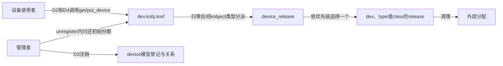
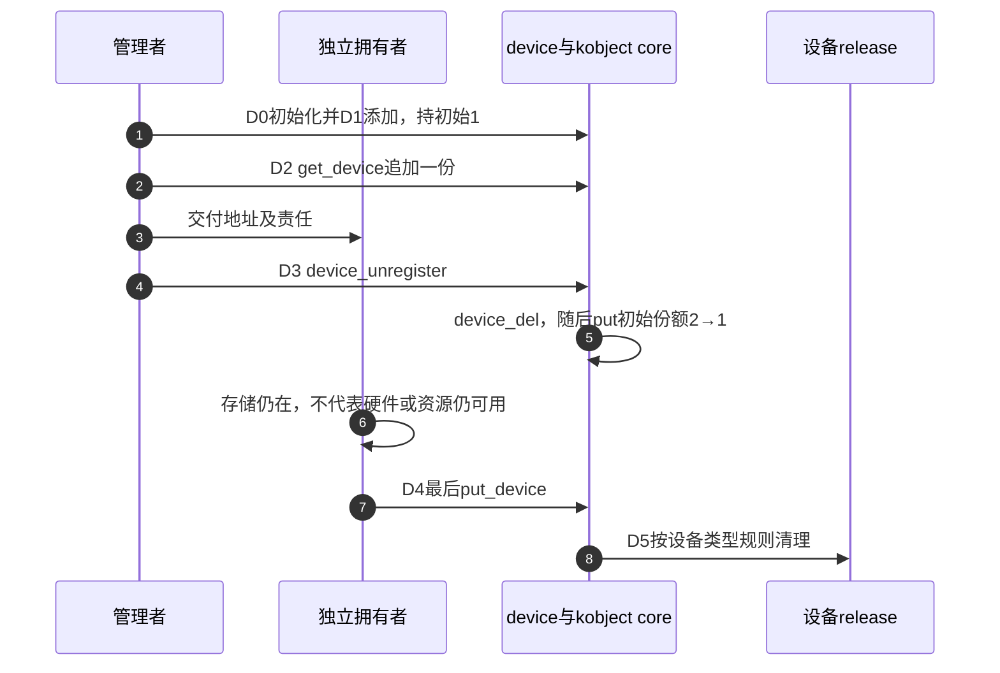

# 第8章\_device引用与资源退出导读

## 8.1\_读者任务与版本

固定NXP linux-imx提交dfaf2136deb2af2e60b994421281ba42f1c087e0、Linux6.12.20，身份见[基线](../../linux/SOURCE_BASELINE.md#1.1_当前来源)。已知[kobject类型清理](P07_kobject身份与类型清理导读.md#7.2_从K0到K5连接状态与回调)以后，本模块说明device的引用包装、注销和最终分派怎样接在其上；完整应用见[P11设备模块](../../../../knowledge/linux/object_lifetime/kref/P11_kref_refcount_t_kobject_的边界.md#11.4.1_device_driver_core_已经封装好的对象模型)。不展开完整probe匹配或总线注册。

## 8.2\_从D0到D5区分登记与存储

设备存储、设备模型登记、驱动绑定和受管资源是不同组状态。get_device接续存储期限，不把其他组状态固定在取得瞬间。

| 阶段 | 状态位置与责任 | 读取者和通信路径 |
| --- | --- | --- |
| D0 初始化 | device_initialize建立dev.kobj的初始引用和设备内部状态 | 创建者负责失败及成功路径的份额结算 |
| D1 添加 | device_add设置设备模型关系和可见入口 | 子系统按各自协议访问设备；不等于绑定了驱动 |
| D2 独立取得 | get_device→kobject_get→已有普通kref链 | 接收者保存同一dev地址的一份 |
| D3 注销 | device_unregister先device_del再put_device | 撤下与归还初始份额相接，其他拥有者可仍存在 |
| D4 最后归还 | 最后put进入kobject core的类型清理 | device_ktype把类型回调接到device_release |
| D5 回收 | device_release选择设备/type/class回调 | 回调清外壳，core按保存的p完成内部收尾 |

精确入口：[注册包装](../source_explanations/drivers/base/core.c.md#1.1_注册包装建立初始份额)、[取得与归还](../source_explanations/drivers/base/core.c.md#1.2_设备取得与归还进入kobject)、[注销包装](../source_explanations/drivers/base/core.c.md#1.3_注销同时归还初始化份额)、[最终回调选择](../source_explanations/drivers/base/core.c.md#1.4_最终release按对象类型选择)。应用不可直接操作dev.kobj.kref并指定自己的回调绕开这条链。

## 8.3\_设备引用不保留驱动受管资源

固定drivers/base/dd.c的[device_unbind_cleanup](../source_explanations/drivers/base/dd.c.md#1.1_解绑清理不等待设备引用归零)调用devres_release_all并清驱动/DMA等关联，不等待dev.kobj计数归零。这与最终device_release中的devres兜底处于不同阶段。devm API把资源挂入受管清理体系，不追加使用者对设备或资源的一份通用引用。

因此对象外壳仍有效时，旧devm缓冲区也可能已无效。驱动须停止新使用并排空旧使用，或给独立生命周期数据另建协议。源码核对不是实际执行解绑，宿主夹具的devres和添加/删除均为替身。

## 8.4\_证据与验证范围

完整模块ARM前端通过，372份头中360份非生成源码与固定提交无差异。宿主保留五个device函数、既有九个kobject函数和普通引用链，八组检查覆盖配置/分配/命名/添加失败、正常注销、三类release优先级、register包装与NULL取得/归还。设备初始化、添加、删除、命名、sysfs与devres等为显式替身，未执行完整driver core、真实解绑、设备事件、并发或目标装卸。delayed kobject release仍不在该同步模块支持范围。

回到[总阅读索引](P01_Linux_6.12_kref源码阅读索引.md#1.2_按问题进入已落地证据)，再区分类别自身release与设备实例release，以及私有对象如何连接设备份额。
