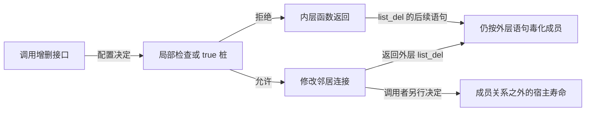

# 第2章\_拓扑修改与发布边界导读

[总索引](P01_Linux_6.12_链表源码阅读索引.md)固定了证据身份。这里沿教材的 S0 私有准备、S1 取得保护、S2 发布、S3 摘取、S4 处理、S5 回收寻找实现：哪些动作 list.h 完成，哪些动作必须留给调用者？

## 2.1\_先找到连接状态的地址

types.h 的 list_head 只有两个成员指针，list.h 不保存业务数据、成员总数或每个宿主的引用数。调用者在 S0 创建外层对象并填业务字段，S1 取得所需保护后才调用插入函数。__list_add 接收 new、prev、next 三个地址，检查后写邻居与新节点连接，完成 S2 的拓扑部分。

删除方向由 __list_del_entry 检查，再由 __list_del 连接两个邻居；list_del 随后毒化被摘成员，list_del_init 则重建自环。它们都没有执行 S5 的宿主释放，S3 之后是否取得独占使用权也不是链表函数判断的。

| 状态或符号 | 谁写、谁读 | 修改约束 |
| --- | --- | --- |
| head.next/prev | 初始化、插入、删除、拼接；判空与遍历读取 | 用调用方同步协议保护，判空不是成员预留 |
| 宿主.link.next/prev | 增删与移动路径；相邻节点和游标读取 | 同一成员不能同时挂两张表 |
| 待插入对象业务数据 | S0 调用者写；S2 后使用者读 | 按共同锁或匹配发布协议保证可见，list_add 本身不是通用发布屏障 |
| 遍历游标 pos/next | 宏在当前执行者局部保存 | safe 不会为 next 取得引用 |
| list_splice_tail_init 的源头 | 成批转移后初始化为空 | 消除对原头的拓扑依赖，但不复制业务对象 |

具体语句分为[初始化与接链](../source_explanations/include/linux/list.h.md#1.1_初始化与四条接链赋值)、[摘链与删除后状态](../source_explanations/include/linux/list.h.md#1.2_摘链与删除后状态)和[游标与批次转移](../source_explanations/include/linux/list.h.md#1.3_游标和批次转移)。INIT_LIST_HEAD 当前对两个方向都使用 WRITE_ONCE；旧稿的非对称初始化片段不能用来解释本版本。

## 2.2\_检查发生在修改之前

CONFIG_DEBUG_LIST 选择 CONFIG_LIST_HARDENED。未开启 hardened 时，__list_add_valid 和 __list_del_entry_valid 是返回 true 的桩；hardened 的普通路径做少量局部校验，debug 或需要报告时进入 lib/list_debug.c。检查读取实际 next/prev 与候选地址，不维护额外的全局成员历史。

__list_add_valid_or_report 检查 NULL、邻居互指与 new 等于直接邻居等条件；这不等于在全系统查找重复成员。__list_del_entry_valid_or_report 检查 NULL、毒化和邻接关系，也不验证任意业务引用。报告策略由 CHECK_DATA_CORRUPTION 及相关配置决定，不能把被报告的错误当成可继续正常使用的事务结果。

版本化符号在源文件中可查，教材的检查模型见[调试与验证](../../../../knowledge/linux/data_structures/单链表_linked_list/P06_调试与验证.md)。如果配置没开、某个调用路径没执行或驱动绕过原语，未告警不能承担正确性证明。

## 2.3\_一次执行不等于成功初始化

once.h 的 DO_ONCE 每个展开点保存 done 与 static key。lib/once.c 的 once_lock 是普通变体共用的自旋锁；__do_once_start 获取锁并检查 done，为 false 时把锁保留给回调，__do_once_done 写 true、解锁并安排静态分支禁用。sleepable 变体对应 once_mutex 和两份辅助函数。

状态分三层：done 表示回调已经执行；static key 决定后续快速分支；once_work 保存延迟禁用键所需的工作项、键地址和模块引用。分配 once_work 失败只失去优化，不清除 done。后台工作禁用键后归还模块引用并释放工作对象。回调内部的业务成功/失败不在这三层中，需要调用者单独设计。

DO_ONCE_LITE 使用不同的简化标志路径，没有同样的锁与静态键协议；不能把它的边界反推到 DO_ONCE。锁也要求回调避免递归进入相同公共锁路径。教材将复杂的可失败初始化保留为明确的锁、候选和重试协议，而不把宏返回的执行标志当错误码。

## 2.4\_读子系统时不要只找next

| 只读位置 | 本批核对事实 | 未扩张的范围 |
| --- | --- | --- |
| include/linux/wait.h | wait_queue_head.lock/head；wait_queue_entry.flags/private/func/entry；init_waitqueue_head | 不重新展开防丢唤醒和调度状态机 |
| include/linux/skbuff.h | sk_buff_head.next/prev/qlen/lock；skb_queue_head_init 与队列操作 | 不把普通 list_add 替代包队列协议 |
| mm/slab.h | struct slab 的 slab_list、freelist，kmem_cache 的缓存列表成员 | 不把所有空闲对象组织归纳成同一表 |
| drivers/base/base.h、include/linux/klist.h | device_private 的多组 knode，klist_node 的 n_node/n_ref | 迭代引用与普通裸链表不同 |
| include/asm-generic/rwonce.h、ARM barrier.h | 单次访问尺寸限制与架构屏障实现分层；32 位上的 64 位访问并非一律原子 | 不从指针宽度推出所有数据访问行为 |
| Documentation/core-api/wrappers/memory-barriers.rst | READ/WRITE_ONCE、发布与顺序契约 | 不把 volatile 解释为绕过 CPU 缓存 |
| include/linux/llist.h | 单向原子头接口的生产者/消费者矩阵、批次遍历和 NMI 条件 | 不声称任意共享遍历或多消费者 del_first 无锁安全 |

保存全文的文件和仅只读核对文件按[源码基线](../../linux/SOURCE_BASELINE.md)区分。返回[总索引](P01_Linux_6.12_链表源码阅读索引.md)或[教材](../../../../knowledge/linux/data_structures/单链表_linked_list/大纲.md)。
