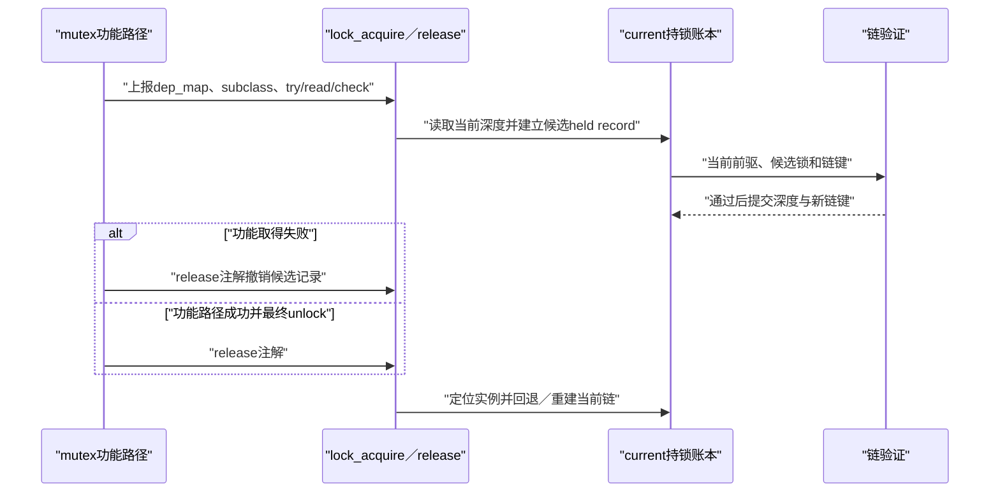

# 第2章\_Linux\_6.12\_Lockdep身份与事件接入模块导读

## 2.1\_模块问题

本模块回答：标准锁对象怎样成为 Lockdep 能识别的实例，同一初始化调用点的动态对象怎样共享锁类，以及一次 acquire/release 怎样把功能路径事实同步到 current 影子账本。

总入口见 [Linux 6.12 Lockdep 源码导读](P01_Linux_6.12_Lockdep源码导读.md#1.1_基线与阅读目标)，稳定机制见[锁实例、锁类、key 与 subclass](../../../../knowledge/linux/synchronization/lockdep/P03_锁实例_锁类_key与subclass.md#3.1_为什么不能给每个地址建一个永久图节点)。

## 2.2\_参与者与状态

| 参与者 | 状态位置 | 写入事件 | 后续消费者 |
| --- | --- | --- | --- |
| 标准锁初始化宏 | 调用点静态 `lock_class_key` | 动态对象初始化 | `lockdep_init_map_type()` |
| 具体锁实例 | 嵌入 `lockdep_map` | 初始化、set class | 锁类查找与 current 实例查询 |
| 锁类登记器 | 全局 class hash/数组 | 首次取得或显式 subclass 初始化 | 依赖图与使用状态 |
| 当前任务 | `held_locks[]`、深度和链键 | acquire 提交、release 回退 | 下一次 acquire、查询、断言和报告 |

## 2.3\_初始化链怎样形成分类

运行时 `mutex_init(&obj->lock)` 在调用点建立静态 key，底层同时初始化 mutex 功能状态和 dep map。许多经过相同调用点初始化的对象实例因而共享 class key。静态定义锁则可以从持久静态对象取得身份。

具体结构和初始化代码见：

- [`lock_class_key` 与 `lockdep_map` 身份结构](../source_explanations/P05_Linux_6.12_Lockdep身份与锁类源码实现.md#5.2_lock_class_key与lockdep_map身份结构)
- [`lockdep_init_map_type()` 与关闭配置分支](../source_explanations/P05_Linux_6.12_Lockdep身份与锁类源码实现.md#5.3_lockdep_init_map_type与关闭配置分支)
- [`register_lock_class()` 锁类注册](../source_explanations/P05_Linux_6.12_Lockdep身份与锁类源码实现.md#5.4_register_lock_class锁类注册)

模块层结论是：key 需要表达 **逻辑同类** 并具有足够生命期，不能用修改 key 当作压制依赖告警的快捷方式。

## 2.4\_取得与释放调用链

具体状态写入只在下列唯一实现标题展开：

- [`task_struct` 持锁账本与 `held_lock`](../source_explanations/P06_Linux_6.12_Lockdep取得释放与持锁账本源码实现.md#6.2_task_struct持锁账本与held_lock)
- [`lock_acquire()` 事件入口](../source_explanations/P06_Linux_6.12_Lockdep取得释放与持锁账本源码实现.md#6.3_lock_acquire事件入口)
- [`__lock_acquire()` 取得状态提交](../source_explanations/P06_Linux_6.12_Lockdep取得释放与持锁账本源码实现.md#6.4___lock_acquire取得状态提交)
- [`__lock_release()` 释放与链回退](../source_explanations/P06_Linux_6.12_Lockdep取得释放与持锁账本源码实现.md#6.5___lock_release释放与链回退)

## 2.5\_阅读时必须区分的边界

- `lock_acquire()` 是检查事件名，不是功能 mutex 已成功，也不是硬件 acquire memory ordering；
- `held_locks[]` 像栈但支持部分非栈顶释放重建，不能按普通调用栈理解；
- release 移除 current 记录，不删除锁类图中的历史依赖；
- trylock 仍可能进入 current 状态，但不按普通阻塞取得增加同样的依赖；
- `CONFIG_LOCKDEP=n` 时检查状态可以消失，标准锁的功能状态仍必须初始化和维护。

## 2.6\_下一步阅读

身份和 current 账本清楚以后，进入[依赖图与规则引擎模块导读](P03_Linux_6.12_Lockdep依赖图与规则引擎模块导读.md#3.1_模块问题)，追踪候选前驱怎样成为全局边。
