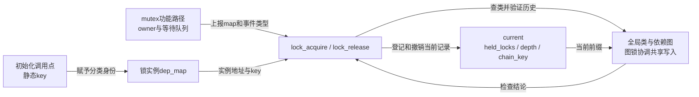
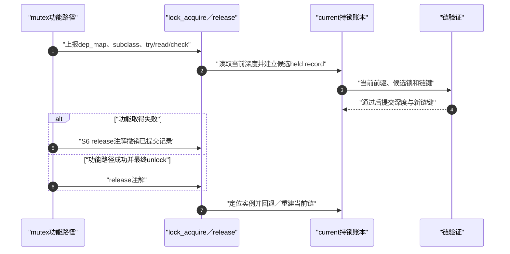

# 第2章\_Linux\_6.12\_Lockdep身份与事件接入模块导读

## 2.1\_模块问题

本模块回答：标准锁对象怎样成为 Lockdep 能识别的实例，同一初始化调用点的动态对象怎样共享锁类，以及一次 acquire/release 怎样把功能路径事实同步到 current 影子账本。

阅读边界固定为 NXP Linux 6.12.20 提交 `dfaf2136deb2af2e60b994421281ba42f1c087e0`，以下以检查器有效、非 PREEMPT_RT 的普通阻塞 mutex 路径为主。这里的任务是找到状态地址及函数之间的交接点；宏体和函数体仍在对应实现标题单独展开。尤其要避免从 `acquire` 这个名字猜测功能锁已经取得。

总入口见 [Linux 6.12 Lockdep 源码导读](P01_Linux_6.12_Lockdep源码导读.md#1.1_基线与阅读目标)，稳定机制见[锁实例、锁类、key 与 subclass](../../../../knowledge/linux/synchronization_and_asynchrony/synchronization/lockdep/P03_锁实例_锁类_key与subclass.md#3.1_从动态对象规模推导锁类)。

## 2.2\_参与者与状态

| 参与者 | 状态位置 | 写入事件 | 后续消费者 |
| --- | --- | --- | --- |
| 标准锁初始化宏 | 调用点静态 `lock_class_key` | 动态对象初始化 | `lockdep_init_map_type()` |
| 具体锁实例 | 嵌入 `lockdep_map` | 初始化、set class | 锁类查找与 current 实例查询 |
| 锁类登记器 | 全局 class hash/数组 | 首次取得或显式 subclass 初始化 | 依赖图与使用状态 |
| 当前任务 | `held_locks[]`、深度和链键 | acquire 提交、release 回退 | 下一次 acquire、查询、断言和报告 |

当前状态具体落在 `current->held_locks[]`、`current->lockdep_depth` 和 `current->curr_chain_key`。锁对象里的 `dep_map` 提供本实例地址和分类信息；它不是另一份 mutex owner。全局 `lock_classes[]` 及类哈希让不同任务按同一 key/subclass 找到同一类，依赖历史由规则引擎维护。当前任务通过同步函数调用更新自己的账本；新增全局状态需要图锁协调，不能把“每任务账本”误读为整个检查器都不发生跨 CPU 共享访问。

## 2.3\_初始化链怎样形成分类

运行时 `mutex_init(&obj->lock)` 在调用点建立静态 key，底层同时初始化 mutex 功能状态和 dep map。许多经过相同调用点初始化的对象实例因而共享 class key。静态定义锁则可以从持久静态对象取得身份。

具体结构和初始化代码见：

- [`lock_class_key` 与 `lockdep_map` 身份结构](../source_explanations/include/linux/lockdep_types.h.md#1.2_lock_class_key与lockdep_map身份结构)
- [`lockdep_init_map_type()` 与关闭配置分支](../source_explanations/kernel/locking/lockdep.c.md#1.3_lockdep_init_map_type与关闭配置分支)
- [`register_lock_class()` 锁类注册](../source_explanations/kernel/locking/lockdep.c.md#1.4_register_lock_class锁类注册)

模块层结论是：key 需要表达 **逻辑同类** 并具有足够生命期，不能用修改 key 当作压制依赖告警的快捷方式。

## 2.4\_取得与释放调用链

沿同一把 mutex 读一次完整周期。这里沿用知识章的 S0～S6；功能 owner、当前账本、全局历史和 `debug_locks` 是不同状态轴，不能用一个“已持锁”位概括。

| 阶段 | 触发与写入者 | 状态落点及后续读取 | 进入下一阶段的条件 |
| --- | --- | --- | --- |
| S0 | 功能路径准备取得，调用 `mutex_acquire_nest()` | 将 `dep_map` 与取得参数传给 `lock_acquire()` | 检查入口允许继续处理 |
| S1 | 类查找/登记代码解析 key 与 subclass | map缓存及全局类身份；后续候选记录引用类 | 找到有效类 |
| S2 | `__lock_acquire()` 填候选 | `held_locks[lockdep_depth]`，此时深度尚未增加 | 候选字段与当前上下文可检查 |
| S3 | 检查代码处理上下文/使用状态和链键 | 当前前缀、类使用状态、候选链；规则引擎读取 | 前置检查通过 |
| S4 | `validate_chain()` 验证适用的新链 | 全局依赖/链历史，必要时受图锁保护 | 验证成功；失败不能冒充正式提交 |
| S5 | `__lock_acquire()` 提交当前状态 | 写 `curr_chain_key` 并增加 `lockdep_depth`；下一次取得或查询读取 | 检查事件结束，功能路径继续尝试 mutex |
| S6 | 功能失败回退，或正常解锁，上报 release | 撤销/重建当前账本；历史依赖通常保留 | 本次检查配对结束 |

最容易读反的是 S5：它表示 **检查器已登记这次阻塞取得事件**，不是 mutex 已经把 owner 交给 current。固定版本的公共取得函数 `__mutex_lock_common()` 在 `mutex_acquire_nest()` 之后才进行相应的尝试、乐观自旋和排队；可中断等待失败时，通过释放注解 `mutex_release()` 撤销的已经是正式记录。S2～S4 内部检查失败则是另一条路径，不能称为“功能失败后撤销候选”。功能侧次序可对照 [mutex取得公共路径](../../locking/source_explanations/kernel/locking/mutex.c.md#1.4_mutex_lock_common的阶段)。

上图从事件登记走向功能结果，省略的是 mutex owner 的具体竞争过程，不是把 owner 隐藏在检查账本里。若释放的记录不在栈顶，释放路径要在移除目标后重放后续检查记录，重算链；它不会替业务重新取得那些功能锁。特殊合并记录还可能先递减引用数而保持深度不变，继续读实现时须同时看 `references` 和 `nest_lock` 分支。

具体状态写入只在下列唯一实现标题展开：

- [`task_struct` 持锁账本与 `held_lock`](../source_explanations/P02_Linux_6.12_Lockdep取得释放与持锁账本源码实现.md#2.2_task_struct持锁账本与held_lock)
- [`lock_acquire()` 事件入口](../source_explanations/P02_Linux_6.12_Lockdep取得释放与持锁账本源码实现.md#2.3_lock_acquire事件入口)
- [`__lock_acquire()` 取得状态提交](../source_explanations/P02_Linux_6.12_Lockdep取得释放与持锁账本源码实现.md#2.4___lock_acquire取得状态提交)
- [`__lock_release()` 释放与链回退](../source_explanations/P02_Linux_6.12_Lockdep取得释放与持锁账本源码实现.md#2.5___lock_release释放与链回退)

## 2.5\_阅读时必须区分的边界

- `lock_acquire()` 是检查事件名，不是功能 mutex 已成功，也不是硬件 acquire memory ordering；
- `held_locks[]` 像栈但支持部分非栈顶释放重建，不能按普通调用栈理解；
- release 移除 current 记录，不删除锁类图中的历史依赖；
- trylock 仍可能进入 current 状态，但不按普通阻塞取得增加同样的依赖；
- `CONFIG_LOCKDEP=n` 时检查状态可以消失，标准锁的功能状态仍必须初始化和维护。

## 2.6\_下一步阅读

读实现前先预测两个现场：可中断 mutex 在等待中收到信号，S5 是否已经发生？在这里的路径上已经发生，因此必须用 S6 配对撤销。释放当前前缀中间的锁时，重建链是否会再次阻塞在功能 mutex？不会，重放的是检查事件。如果源码阅读得到相反结论，优先检查自己是否把候选、正式记录与功能 owner 混在了一起。

身份和 current 账本清楚以后，进入[依赖图与规则引擎模块导读](P03_Linux_6.12_Lockdep依赖图与规则引擎模块导读.md#3.1_模块问题)，追踪候选前驱怎样成为全局边。
