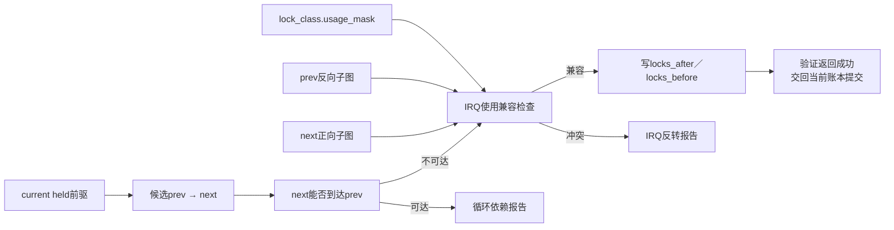
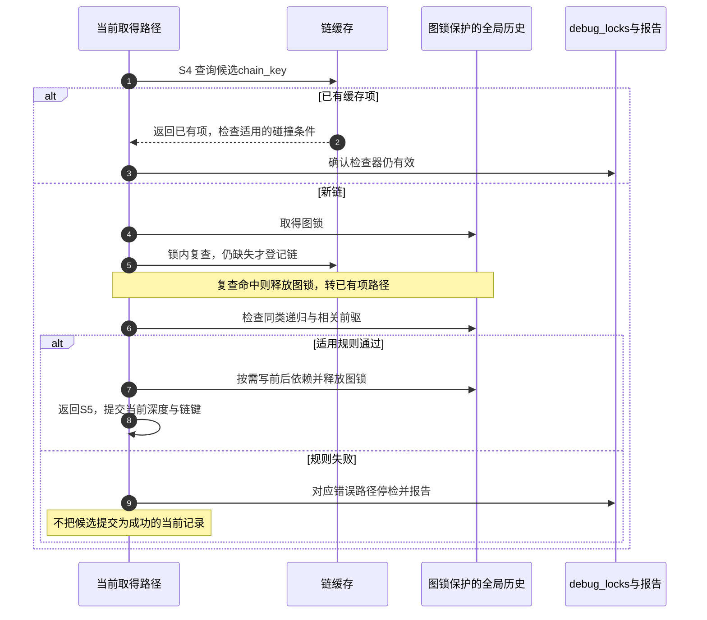

# 第3章\_Linux\_6.12\_Lockdep依赖图与规则引擎模块导读

## 3.1\_模块问题

本模块回答：当前任务持有 `[A]` 并取得 B 时，`A → B` 怎样被验证和保存；为什么同类递归单独检查；锁类的 IRQ 使用事实怎样沿全局依赖图形成反转证明。

版本固定为 NXP Linux 6.12.20 提交 `dfaf2136deb2af2e60b994421281ba42f1c087e0`。以下主路径假定 `CONFIG_PROVE_LOCKING` 开启、检查器有效，并以普通阻塞独占取得引出验证流程；读类型、trylock和合并记录不能直接套用无类型有向图。上一模块的 S3 负责使用状态与链键，本模块细读 S4 的共享历史验证，再把结果交回 S5 当前账本提交。

前置阅读：[身份与事件接入模块导读](P02_Linux_6.12_Lockdep身份与事件接入模块导读.md#2.1_模块问题)。稳定规则模型见[递归、依赖环、IRQ 与读写规则](../../../../knowledge/linux/synchronization_and_asynchrony/synchronization/lockdep/P05_递归_依赖环_IRQ与读写规则.md#5.1_先明确闭环搜索要回答什么)。

## 3.2\_规则链而不是一个环检测函数

```text
__lock_acquire()
  → mark_usage()                     记录当前上下文使用事实
  → validate_chain()                 先查链缓存；未命中时登记后继续验证
      → check_deadlock()             当前账本中的同类递归
      → check_prevs_add()            选择相关前驱
          → check_prev_add()
              → check_noncircular()  从next搜索能否到prev
              → check_irq_usage()    连接前后子图的IRQ状态
              → add_lock_to_list()   验证通过才写前向／反向边
```

任何一步失败都会阻止当前候选链成为可信新历史。不要只找到 `check_noncircular()` 就把 Lockdep 写成单一 DFS/BFS 环检测器。

这里的“可信”不等于失败前没有写过任何内存。`lookup_chain_cache_add()` 在新链路径中先取得图锁，再查一次缓存以避免其他 CPU 已经插入同一项，随后登记链缓存，才继续调用递归和前驱验证。因此，**缓存登记早于整条新链验证完成**。出错时需要结合停检状态理解已经留下的内容，不能从“缓存中有这个键”反推所有检查通过。命中旧链、trylock或不要求检查的事件也必须经过检查器生命状态边界；它们不是进入完整新链验证的同义词。

## 3.3\_状态传播图



图中只画新边验证内部；链缓存登记发生在进入这段检查之前。状态的承载地址也要分开：当前前驱来自 `current->held_locks[]`，上下文事实保存在对应 `lock_class.usage_mask`，前后历史由类的 `locks_after/locks_before` 链表连接，缓存保存链身份。图锁串行化相关共享修改，函数返回把结果交回当前调用者；这里没有另一个后台线程替该任务完成证明。



## 3.4\_为什么要保存前向和反向边

- 环检查从新后继出发沿前向边找旧前驱；
- IRQ 规则既要从 prev 向后看谁曾取得它，也要从 next 向前看它将取得谁；
- 报告需要还原一条可解释的历史路径，而不只是返回布尔结果。

因此 `lock_class` 同时维护 `locks_after` 与 `locks_before`。这是全局历史，不因当前任务 release 删除。

用一条具体路径核对遍历方向：历史中已有 `H → A` 和 `B → U`，现在准备接入 `A → B`。从 A 的反向子图能找到 H，从 B 的正向子图能找到 U；如果 H 的已记录使用状态是相应 IRQ-safe，U 是相应 IRQ-unsafe，新边会连接出 `H → A → B → U` 的危险依赖。只检查 A 和 B 自己的使用位会遗漏两端历史。这正是 `check_irq_usage()` 需要两侧子图、而不能只比较当前两把锁的原因。具体类型兼容条件继续沿唯一实现入口阅读，不把所有读边都视为相同阻塞能力。

## 3.5\_具体实现入口

- [`check_deadlock()` 同类递归检查](../source_explanations/P03_Linux_6.12_Lockdep依赖图与规则引擎源码实现.md#3.2_check_deadlock同类递归检查)
- [`mark_usage()` 锁类上下文状态](../source_explanations/P03_Linux_6.12_Lockdep依赖图与规则引擎源码实现.md#3.3_mark_usage锁类上下文状态)
- [`check_prev_add()` 新依赖验证](../source_explanations/P03_Linux_6.12_Lockdep依赖图与规则引擎源码实现.md#3.4_check_prev_add新依赖验证)
- [`check_irq_usage()` IRQ依赖传播检查](../source_explanations/P03_Linux_6.12_Lockdep依赖图与规则引擎源码实现.md#3.5_check_irq_usageIRQ依赖传播检查)
- [`validate_chain()` 链缓存门控](../source_explanations/P03_Linux_6.12_Lockdep依赖图与规则引擎源码实现.md#3.6_validate_chain链缓存门控)

## 3.6\_阅读边界

- trylock 不按普通阻塞边处理，但 current 状态仍要维护；
- 跨 IRQ 上下文的 held 记录可以共享任务账本，链键和直接边在上下文边界分隔，IRQ 图规则负责另一路证明；
- 读锁边带有取得类型，只有强依赖环才对应阻塞闭包；
- wait-context 和 PREEMPT_RT 规则属于同一入口中的另一组检查，不应无版本边界外推；
- 图算法证明依赖输入的一致性，不证明业务对象生命期或共享数据无竞争。

## 3.7\_下一步阅读

阅读实现后应能回答：为什么缓存未命中以后还要在图锁内重查？因为另一 CPU 可能在第一次查询后登记同一链，锁内重查避免重复插入。缓存项存在而 `debug_locks=0` 能否作为验证成功证据？不能，它不包含检查器仍有效的保证。释放 A 是否应删除 `A → B` 历史？不应按普通release删除，否则下一任务无法组合已观察的顺序。这三个问题分别检查共享写入、证明资格与跨时间历史，不能用一句“有缓存所以快”代替。

完成图规则以后，进入[查询适配与诊断模块导读](P04_Linux_6.12_Lockdep查询适配与诊断模块导读.md#4.1_模块问题)，观察业务断言和 RCU 怎样复用 current 状态，并学习检查器停检与 proc 输出。
