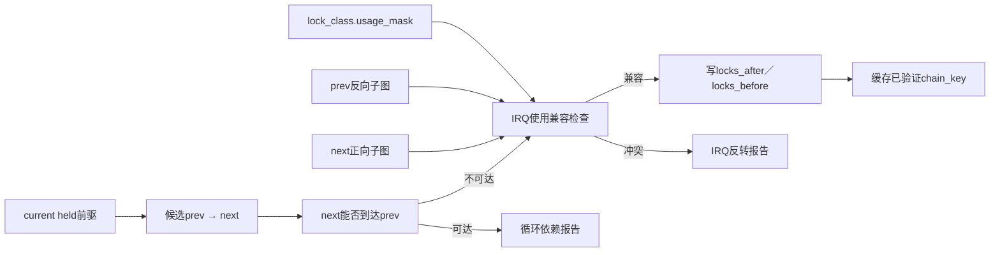

# 第3章\_Linux\_6.12\_Lockdep依赖图与规则引擎模块导读

## 3.1\_模块问题

本模块回答：当前任务持有 `[A]` 并取得 B 时，`A → B` 怎样被验证和保存；为什么同类递归单独检查；锁类的 IRQ 使用事实怎样沿全局依赖图形成反转证明。

前置阅读：[身份与事件接入模块导读](P02_Linux_6.12_Lockdep身份与事件接入模块导读.md#2.1_模块问题)。稳定规则模型见[递归、依赖环、IRQ 与读写规则](../../../../knowledge/linux/synchronization/lockdep/P05_递归_依赖环_IRQ与读写规则.md#5.1_先检查同类递归)。

## 3.2\_规则链而不是一个环检测函数

```text
__lock_acquire()
  → mark_usage()                     记录当前上下文使用事实
  → validate_chain()                 先查已验证链缓存
      → check_deadlock()             当前账本中的同类递归
      → check_prevs_add()            选择相关前驱
          → check_prev_add()
              → check_noncircular()  从next搜索能否到prev
              → check_irq_usage()    连接前后子图的IRQ状态
              → add_lock_to_list()   验证通过才写前向／反向边
```

任何一步失败都会阻止当前候选链成为可信新历史。不要只找到 `check_noncircular()` 就把 Lockdep 写成单一 DFS/BFS 环检测器。

## 3.3\_状态传播图



## 3.4\_为什么要保存前向和反向边

- 环检查从新后继出发沿前向边找旧前驱；
- IRQ 规则既要从 prev 向后看谁曾取得它，也要从 next 向前看它将取得谁；
- 报告需要还原一条可解释的历史路径，而不只是返回布尔结果。

因此 `lock_class` 同时维护 `locks_after` 与 `locks_before`。这是全局历史，不因当前任务 release 删除。

## 3.5\_具体实现入口

- [`check_deadlock()` 同类递归检查](../source_explanations/P07_Linux_6.12_Lockdep依赖图与规则引擎源码实现.md#7.2_check_deadlock同类递归检查)
- [`mark_usage()` 锁类上下文状态](../source_explanations/P07_Linux_6.12_Lockdep依赖图与规则引擎源码实现.md#7.3_mark_usage锁类上下文状态)
- [`check_prev_add()` 新依赖验证](../source_explanations/P07_Linux_6.12_Lockdep依赖图与规则引擎源码实现.md#7.4_check_prev_add新依赖验证)
- [`check_irq_usage()` IRQ依赖传播检查](../source_explanations/P07_Linux_6.12_Lockdep依赖图与规则引擎源码实现.md#7.5_check_irq_usageIRQ依赖传播检查)
- [`validate_chain()` 链缓存门控](../source_explanations/P07_Linux_6.12_Lockdep依赖图与规则引擎源码实现.md#7.6_validate_chain链缓存门控)

## 3.6\_阅读边界

- trylock 不按普通阻塞边处理，但 current 状态仍要维护；
- 跨 IRQ 上下文的 held 记录可以共享任务账本，链键和直接边在上下文边界分隔，IRQ 图规则负责另一路证明；
- 读锁边带有取得类型，只有强依赖环才对应阻塞闭包；
- wait-context 和 PREEMPT_RT 规则属于同一入口中的另一组检查，不应无版本边界外推；
- 图算法证明依赖输入的一致性，不证明业务对象生命期或共享数据无竞争。

## 3.7\_下一步阅读

完成图规则以后，进入[查询适配与诊断模块导读](P04_Linux_6.12_Lockdep查询适配与诊断模块导读.md#4.1_模块问题)，观察业务断言和 RCU 怎样复用 current 状态，并学习检查器停检与 proc 输出。
