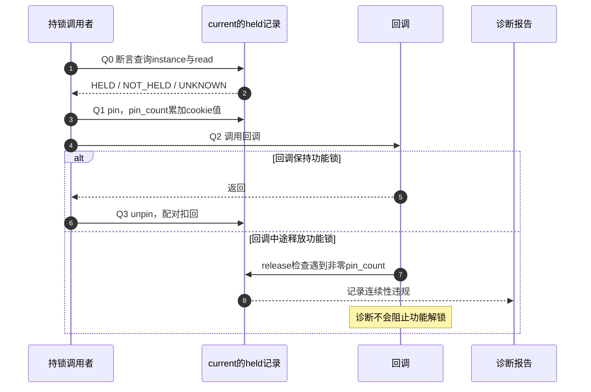
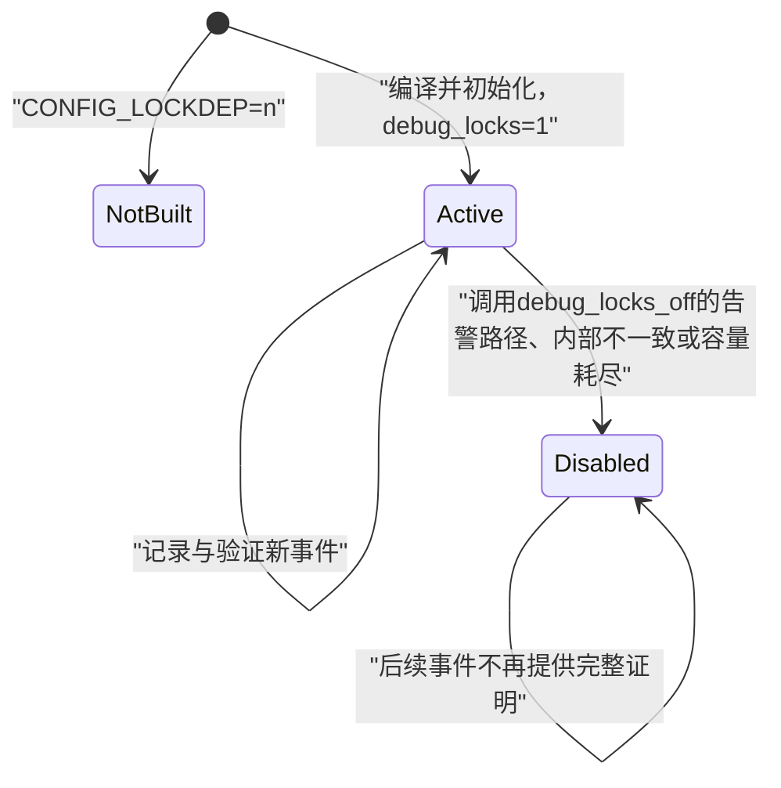

# 第4章\_Linux\_6.12\_Lockdep查询适配与诊断模块导读

## 4.1\_模块问题

本模块回答：`lockdep_is_held()` 怎样从 current 账本查询指定实例，断言为何接受 UNKNOWN，RCU 怎样把条件接入 Lockdep，以及 `/proc/lockdep_stats` 怎样表明检查器仍在工作。

采用 NXP Linux 6.12.20 固定提交 `dfaf2136deb2af2e60b994421281ba42f1c087e0`。前两篇追踪事件怎样写入当前记录和全局历史，这一篇追踪消费者怎样读取它们；查询返回、断言不告警和全局检查器有效，是三个不同结论。

总入口见 [Linux 6.12 Lockdep 源码导读](P01_Linux_6.12_Lockdep源码导读.md#1.1_基线与阅读目标)。稳定用法见[查询、断言、pin 与自定义原语接入](../../../../knowledge/linux/synchronization_and_asynchrony/synchronization/lockdep/P06_查询_断言_pin与自定义原语接入.md#6.1_先确认自己在哪一层使用Lockdep)，配置、报告和覆盖边界见[配置、亲手实验与报告解读](../../../../knowledge/linux/synchronization_and_asynchrony/synchronization/lockdep/P08_配置_亲手实验与报告解读.md#8.1_先把使用资格变成环境检查)与[成本、覆盖边界与工程选择](../../../../knowledge/linux/synchronization_and_asynchrony/synchronization/lockdep/P09_成本_覆盖边界与工程选择.md#9.1_先把无告警写成条件命题)。

## 4.2\_查询链

```text
lockdep_is_held(&lock)
  → &(lock)->dep_map
  → lock_is_held()
  → lock_is_held_type(map, -1)
  → 检查器不可用：LOCK_STATE_UNKNOWN
  → 检查器可用：遍历current->held_locks[]
      → match_held_lock()通常匹配实例；特殊合并记录还可能按类匹配
      → 可选核对read类型
```

查询只读 current 状态，不读取 mutex owner，也不扫描其他任务。具体实现见 [`lock_is_held_type()` 当前持锁查询](../source_explanations/P04_Linux_6.12_Lockdep查询注解与配置源码实现.md#4.2_lock_is_held_type当前持锁查询)。

顺着实现先找 `current->lockdep_depth` 限定遍历范围，再看 `current->held_locks[i].instance` 与目标 map；`references/nest_lock` 对应的合并情形不能忽略。类型参数 `read=-1` 表示不限定读/写，指定类型时还要检查记录中的 `read`。这不是用锁地址读取任意任务 owner 的接口。

头文件把 UNKNOWN 定义为 -1、NOT_HELD 定义为 0、HELD 定义为 1。对C调用者，直接把结果放进 `if` 会把 UNKNOWN 也当成真。因此这些返回值适合表达诊断资格，不能用来决定“看起来已经持锁就跳过功能加锁”。即使比较结果等于 HELD，也不会替代调用者必须遵守的锁协议。

## 4.3\_断言与pin怎样消费held\_record

`lockdep_assert_held()` 只有在结果明确为 NOT_HELD 时才告警，避免检查器失效时误报“未持锁”；pin 则在已经匹配的 held record 上增加 `pin_count`，使中途 release 可以被发现。

pin写入的是 `current->held_locks[]` 中匹配记录的计数，返回的cookie用来配对扣回；它既不是 mutex owner，也不是对象引用。下面把一次回调前后的诊断分成Q0至Q3，便于对照查询、pin和释放三个入口：



Q0只回答一个时点的问题，Q1至Q3才试图检查中间的连续性；回调偷放再重取，前后两次普通断言仍可能都通过。若检查关闭、检查器已失效或路径没有执行，这条诊断链就不构成保证。正常业务必须自行确保回调契约、锁对象寿命和功能同步成立。

唯一实现入口：

- [`lockdep_assert` 系列断言展开](../source_explanations/P04_Linux_6.12_Lockdep查询注解与配置源码实现.md#4.3_lockdep_assert系列断言展开)
- [`lockdep_pin_lock()` 锁保持注解](../source_explanations/P04_Linux_6.12_Lockdep查询注解与配置源码实现.md#4.4_lockdep_pin_lock锁保持注解)

## 4.4\_RCU适配链

RCU 的 `rcu_lock_map` 等虚拟 map 使用同一 held record 设施；`rcu_read_lock_held()` 查询虚拟 map，业务锁条件则直接调用 `lockdep_is_held()`。`RCU_LOCKDEP_WARN()` 在 RCU 检查可用时消费布尔条件。

这里的查询还经过RCU自己的上下文与配置判断，不能简化为总是直接查map；关闭相应检查的分支可以退化为无法核实实际保护的返回值。`RCU_LOCKDEP_WARN` 的条件表示“应报告违规”，方向与访问器收到的“保护理由成立”条件相反。沿下面的RCU入口核对这些分支，不把通用查询函数复制成另一份RCU实现。

Lockdep 核心查询在本专题展开；RCU map 与宏体的权威实现仍链接：

- [RCU Lockdep适配层源码实现](../../rcu/source_explanations/P04_Linux_6.12_RCU_Lockdep适配层源码实现.md#4.1_实现所有权与读者目标)
- [`RCU_LOCKDEP_WARN()` 检查适配层](../../rcu/source_explanations/P01_Linux_6.12_RCU_公共接口与检查机制源码详解.md#1.6_RCU_LOCKDEP_WARN检查适配层)

## 4.5\_配置与生命状态



`CONFIG_LOCKDEP=y` 只表示代码存在；当前是否仍有效要看 `debug_locks`。配置关系和关闭分支见 [`PROVE_LOCKING`、`DEBUG_LOCK_ALLOC` 与 `LOCKDEP`](../source_explanations/P04_Linux_6.12_Lockdep查询注解与配置源码实现.md#4.5_PROVE_LOCKING_DEBUG_LOCK_ALLOC与LOCKDEP)。

这张图只表示全局生命状态。`debug_locks=1` 是必要条件，不能证明当前入口没有递归抑制、目标原语已接入或所有路径都执行。读取proc得到的是观察时点的状态，还要与目标路径运行前后的记录配对。不能把一个全局位当成某次查询必定有确定答案的保证。

容量上限不是附带数字，而是检查结论成立的前提。锁类槽位、任务持锁深度、其他状态池和容量失败后的停检行为见[容量常量与停检边界](../source_explanations/P04_Linux_6.12_Lockdep查询注解与配置源码实现.md#4.7_容量常量与停检边界)。

## 4.6\_诊断输出链

`kernel/locking/lockdep.c` 的各类 `print_*_bug()` 输出当前新事件、历史路径和 held locks；`lockdep_proc.c` 另提供全局计数和类/链视图。读取 `/proc/lockdep_stats` 时至少看：

- `lock-classes`、`direct dependencies`、`dependency chains`；
- `stack-trace entries`、`max locking depth`；
- 各项 `[max: ...]`；
- `debug_locks` 是否为 `1`。

proc 创建条件和字段见 [`lockdep_proc_init()` 与 `/proc/lockdep*`](../source_explanations/P04_Linux_6.12_Lockdep查询注解与配置源码实现.md#4.6_lockdep_proc_init与proc接口)。

## 4.7\_阅读完成标准

先做一个反例核对：目标路径留下执行日志，持锁断言没有输出，但执行前的统计已显示 `debug_locks=0`。这只能证明功能路径执行过，不能证明断言成功检查了持锁条件；应先保存首个停检原因，在干净启动重验。另一个现场是pin报告后回调继续执行，这也不矛盾，因为计数属于诊断账本，不是功能锁的阻止开关。

读者应能区分：

1. mutex 是否被任意任务占用与 current 是否持有指定实例；
2. HELD、NOT_HELD 与 UNKNOWN；
3. 持锁断言、pin 和 acquire/release 注解；
4. RCU 功能读侧与虚拟 map 检查状态；
5. 编译了 Lockdep 与当前 `debug_locks` 仍有效；
6. 正确性图 `/proc/lockdep*` 与性能统计 `/proc/lock_stat`。

跨专题实例见[kref最后归还实验](../../../../knowledge/linux/object_lifetime/kref/P39_最后归还与Lockdep实验.md#39.1_先把一条隐含依赖画出来)：一个任务先后走两种锁顺序也可留下潜在环证据；报告后的检查器状态与功能锁释放必须分别判断。此入口不改变本模块的查询、容量和诊断实现职责。
