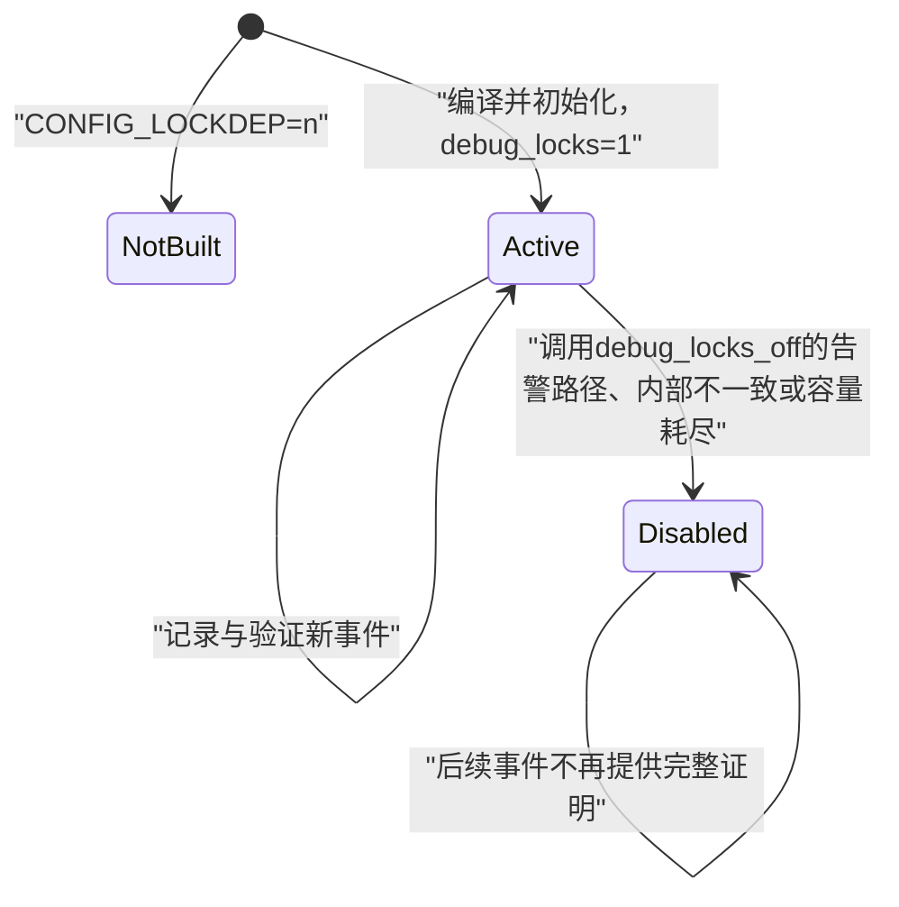

# 第4章\_Linux\_6.12\_Lockdep查询适配与诊断模块导读

## 4.1\_模块问题

本模块回答：`lockdep_is_held()` 怎样从 current 账本查询指定实例，断言为何接受 UNKNOWN，RCU 怎样把条件接入 Lockdep，以及 `/proc/lockdep_stats` 怎样表明检查器仍在工作。

总入口见 [Linux 6.12 Lockdep 源码导读](P01_Linux_6.12_Lockdep源码导读.md#1.1_基线与阅读目标)。稳定用法见[查询、断言、pin 与自定义原语接入](../../../../knowledge/linux/synchronization/lockdep/P06_查询_断言_pin与自定义原语接入.md#6.1_先从调用者的四个问题选接口)，配置、报告和覆盖边界见[配置、报告解读与验证方法](../../../../knowledge/linux/synchronization/lockdep/P08_配置_报告解读与验证方法.md#8.1_实验前先建立证据门槛)与[成本、覆盖边界与工程选择](../../../../knowledge/linux/synchronization/lockdep/P09_成本_覆盖边界与工程选择.md#9.1_先把无告警写成条件命题)。

## 4.2\_查询链

```text
lockdep_is_held(&lock)
  → &(lock)->dep_map
  → lock_is_held()
  → lock_is_held_type(map, -1)
  → 检查器不可用：LOCK_STATE_UNKNOWN
  → 检查器可用：遍历current->held_locks[]
      → match_held_lock()按具体实例匹配
      → 可选核对read类型
```

查询只读 current 状态，不读取 mutex owner，也不扫描其他任务。具体实现见 [`lock_is_held_type()` 当前持锁查询](../source_explanations/P04_Linux_6.12_Lockdep查询注解与配置源码实现.md#4.2_lock_is_held_type当前持锁查询)。

## 4.3\_断言与pin怎样消费held record

`lockdep_assert_held()` 只有在结果明确为 NOT_HELD 时才告警，避免检查器失效时误报“未持锁”；pin 则在已经匹配的 held record 上增加 `pin_count`，使中途 release 可以被发现。

唯一实现入口：

- [`lockdep_assert` 系列断言展开](../source_explanations/P04_Linux_6.12_Lockdep查询注解与配置源码实现.md#4.3_lockdep_assert系列断言展开)
- [`lockdep_pin_lock()` 锁保持注解](../source_explanations/P04_Linux_6.12_Lockdep查询注解与配置源码实现.md#4.4_lockdep_pin_lock锁保持注解)

## 4.4\_RCU适配链

RCU 的 `rcu_lock_map` 等虚拟 map 使用同一 held record 设施；`rcu_read_lock_held()` 查询虚拟 map，业务锁条件则直接调用 `lockdep_is_held()`。`RCU_LOCKDEP_WARN()` 在 RCU 检查可用时消费布尔条件。

Lockdep 核心查询在本专题展开；RCU map 与宏体的权威实现仍链接：

- [RCU Lockdep 状态来源](../../rcu/source_explanations/P01_Linux_6.12_RCU_公共接口与检查机制源码详解.md#1.6_RCU_Lockdep状态来源)
- [`RCU_LOCKDEP_WARN()` 检查适配层](../../rcu/source_explanations/P01_Linux_6.12_RCU_公共接口与检查机制源码详解.md#1.7_RCU_LOCKDEP_WARN检查适配层)

## 4.5\_配置与生命状态



`CONFIG_LOCKDEP=y` 只表示代码存在；当前是否仍有效要看 `debug_locks`。配置关系和关闭分支见 [`PROVE_LOCKING`、`DEBUG_LOCK_ALLOC` 与 `LOCKDEP`](../source_explanations/P04_Linux_6.12_Lockdep查询注解与配置源码实现.md#4.5_PROVE_LOCKING_DEBUG_LOCK_ALLOC与LOCKDEP)。

容量上限不是附带数字，而是检查结论成立的前提。锁类槽位、任务持锁深度、其他状态池和容量失败后的停检行为见[容量常量与停检边界](../source_explanations/P04_Linux_6.12_Lockdep查询注解与配置源码实现.md#4.7_容量常量与停检边界)。

## 4.6\_诊断输出链

`kernel/locking/lockdep.c` 的各类 `print_*_bug()` 输出当前新事件、历史路径和 held locks；`lockdep_proc.c` 另提供全局计数和类/链视图。读取 `/proc/lockdep_stats` 时至少看：

- `lock-classes`、`direct dependencies`、`dependency chains`；
- `stack-trace entries`、`max locking depth`；
- 各项 `[max: ...]`；
- `debug_locks` 是否为 `1`。

proc 创建条件和字段见 [`lockdep_proc_init()` 与 `/proc/lockdep*`](../source_explanations/P04_Linux_6.12_Lockdep查询注解与配置源码实现.md#4.6_lockdep_proc_init与proc接口)。

## 4.7\_阅读完成标准

读者应能区分：

1. mutex 是否被任意任务占用与 current 是否持有指定实例；
2. HELD、NOT_HELD 与 UNKNOWN；
3. 持锁断言、pin 和 acquire/release 注解；
4. RCU 功能读侧与虚拟 map 检查状态；
5. 编译了 Lockdep 与当前 `debug_locks` 仍有效；
6. 正确性图 `/proc/lockdep*` 与性能统计 `/proc/lock_stat`。
