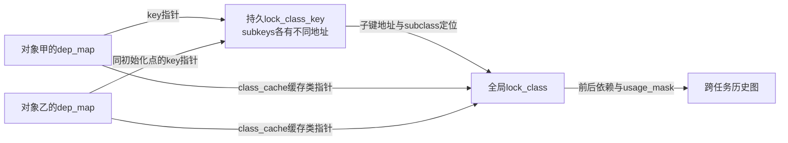

# 第1章\_Lockdep子键与实例映射类型实现

## 1.1\_关联入口

| 入口 | 本文提供的实现证据 |
| --- | --- |
| [Lockdep 总阅读索引](../../../navigation/P01_Linux_6.12_Lockdep源码导读.md#1.1_基线与阅读目标) | Linux 6.12.20 源码地图和建议顺序 |
| [身份与事件接入模块导读](../../../navigation/P02_Linux_6.12_Lockdep身份与事件接入模块导读.md#2.1_模块问题) | 实例、key、锁类和初始化调用链 |
| [稳定机制：锁实例、锁类、key 与 subclass](../../../../../../knowledge/linux/synchronization_and_asynchrony/synchronization/lockdep/P03_锁实例_锁类_key与subclass.md#3.1_从动态对象规模推导锁类) | 为什么必须分类以及错误分类后果 |

源码基线：NXP `linux-imx`，标签 `lf-6.12.20-2.0.0`，提交 `dfaf2136deb2af2e60b994421281ba42f1c087e0`，Linux 6.12.20。下列 Doxygen 和中文行内注释均为 **仓库补充，非上游原文**；代码省略不影响本文所述控制流。

## 1.2\_lock\_class\_key与lockdep\_map身份结构

**上游相对位置：** [`include/linux/lockdep_types.h`](../../../../linux/include/linux/lockdep_types.h)

```c
/* 仓库补充：最多八个子类身份；每个map只缓存两个类地址。 */
#define MAX_LOCKDEP_SUBCLASSES 8UL
#define NR_LOCKDEP_CACHING_CLASSES 2

/**
 * @brief 用不同字节地址为同一个key下的子类建立不同身份。
 * 仓库补充，非上游原文。身份来自地址，不是字节内容。
 */
struct lockdep_subclass_key {
	char __one_byte;
} __attribute__ ((__packed__));

/**
 * @brief 为一组逻辑同类锁提供稳定身份，并为 subclass 预留子键。
 *
 * 仓库补充，非上游原文。动态分配的 key 必须先登记，并在释放
 * key 内存以前注销；常规初始化宏通常使用调用点静态 key。
 */
struct lock_class_key {
	union {
		struct hlist_node hash_entry; /* 动态key登记时使用。 */
		struct lockdep_subclass_key subkeys[MAX_LOCKDEP_SUBCLASSES];
	};
};

/**
 * @brief 嵌入具体锁实例，把实例关联到锁类身份和等待类型。
 *
 * 仓库补充，非上游原文。map不是功能锁状态，不保存mutex owner。
 */
struct lockdep_map {
	struct lock_class_key *key;
	struct lock_class *class_cache[NR_LOCKDEP_CACHING_CLASSES];
	const char *name;
	u8 wait_type_outer; /* 外部上下文允许怎样取得本锁。 */
	u8 wait_type_inner; /* 持有本锁后向内层呈现什么等待约束。 */
	u8 lock_type;
#ifdef CONFIG_LOCK_STAT
	int cpu;
	unsigned long ip;
#endif
};
```

**实现原理：** `key + subclass` 决定全局锁类节点，更精确地说，注册代码取 `key->subkeys + subclass` 的地址作为类身份。八个单字节子键提供八个不同地址，`__one_byte` 的数值不承担类别编码。外层key的union让动态key登记使用哈希节点，而分类使用该对象内的子键地址；不能把子键内存当作可任意写入的业务标志，因为它与登记节点共享存储。

`class_cache[]` 只有两个指针槽，并不限制总共只能有两个subclass，也不是按最近使用时间淘汰的缓存。正常低编号子类可直接缓存，而强制注册可以把非零子类放入默认槽；取得端直接使用对应缓存槽，因此不能根据槽号推断类中保存的子类编号，也不能任意改写缓存。未缓存的合法子类继续查全局类哈希。`name` 用于诊断，不是身份本身。等待类型参与上下文合法性检查，但不改变实际锁如何等待。



图中两个map是不同实例地址，即使它们指向同一全局类也不会变成同一把功能锁。map由锁对象拥有，key必须在身份使用期间有效，全局类由Lockdep管理；类缓存只是指针引用，不把全局类所有权转给实例。释放对象、注销动态key与清理类历史是不同操作，不能只清空一个缓存指针就认为所有历史引用均已排空。

字段阅读时还须区分三个维度：`wait_type_outer`约束取得时的外部上下文，`wait_type_inner`向后续嵌套取得呈现当前等待上下文，`lock_type`是检查器使用的类型标签；三者都不会改变功能锁实现。`CONFIG_LOCK_STAT`下的`cpu/ip`为竞争与持有统计提供位置记录，不是mutex owner或长期持锁证明；关闭统计也不会改变key决定锁类的方式。

**可修改性边界：** 改子类上限必须同时核对索引检查、子键地址计算与当前记录的类索引；改缓存槽数必须检查初始化清零、注册写槽和读取端校验，不能只改数组长度。名称相同不意味着可以合并key，名称不同也不自动创建新类。用两个实例、共享key及不同subclass分别预测类身份，是理解该布局的最小纸面练习。

关闭 `CONFIG_LOCKDEP` 时，上游把 `lock_class_key` 和 `lockdep_map` 定义为空结构，说明检查身份能够从非调试构建中消失；功能锁本身的 owner、wait list 或架构锁字仍保留。

## 1.3\_类型如何进入登记路径

从key与map回到[初始化和锁类登记](../../kernel/locking/lockdep.c.md#1.3_lockdep_init_map_type与关闭配置分支)，继续检查谁写入缓存、何时发布全局类以及失败如何退出。这里仅展开上游头文件的子键与实例映射类型；全局类与held记录仍需结合对应唯一实现阅读。
