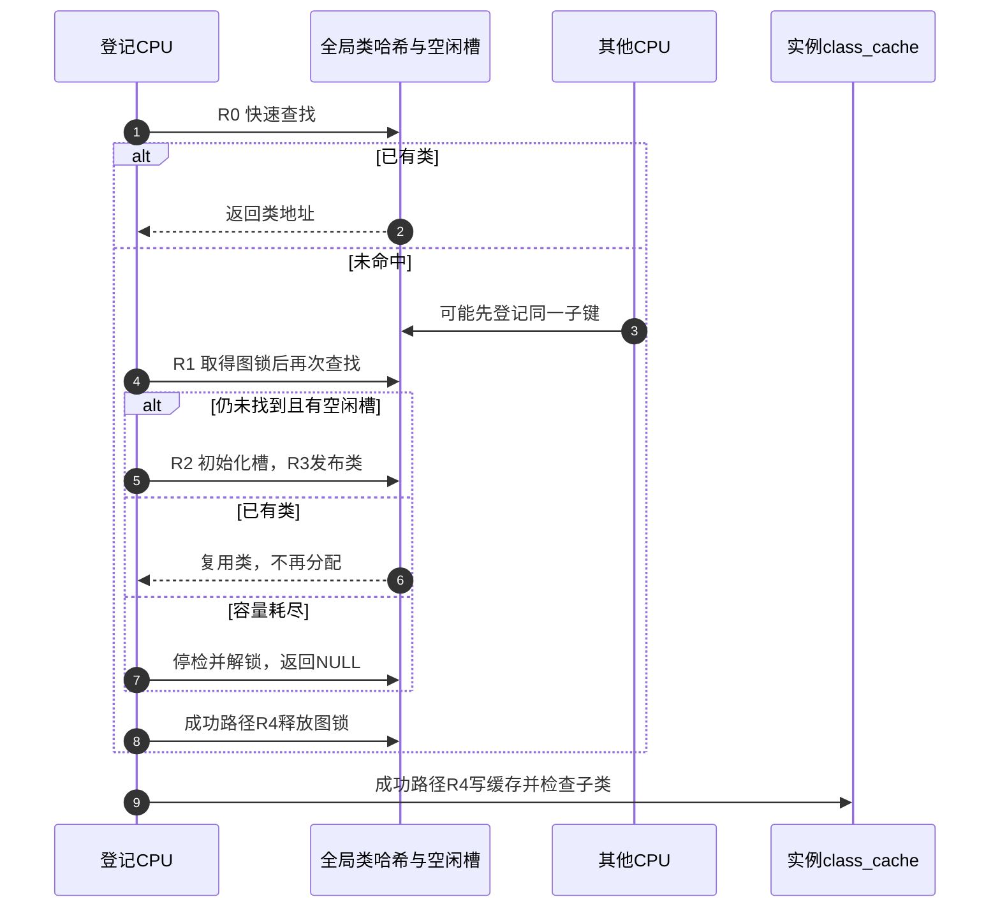

# 第1章\_Linux\_6.12\_Lockdep身份与锁类源码实现

## 1.1\_关联入口

| 入口 | 本文提供的实现证据 |
| --- | --- |
| [Lockdep 总阅读索引](../../../navigation/P01_Linux_6.12_Lockdep源码导读.md#1.1_基线与阅读目标) | Linux 6.12.20 源码地图和建议顺序 |
| [身份与事件接入模块导读](../../../navigation/P02_Linux_6.12_Lockdep身份与事件接入模块导读.md#2.1_模块问题) | 实例、key、锁类和初始化调用链 |
| [稳定机制：锁实例、锁类、key 与 subclass](../../../../../../knowledge/linux/synchronization_and_asynchrony/synchronization/lockdep/P03_锁实例_锁类_key与subclass.md#3.1_从动态对象规模推导锁类) | 为什么必须分类以及错误分类后果 |

源码基线：NXP `linux-imx`，标签 `lf-6.12.20-2.0.0`，提交 `dfaf2136deb2af2e60b994421281ba42f1c087e0`，Linux 6.12.20。下列 Doxygen 和中文行内注释均为 **仓库补充，非上游原文**；代码省略不影响本文所述控制流。

## 1.2\_身份类型入口

子键、key与map的唯一类型讲解位于[lockdep_types.h](../../include/linux/lockdep_types.h.md#1.2_lock_class_key与lockdep_map身份结构)。本文件继续解释上游kernel/locking/lockdep.c中的初始化与登记路径，不复制头文件类型。

## 1.3\_lockdep\_init\_map\_type与关闭配置分支

**上游相对位置：** [`include/linux/lockdep.h`](../../../../linux/include/linux/lockdep.h)、[`kernel/locking/lockdep.c`](../../../../linux/kernel/locking/lockdep.c)

```c
/**
 * @brief 初始化一个锁实例到锁类的映射信息。
 *
 * 仓库补充，非上游原文。
 * @param lock     具体实例内嵌的dep_map。
 * @param name     诊断名称，不能为NULL。
 * @param key      持久静态key或已登记的动态key。
 * @param subclass 初始子类编号。
 * @param inner    向内层呈现的等待类型。
 * @param outer    外部允许的等待类型。
 * @param lock_type 锁类型标签。
 */
void lockdep_init_map_type(struct lockdep_map *lock, const char *name,
			   struct lock_class_key *key, int subclass,
			   u8 inner, u8 outer, u8 lock_type)
{
	int i;

	for (i = 0; i < NR_LOCKDEP_CACHING_CLASSES; i++)
		lock->class_cache[i] = NULL; /* 重新初始化必须清除旧类缓存。 */

#ifdef CONFIG_LOCK_STAT
	lock->cpu = raw_smp_processor_id(); /* 统计配置记录初始化CPU。 */
#endif

	if (DEBUG_LOCKS_WARN_ON(!name)) {
		lock->name = "NULL";
		return;
	}
	lock->name = name;
	lock->wait_type_outer = outer;
	lock->wait_type_inner = inner;
	lock->lock_type = lock_type;

	if (DEBUG_LOCKS_WARN_ON(!key))
		return;
	if (!static_obj(key) && !is_dynamic_key(key)) {
		if (debug_locks)
			printk(KERN_ERR "BUG: key %px has not been registered!\n", key);
		DEBUG_LOCKS_WARN_ON(1);
		return;
	}
	lock->key = key;

	if (unlikely(!debug_locks))
		return; /* 写入map不等于全局检查器仍能继续登记。 */

	if (subclass) {
		unsigned long flags;

		if (DEBUG_LOCKS_WARN_ON(!lockdep_enabled()))
			return;

		raw_local_irq_save(flags);
		lockdep_recursion_inc();
		register_lock_class(lock, subclass, 1); /* 非零subclass提前注册。 */
		lockdep_recursion_finish();
		raw_local_irq_restore(flags);
	}
}
```

**状态副作用：** map 的类缓存被清空，名称、key、等待类型和锁类型被写入；启用统计时还记录初始化CPU。非零 subclass 只有通过检查器有效性与入口检查后才进入锁类登记。函数不会取得功能锁，也不会给 current 增加 held record。

初始化不是事务式提交。先清缓存，再处理名称和类型，再验证key；某个后续检查失败并不会自动恢复前面已写字段。尤其在写入key以后，`debug_locks` 已关闭会直接返回，不能看到map字段有值就断言锁类已经登记。`subclass=0` 的通常路径不在这里强制注册；非零子类路径先要求 `lockdep_enabled()`，随后保存并关闭本地IRQ，增加检查递归计数，注册，再结束递归并恢复原IRQ状态。递归计数约束检查器自身的重入，不是功能mutex的嵌套次数。

修改这里的次序时，应同时检查名称为空、key为空、动态key未登记、检查器已停检、非零子类入口受抑制和正常初始化这些出口。`void`返回值不提供业务可用性判据；诊断失败也不能用来替代功能锁初始化协议。本段已恢复固定版本的全部可执行语句，省略的只是上游英文说明注释。

`CONFIG_LOCKDEP=n` 时，同名宏只保留对 `name`/`key` 的无害引用以避免编译告警，不创建任何锁类。关闭分支见 [`include/linux/lockdep.h`](../../../../linux/include/linux/lockdep.h) 的 `!CONFIG_LOCKDEP` 区域。

## 1.4\_register\_lock\_class锁类注册

**上游相对位置：** [`kernel/locking/lockdep.c`](../../../../linux/kernel/locking/lockdep.c)

```c
/**
 * @brief 查找或登记map在指定subclass下的全局锁类。
 *
 * 仓库补充，非上游原文。调用时本地IRQ已关闭；真正修改全局
 * class hash和类列表还要持有graph_lock。
 * @return 成功时返回锁类；身份非法、容量耗尽或检查器失效时返回NULL。
 */
static struct lock_class *
register_lock_class(struct lockdep_map *lock, unsigned int subclass, int force)
{
	struct lockdep_subclass_key *key;
	struct hlist_head *hash_head;
	struct lock_class *class;
	int idx;

	/* 仓库补充：入口要求本地中断已关闭。 */
	DEBUG_LOCKS_WARN_ON(!irqs_disabled());

	class = look_up_lock_class(lock, subclass);
	if (likely(class))
		goto out_set_class_cache;

	if (!lock->key) {
		if (!assign_lock_key(lock))
			return NULL;
	} else if (!static_obj(lock->key) && !is_dynamic_key(lock->key)) {
		return NULL;
	}

	key = lock->key->subkeys + subclass;
	hash_head = classhashentry(key);

	if (!graph_lock()) {
		return NULL;
	}
	/*
	 * We have to do the hash-walk again, to avoid races
	 * with another CPU:
	 */
	hlist_for_each_entry_rcu(class, hash_head, hash_entry) {
		if (class->key == key)
			goto out_unlock_set;
	}

	/* 仓库补充：首次使用时建立空闲类等全局结构。 */
	init_data_structures_once();

	/* Allocate a new lock class and add it to the hash. */
	class = list_first_entry_or_null(&free_lock_classes, typeof(*class),
					 lock_entry);
	if (!class) {
		if (!debug_locks_off_graph_unlock()) {
			return NULL;
		}

		nbcon_cpu_emergency_enter();
		print_lockdep_off("BUG: MAX_LOCKDEP_KEYS too low!");
		dump_stack();
		nbcon_cpu_emergency_exit();
		return NULL;
	}
	nr_lock_classes++;
	__set_bit(class - lock_classes, lock_classes_in_use);
	debug_atomic_inc(nr_unused_locks);
	class->key = key;
	class->name = lock->name;
	class->subclass = subclass;
	WARN_ON_ONCE(!list_empty(&class->locks_before));
	WARN_ON_ONCE(!list_empty(&class->locks_after));
	class->name_version = count_matching_names(class);
	class->wait_type_inner = lock->wait_type_inner;
	class->wait_type_outer = lock->wait_type_outer;
	class->lock_type = lock->lock_type;
	/*
	 * We use RCU's safe list-add method to make
	 * parallel walking of the hash-list safe:
	 */
	hlist_add_head_rcu(&class->hash_entry, hash_head);
	/*
	 * Remove the class from the free list and add it to the global list
	 * of classes.
	 */
	list_move_tail(&class->lock_entry, &all_lock_classes);
	idx = class - lock_classes;
	if (idx > max_lock_class_idx)
		max_lock_class_idx = idx;

	if (verbose(class)) {
		graph_unlock();

		nbcon_cpu_emergency_enter();
		printk("\nnew class %px: %s", class->key, class->name);
		if (class->name_version > 1)
			printk(KERN_CONT "#%d", class->name_version);
		printk(KERN_CONT "\n");
		dump_stack();
		nbcon_cpu_emergency_exit();

		if (!graph_lock()) {
			return NULL;
		}
	}
/* 仓库补充：锁内命中与新建类都从这里释放图锁。 */
out_unlock_set:
	graph_unlock();

/* 仓库补充：force可把非零子类写入默认缓存槽。 */
out_set_class_cache:
	if (!subclass || force)
		lock->class_cache[0] = class;
	else if (subclass < NR_LOCKDEP_CACHING_CLASSES)
		lock->class_cache[subclass] = class;

	/*
	 * Hash collision, did we smoke some? We found a class with a matching
	 * hash but the subclass -- which is hashed in -- didn't match.
	 */
	if (DEBUG_LOCKS_WARN_ON(class->subclass != subclass))
		return NULL;

	return class;
}

```

**实现原理：** 首次无锁快速查找减少重复登记；未命中后在 `graph_lock` 下双检，避免两个 CPU 为同一 key 创建两个类。`assign_lock_key()` 只接受内核/模块 per-CPU 的规范地址或其他静态对象；无法确认持久性的临时对象会关闭检查器并要求调用者补正确初始化/注解。

这段函数现保留完整上游控制流；不能把尾部解锁、缓存和返回统称为“统计代码”省略。按R0至R4追踪它：

| 阶段 | 入口与状态变化 | 谁继续读取 |
| --- | --- | --- |
| R0 | 当前CPU已关本地IRQ，查找现有类；命中直接转缓存出口 | 当前调用者 |
| R1 | 身份有效后取得图锁，在类哈希桶中复查 | 与其他CPU串行化的新类登记 |
| R2 | 初始化全局结构，从free_lock_classes取槽，设置key/名称/类型和占用位 | 类哈希与全局类列表的读者 |
| R3 | 用RCU链表操作发布哈希节点，把槽移到all_lock_classes，更新最大索引 | 后续取得路径及诊断统计 |
| R4 | 释放图锁，写实例class_cache，核对subclass并返回 | 本实例后续取得及当前调用者 |

R1的锁内命中直接进入R4，不重复分配。R2无空闲槽时，`debug_locks_off_graph_unlock()` 同时承担停检与释放图锁，随后输出容量故障，返回NULL。调用者不能把这个NULL解释成“锁类不存在但检查仍然完整”。R3的verbose分支是另一个容易漏看的出口：它先解锁再打印，打印后重新取得图锁；重新加锁失败也返回NULL，因此不能在抽取源码时删去它再声称控制流未变。



缓存出口还解释了参数 `force`：subclass为0或force非零时写 `class_cache[0]`；其他可缓存的子类写其编号对应槽。不能将这里概括成“所有子类总写同编号槽”。`name_version` 用于区分同名类的诊断显示，`nr_lock_classes`、占用位及最大索引帮助管理全局槽位；它们不改变由子键决定的身份。`verbose`、`nbcon_cpu_emergency_enter/exit` 和打印调用服务诊断输出，其中重新加锁分支影响返回结果，所以源码保留原样。

**可修改性边界：** 改缓存策略时应同时核对force调用者、子类编号与查找端；改发布顺序时必须保持槽初始化先于哈希发布、空闲列表到全局列表的唯一归属以及全部错误出口解锁。验证应包含首次登记、已有类命中、两CPU竞争同一子键和容量失败；本节没有声称这些目标运行测试已经执行。

**配置与容量边界：** `MAX_LOCKDEP_KEYS` 是固定 class 槽位数。耗尽时不是静默忽略一个类，而是报告并使 `debug_locks` 失效。诊断见[成本、覆盖边界与工程选择](../../../../../../knowledge/linux/synchronization_and_asynchrony/synchronization/lockdep/P09_成本_覆盖边界与工程选择.md#9.3_固定容量为何是证明前提)。

## 1.5\_实现核对表

| 核对点 | 应见到的证据 |
| --- | --- |
| 动态实例共享逻辑类 | 同一初始化调用点传入同一静态 key |
| 静态实例延迟分配 key | `assign_lock_key()` 只接受持久静态地址 |
| subclass 成为独立图节点 | 使用 `key->subkeys + subclass` |
| 实例查询仍可精确匹配 | held record 另存具体 `lockdep_map *instance` |
| 容量失败可观察 | `MAX_LOCKDEP_KEYS` 告警与 `debug_locks` 停检 |

## 1.6\_图锁与检查入口的自保护

类登记依赖的图锁也是共享同步，但不能通过普通被检查锁再次递归进入自己。上游在同一文件定义架构锁`__lock`和拥有者指针`__owner`；另以每CPU的`lockdep_recursion`和当前任务同名字段控制不同重入路径。两个递归计数属于不同存储，不能混作一项。

```c
/* 仓库补充：这两项全局状态只服务检查器自身的串行化。 */
static arch_spinlock_t __lock = (arch_spinlock_t)__ARCH_SPIN_LOCK_UNLOCKED;
static struct task_struct *__owner;

/**
 * @brief 判断全局检查、每CPU递归和当前任务递归是否允许入口继续。
 * 仓库补充，非上游原文。
 */
static __always_inline bool lockdep_enabled(void)
{
	if (!debug_locks)
		return false;

	if (this_cpu_read(lockdep_recursion))
		return false;

	if (current->lockdep_recursion)
		return false;

	return true;
}

/**
 * @brief 先增加每CPU递归保护，再取得不经普通Lockdep注解的架构锁。
 * 仓库补充，非上游原文。
 */
static inline void lockdep_lock(void)
{
	DEBUG_LOCKS_WARN_ON(!irqs_disabled());

	__this_cpu_inc(lockdep_recursion);
	arch_spin_lock(&__lock);
	__owner = current;
}

/**
 * @brief 验证拥有者，清除记录后释放架构锁并退出每CPU递归保护。
 * 仓库补充，非上游原文。
 */
static inline void lockdep_unlock(void)
{
	DEBUG_LOCKS_WARN_ON(!irqs_disabled());

	if (debug_locks && DEBUG_LOCKS_WARN_ON(__owner != current))
		return;

	__owner = NULL;
	arch_spin_unlock(&__lock);
	__this_cpu_dec(lockdep_recursion);
}

/**
 * @brief 取得底层图锁后复查debug_locks，失败时先解锁再返回。
 * 仓库补充，非上游原文。
 */
static int graph_lock(void)
{
	lockdep_lock();
	/*
	 * Make sure that if another CPU detected a bug while
	 * walking the graph we dont change it (while the other
	 * CPU is busy printing out stuff with the graph lock
	 * dropped already)
	 */
	if (!debug_locks) {
		lockdep_unlock();
		return 0;
	}
	return 1;
}

/**
 * @brief 释放图锁，继承底层解锁的IRQ与拥有者要求。
 * 仓库补充，非上游原文。
 */
static inline void graph_unlock(void)
{
	lockdep_unlock();
}

/**
 * @brief 先关闭检查，再释放图锁，并返回是否由本次完成停检。
 * 仓库补充，非上游原文。
 */
static inline int debug_locks_off_graph_unlock(void)
{
	int ret = debug_locks_off();

	lockdep_unlock();

	return ret;
}
```

`lockdep_enabled()`先读全局`debug_locks`，再分别读本CPU和current的递归计数，任一条件不允许就返回false。它本身不加锁，也不改变功能锁；初始化非零子类的调用点用它拒绝不合适的递归入口。

`lockdep_lock()`要求调用方已关本地IRQ，然后增加本CPU递归计数，再通过`arch_spin_lock()`争用`__lock`，成功后才写`__owner=current`。关IRQ防止同CPU普通中断重入，架构锁串行化不同CPU，两者不能互换。架构锁的具体指令由目标架构实现，此处只使用其排他与释放契约，不复制架构代码。

`graph_lock()`取得锁后才复查全局生命状态，堵住“等待图锁期间另一CPU已经停检”的窗口。若关闭，它自行解锁并返回0，调用者此时不再拥有图锁；若返回1，调用者必须在成功或失败出口配对释放。容量失败使用`debug_locks_off_graph_unlock()`，因此不能再额外解锁一次。

解锁正常路径先清`__owner`，再释放架构锁，最后减少本CPU递归计数；拥有者不匹配且检查仍有效时会诊断并提前返回。这是内部不变量失败，不能把它当作普通可恢复返回值继续假设已经解锁。`DEBUG_LOCKS_WARN_ON`承担诊断，`unlikely`只表达分支预测提示，`__always_inline`/`inline`是编译器内联指示；都不是功能mutex的状态字段。

**修改约束：** 保留IRQ前提、递归计数配对、owner写入顺序与graph_lock返回值的锁所有权含义。用三条路径核对每次修改：正常登记后解锁，等待期间他CPU停检导致graph_lock返回0，当前CPU容量失败并停检解锁。不能因为一次初始化未告警就推断这三条都执行过。

## 1.7\_类查找与静态身份补全

登记先调用下面的查找函数；它返回NULL既可能表示尚未登记，也可能表示输入或检查条件错误。因此register_lock_class还要分别检查身份与全局生命状态，不能把每个NULL都当成可以直接分配新类。

```c
/**
 * @brief 识别内核、模块与允许阶段的初始化区静态对象地址。
 * 仓库补充，非上游原文。
 */
static int static_obj(const void *obj)
{
	unsigned long addr = (unsigned long) obj;

	if (is_kernel_core_data(addr))
		return 1;

	/*
	 * keys are allowed in the __ro_after_init section.
	 */
	if (is_kernel_rodata(addr))
		return 1;

	/*
	 * in initdata section and used during bootup only?
	 * NOTE: On some platforms the initdata section is
	 * outside of the _stext ... _end range.
	 */
	if (system_state < SYSTEM_FREEING_INITMEM &&
		init_section_contains((void *)addr, 1))
		return 1;

	/*
	 * in-kernel percpu var?
	 */
	if (is_kernel_percpu_address(addr))
		return 1;

	/*
	 * module static or percpu var?
	 */
	return is_module_address(addr) || is_module_percpu_address(addr);
}

/**
 * @brief 按子键地址查询全局类，并检查子类边界和IRQ前提。
 * 仓库补充，非上游原文。
 */
static noinstr struct lock_class *
look_up_lock_class(const struct lockdep_map *lock, unsigned int subclass)
{
	struct lockdep_subclass_key *key;
	struct hlist_head *hash_head;
	struct lock_class *class;

	if (unlikely(subclass >= MAX_LOCKDEP_SUBCLASSES)) {
		instrumentation_begin();
		debug_locks_off();
		nbcon_cpu_emergency_enter();
		printk(KERN_ERR
			"BUG: looking up invalid subclass: %u\n", subclass);
		printk(KERN_ERR
			"turning off the locking correctness validator.\n");
		dump_stack();
		nbcon_cpu_emergency_exit();
		instrumentation_end();
		return NULL;
	}

	/*
	 * If it is not initialised then it has never been locked,
	 * so it won't be present in the hash table.
	 */
	if (unlikely(!lock->key))
		return NULL;

	/*
	 * NOTE: the class-key must be unique. For dynamic locks, a static
	 * lock_class_key variable is passed in through the mutex_init()
	 * (or spin_lock_init()) call - which acts as the key. For static
	 * locks we use the lock object itself as the key.
	 */
	BUILD_BUG_ON(sizeof(struct lock_class_key) >
			sizeof(struct lockdep_map));

	key = lock->key->subkeys + subclass;

	hash_head = classhashentry(key);

	/*
	 * We do an RCU walk of the hash, see lockdep_free_key_range().
	 */
	if (DEBUG_LOCKS_WARN_ON(!irqs_disabled()))
		return NULL;

	hlist_for_each_entry_rcu_notrace(class, hash_head, hash_entry) {
		if (class->key == key) {
			/*
			 * Huh! same key, different name? Did someone trample
			 * on some memory? We're most confused.
			 */
			WARN_ONCE(class->name != lock->name &&
				  lock->key != &__lockdep_no_validate__,
				  "Looking for class \"%s\" with key %ps, but found a different class \"%s\" with the same key\n",
				  lock->name, lock->key, class->name);
			return class;
		}
	}

	return NULL;
}

/**
 * @brief 为缺省key的静态锁取得规范地址，拒绝未标注的非静态对象。
 * 仓库补充，非上游原文。
 */
static bool assign_lock_key(struct lockdep_map *lock)
{
	unsigned long can_addr, addr = (unsigned long)lock;

#ifdef __KERNEL__
	/*
	 * lockdep_free_key_range() assumes that struct lock_class_key
	 * objects do not overlap. Since we use the address of lock
	 * objects as class key for static objects, check whether the
	 * size of lock_class_key objects does not exceed the size of
	 * the smallest lock object.
	 */
	BUILD_BUG_ON(sizeof(struct lock_class_key) > sizeof(raw_spinlock_t));
#endif

	if (__is_kernel_percpu_address(addr, &can_addr))
		lock->key = (void *)can_addr;
	else if (__is_module_percpu_address(addr, &can_addr))
		lock->key = (void *)can_addr;
	else if (static_obj(lock))
		lock->key = (void *)lock;
	else {
		/* Debug-check: all keys must be persistent! */
		debug_locks_off();
		nbcon_cpu_emergency_enter();
		pr_err("INFO: trying to register non-static key.\n");
		pr_err("The code is fine but needs lockdep annotation, or maybe\n");
		pr_err("you didn't initialize this object before use?\n");
		pr_err("turning off the locking correctness validator.\n");
		dump_stack();
		nbcon_cpu_emergency_exit();
		return false;
	}

	return true;
}
```

`static_obj()`判定的是地址归属，不是承诺对象永不释放。普通内核数据、只读数据、per-CPU区以及模块静态区各有各的存续协议；初始化区只有在`system_state < SYSTEM_FREEING_INITMEM`时可通过对应检查。模块卸载仍需走key/类清理，不能因为一个地址今天被识别为静态就永久保存引用。各地址分类辅助函数由内核/模块/per-CPU设施提供，本节使用其地址归属契约，不展开架构地址布局。

`look_up_lock_class()`先限制subclass，再处理尚无key的情形。哈希桶由子键地址计算，桶内还比较完整子键指针，哈希碰撞不等于同类。遍历使用RCU的notrace入口并要求本地IRQ关闭；它不取得图锁，删除端必须与这种读者协调。`noinstr`及instrumentation_begin/end用于控制插桩区域，不能把它们当成可以随意删除的装饰。名称不一致会告警，但找到的类仍按key返回，名称不是分类键。

`assign_lock_key()`只处理未显式提供key的对象。per-CPU实例先转换为去掉CPU偏移的规范地址，从而让各CPU副本共享逻辑身份；其他认可的静态map用自身地址。普通动态对象不能走这个兜底，否则每个分配地址都会意外变成不同类，释放重用还会使身份失真。失败路径停检、输出初始化/注解提示并返回false，调用者必须停止该次登记。

两个BUILD_BUG_ON检查的是编译期尺寸关系，防止用对象地址充当key时潜在范围重叠假设失效；它们不在运行时给对象分配额外内存。WARN_ONCE及printk/dump_stack属于诊断，KERN_ERR/KERN_CONT标明日志级别或续行，nbcon配对限定紧急输出区。修改地址分类或身份兜底时，必须同时复核动态key注册/注销和模块释放协议，不能只让一个新地址通过static_obj。

下一篇：[Lockdep 取得释放与持锁账本源码实现](../../P02_Linux_6.12_Lockdep取得释放与持锁账本源码实现.md#2.1_关联入口)。
