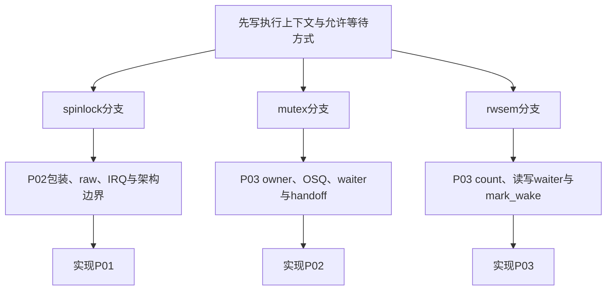

# 第1章\_Linux\_6.12\_锁源码总阅读索引

## 1.1\_版本边界与阅读任务

本专题固定到 NXP `linux-imx` 发布标签 `lf-6.12.20-2.0.0` 解引用后的提交 `dfaf2136deb2af2e60b994421281ba42f1c087e0`，顶层版本为 Linux 6.12.20。当前开发工作树位于同一 `lf-6.12.y` 分支且比该标签提交前进 3 个提交；本文所有函数和行号仍以固定发布提交为准，不静默混用分支头。

当前核对的 `.config` 启用了 `CONFIG_SMP=y`、`CONFIG_MUTEX_SPIN_ON_OWNER=y` 与 `CONFIG_RWSEM_SPIN_ON_OWNER=y`，未启用普通抢占；它只用于说明当前可运行分支，不把 `CONFIG_PREEMPT_RT` 替代实现写成已运行事实。

跨版本因果模型先读[锁机制专题](../../../../knowledge/linux/synchronization_and_asynchrony/synchronization/locks/大纲.md#1.1_专题定位)。本目录只回答 Linux 6.12.20 把锁状态放在哪里、哪些函数读写、慢路径怎样通信。

## 1.2\_源码文件地图

| 分支 | 文件 | 职责 |
| --- | --- | --- |
| spinlock | [`include/linux/spinlock_types.h`](https://github.com/nxp-imx/linux-imx/blob/dfaf2136deb2af2e60b994421281ba42f1c087e0/include/linux/spinlock_types.h) | 普通与 RT 配置下 `spinlock_t` 类型映射 |
| spinlock | [`include/linux/spinlock.h`](https://github.com/nxp-imx/linux-imx/blob/dfaf2136deb2af2e60b994421281ba42f1c087e0/include/linux/spinlock.h) | 公共包装、raw 路径与架构边界 |
| spinlock | `arch/arm/include/asm/spinlock.h` 及选定实现 | ARM 架构原子锁实现；结论限 ARM/配置 |
| mutex | [`include/linux/mutex_types.h`](https://github.com/nxp-imx/linux-imx/blob/dfaf2136deb2af2e60b994421281ba42f1c087e0/include/linux/mutex_types.h)、[`kernel/locking/mutex.c`](https://github.com/nxp-imx/linux-imx/blob/dfaf2136deb2af2e60b994421281ba42f1c087e0/kernel/locking/mutex.c) | owner/wait list、乐观自旋、慢路径与 handoff |
| rwsem | [`include/linux/rwsem.h`](https://github.com/nxp-imx/linux-imx/blob/dfaf2136deb2af2e60b994421281ba42f1c087e0/include/linux/rwsem.h)、[`kernel/locking/rwsem.c`](https://github.com/nxp-imx/linux-imx/blob/dfaf2136deb2af2e60b994421281ba42f1c087e0/kernel/locking/rwsem.c) | count/owner、读写 waiter、批量读唤醒 |
| RT 边界 | `kernel/locking/spinlock_rt.c`、`kernel/locking/rtmutex.c` | PREEMPT_RT 下普通 spin/mutex 基础；本轮只标边界 |

## 1.3\_三条实现分支

- [spinlock 模块源码概念导读](P02_Linux_6.12_spinlock模块源码概念导读.md#2.1_模块问题与配置边界)
- [mutex 与 rwsem 模块源码概念导读](P03_Linux_6.12_mutex与rwsem模块源码概念导读.md#3.1_模块问题与职责拆分)
- [spinlock 包装与 raw 路径源码实现](../source_explanations/P01_Linux_6.12_spinlock包装与raw路径源码实现.md#1.2_源码符号覆盖账本)
- [mutex 慢路径源码实现](../source_explanations/P02_Linux_6.12_mutex慢路径源码实现.md#2.2_源码符号覆盖账本)
- [rwsem 慢路径源码实现](../source_explanations/P03_Linux_6.12_rwsem慢路径源码实现.md#3.2_源码符号覆盖账本)

## 1.4\_状态所有权总表

| 状态 | 地址 | 正常写入者 | 后续读取者 |
| --- | --- | --- | --- |
| raw 锁字 | `raw_spinlock_t.raw_lock` | arch lock/unlock | 竞争 CPU |
| mutex 所有者/标志 | `mutex.owner` | trylock、handoff、unlock | 快路径与慢路径 |
| mutex waiter | `mutex.wait_list` | `wait_lock` 下慢路径 | unlock 选择首 waiter |
| rwsem 持有/等待编码 | `rw_semaphore.count` | down/up 与 mark-wake | 所有读写竞争者 |
| rwsem owner | `rw_semaphore.owner` | 读写取得/释放路径 | 乐观自旋与诊断 |
| rwsem waiter | `rw_semaphore.wait_list` | `wait_lock` 下慢路径 | wake 选择写者或读者批次 |

## 1.5\_配置与证明边界

类型头显示 `CONFIG_PREEMPT_RT` 下普通 `spinlock_t` 映射到 `rt_mutex_base`，非 RT 才内嵌 raw spinlock。当前 `.config` 不能执行 RT 分支，因此本专题只通过同一提交的条件编译源码解释该替代关系，不宣称做过 RT 运行验证。Lockdep 状态只证明已配置、已接入且已执行路径的锁协议，单独进入[Lockdep 源码导读](../../lockdep/navigation/P01_Linux_6.12_Lockdep源码导读.md#1.1_基线与阅读目标)。

## 1.6\_建议阅读顺序

1. 从知识正文[锁的统一状态与通信周期](../../../../knowledge/linux/synchronization_and_asynchrony/synchronization/locks/P03_锁的统一状态与通信周期.md#3.4_S0到S7的完整周期)写出当前锁的 S0～S7。
2. 不可睡路径进入 P02，先看 `spinlock_t` 配置映射，再看包装层和架构边界。
3. 可睡排他进入 P03 mutex 分支，依次看 owner flags、OSQ、wait list、schedule 和 unlock handoff。
4. 多读单写进入 P03 rwsem 分支，依次看 count/owner、waiter type、read/write slowpath 和 `rwsem_mark_wake()`。
5. 只有需要解释具体字段或函数体时进入三个 source_explanations，避免重复展开。

## 1.7\_复核问题

- 为什么关闭本地 IRQ 和取得跨 CPU 锁是两个状态动作？
- mutex 的 WAITERS、HANDOFF、PICKUP 分别连接哪个阶段？
- rwsem 为什么必须同时保存 count、owner 和混合 waiter 队列？
- 当前配置能验证哪些分支，PREEMPT_RT 结论又来自哪层证据？

下一篇：[spinlock 模块源码概念导读](P02_Linux_6.12_spinlock模块源码概念导读.md)。
