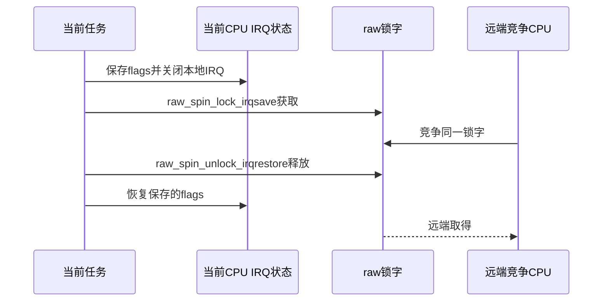

# 第2章\_Linux\_6.12\_spinlock模块源码概念导读

## 2.1\_模块问题与配置边界

本章不重复 spinlock 使用教程，而是回答一次 `spin_lock_irqsave()` 如何同时改变当前 CPU IRQ 状态和共享锁状态。固定源码为 `dfaf2136...`；当前配置走 SMP、非 RT 路径，ARM 具体原子实现只作为该架构载体，不外推到 x86/ARM64/RISC-V。

## 2.2\_接口层次与状态地址

| 层 | 入口/状态 | 所有权 |
| --- | --- | --- |
| 公共类型 | `spinlock_t` | 非 RT 内嵌 `raw_spinlock_t`；RT 内嵌 `rt_mutex_base` |
| 上下文包装 | `spin_lock_bh/irq/irqsave` | 当前 CPU 的 softirq/IRQ/抢占状态 |
| raw 包装 | `raw_spin_lock*`、`do_raw_spin_lock()` | debug/Lockdep、raw 锁协议 |
| 架构层 | `arch_spin_lock(&lock->raw_lock)` | 具体原子锁字与排队算法 |
| I/O 顺序辅助 | `mmiowb_spin_lock/unlock()` | 锁保护 MMIO 写的架构排序边界 |

## 2.3\_普通获取调用链

```text
spin_lock(lock)
  → raw_spin_lock(&lock->rlock)
    → _raw_spin_lock()
      → do_raw_spin_lock()
        → arch_spin_lock(&lock->raw_lock)
        → mmiowb_spin_lock()
```

释放按相反方向进入 `mmiowb_spin_unlock()` 和 `arch_spin_unlock()`。具体实现和裁剪代码见[spinlock 包装与 raw 路径源码实现](../source_explanations/P01_Linux_6.12_spinlock包装与raw路径源码实现.md#1.4_spin_lock到raw包装)。

## 2.4\_irqsave分支的通信顺序



flags 属于调用栈和当前 CPU，不能跨 CPU 或错误配对。锁字属于共享锁对象，其他 CPU 始终可竞争。

## 2.5\_PREEMPT\_RT分叉点

`include/linux/spinlock_types.h` 在非 RT 分支把 `spinlock_t` 映射为 raw；RT 分支改为 `rt_mutex_base`。因此不能从非 RT `spin_lock()` 直接内联到 raw 的代码，推断 RT 也必然忙等。严格 raw 语义仍从 `raw_spinlock_t` 路径阅读。

## 2.6\_源码阅读顺序

1. `include/linux/spinlock_types_raw.h`：raw 锁对象和调试字段。
2. `include/linux/spinlock_types.h`：普通/RT 类型分叉。
3. `include/linux/spinlock.h`：公共包装与 `do_raw_spin_*`。
4. `kernel/locking/spinlock.c`：非内联通用入口和导出符号。
5. `arch/arm/include/asm/spinlock.h` 及其包含实现：ARM 原子层；阅读前先核对 Kconfig 选择。

## 2.7\_复核问题

- 共享锁状态和本地 IRQ 状态分别保存在哪里？
- `spin_lock()` 为什么不是 Linux 自己实现完整原子算法？
- PREEMPT_RT 下哪一个类型仍表示严格 raw 语义？
- `mmiowb_spin_*` 为什么不能被概括成锁本身完成所有 MMIO 顺序？

总索引：[Linux 6.12 锁源码总阅读索引](P01_Linux_6.12_锁源码总阅读索引.md#1.6_建议阅读顺序)。

上一篇：[Linux 6.12 锁源码总阅读索引](P01_Linux_6.12_锁源码总阅读索引.md)。

下一篇：[mutex 与 rwsem 模块源码概念导读](P03_Linux_6.12_mutex与rwsem模块源码概念导读.md)。
