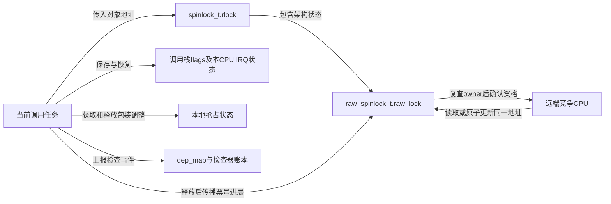
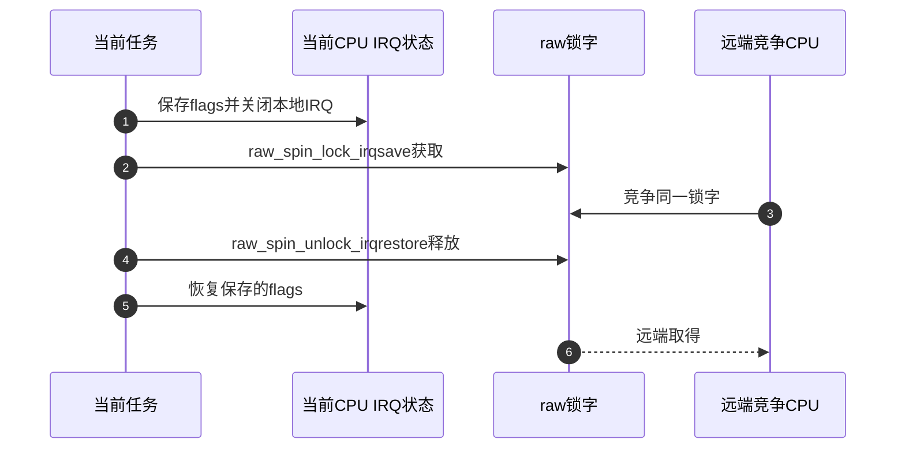

# 第2章\_Linux\_6.12\_spinlock模块源码概念导读

## 2.1\_模块问题与配置边界

本章不重复 spinlock 使用教程，而是回答一次 `spin_lock_irqsave()` 如何同时改变当前 CPU IRQ 状态和共享锁状态。固定源码为 `dfaf2136...`；本轮标准工作树配置为UP、非RT，下面SMP分支来自固定提交的条件源码，不代表当前构建选择，ARM 具体原子实现只作为该架构载体，不外推到 x86/ARM64/RISC-V。

读者已在[实现与上下文正文](../../../../knowledge/linux/synchronization_and_asynchrony/synchronization/locks/P04_spinlock实现与上下文边界.md#4.3.1_从反复抢夺改为领号等待)建立票号和本地重入模型。现在面对源码里的多层同名包装，任务是追踪业务传入的锁地址怎样到达架构锁字，并分清调试记录、抢占状态、IRQ保存值分别由谁维护。不能看见名为spin_lock的函数就跳过中间配置分叉。

## 2.2\_接口层次与状态地址

| 层 | 入口/状态 | 所有权 |
| --- | --- | --- |
| 公共类型 | `spinlock_t` | 非 RT 内嵌 `raw_spinlock_t`；RT 内嵌 `rt_mutex_base` |
| 上下文包装 | `spin_lock_bh/irq/irqsave` | 当前 CPU 的 softirq/IRQ/抢占状态 |
| raw 包装 | `raw_spin_lock*`、`do_raw_spin_lock()` | debug/Lockdep、raw 锁协议 |
| 架构层 | `arch_spin_lock(&lock->raw_lock)` | 具体原子锁字与排队算法 |
| I/O 顺序辅助 | `mmiowb_spin_lock/unlock()` | 锁保护 MMIO 写的架构排序边界 |

非RT分支中，业务 `spinlock_t` 内的 `rlock` 保存raw对象，后者的 `raw_lock` 保存 `arch_spinlock_t`。`CONFIG_DEBUG_SPINLOCK` 可额外提供magic、owner_cpu和调试owner；它们不是架构获取资格的唯一状态，关闭调试并不会消除互斥。Lockdep的dep_map又属于另一组检查状态，不能拿调试owner字段当作ARM票号机制的任务所有者。



## 2.3\_普通获取调用链

```text
spin_lock(lock)
  → raw_spin_lock(&lock->rlock)
    → _raw_spin_lock()
      → __raw_spin_lock()（所选SMP通用内联分支）
        → preempt_disable()、spin_acquire()、LOCK_CONTENDED()
          → do_raw_spin_lock()
            → arch_spin_lock(&lock->raw_lock)
            → mmiowb_spin_lock()
```

释放按相反方向进入 `mmiowb_spin_unlock()` 和 `arch_spin_unlock()`。具体实现和裁剪代码见[spinlock 包装与 raw 路径源码实现](../source_explanations/P01_Linux_6.12_spinlock包装与raw路径源码实现.md#1.4_spin_lock到raw包装)。

这是一条明确选择的阅读路径，不能声称所有构建都逐层产生函数调用：`_raw_*`可以被内联映射，`kernel/locking/spinlock.c`也提供非内联入口；GENERIC_LOCKBREAK与调试配置会改变所用包装分支。`LOCK_CONTENDED`可先尝试再进入竞争路径，不是额外业务锁。此处只组织调用职责，宏体留给实现讲解。

沿P03的阶段检查该调用链：S0先初始化并保证对象有效；S1包装建立本地约束、尝试架构取得；有竞争时S3/S4/S5由架构算法落实，ARM领号把尝试与排队位置合并；S2才是业务持有；S6先释放架构锁，S7再恢复本地上下文。`spin_acquire`位于功能获取前的检查事件，不能用它代替S2成功证据；trylock成功与失败的检查/恢复路径还需单独阅读。

## 2.4\_irqsave分支的通信顺序



flags 属于调用栈和当前 CPU，不能跨 CPU 或错误配对。锁字属于共享锁对象，其他 CPU 始终可竞争。

图采用 `spinlock_api_smp.h` 的常规非lockbreak路径：保存IRQ状态后施加抢占约束，登记检查事件，再完成架构锁获取；释放端先报告检查释放、释放架构锁，再恢复IRQ和抢占状态。因而远端可能在本CPU尚未完成全部恢复时取得锁，不能把图中纵向先后误当作远端必须等待本地函数返回。

若本地硬中断也要拿同锁，irqsave在获取前屏蔽它，避免中断暂停真正解锁者后自己无限等待；若调用者进入时IRQ已关闭，恢复后仍应关闭。NMI不由普通IRQ屏蔽排除，仍须另行证明不会递归取同锁。

## 2.5\_PREEMPT\_RT分叉点

`include/linux/spinlock_types.h` 在非 RT 分支把 `spinlock_t` 映射为 raw；RT 分支改为 `rt_mutex_base`。因此不能从非 RT `spin_lock()` 直接内联到 raw 的代码，推断 RT 也必然忙等。严格 raw 语义仍从 `raw_spinlock_t` 路径阅读。

还要更早检查SMP/UP分叉：`spinlock_types_raw.h` 在SMP下包含架构类型，UP下包含 `spinlock_types_up.h`；`spinlock.h` 分别选择架构操作与 `spinlock_up.h`，通用API还区分UP调试/非调试。当前工作配置非SMP，因此不能用ARM票号函数体冒充本地实际宏展开。RT普通锁的irqsave也不关硬中断，本节图只属于已声明的非RT分支。

## 2.6\_源码阅读顺序

1. `include/linux/spinlock_types_raw.h`：raw 锁对象和调试字段。
2. `include/linux/spinlock_types.h`：普通/RT 类型分叉。
3. `include/linux/spinlock.h`：公共包装与 `do_raw_spin_*`。
4. `include/linux/spinlock_api_smp.h` 与 `kernel/locking/spinlock.c`：内联/非内联通用入口、本地状态和配置例外；UP另查对应up头文件。
5. `arch/arm/include/asm/spinlock_types.h` 与 `spinlock.h`：票号布局与原子操作；仅在所选SMP分支进入，不代表当前配置。

现有[类型讲解](../source_explanations/P01_Linux_6.12_spinlock包装与raw路径源码实现.md#1.3_spinlock_t的配置映射)和[raw到架构边界](../source_explanations/P01_Linux_6.12_spinlock包装与raw路径源码实现.md#1.5_do_raw_spin_lock到架构边界)承担具体裁剪阅读。架构函数体与完整API配置分支仍须对照上述固定源码，不把当前入口的覆盖范围扩大成已经逐句讲完全部spinlock实现。

## 2.7\_复核问题

- 共享锁状态和本地 IRQ 状态分别保存在哪里？
- `spin_lock()` 为什么不是 Linux 自己实现完整原子算法？
- PREEMPT_RT 下哪一个类型仍表示严格 raw 语义？
- `mmiowb_spin_*` 为什么不能被概括成锁本身完成所有 MMIO 顺序？

总索引：[Linux 6.12 锁源码总阅读索引](P01_Linux_6.12_锁源码总阅读索引.md#1.6_建议阅读顺序)。

上一篇：[Linux 6.12 锁源码总阅读索引](P01_Linux_6.12_锁源码总阅读索引.md)。

下一篇：[mutex 与 rwsem 模块源码概念导读](P03_Linux_6.12_mutex与rwsem模块源码概念导读.md)。
