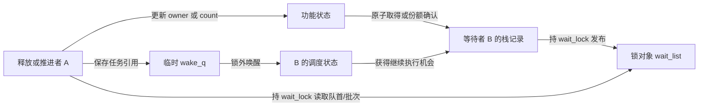
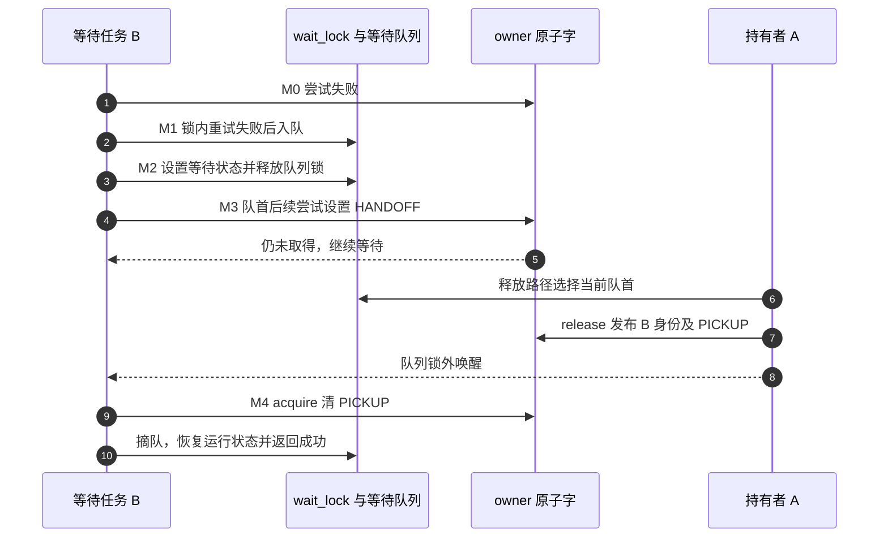
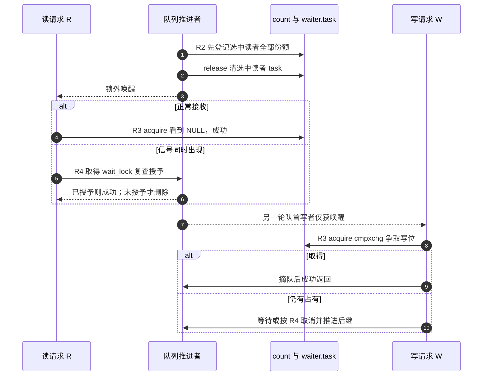

# 第3章\_Linux\_6.12\_mutex与rwsem模块源码概念导读

## 3.1\_模块问题与职责拆分

上一份[自旋模块导读](P02_Linux_6.12_spinlock模块源码概念导读.md)沿包装层追到了架构锁字。这里换一个约束：任务可以让出处理器，临界区也可能跨越调度。我们不再只问“谁能更新锁字”，还要问“等待者登记在哪里、谁使它继续、继续以后是否已经取得”。

先有 mutex 的单一持有者，再看 rwsem 为什么不能照搬同一套通知。mutex 定向交接给某个任务，目标必须确认接收；rwsem 可以同时授予多名读者，却只通知写者重新竞争。两者都能睡眠，不意味着同一个状态机换了名称。机制推导与应用先读[mutex 知识正文](../../../../knowledge/linux/synchronization_and_asynchrony/synchronization/locks/P05_mutex慢路径与所有权交接.md)和[rwsem 知识正文](../../../../knowledge/linux/synchronization_and_asynchrony/synchronization/locks/P06_rwsem读写汇聚与唤醒.md)；本页负责 Linux 6.12.20 的入口、状态落点和阅读顺序，不展开函数体。

版本固定为 NXP linux-imx 的 dfaf2136deb2af2e60b994421281ba42f1c087e0，标签 lf-6.12.20-2.0.0。先按[总索引](P01_Linux_6.12_锁源码总阅读索引.md#1.1_版本边界与阅读任务)确认配置，以下主线都是非 PREEMPT_RT 的普通路径，不混入 WW 多锁协议。

## 3.2\_文件与对象

| 文件 | 阅读任务 |
| --- | --- |
| include/linux/mutex_types.h | 找到 mutex 的非 RT owner/wait_lock/wait_list，以及 RT 替代布局 |
| include/linux/mutex.h | 找初始化、公共入口和调试配置包装 |
| kernel/locking/mutex.c | 把原子尝试、队列登记、调度与交接连接起来 |
| include/linux/rwsem.h | 分开 count、owner、队列与观察接口；RT 则换成 rwbase |
| kernel/locking/rwsem.c | 跟踪请求类型、读者预授、写者竞争及取消后的队列推进 |

先分开五类状态：功能所有权、排队关系、等待者私有记录、调度状态和检查器记录。它们组成分布式协议，并非某一个字段枚举出全部情况。例如任务已经被唤醒但仍未取得写位，是合法的中间状态。

| 具体地址 | 写入者与读取者 | 能说明什么 |
| --- | --- | --- |
| lock.owner | mutex 竞争者原子尝试，释放者普通清除或定向发布；下一竞争者读取 | 任务身份及 WAITERS/HANDOFF/PICKUP 协议位 |
| lock.wait_list 与 B 栈上 mutex_waiter | B 持 wait_lock 入队/摘队，解锁者持同锁选择首节点 | 谁正在登记等待，不等于谁已持有 |
| sem.count | rwsem 获取/释放及授予函数更新，读写竞争者读取 | 读份额、写位与等待/交接标志 |
| B 栈上 rwsem_waiter.task | 读请求入队时写 current，授予方 release 写 NULL，B acquire 读取 | 对读者表示份额已授予；写者没有这条完成协议 |
| sem.owner | 取得/释放路径维护，自旋者和诊断读取 | 写者或某位读者提示，不能枚举全部读者 |
| 任务调度状态、临时 wake_q | 等待者设置等待状态；唤醒方安排任务继续 | 执行机会与任务引用，不替代功能所有权 |

wait_lock 是保护慢路径协调的 raw 锁，不是业务读写锁。waiter 在等待者栈上，但入队后被共享链表引用；返回前必须完成摘队或已授予移出。wake_q 则属于当前推进者，用来把实际唤醒放到队列锁外。

## 3.3\_mutex完整调用链

先沿普通 mutex_lock 入口到 __mutex_lock_common。调试配置会改变是否单列快速入口，但不改变“实际取得必须由功能原子操作确认”的要求。WAITERS 表示队列工作，HANDOFF 是交接请求，PICKUP 是定向发布后等待目标确认；先记住这三种含义，再往下跟字段。

| 阶段 | 要找的函数协作 | 阅读时检查的状态 |
| --- | --- | --- |
| M0 尝试 | 快速尝试；共同路径中的 __mutex_trylock 与可选自旋 | 是否真的把 owner 改为 current，还是只看到旧身份 |
| M1 登记 | 取得 wait_lock 后再次尝试；失败才初始化 waiter 并入队 | 锁内重试可能直接成功，不是每次慢路径都睡眠 |
| M2 等待 | 设置任务状态，先尝试/查错误，再释放 wait_lock 调度 | 调度时不能继续占住队列锁 |
| M3 请求与发布 | 队首尝试可设置 HANDOFF；解锁者读取当前队首并发布目标+PICKUP | 请求不等于接收，目标可能因取消而变化 |
| M4 接收与清理 | 目标 acquire 清 PICKUP，持 wait_lock 摘队 | 成功后才向调用者交付临界区 |
| M5 取消 | 锁内尝试失败且信号允许取消时摘队并返回错误 | 已交接给自己的锁不能被遗弃 |

具体实现先读[owner 尝试](../source_explanations/kernel/locking/mutex.c.md#1.3_owner指针与三个位标志)，再读[登记与共同获取](../source_explanations/kernel/locking/mutex.c.md#1.4_mutex_lock_common的阶段)，最后读[解锁交接](../source_explanations/kernel/locking/mutex.c.md#1.5_mutex_unlock_slowpath的交接)。

共同获取循环把 trylock 放在信号检查前，正是为了保护 M4 与 M5 的边界：若 owner 仍是属于 B 的 PICKUP，正常协议应先接收，而不是先按信号取消。没有取得才进入错误检查；取消在 wait_lock 下摘队，释放者随后选的是仍在队列里的真实首节点。

普通解锁没有 HANDOFF 时，可以先清 owner 再处理队列，新到达者可能利用窗口取得；有 HANDOFF 时则跳出普通释放循环，在 wait_lock 下选择目标。两条路径都必须看实际原子更新，不能用“队首被唤醒”代替证明。mutex_unlock 清 owner 后仍可能触碰队列字段，外围对象必须存活到解锁函数返回。

OSQ 是可选的乐观自旋排队结构。未进入睡眠队列的自旋者与已经入队的队首并非同一路径：后者可绕过 OSQ 与其队首并行尝试。它限制的是某些自旋竞争，不是把所有任务统一塞入 wait_list；未启用配置时，自旋调用点不能被描述为已经发生的运行过程。

## 3.4\_rwsem完整调用链

从 [rwsem.h 的对象布局](../source_explanations/include/linux/rwsem.h.md#1.2_非RT对象的状态落点)进入。读者份额在 count，观察 count 非零不等于 current 已取得。接下来把读写两条路径放在同一组阶段中比较。

| 阶段 | 读请求 | 写请求 |
| --- | --- | --- |
| R0 进入慢路径 | 已有预加份额，可能直接成功；真正入队时撤回本次预加 | 可选自旋失败后登记写请求 |
| R1 队列协调 | wait_lock 下登记类型、任务、期限 | 同一队列记录写类型；必要时置 WAITERS |
| R2 选择推进 | mark_wake 选中读者时，先移到本地批次并记足份额 | 队首写者仅加入 wake_q，不授写位 |
| R3 完成条件 | acquire 看到 waiter.task=NULL，或在队列锁内确认授予 | try_write_lock 成功设置写位并摘队 |
| R4 错误退出 | 有信号后持锁复查 task，仍未授予才能删除 | 未取得后处理信号，重新持锁删除请求 |
| R5 后继推进 | 删除队首可能触发后继授予或唤醒 | 同一删除辅助函数释放 wait_lock，再实际唤醒 |

沿[mark_wake 两遍发布](../source_explanations/kernel/locking/rwsem.c.md#1.4_mark_wake先记账再发布)理解 R2，再分别读[读者接收](../source_explanations/kernel/locking/rwsem.c.md#1.5_读者等待与信号复查)、[写者争取](../source_explanations/kernel/locking/rwsem.c.md#1.6_写者唤醒后仍须取得)和[取消推进](../source_explanations/kernel/locking/rwsem.c.md#1.7_取消如何让后继继续)。

这不是保证图中的读者和写者总按固定顺序服务，而是对比两种通知的含义。读批次扫描跳过写者、最多选 256 名读者；要先给全部选中者记账，再清 task，因为某个读者可能尚未睡下，看到授予便立即完成工作并归还份额。写者则从未因 wake 就拥有写位。

rwsem 的 HANDOFF 在 count 中，和 mutex 的“任务身份+PICKUP”不是同一种编码。写路径要结合队首 handoff_set 判断让步关系，不能照搬 mutex 的接收流程。取消节点后，统一辅助函数可能推进新的队首，并且自己释放 wait_lock，调用者不能再重复解锁。

## 3.5\_共同配置边界

固定提交提供可选自旋与 RT 替代实现，但当前核对配置是非 SMP、PREEMPT_NONE、TINY_RCU，未启用 mutex/rwsem owner spinning。即使启用，是否自旋也取决于 owner 是否运行、调度请求及队列情况。本文解释源码条件，不表示已在目标运行。

mutex_types.h 的 RT 基础载体是 rt_mutex_base；rwsem.h 则改用 rwbase。这里不把非 RT 字段布局外推到 RT，也不展开 WW、多锁死锁处理、OSQ 内部及实时优先级传播。Lockdep 记录是检查状态，功能取得仍以原子操作与授予协议为准；配置关闭或检查器失效时“无告警”更不能作为正确性证明。

## 3.6\_复核问题

1. B 的 waiter 位于栈上，为什么仍须按共享对象追踪其寿命？指出谁在什么锁下引用它。
2. mutex 队首设置 HANDOFF 后，和真正持锁还差哪两步？唤醒是否完成其中任一步？
3. rwsem 的读者和写者同样收到 wake，为什么后续读取的完成状态不同？
4. 为什么读者遇到信号必须复查 task，而写者取消不能照搬这个 NULL 判断？
5. 哪些结论来自固定提交中的条件分支，哪些需要另行目标编译和竞争实测？

可核对的回答是：栈节点入队后跨任务可见；mutex 还需释放者发布目标、目标 acquire 接收；rwsem 读者已有预授，写者还要争取写位；两类 waiter 没有统一的 NULL 完成协议；自旋、RT 和性能结论不能由当前非 SMP 配置的源码阅读直接验证。

总索引：[Linux 6.12 锁源码总阅读索引](P01_Linux_6.12_锁源码总阅读索引.md#1.6_建议阅读顺序)。

上一篇：[spinlock 模块源码概念导读](P02_Linux_6.12_spinlock模块源码概念导读.md)。
