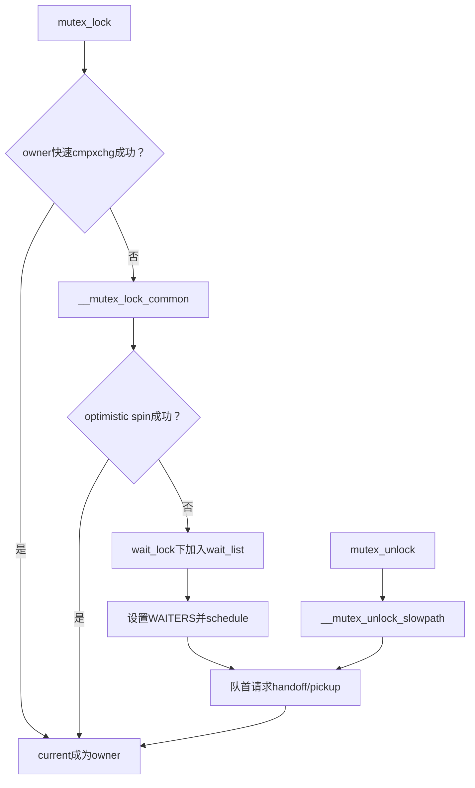
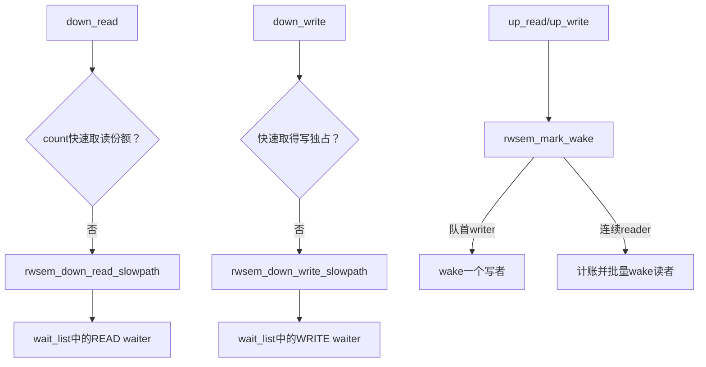

# 第3章\_Linux\_6.12\_mutex与rwsem模块源码概念导读

## 3.1\_模块问题与职责拆分

mutex 与 rwsem 都允许竞争任务睡眠，却不是同一状态机。mutex 围绕唯一 owner 与 waiter handoff；rwsem 围绕读者份额、写者独占和混合 waiter 队列。本章只组织模块与调用链，函数体分别进入 P02/P03 实现文档。

## 3.2\_文件与对象

| 文件 | mutex 职责 | rwsem 职责 |
| --- | --- | --- |
| `include/linux/mutex_types.h` | `struct mutex` 的非 RT/RT 布局 | — |
| `include/linux/mutex.h` | 初始化、公共 API 和配置包装 | — |
| `kernel/locking/mutex.c` | owner flags、OSQ、waiter、lock/unlock slowpath | — |
| `include/linux/rwsem.h` | — | count、owner、OSQ、wait_lock/list 与 API |
| `kernel/locking/rwsem.c` | — | waiter type、读写慢路径、mark wake |

## 3.3\_mutex完整调用链

owner 的低三位记录 WAITERS/HANDOFF/PICKUP；wait_list 由 wait_lock 保护；OSQ 协调乐观自旋者。信号退出要在慢路径中移除 waiter 后返回。

具体函数见[mutex 慢路径源码实现](../source_explanations/P02_Linux_6.12_mutex慢路径源码实现.md#2.2_源码符号覆盖账本)。

## 3.4\_rwsem完整调用链

`rwsem_mark_wake()` 在 wait_lock 下标记任务和调整 count，再把任务加入 wake_q，调用者释放锁后真正唤醒。具体函数见[rwsem 慢路径源码实现](../source_explanations/P03_Linux_6.12_rwsem慢路径源码实现.md#3.2_源码符号覆盖账本)。

## 3.5\_共同配置边界

当前 `.config` 开启 mutex/rwsem owner spinning，因此源代码优化可运行；是否实际自旋取决于 owner 是否运行、need_resched、队列和调用上下文。PREEMPT_RT 分支使用不同类型/实现，只能作为源码替代路径阅读，本次没有 RT 运行验证。

## 3.6\_复核问题

- mutex 哪些状态在 owner 原子字，哪些状态在 wait_list？
- 乐观自旋失败后，任务在哪里登记并变成何种调度状态？
- rwsem 如何判断唤醒一名写者还是一批读者？
- wake_q 为什么在 wait_lock 外实际唤醒任务？

总索引：[Linux 6.12 锁源码总阅读索引](P01_Linux_6.12_锁源码总阅读索引.md#1.6_建议阅读顺序)。

上一篇：[spinlock 模块源码概念导读](P02_Linux_6.12_spinlock模块源码概念导读.md)。
