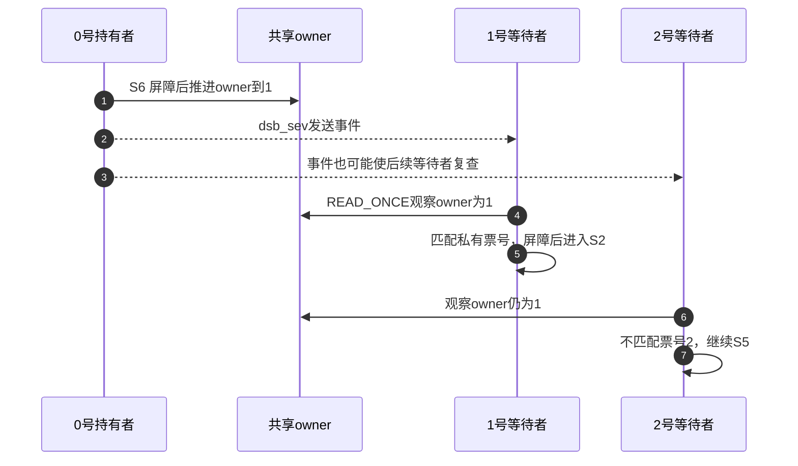

# 第1章\_Linux\_6.12\_ARM\_spinlock.h票号与事件

## 1.1\_进入这个文件之前

通用raw层已经建立本地上下文约束，现在把锁地址交给架构实现。上游位置是 `arch/arm/include/asm/spinlock.h`，固定提交dfaf2136deb2af2e60b994421281ba42f1c087e0、Linux 6.12.20。本页仅展开票号阻塞获取、释放与事件辅助三个完整函数；中文Doxygen是仓库补充，函数体保持固定原文。

这是所选ARM SMP分支，不是所有ARM部署都会执行的代码。当前取证配置未启用SMP，不能用本页声称目标已经执行这些指令。普通raw对象在SMP下包含的arch_spinlock_t来自同目录spinlock_types.h：32位slock与两个16位tickets字段共用存储，next发号、owner表示服务号；字段布局随大小端选择。这里引用布局，不复制其typedef。

## 1.2\_取得票号不等于已经进入

```c
/** @brief 仓库阅读说明：原子领取一个票号，再等待owner追上该票号。 */
static inline void arch_spin_lock(arch_spinlock_t *lock)
{
	unsigned long tmp;
	u32 newval;
	arch_spinlock_t lockval;

	prefetchw(&lock->slock);
	__asm__ __volatile__(
"1:	ldrex	%0, [%3]\n"
"	add	%1, %0, %4\n"
"	strex	%2, %1, [%3]\n"
"	teq	%2, #0\n"
"	bne	1b"
	: "=&r" (lockval), "=&r" (newval), "=&r" (tmp)
	: "r" (&lock->slock), "I" (1 << TICKET_SHIFT)
	: "cc");

	while (lockval.tickets.next != lockval.tickets.owner) {
		wfe();
		lockval.tickets.owner = READ_ONCE(lock->tickets.owner);
	}

	smp_mb();
}
```

先把汇编操作数对应到变量：%0保存读出的旧锁字lockval，%1保存计划写入的新值newval，%2接收独占写结果tmp，%3是共享slock地址，%4是 `1 << TICKET_SHIFT`，该版本TICKET_SHIFT为16。prefetchw只是访问提示，不授予锁。

ldrex读取锁字，add为next所在半字增加一个票号单位，strex尝试提交；teq检查结果，失败便跳回标号1重试。因此一次成功领号可能经过多次硬件尝试，不能把“每人只领一个号”理解成“只执行一次原子指令”。

成功后lockval仍保留旧值，旧next就是本次私有票号。它等于旧owner时可直接通过；不相等则进入等待循环。循环只刷新本地副本的owner，私有票号不变，不会每轮又领一个号。若把next也当作不断刷新到最新值的目标，就会把自己的队列位置弄丢。

对应统一周期，原子领号合并S1尝试与S4位置登记；有竞争经过S5，服务号相等后执行smp_mb才进入S2业务持有。此处屏障是该实现兑现锁顺序的方式，不把它提升为所有架构通用锁接口都具有任意全屏障效果。

## 1.3\_事件通知为何仍须复查

```c
/** @brief 仓库阅读说明：先约束临界区访问，再推进服务号并发送事件。 */
static inline void arch_spin_unlock(arch_spinlock_t *lock)
{
	smp_mb();
	lock->tickets.owner++;
	dsb_sev();
}
```

```c
/** @brief 仓库阅读说明：在事件发送前完成所需存储顺序约束。 */
static inline void dsb_sev(void)
{

	dsb(ishst);
	__asm__(SEV);
}
```

释放路径先执行smp_mb，再把共享owner加一，最后通过dsb_sev进入dsb(ishst)和SEV。该文件中的SEV宏结合SMP替换机制，不能把本页C调用直接当作所有配置下的同一条机器指令；事件指令及UP修补还须看文件顶部条件。

wfe表示等待事件，sev表示发送事件。它们服务于架构等待，不创建mutex式任务waiter，也不让调度器把一个睡眠任务置为可运行。事件不是携带“这把锁已归你”的消息；等待者仍必须读取owner，只有服务号等于自己的票号才通过。因其他事件结束等待也不能跳过比较。



释放者没有遍历一张任务链表通知B。共享owner承载资格，架构事件促使等待观察继续；二者不能互相替代。每个等待者仍读取共享状态，新到者领号仍修改同一锁字，所以票号并不消除缓存一致性通信。若下一票号者因虚拟机暂停等原因迟迟不推进，后面的票号也不能随意越过。

## 1.4\_阅读练习与覆盖边界

先令next=3、owner=0，三个任务已经分别持有票号0、1、2。0号释放后，1号和2号都结束事件等待，谁能进入？只有1号。若把while改成一次if判断后无条件返回，2号便可能在事件后越过校验，破坏互斥。若把最后的smp_mb删去，服务号匹配本身也不足以替代该实现对受保护访问的顺序要求。

本页未展开trylock、rwlock、票号空间耗尽、WFE/SEV替换宏体或全部ARM指令语义；没有目标汇编编译、硬件事件或SMP运行验证。具体代码只能说明固定源码怎样表达机制，不能由静态相同推出时延保证。

应用模型见[票号推导](../../../../../../../../knowledge/linux/synchronization_and_asynchrony/synchronization/locks/P04_spinlock实现与上下文边界.md#4.3.1_从反复抢夺改为领号等待)，版本阅读回到[spinlock模块](../../../../../navigation/P02_Linux_6.12_spinlock模块源码概念导读.md#2.6_源码阅读顺序)和[锁总索引](../../../../../navigation/P01_Linux_6.12_锁源码总阅读索引.md#1.3_三条实现分支)。
