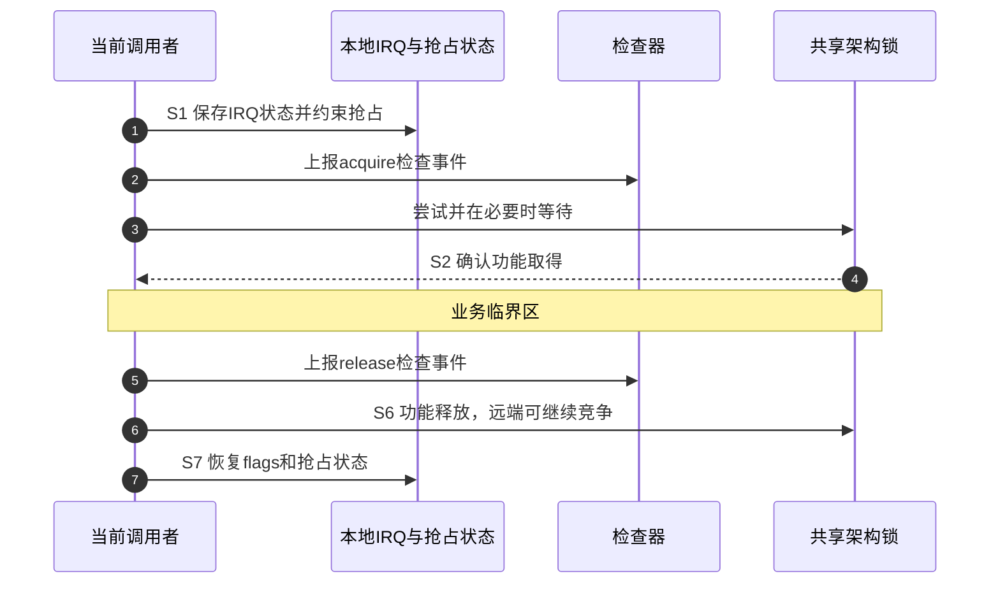

# 第1章\_Linux\_6.12\_spinlock\_api\_smp.h上下文与获取释放

## 1.1\_公共包装之后还发生什么

上页的spin_lock只把地址交给raw入口。本页进入上游 `include/linux/spinlock_api_smp.h`，回答本地抢占、IRQ保存、检查事件与功能取得的先后。证据固定于dfaf2136deb2af2e60b994421281ba42f1c087e0，Linux 6.12.20；中文Doxygen和中文注释为仓库补充。

以下获取函数选择 `!CONFIG_GENERIC_LOCKBREAK || CONFIG_DEBUG_LOCK_ALLOC` 分支。其他lockbreak实现不在本页展开，UP也不能直接假定选择这些操作。外层_raw名称可能按内联配置映射到这里，也可能经过非内联包装；不能把阅读层次当作必然的运行时调用次数。

## 1.2\_普通获取和释放的顺序

```c
/**
 * @brief 仓库阅读说明：常规raw获取先建立本地约束，再尝试功能锁。
 * @param lock 生命周期已由调用者保证的raw对象。
 */
static inline void __raw_spin_lock(raw_spinlock_t *lock)
{
    preempt_disable();
    spin_acquire(&lock->dep_map, 0, 0, _RET_IP_);
    LOCK_CONTENDED(lock, do_raw_spin_trylock, do_raw_spin_lock);
}

/** @brief 仓库阅读说明：先解除功能锁，再恢复本地抢占条件。 */
static inline void __raw_spin_unlock(raw_spinlock_t *lock)
{
    spin_release(&lock->dep_map, _RET_IP_);
    do_raw_spin_unlock(lock);
    preempt_enable();
}
```

沿统一周期看，preempt_disable位于S1功能尝试之前；检查器的spin_acquire也在功能成功之前。LOCK_CONTENDED组织尝试与竞争路径，最终的do_raw操作才落实架构状态。失败竞争者可能处于S5等待，此时检查记录不能当成S2已获得所有权。释放端检查事件同样早于实际do_raw释放，不代表硬件状态已经空闲。

preempt_enable发生在架构释放之后，所以远端取得同锁不需要等当前调用完全返回。本页不展开LOCK_CONTENDED宏体，其不同诊断配置不是另一把业务锁；do_raw的唯一实现见[架构边界](spinlock.h.md#1.5_do_raw_spin_lock到架构边界)。

## 1.3\_irqsave把哪份状态带回调用者

```c
/**
 * @brief 仓库阅读说明：常规分支保存并关闭本地IRQ后取得raw锁。
 * @return 进入前本CPU的IRQ状态，供同次配对恢复。
 */
static inline unsigned long __raw_spin_lock_irqsave(raw_spinlock_t *lock)
{
    unsigned long flags;
    local_irq_save(flags);
    preempt_disable();
    spin_acquire(&lock->dep_map, 0, 0, _RET_IP_);
    LOCK_CONTENDED(lock, do_raw_spin_trylock, do_raw_spin_lock);
    return flags;
}

/**
 * @brief 仓库阅读说明：解开共享锁后恢复本地IRQ和抢占状态。
 * @param flags 与本次获取配对的保存值。
 */
static inline void __raw_spin_unlock_irqrestore(raw_spinlock_t *lock,
                                               unsigned long flags)
{
    spin_release(&lock->dep_map, _RET_IP_);
    do_raw_spin_unlock(lock);
    local_irq_restore(flags);
    preempt_enable();
}
```

flags返回给调用者保存，不存储在共享锁字中；锁字由远端CPU同时访问，IRQ状态只约束当前CPU。若取锁前没有屏蔽会重入同锁的硬中断，中断便可能暂停解锁者后自己等待它。若释放时无条件开中断，则会破坏调用者原先已关闭IRQ的外层约束。raw路径的这个顺序不能外推成RT普通spinlock的irqsave语义。



## 1.4\_trylock失败为什么不能留下约束

```c
/**
 * @brief 仓库阅读说明：trylock仅在成功后登记持锁检查状态。
 * @return 1表示持锁；0表示失败且已撤销本层抢占约束。
 */
static inline int __raw_spin_trylock(raw_spinlock_t *lock)
{
    preempt_disable();
    if (do_raw_spin_trylock(lock)) {
        spin_acquire(&lock->dep_map, 0, 1, _RET_IP_);
        return 1;
    }
    preempt_enable();
    return 0;
}
```

和阻塞获取对比，trylock的检查事件放在成功分支，并标明这是try获取。失败不登记等待者、不调用unlock，直接恢复本层抢占约束；成功则保持约束直到配对释放。若把失败返回移到preempt_enable之前，会让一个没有拿到锁的调用者仍背着多余的本地约束，影响后续调度。

练习：能否在失败分支调用普通unlock代替恢复？不能，调用者根本没有功能锁所有权，unlock会错误释放别人的锁。能否因为普通阻塞获取已经上报spin_acquire就开始访问数据？不能，该检查事件早于功能取得，两种接口的事件先后不同。

## 1.5\_覆盖范围与下一步

本页完整展开五个函数，覆盖普通配对、irqsave配对及trylock失败恢复。未展开bh、无保存IRQ包装、lockbreak、检查宏实现和架构原子算法，不把所列函数的静态一致性当作全配置编译验证。

公共入口见[spinlock.h](spinlock.h.md#1.4_spin_lock到raw包装)，角色与配置地图见[spinlock模块导读](../../../navigation/P02_Linux_6.12_spinlock模块源码概念导读.md#2.3_普通获取调用链)，总路线见[锁源码索引](../../../navigation/P01_Linux_6.12_锁源码总阅读索引.md#1.3_三条实现分支)。当前配置非SMP、非RT，本页不报告目标运行结果。
