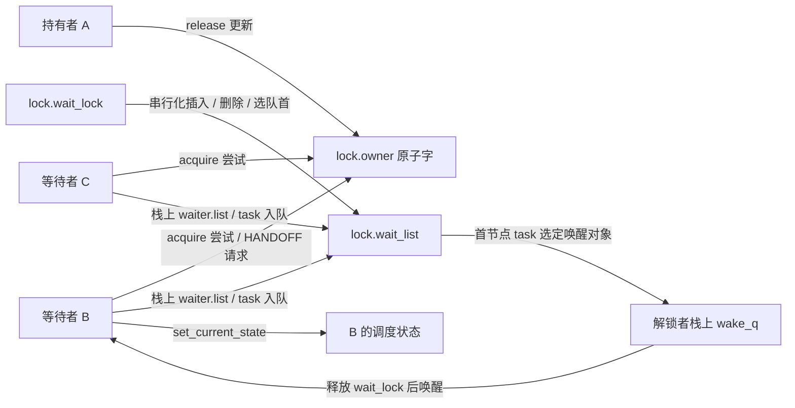
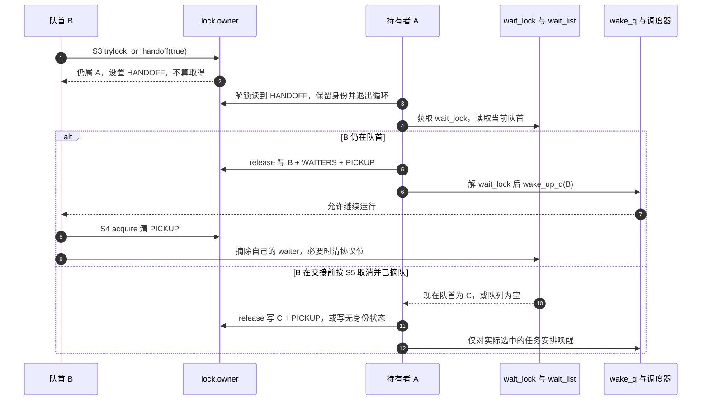

# 第1章\_Linux\_6.12\_mutex慢路径源码实现

## 1.1\_实现讲解边界

[mutex 模块导读](../../../navigation/P03_Linux_6.12_mutex与rwsem模块源码概念导读.md#3.3_mutex完整调用链)已经给出获取、排队与释放的阅读路线。本篇把其中最容易混淆的两件事落实到函数体：排队者怎样请求定向交接，以及解锁者怎样发布所有权、随后唤醒任务。请先阅读[知识正文的交接模型](../../../../../../knowledge/linux/synchronization_and_asynchrony/synchronization/locks/P05_mutex慢路径与所有权交接.md)，这里沿用其参与者，不从 API 入门重新讲起。

源码为 NXP 官方 linux-imx 发布标签 lf-6.12.20-2.0.0 的固定提交 dfaf2136deb2af2e60b994421281ba42f1c087e0，Linux 6.12.20；上游位置是 kernel/locking/mutex.c，blob 为 cbae8c0b89ab2b8074a387ebf1cca86951362cc2。身份与配置见[源码基线](../../../../linux/SOURCE_BASELINE.md)。

以下函数位于 !CONFIG_PREEMPT_RT 分支，普通 mutex 路径令 use_ww_ctx 为 false。共同函数中的 WW 分支保留原样，以免裁剪改变跳转关系；WW 是处理多锁获取冲突的另一套协议，其排序与回退算法不在本篇展开。CONFIG_MUTEX_SPIN_ON_OWNER 控制可选自旋实现；当前核对的非 SMP 工作配置未启用它。因此能够阅读自旋调用点，并不表示本机实际运行过该分支。

代码块按完整函数抽取，不是可独立编译的替代实现。中文 Doxygen 与中文行内注释由仓库补充，原有英文注释保留。调度器、Lockdep、wake_q 和 OSQ 的内部实现仍由对应源码负责。

## 1.2\_源码符号覆盖账本

| 阅读位置 | 本篇展开的真实单元 | 要回答的问题 |
| --- | --- | --- |
| [owner 的编码与取得](#1.3_owner指针与三个位标志) | __mutex_owner、__owner_task、__owner_flags、__mutex_trylock_common 及两个布尔包装 | 哪次原子操作才真正取得锁？ |
| [排队与获取周期](#1.4_mutex_lock_common的阶段) | __mutex_add_waiter、__mutex_remove_waiter、__mutex_lock_common | 栈上 waiter 何时成为共享队列成员，失败怎样撤回？ |
| [释放与定向交接](#1.5_mutex_unlock_slowpath的交接) | __mutex_handoff、__mutex_unlock_slowpath | 所有权发布与任务唤醒为何是两个动作？ |

## 1.3\_owner指针与三个位标志

owner 是一个原子字，不只是任务指针。上游利用任务指针对齐留下的低位保存三个标志宏：MUTEX_FLAG_WAITERS=0x01、MUTEX_FLAG_HANDOFF=0x02、MUTEX_FLAG_PICKUP=0x04，合并掩码 MUTEX_FLAGS=0x07。下文简称 WAITERS、HANDOFF、PICKUP：WAITERS 提醒释放者还有队列工作；HANDOFF 表示请求定向交接；PICKUP 表示目标身份已经写入，但目标尚未完成取得确认。MUTEX_WARN_ON 是调试告警宏，帮助发现不应出现的组合，不负责取得所有权。

这三位不是三把锁。wait_list 的链表结构由 wait_lock 保护，owner 字则通过原子读改写与未持有 wait_lock 的竞争者通信。拆开它们，才能解释为什么持有 wait_lock 不等于已取得用户需要的 mutex。

```c
/**
 * @brief 读取共享 owner 字中的任务身份。
 * @note 仓库补充阅读说明：屏蔽协议位只得到观察值，不能据此获得锁或固定任务寿命。
 */
static inline struct task_struct *__mutex_owner(struct mutex *lock)
{
	return (struct task_struct *)(atomic_long_read(&lock->owner) & ~MUTEX_FLAGS);
}
```
```c
/**
 * @brief 从已经读取的 owner 值分离任务身份。
 * @note 仓库补充阅读说明：本函数不再次读取共享内存。
 */
static inline struct task_struct *__owner_task(unsigned long owner)
{
	return (struct task_struct *)(owner & ~MUTEX_FLAGS);
}
```
```c
/**
 * @brief 从同一个 owner 快照分离协议位。
 * @note 仓库补充阅读说明：身份和协议位在后续 cmpxchg 中一起比较与更新。
 */
static inline unsigned long __owner_flags(unsigned long owner)
{
	return owner & MUTEX_FLAGS;
}
```

下面先预测三个输入：owner 只有 A 的身份时，B 的普通尝试失败；owner 没有身份而仅有 WAITERS 时，B 可以尝试取得；owner 是 B|WAITERS|PICKUP 时，只有 B 可以确认接收。最后一种尤其重要：看见自己的指针还不算完成接收，必须执行带 acquire 语义的更新。

```c
/**
 * @brief 尝试取得所有权，或向现任持有者提出交接请求。
 * @note 仓库补充阅读说明：返回 NULL 才是取得成功；返回任务指针表示本次没有取得。
 */
static inline struct task_struct *__mutex_trylock_common(struct mutex *lock, bool handoff)
{
	unsigned long owner, curr = (unsigned long)current;

	owner = atomic_long_read(&lock->owner);
	for (;;) { /* must loop, can race against a flag */
		unsigned long flags = __owner_flags(owner);
		unsigned long task = owner & ~MUTEX_FLAGS;

		/* 中文阅读注：先处理既有身份，不能把 PICKUP 当作空闲。 */
		if (task) {
			if (flags & MUTEX_FLAG_PICKUP) {
				if (task != curr)
					break;
				flags &= ~MUTEX_FLAG_PICKUP;
			} else if (handoff) {
				if (flags & MUTEX_FLAG_HANDOFF)
					break;
				flags |= MUTEX_FLAG_HANDOFF;
			} else {
				break;
			}
		} else {
			MUTEX_WARN_ON(flags & (MUTEX_FLAG_HANDOFF | MUTEX_FLAG_PICKUP));
			task = curr;
		}

		/* 中文阅读注：请求 HANDOFF 成功与取得所有权成功是两件事。 */
		if (atomic_long_try_cmpxchg_acquire(&lock->owner, &owner, task | flags)) {
			if (task == curr)
				return NULL;
			break;
		}
	}

	return __owner_task(owner);
}
```

从上往下看，PICKUP 优先于 handoff 参数：若目标不是 current 就退出；若目标正是 current，就准备清 PICKUP。没有 PICKUP 而 handoff=true 时，只准备把 HANDOFF 置位，任务身份仍是原持有者 A。后面的 cmpxchg 即使成功，只要 task 不是 current，函数仍不能返回取得成功。

cmpxchg 失败会把最新原子字读回 owner，循环重新分离身份和标志。这样，其他参与者刚刚设置的协议位不会被旧快照覆盖。代码没有“等了多少毫秒就交接”的阈值；是否提出请求由调用者传来的 handoff 决定。

```c
/**
 * @brief 把内部指针返回值转换为取得成功的布尔值。
 * @note 仓库补充阅读说明：传 true 允许请求交接，但不能让请求本身变成取得成功。
 */
static inline bool __mutex_trylock_or_handoff(struct mutex *lock, bool handoff)
{
	return !__mutex_trylock_common(lock, handoff);
}
```
```c
/**
 * @brief 尝试取得空闲锁或接收已经指定给本任务的交接。
 * @note 仓库补充阅读说明：false 只禁止新增 HANDOFF 请求，不禁止处理已有 PICKUP。
 */
static inline bool __mutex_trylock(struct mutex *lock)
{
	return !__mutex_trylock_common(lock, false);
}
```

## 1.4\_mutex\_lock\_common的阶段

先给每个状态一个具体地址。A 持有临界区，B、C 是等待任务；以下是普通 mutex 的关系，WW 和自旋队列不混入这条主线。



waiter 虽然在 B 的栈上，却在入队后由 lock.wait_list 发布给其他任务。B 不能在节点仍被共享队列引用时从获取函数返回。两个辅助函数把这条寿命约束落实到链表与标志上：

```c
/**
 * @brief 在给定位置加入等待节点，并在成为队首时设置 WAITERS。
 * @note 仓库补充阅读说明：调用者持有 wait_lock；普通路径传入整个 wait_list，执行尾插。
 */
static void
__mutex_add_waiter(struct mutex *lock, struct mutex_waiter *waiter,
		   struct list_head *list)
{
	debug_mutex_add_waiter(lock, waiter, current);

	list_add_tail(&waiter->list, list);
	if (__mutex_waiter_is_first(lock, waiter))
		__mutex_set_flag(lock, MUTEX_FLAG_WAITERS);
}
```
```c
/**
 * @brief 摘除本任务节点，在队列为空时清理协议位。
 * @note 仓库补充阅读说明：调用者持有 wait_lock；清理的是 MUTEX_FLAGS 全部协议位，不是 owner 中的任务身份。
 */
static void
__mutex_remove_waiter(struct mutex *lock, struct mutex_waiter *waiter)
{
	list_del(&waiter->list);
	if (likely(list_empty(&lock->wait_list)))
		__mutex_clear_flag(lock, MUTEX_FLAGS);

	debug_mutex_remove_waiter(lock, waiter, current);
}
```

最后一个节点退出时，WAITERS、HANDOFF、PICKUP 都不再有排队者需要延续，清理掩码因此是 MUTEX_FLAGS，而不是只清 WAITERS。成功取得者的任务指针仍保留在 owner 中，摘队并不等于解锁。

现在沿一个操作周期读共同获取函数。这里的 S0～S5 是本篇定位代码的阶段名，分别对应知识正文中的尝试、登记、等待、交接、接收与退出：

| 阶段 | 触发与写入者 | 状态地址和变化 | 退出条件 |
| --- | --- | --- | --- |
| S0 尝试 | B 进入获取函数 | 禁抢占，尝试 owner；可选自旋未入睡眠队列 | 成功返回；否则取得 wait_lock 后重试 |
| S1 登记 | 再次尝试失败的 B | 初始化栈上 waiter.task，尾插 wait_list，必要时设置 WAITERS | 设置本任务等待状态 |
| S2 等待 | B 仍未取得 | 先尝试 owner，再查信号；释放 wait_lock 后调度 | 被唤醒或其他调度条件使其继续 |
| S3 请求与发布 | 队首 B、随后解锁者 A | B 尝试或设置 HANDOFF；A 在释放路径写 B 身份及 PICKUP | B 再次尝试接收 |
| S4 成功退出等待 | 取得者 B | acquire 更新 owner，恢复 TASK_RUNNING，持 wait_lock 摘队 | 清理检查状态、解 wait_lock、恢复抢占，返回 0 |
| S5 取消等待 | 未取得且遇到有效信号的 B | 持 wait_lock 恢复运行状态并摘队，撤销检查登记 | 恢复抢占，返回 -EINTR |

不是每次调用都经过所有阶段：S0 可直接成功，S2 可在普通竞争中成功而跳过 S3，S5 只属于失败分支。下面保留完整共同函数，先把 use_ww_ctx=false、ww_ctx=NULL 代入阅读，再识别可选分支。trace_contention_begin/end 记录竞争区间，LCB_F_MUTEX 与 LCB_F_SPIN 是追踪事件的类型标志；它们没有替代 owner 更新。WW 分支中的 READ_ONCE 读取上下文指针，-EALREADY 表示相同获取上下文已经登记；普通路径不进入这个分支。FIFO 注释描述普通等待者按先入先出方式入队，不保证所有到达者都严格按此顺序取得锁。

```c
/**
 * @brief 完成普通或 WW mutex 的共同获取、等待和失败清理。
 * @note 仓库补充阅读说明：state 决定哪些信号允许取消；普通 mutex 选择 use_ww_ctx=false。
 */
static __always_inline int __sched
__mutex_lock_common(struct mutex *lock, unsigned int state, unsigned int subclass,
		    struct lockdep_map *nest_lock, unsigned long ip,
		    struct ww_acquire_ctx *ww_ctx, const bool use_ww_ctx)
{
	struct mutex_waiter waiter;
	struct ww_mutex *ww;
	int ret;

	if (!use_ww_ctx)
		ww_ctx = NULL;

	might_sleep();

	MUTEX_WARN_ON(lock->magic != lock);

	ww = container_of(lock, struct ww_mutex, base);
	if (ww_ctx) {
		if (unlikely(ww_ctx == READ_ONCE(ww->ctx)))
			return -EALREADY;

		/*
		 * Reset the wounded flag after a kill. No other process can
		 * race and wound us here since they can't have a valid owner
		 * pointer if we don't have any locks held.
		 */
		if (ww_ctx->acquired == 0)
			ww_ctx->wounded = 0;

#ifdef CONFIG_DEBUG_LOCK_ALLOC
		nest_lock = &ww_ctx->dep_map;
#endif
	}

	/* 中文阅读注 S0：检查器登记尝试，不代表功能锁已经取得。 */
	preempt_disable();
	mutex_acquire_nest(&lock->dep_map, subclass, 0, nest_lock, ip);

	trace_contention_begin(lock, LCB_F_MUTEX | LCB_F_SPIN);
	if (__mutex_trylock(lock) ||
	    mutex_optimistic_spin(lock, ww_ctx, NULL)) {
		/* got the lock, yay! */
		lock_acquired(&lock->dep_map, ip);
		if (ww_ctx)
			ww_mutex_set_context_fastpath(ww, ww_ctx);
		trace_contention_end(lock, 0);
		preempt_enable();
		return 0;
	}

	raw_spin_lock(&lock->wait_lock);
	/*
	 * After waiting to acquire the wait_lock, try again.
	 */
	if (__mutex_trylock(lock)) {
		if (ww_ctx)
			__ww_mutex_check_waiters(lock, ww_ctx);

		goto skip_wait;
	}

	/* 中文阅读注 S1：到这里才建立栈上等待记录。 */
	debug_mutex_lock_common(lock, &waiter);
	waiter.task = current;
	if (use_ww_ctx)
		waiter.ww_ctx = ww_ctx;

	lock_contended(&lock->dep_map, ip);

	if (!use_ww_ctx) {
		/* add waiting tasks to the end of the waitqueue (FIFO): */
		__mutex_add_waiter(lock, &waiter, &lock->wait_list);
	} else {
		/*
		 * Add in stamp order, waking up waiters that must kill
		 * themselves.
		 */
		ret = __ww_mutex_add_waiter(&waiter, lock, ww_ctx);
		if (ret)
			goto err_early_kill;
	}

	set_current_state(state);
	trace_contention_begin(lock, LCB_F_MUTEX);
	for (;;) {
		bool first;

		/*
		 * Once we hold wait_lock, we're serialized against
		 * mutex_unlock() handing the lock off to us, do a trylock
		 * before testing the error conditions to make sure we pick up
		 * the handoff.
		 */
		if (__mutex_trylock(lock))
			goto acquired;

		/*
		 * Check for signals and kill conditions while holding
		 * wait_lock. This ensures the lock cancellation is ordered
		 * against mutex_unlock() and wake-ups do not go missing.
		 */
		if (signal_pending_state(state, current)) {
			ret = -EINTR;
			goto err;
		}

		if (ww_ctx) {
			ret = __ww_mutex_check_kill(lock, &waiter, ww_ctx);
			if (ret)
				goto err;
		}

		/* 中文阅读注 S2：不能带着保护队列的 raw 锁去睡眠。 */
		raw_spin_unlock(&lock->wait_lock);
		schedule_preempt_disabled();

		first = __mutex_waiter_is_first(lock, &waiter);

		set_current_state(state);
		/*
		 * Here we order against unlock; we must either see it change
		 * state back to RUNNING and fall through the next schedule(),
		 * or we must see its unlock and acquire.
		 */
		if (__mutex_trylock_or_handoff(lock, first))
			break;

		if (first) {
			trace_contention_begin(lock, LCB_F_MUTEX | LCB_F_SPIN);
			if (mutex_optimistic_spin(lock, ww_ctx, &waiter))
				break;
			trace_contention_begin(lock, LCB_F_MUTEX);
		}

		raw_spin_lock(&lock->wait_lock);
	}
	raw_spin_lock(&lock->wait_lock);
acquired:
	/* 中文阅读注 S4：已经取得 owner，现在退出共享等待队列。 */
	__set_current_state(TASK_RUNNING);

	if (ww_ctx) {
		/*
		 * Wound-Wait; we stole the lock (!first_waiter), check the
		 * waiters as anyone might want to wound us.
		 */
		if (!ww_ctx->is_wait_die &&
		    !__mutex_waiter_is_first(lock, &waiter))
			__ww_mutex_check_waiters(lock, ww_ctx);
	}

	__mutex_remove_waiter(lock, &waiter);

	debug_mutex_free_waiter(&waiter);

skip_wait:
	/* got the lock - cleanup and rejoice! */
	lock_acquired(&lock->dep_map, ip);
	trace_contention_end(lock, 0);

	if (ww_ctx)
		ww_mutex_lock_acquired(ww, ww_ctx);

	raw_spin_unlock(&lock->wait_lock);
	preempt_enable();
	return 0;

err:
	/* 中文阅读注 S5：没有取得 owner，按失败路径摘队。 */
	__set_current_state(TASK_RUNNING);
	__mutex_remove_waiter(lock, &waiter);
err_early_kill:
	trace_contention_end(lock, ret);
	raw_spin_unlock(&lock->wait_lock);
	debug_mutex_free_waiter(&waiter);
	mutex_release(&lock->dep_map, ip);
	preempt_enable();
	return ret;
}
```

把成功和取消一起读，才能理解循环顶部为什么先 trylock 再检查信号。A 的交接和 B 的错误退出都经过 wait_lock；B 在这个锁内先确认是否已有属于自己的 PICKUP。若已经接收成功，就走 acquired，而不会留下一个“owner 指向已退出等待者”的锁。若尝试失败，才依据 state 检查信号并摘队。普通不可中断等待与可中断等待的差异由 state 决定，不能把所有返回路径都说成收到信号便失败。

再看两次自旋调用的实参。第一次传 NULL，发生在加入 wait_list 之前；第二次传 &waiter，且只在 first 为真时发生。在启用 owner 自旋的实现中，后者是已入队的队首，允许绕过 OSQ 与 OSQ 队首并行尝试。这里不展开 OSQ 算法，也不能据第一处调用概括“任何时候只有一个 mutex 竞争者”。

preempt_disable 也没有把 mutex 变成不可睡的锁：代码明确通过 schedule_preempt_disabled 执行受控调度。真正不能跨睡眠保留的是 wait_lock；每次调度前都先释放它，让解锁者有机会检查队列。睡醒后重新设置等待状态再尝试，配合唤醒方的状态更新，避免“刚错过唤醒就永久睡下”的窗口。

## 1.5\_mutex\_unlock\_slowpath的交接

S3 的后半段发生在 A，而不是 B。先看定向发布的辅助函数：next 有值时，写入目标身份和 PICKUP；next 为 NULL 时退化为普通释放。两种情况都保留 WAITERS、清除 HANDOFF，并通过 release 发布临界区写入。调用者用 DEFINE_WAKE_Q 声明并初始化栈上的延后唤醒队列：在 wait_lock 内收集目标，在锁外实施唤醒。

```c
/**
 * @brief 释放当前所有权，必要时定向发布给下一任务。
 * @note 仓库补充阅读说明：调用方在 wait_lock 内选定 task；目标仍需通过 acquire 接收。
 */
static void __mutex_handoff(struct mutex *lock, struct task_struct *task)
{
	unsigned long owner = atomic_long_read(&lock->owner);

	for (;;) {
		unsigned long new;

		MUTEX_WARN_ON(__owner_task(owner) != current);
		MUTEX_WARN_ON(owner & MUTEX_FLAG_PICKUP);

		new = (owner & MUTEX_FLAG_WAITERS);
		new |= (unsigned long)task;
		if (task)
			new |= MUTEX_FLAG_PICKUP;

		if (atomic_long_try_cmpxchg_release(&lock->owner, &owner, new))
			break;
	}
}
```

这里的 new 并非在原 owner 上简单加一个标志。它先只保留 WAITERS，再拼入目标身份，有目标时才加 PICKUP。因此原持有者 A 与 HANDOFF 请求都不再留在新值中。若没有目标，不能发布一个没有接收人的 PICKUP。

```c
/**
 * @brief 普通释放或定向交接，并在队列锁外实施唤醒。
 * @note 仓库补充阅读说明：mutex_release 是检查器事件；真正的功能发布由 release 原子操作完成。
 */
static noinline void __sched __mutex_unlock_slowpath(struct mutex *lock, unsigned long ip)
{
	struct task_struct *next = NULL;
	DEFINE_WAKE_Q(wake_q);
	unsigned long owner;

	mutex_release(&lock->dep_map, ip);

	/*
	 * Release the lock before (potentially) taking the spinlock such that
	 * other contenders can get on with things ASAP.
	 *
	 * Except when HANDOFF, in that case we must not clear the owner field,
	 * but instead set it to the top waiter.
	 */
	owner = atomic_long_read(&lock->owner);
	for (;;) {
		MUTEX_WARN_ON(__owner_task(owner) != current);
		MUTEX_WARN_ON(owner & MUTEX_FLAG_PICKUP);

		/* 中文阅读注：HANDOFF 必须退出本循环，去队列中选接收者。 */
		if (owner & MUTEX_FLAG_HANDOFF)
			break;

		if (atomic_long_try_cmpxchg_release(&lock->owner, &owner, __owner_flags(owner))) {
			if (owner & MUTEX_FLAG_WAITERS)
				break;

			return;
		}
	}

	raw_spin_lock(&lock->wait_lock);
	debug_mutex_unlock(lock);
	if (!list_empty(&lock->wait_list)) {
		/* get the first entry from the wait-list: */
		struct mutex_waiter *waiter =
			list_first_entry(&lock->wait_list,
					 struct mutex_waiter, list);

		next = waiter->task;

		debug_mutex_wake_waiter(lock, waiter);
		wake_q_add(&wake_q, next);
	}

	if (owner & MUTEX_FLAG_HANDOFF)
		__mutex_handoff(lock, next);

	raw_spin_unlock(&lock->wait_lock);

	/* 中文阅读注：唤醒发生在队列锁外，不等于替任务执行 acquire。 */
	wake_up_q(&wake_q);
}
```

普通路径先把任务身份清掉，留下协议位。若没有 WAITERS，便立即返回；若有，才进入 wait_lock 选队首。这个先发布再处理队列的顺序允许新竞争者尽快取得锁，也解释了为什么“B 是被唤醒的队首”还不能推出“B 必然取得”。

HANDOFF 分支不同：看到请求就跳出第一次循环，不把 owner 清成可抢占的空闲值；取得 wait_lock 后，再按此时队列中的真实首节点选择 next。队列可能已经发生取消，不能从请求位推断目标永远是最初那个 B。__mutex_handoff 发布以后，wake_up_q 才使目标有机会运行。



图中的取消分支发生在 A 选目标之前。若 A 已经在 wait_lock 内把 B 写成接收者，B 就不能再依据旧观察随意取消：获取循环先尝试接收，然后才检查错误。这正是 S4 与 S5 必须在同一流程中阅读的原因。

最后检查一个容易被原子发布掩盖的寿命问题：普通分支可能已经清掉 owner，但 A 随后仍访问 lock.wait_lock 和 lock.wait_list。因此其他线程看到“锁已空闲”，不代表可以立即释放包含 mutex 的对象；调用者必须保证 mutex_unlock 返回前对象仍然存活。锁负责受保护访问的顺序，对象的最终释放还要有外层寿命协议。

## 1.6\_复核问题

先不看提示，按上述函数逐步填写 owner 字、队列与返回值：

1. A 持锁、B 在队首。B 成功设置 HANDOFF 后，__mutex_trylock_or_handoff 返回什么？为什么一次成功的 cmpxchg 不足以证明取得？
2. A 已发布 B|WAITERS|PICKUP，同时 B 有待处理信号。B 持 wait_lock 进入循环后先走哪条分支？若交换信号检查与 trylock 的顺序，会遗留什么身份？
3. 最后一个 waiter 退出为什么清全部 MUTEX_FLAGS？它会不会把已经取得锁的任务指针一起清掉？
4. 去掉调度前的 raw_spin_unlock 会怎样阻碍解锁者？请指出双方争用的具体锁和等待的动作。
5. 普通释放与定向交接各改善什么，又分别在哪个时间窗口付出代价？为什么 wake_up_q 不能替代 acquire？
6. owner 已清空后，为什么不能让另一个任务立刻释放对象？

对照要点：第 1 题仍失败，因为 task 仍是 A；第 2 题先接收，错误次序可能让 owner 指向已退出者；第 3 题只清低位，身份保留；第 4 题解锁者无法取得 wait_lock 选队首，而等待者在等后续进展；第 5 题普通路径允许新到达者利用空闲窗口，交接减少插队却可能等待指定任务获得 CPU；第 6 题释放慢路径尚未结束对队列字段的访问。

本篇已把普通 mutex 的请求、发布、接收与取消落实到真实函数。接下来阅读 [rwsem 慢路径](../../kernel/locking/rwsem.c.md)，观察所有权从单任务变为读者份额之后，为什么唤醒协议也必须改变。

模块导读：[Linux 6.12 mutex 与 rwsem 模块源码概念导读](../../../navigation/P03_Linux_6.12_mutex与rwsem模块源码概念导读.md#3.3_mutex完整调用链)。

总索引：[Linux 6.12 锁源码总阅读索引](../../../navigation/P01_Linux_6.12_锁源码总阅读索引.md#1.6_建议阅读顺序)。

上一篇：[spinlock 包装与 raw 路径源码实现](../../include/linux/spinlock.h.md)。
